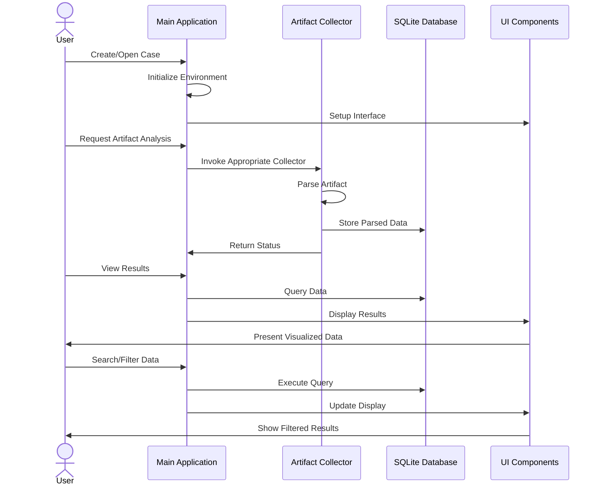
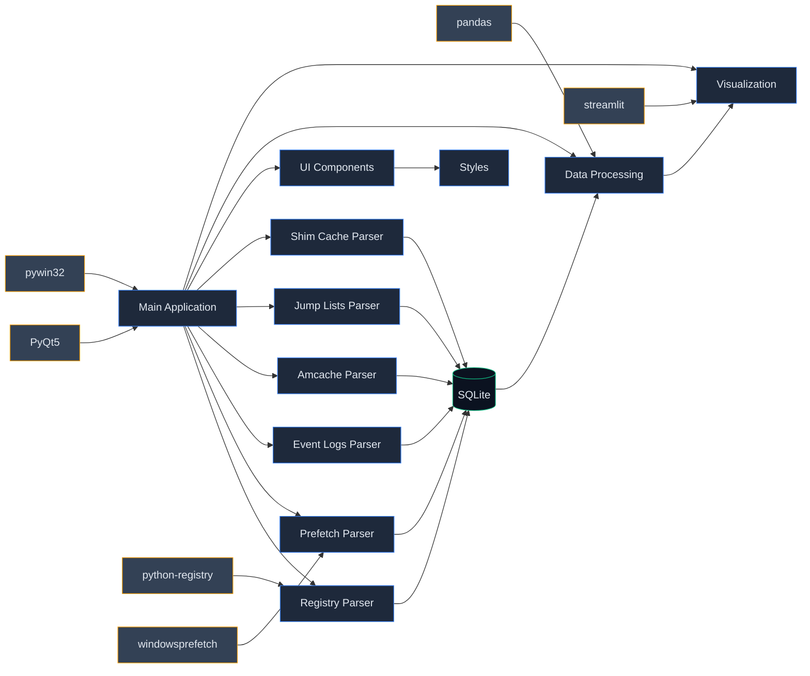

# Crow Eye Architecture Chart

```mermaid
graph TD
    %% Main Components
    Main["Main Application\n(Crow Eye.py)"] --> UI["UI Components"]
    Main --> ArtifactCollection["Artifact Collection"]
    Main --> DataManagement["Data Management"]
    Main --> CaseManagement["Case Management"]
    
    %% UI Components
    UI --> Styles["Styles\n(styles.py)"]
    UI --> ComponentFactory["Component Factory\n(component_factory.py)"]
    UI --> LoadingDialog["Loading Dialog\n(Loading_dialog.py)"]
    
    %% Artifact Collectors
    ArtifactCollection --> Amcache["Amcache Parser\n(amcacheparser.py)"]
    ArtifactCollection --> Prefetch["Prefetch Parser\n(Prefetch_claw.py)"]
    ArtifactCollection --> Registry["Registry Parser\n(Regclaw.py)"]
    ArtifactCollection --> OfflineRegistry["Offline Registry\n(offline_RegClaw.py)"]
    ArtifactCollection --> EventLogs["Event Logs\n(WinLog_Claw.py)"]
    ArtifactCollection --> JumpLists["Jump Lists & LNK\n(A_CJL_LNK_Claw.py)"]
    ArtifactCollection --> ShimCache["Shim Cache\n(shimcash_claw.py)"]
    
    %% Data Management
    DataManagement --> BaseLoader["Base Loader\n(base_loader.py)"]
    DataManagement --> RegistryLoader["Registry Loader\n(registry_loader.py)"]
    DataManagement --> SQLite[("SQLite Databases")]
    
    %% Case Management
    CaseManagement --> ConfigFiles[("JSON Config Files\n(config/)")]
    
    %% Utilities
    Main --> Utils["Utilities"]
    Utils --> FileUtils["File Utilities\n(file_utils.py)"]
    Utils --> ErrorHandler["Error Handler\n(error_handler.py)"]
    
    %% Data Flow
    Amcache --> SQLite
    Prefetch --> SQLite
    Registry --> SQLite
    OfflineRegistry --> SQLite
    EventLogs --> SQLite
    JumpLists --> SQLite
    ShimCache --> SQLite
    
    SQLite --> Main
    
    %% Styling
    Styles --> UI
    
    %% User Interaction
    User(("User")) --> Main
    Main --> User
    
    %% Class Definitions
    classDef mainApp fill:#0F172A,stroke:#00FFFF,stroke-width:2px,color:#E2E8F0
    classDef component fill:#1E293B,stroke:#3B82F6,stroke-width:1px,color:#E2E8F0
    classDef collector fill:#1E293B,stroke:#8B5CF6,stroke-width:1px,color:#E2E8F0
    classDef data fill:#0B1220,stroke:#10B981,stroke-width:1px,color:#E2E8F0
    classDef utility fill:#1E293B,stroke:#F59E0B,stroke-width:1px,color:#E2E8F0
    classDef user fill:#334155,stroke:#00FFFF,stroke-width:2px,color:#E2E8F0
    
    %% Apply Classes
    class Main mainApp
    class UI,ComponentFactory,LoadingDialog,Styles component
    class Amcache,Prefetch,Registry,OfflineRegistry,EventLogs,JumpLists,ShimCache collector
    class SQLite,BaseLoader,RegistryLoader,DataManagement,ConfigFiles data
    class Utils,FileUtils,ErrorHandler utility
    class User user
    class ArtifactCollection collector
    class CaseManagement data
```

## Component Interaction Flow

```mermaid
sequenceDiagram
    actor User
    participant Main as Main Application
    participant Collector as Artifact Collector
    participant DB as SQLite Database
    participant UI as UI Components
    
    User->>Main: Create/Open Case
    Main->>Main: Initialize Environment
    Main->>UI: Setup Interface
    
    User->>Main: Request Artifact Analysis
    Main->>Collector: Invoke Appropriate Collector
    Collector->>Collector: Parse Artifact
    Collector->>DB: Store Parsed Data
    Collector->>Main: Return Status
    
    User->>Main: View Results
    Main->>DB: Query Data
    Main->>UI: Display Results
    UI->>User: Present Visualized Data
    
    User->>Main: Search/Filter Data
    Main->>DB: Execute Query
    Main->>UI: Update Display
    UI->>User: Show Filtered Results
```

## Module Dependencies

```mermaid
flowchart LR
    %% External Dependencies
    PyQt5["PyQt5"] --> Main
    PythonRegistry["python-registry"] --> Registry
    PyWin32["pywin32"] --> Main
    Pandas["pandas"] --> DataProcessing
    Streamlit["streamlit"] --> Visualization
    WindowsPrefetch["windowsprefetch"] --> Prefetch
    
    %% Internal Components
    Main["Main Application"] --> Registry["Registry Parser"]
    Main --> Prefetch["Prefetch Parser"]
    Main --> EventLogs["Event Logs Parser"]
    Main --> Amcache["Amcache Parser"]
    Main --> JumpLists["Jump Lists Parser"]
    Main --> ShimCache["Shim Cache Parser"]
    Main --> UI["UI Components"]
    Main --> DataProcessing["Data Processing"]
    Main --> Visualization["Visualization"]
    
    %% Styling
    UI --> Styles["Styles"]
    
    %% Data Flow
    Registry --> SQLite[("SQLite")]
    Prefetch --> SQLite
    EventLogs --> SQLite
    Amcache --> SQLite
    JumpLists --> SQLite
    ShimCache --> SQLite
    
    SQLite --> DataProcessing
    DataProcessing --> Visualization
    
    %% Class Definitions
    classDef external fill:#334155,stroke:#F59E0B,stroke-width:1px,color:#E2E8F0
    classDef internal fill:#1E293B,stroke:#3B82F6,stroke-width:1px,color:#E2E8F0
    classDef data fill:#0B1220,stroke:#10B981,stroke-width:1px,color:#E2E8F0
    
    %% Apply Classes
    class PyQt5,PythonRegistry,PyWin32,Pandas,Streamlit,WindowsPrefetch external
    class Main,Registry,Prefetch,EventLogs,Amcache,JumpLists,ShimCache,UI,DataProcessing,Visualization,Styles internal
    class SQLite data
```