# Crow Eye Contribution Guide

Welcome to the Crow Eye project! We appreciate your interest in contributing. This guide will help you get started with contributing to our Windows forensic investigation tool.

## Table of Contents

- [Introduction](#introduction)
- [Documentation Index](#documentation-index)
  - [Core Documentation](#core-documentation)
  - [Component Details](#component-details)
- [Development Environment Setup](#development-environment-setup)
- [Contribution Guidelines](#contribution-guidelines)
  - [Types of Contributions](#types-of-contributions)
  - [Coding Standards](#coding-standards)
  - [Pull Request Process](#pull-request-process)
  - [Commit Message Guidelines](#commit-message-guidelines)
- [Development Workflows](#development-workflows)
- [Testing](#testing)
- [For AI Agents](#for-ai-agents)
- [Roadmap and Future Development](#roadmap-and-future-development)
- [Community Guidelines](#community-guidelines)

## Introduction

Crow Eye is an open-source Windows forensic investigation tool designed to collect, analyze, and visualize various Windows artifacts with a cyberpunk-themed interface. We welcome contributions from the community to make this tool even better.

**Our Vision**: Crow-Eye aims to democratize digital forensics, making it accessible to everyone—from concerned parents to professional investigators and businesses. See our complete vision in [README.md](README.md#vision-forensics-for-everyone).

## Documentation Index

This section provides a comprehensive overview of all project documentation to help you navigate the codebase effectively.

### Core Documentation

- **[README.md](README.md)**: Project overview, vision, features, installation, and basic usage
- **[TECHNICAL_DOCUMENTATION.md](TECHNICAL_DOCUMENTATION.md)**: Complete technical documentation including:
  - Complete project structure and file organization
  - Architecture diagrams and system design
  - Detailed component documentation
  - Artifact collector specifications
  - Timeline module architecture
  - Data management layer
  - Development guide and best practices
- **[CONTRIBUTING.md](CONTRIBUTING.md)**: This document - contribution guidelines, coding standards, and documentation index
- **[timeline/ARCHITECTURE.md](timeline/ARCHITECTURE.md)**: Detailed timeline module architecture and implementation details

### Quick Reference: System Architecture

The following diagram provides a high-level overview of the Crow Eye architecture for new contributors:


**Key Areas for Contributors:**
- **🖥️ UI Layer**: PyQt5-based interface with cyberpunk styling
- **📦 Collectors**: Specialized parsers for Windows forensic artifacts
- **💾 Data Layer**: SQLite-based storage with optimized querying
- **🔧 Utilities**: Reusable helper functions for common tasks

### Contribution Decision Tree

Use this flowchart to quickly determine where your contribution should go and what steps to follow:

```mermaid
flowchart TD
    Start["🚀 I want to contribute"] --> Type{What type of\ncontribution?}
    
    Type -->|New Artifact Parser| Artifact["📦 Add to Artifacts_Collectors/"]
    Type -->|UI Enhancement| UI["🖥️ Add to ui/"]
    Type -->|Bug Fix| Bug["🐛 Find relevant module"]
    Type -->|Documentation| Docs["📝 Update .md files"]
    Type -->|Timeline Feature| TL["⏱️ Add to timeline/"]
    
    Artifact --> Parser["1️⃣ Create *_claw.py file"]
    Parser --> DataClass["2️⃣ Define @dataclass structures"]
    DataClass --> ParseFunc["3️⃣ Implement parse() function"]
    ParseFunc --> DBFunc["4️⃣ Add save_to_sqlite()"]
    DBFunc --> IntegrateMain["5️⃣ Integrate with Crow Eye.py"]
    
    UI --> Factory["Use ComponentFactory"]
    Factory --> Style["Follow cyberpunk theme\n(styles.py)"]
    Style --> UITest["Test UI responsiveness"]
    
    TL --> TLArch["Review timeline/ARCHITECTURE.md"]
    TLArch --> TLLayer{Which layer?}
    TLLayer -->|Data| TLData["timeline/data/"]
    TLLayer -->|Rendering| TLRender["timeline/rendering/"]
    TLLayer -->|UI| TLUI["timeline/*.py dialogs"]
    
    Bug --> TestCase["1️⃣ Write test case"]
    TestCase --> FixIssue["2️⃣ Fix the issue"]
    FixIssue --> VerifyFix["3️⃣ Verify fix works"]
    
    Docs --> ReviewDocs["Review existing docs"]
    ReviewDocs --> UpdateDocs["Update relevant sections"]
    UpdateDocs --> CheckLinks["Verify all links work"]
    
    IntegrateMain --> PR["📤 Create Pull Request"]
    UITest --> PR
    TLData --> PR
    TLRender --> PR
    TLUI --> PR
    VerifyFix --> PR
    CheckLinks --> PR
    
    PR --> CodeReview["👀 Code Review"]
    CodeReview --> Changes{Changes\nrequested?}
    Changes -->|Yes| MakeChanges["Make requested changes"]
    MakeChanges --> CodeReview
    Changes -->|No| Merge["✅ Merge to main"]
    
    style Start fill:#0F172A,stroke:#00FFFF,stroke-width:3px,color:#E2E8F0
    style Merge fill:#10B981,stroke:#059669,stroke-width:3px,color:#E2E8F0
    style PR fill:#8B5CF6,stroke:#7C3AED,stroke-width:2px,color:#E2E8F0
    style Type fill:#1E293B,stroke:#3B82F6,stroke-width:2px,color:#E2E8F0
    style CodeReview fill:#F59E0B,stroke:#D97706,stroke-width:2px,color:#0F172A
    
    classDef artifactClass fill:#1E293B,stroke:#8B5CF6,color:#E2E8F0
    classDef uiClass fill:#1E293B,stroke:#3B82F6,color:#E2E8F0
    classDef bugClass fill:#7F1D1D,stroke:#DC2626,color:#E2E8F0
    classDef docClass fill:#065F46,stroke:#10B981,color:#E2E8F0
    classDef timelineClass fill:#1E293B,stroke:#F59E0B,color:#E2E8F0
    
    class Artifact,Parser,DataClass,ParseFunc,DBFunc,IntegrateMain artifactClass
    class UI,Factory,Style,UITest uiClass
    class Bug,TestCase,FixIssue,VerifyFix bugClass
    class Docs,ReviewDocs,UpdateDocs,CheckLinks docClass
    class TL,TLArch,TLLayer,TLData,TLRender,TLUI timelineClass
```



**Quick Decision Guide:**
- **Adding support for a new Windows artifact?** → Follow the Artifact Parser path
- **Improving the user interface?** → Follow the UI Enhancement path
- **Fixing a bug?** → Follow the Bug Fix path
- **Improving documentation?** → Follow the Documentation path
- **Enhancing timeline features?** → Follow the Timeline Feature path


### Component Details

#### Artifact Collectors

The following components are responsible for collecting and parsing Windows artifacts:

- **Prefetch Parser** (`Artifacts_Collectors/Prefetch_claw.py`): Parses Windows Prefetch files (.pf) to extract execution history
- **Registry Parser** (`Artifacts_Collectors/Regclaw.py`): Extracts forensic artifacts from Windows Registry hives
- **Amcache Parser** (`Artifacts_Collectors/amcacheparser.py`): Parses Amcache.hve to identify application execution history
- **Jump Lists/LNK Parser** (`Artifacts_Collectors/A_CJL_LNK_Claw.py`, `JLParser.py`): Extracts information from Jump Lists and LNK files
- **Event Log Parser** (`Artifacts_Collectors/WinLog_Claw.py`): Parses Windows Event Logs for security events and system activity

#### Data Management

Components for managing data loading and processing:

- **Base Data Loader** (`data/base_loader.py`): Core functionality for database operations with optimized SQLite handling
- **Registry Loader** (`data/registry_loader.py`): Specialized loader for Registry data

#### UI Components

Components for the user interface:

- **Component Factory** (`ui/component_factory.py`): Creates UI elements with consistent cyberpunk styling
- **Loading Dialog** (`ui/Loading_dialog.py`): Custom dialog for displaying loading progress
- **Main Window** (`Crow Eye.py`): Primary application window and UI orchestration

#### Utilities

Helper functions and utilities:

- **Error Handler** (`utils/error_handler.py`): Consistent error handling and logging
- **File Utilities** (`utils/file_utils.py`): Common file operations
- **Search Utilities** (`utils/search_utils.py`): Global search and highlighting functionality


## Development Environment Setup

### Prerequisites

- Python 3.12.4 or higher
- Git
- Windows operating system (recommended for testing artifacts)

### Setting Up Your Development Environment

1. **Fork and Clone the Repository**

   ```bash
   git clone https://github.com/Ghassan-elsman/Crow-Eye.git
   cd Crow-Eye
   ```

2. **Run the Application**

   Simply run the main script. The application handles environment setup automatically.

   ```bash
   python "Crow Eye.py"
   ```

   **Automatic Setup Process:**
   - The script checks for a `crow_eye_venv` virtual environment.
   - If missing, it creates one automatically.
   - It installs all required dependencies.
   - Finally, it restarts itself within the virtual environment.

   > [!NOTE]
   > Run as administrator to ensure access to all system artifacts during live analysis.

## Contribution Guidelines

### Types of Contributions

We welcome various types of contributions:

- **Bug fixes**: Fixing issues in existing functionality
- **Feature enhancements**: Adding new features or improving existing ones
- **Documentation**: Improving or adding documentation
- **Testing**: Adding or improving tests
- **UI improvements**: Enhancing the user interface

### Coding Standards

#### Python Style Guide

- Follow **PEP 8** guidelines.
- Use meaningful variable and function names.
- Add **docstrings** to all functions and classes.
- Keep functions focused on a single responsibility.
- Use type hints where possible.

#### Example of Good Code

```python
def parse_prefetch_file(file_path: str) -> Dict[str, Any]:
    """
    Parse a Windows Prefetch file and extract metadata.
    
    Args:
        file_path: Path to the Prefetch file
        
    Returns:
        Dictionary containing parsed Prefetch metadata
        
    Raises:
        FileNotFoundError: If the file does not exist
    """
    if not os.path.exists(file_path):
        raise FileNotFoundError(f"Prefetch file not found: {file_path}")
        
    # Implementation details...
    
    return prefetch_data
```

### Pull Request Process

1. **Create a Branch**: Create a branch for your feature or bugfix.
   ```bash
   git checkout -b feature/your-feature-name
   ```

2. **Make Changes**: Implement your changes following the coding standards.

3. **Test Your Changes**: Ensure your changes work as expected and don't break existing functionality.

4. **Commit Your Changes**: Use clear commit messages.

5. **Push to Your Fork**:
   ```bash
   git push origin feature/your-feature-name
   ```

6. **Create a Pull Request**: Submit a pull request to the main repository.

#### Pull Request Workflow


**Best Practices:**
- Keep PRs focused on a single feature or fix
- Write clear, descriptive commit messages
- Ensure all tests pass before submitting
- Respond promptly to review feedback
- Keep your branch up to date with main

### Commit Message Guidelines

Use the following format for commit messages:

```
<type>: <subject>

<body>
```

Where `<type>` is one of:
- **feat**: A new feature
- **fix**: A bug fix
- **docs**: Documentation changes
- **style**: Changes that do not affect the meaning of the code
- **refactor**: Code changes that neither fix a bug nor add a feature
- **test**: Adding or modifying tests
- **chore**: Changes to the build process or auxiliary tools

## Development Workflows

### Adding a New Artifact Parser

1. **Create a new file** in the `Artifacts_Collectors/` directory.
2. **Implement the parser** following the existing patterns.
3. **Add database functionality** for storing parsed data.
4. **Integrate with the UI** by adding necessary components.
5. **Update the case management** system to include the new artifact type.

#### Workflow Diagram


**Key Steps:**
1. **Research**: Understand the artifact format and forensic value
2. **Implementation**: Create parser with proper data structures
3. **Testing**: Validate with real-world samples
4. **Integration**: Connect to UI and case management
5. **Documentation**: Update all relevant docs

### Enhancing the UI

1. **Use the ComponentFactory** to create consistent UI elements.
2. **Follow the cyberpunk styling** guidelines in `styles.py`.
3. **Ensure responsive design** and proper error handling.

### Improving Data Correlation

1. **Identify common attributes** across artifacts.
2. **Implement correlation rules** in the correlation engine.
3. **Update the UI** to display correlated data.
4. **Test with various datasets** to ensure accuracy.

## Testing

### Manual Testing

When testing your changes, please verify the following:

- **Test with different Windows versions** (7/10/11)
- **Verify artifact parsing** with known test files
- **Check UI rendering** on different screen sizes
- **Validate database operations** and data integrity
- **Test error handling** with malformed or corrupted files

### Automated Testing

We're working on implementing automated tests. Contributions in this area are welcome!

## For AI Agents

If you're an AI agent working on Crow Eye, here are some tips:

### Understanding the Codebase

- Start with [STRUCTURE.md](STRUCTURE.md) to understand the overall architecture
- Examine the main application file (`Crow Eye.py`) to understand the entry point
- Look at specific artifact collectors to understand parsing logic
- Review the `ComponentFactory` pattern for UI consistency

### Making Enhancements

- Follow the modular architecture when adding new features
- Maintain the cyberpunk styling for UI components
- Ensure proper error handling and logging
- Add comprehensive documentation for new components
- Use type hints and docstrings for all functions

### Testing Changes

- Test with different Windows versions (7/10/11)
- Verify artifact parsing with known test files
- Check UI rendering on different screen sizes
- Validate database operations and data integrity

## Roadmap and Future Development

Planned enhancements for Crow Eye include:

- **Enhanced LNK file and Jump list structure parsing**
- **Advanced visualization of artifact timelines**
- **Reporting functionality** for exporting findings
- **Timeline Visualization feature** (in progress)
- **Correlation engine** to correlate Windows Artifacts
- **Enhanced search dialog** with advanced filtering
- **Enhanced visualization timeline** with interactive features
- **AI integration** for asking questions, searching results, summarizing, and helping non-technical users

We welcome contributions in these areas, as well as new ideas for improving the project!

## Community Guidelines

### Code of Conduct

We expect all contributors to follow our Code of Conduct:

- Be respectful and inclusive.
- Focus on constructive feedback.
- Maintain a welcoming environment for all contributors.

### Communication Channels

- **GitHub Issues**: For bug reports and feature requests.
- **Pull Requests**: For code contributions.

Thank you for contributing to Crow Eye!
