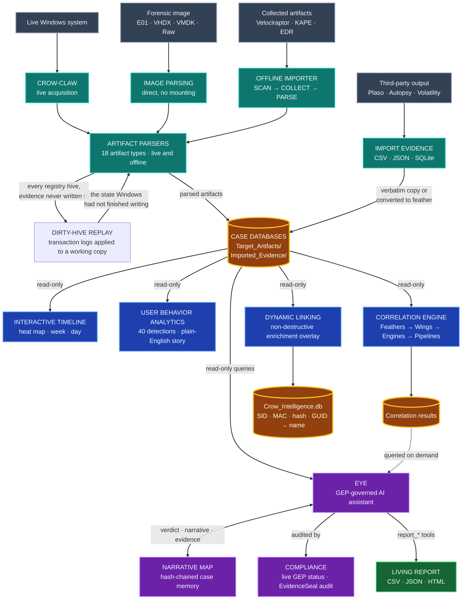

# Crow-Eye — Windows Forensics Engine

<p align="center">
  
</p>

<p align="center"><strong>A forensic time machine for Windows.</strong><br/>
Crow-Eye doesn't just <em>detect</em> — it <strong>reconstructs what actually happened</strong> on the timeline, from acquisition all the way to a verdict traceable to its source records.</p>

[](https://www.gnu.org/licenses/gpl-3.0)


[](https://discord.gg/2vag2Udf)
[](https://github.com/Ghassan-elsman/Crow-Eye/stargazers)
[](https://github.com/Ghassan-elsman/Crow-Eye/issues)
[](https://github.com/Ghassan-elsman/Crow-Eye/commits)

## Table of Contents
- [Overview](#overview)
- [✨ Highlights](#-highlights)
- [👥 Who Crow-Eye Is For](#-who-crow-eye-is-for)
- [🧭 Subsystems at a Glance](#-subsystems-at-a-glance)
- [🏗️ Architecture](#️-architecture)
- [📥 Download & Install](#-download--install)
- [🚀 Quick Start](#-quick-start)
- [📂 Supported Artifacts](#-supported-artifacts)
- [🔧 Analysis Modes](#-analysis-modes)
  - [📎 Import Evidence (third-party data)](#-import-evidence-third-party-data)
- [🧠 User Behavior Analytics (UBA)](#-user-behavior-analytics-uba)
- [🧩 Correlation Engine](#-correlation-engine)
- [👁️ Eye — The Forensics AI Assistant](#️-eye--the-forensics-ai-assistant)
- [📖 Eye-Describe — Byte-Level Artifact Knowledge Base](#-eye-describe--byte-level-artifact-knowledge-base)
- [🧪 Quality & Validation](#-quality--validation)
- [🔬 Research Platform](#-research-platform)
- [🛠️ Technical Notes](#️-technical-notes)
- [📸 Screenshots](#-screenshots)
- [🚧 Roadmap](#-roadmap)
- [📚 Documentation](#-documentation)
- [🤝 Contributing](#-contributing)
- [🌐 Website & Community](#-website--community)
- [📄 License](#-license)
- [📝 Citing Crow-Eye](#-citing-crow-eye)
- [💖 Support](#-support)
- [Credits](#credits)

## Overview

**Crow-Eye is an open-source (GPL-3.0) Windows forensics engine that unifies acquisition, analysis, verification, intelligence, and AI.** Most security tools ask *"is this bad?"* and clear whatever looks legitimate. Crow-Eye asks a different question: **"what happened?"** It correlates **all** activity — suspicious or not — and reconstructs the actual sequence of events on a system, so the truth of an investigation is *rebuilt from evidence* rather than guessed from alerts.

That reconstruction-first design is exactly what it takes to **hunt APT and nation-state threats**: sophisticated adversaries live inside legitimate tools (`powershell.exe`, PsExec, `certutil`) and in the *sequence* of actions — invisible to tools that clear anything that looks normal. Because Crow-Eye never clears anything and reasons over execution **artifacts** (which survive log tampering and anti-forensics), the attack can't hide. The same engine stays approachable for everyday DFIR work and for non-experts who simply want to know what happened on a computer.

- 🕰️ **Reconstruct, don't just detect** — rebuild the timeline of what actually occurred.
- 🖥️ **Cross-platform** — full live + offline analysis on **Windows**; **offline analysis and forensic-image parsing on Linux** (live parsers are Windows-only).
- 🔒 **Private by design** — **0 ms of data sent off-device**; the Eye AI assistant can run fully **air-gapped**.
- 🧾 **Court-grade** — evidence is cryptographically sealed and every step is auditable.
- 📦 **Current version:** 0.12.6 · **Correlation Engine:** 1.7.0 · **License:** GPL-3.0.

## ✨ Highlights

- **Reconstruction over detection.** Correlates every artifact into one navigable, per-entity story instead of a pile of alerts.
- **Integrated end to end** — acquisition → correlation → timeline → behavioral analytics → AI → sealed case memory: a full pipeline no single incumbent tool spans.
- **Artifact-deep, not log-shallow.** Prefetch, Amcache, ShimCache, SRUM, MFT, USN, LNK/JumpLists and more survive the log clearing and "living-off-the-land" tricks that blind log-only tools.
- **The Eye AI assistant** — natural-language forensic investigation with an auditable, tamper-evident chain of custody, runnable in the cloud, on a private server, or fully offline.
- **User Behavior Analytics (UBA)** — turns raw artifacts into a plain-English, HR/examiner-readable activity story.
- **Free & open-source (GPL-3.0)** — auditable by anyone, with an active research and documentation effort.

## 👥 Who Crow-Eye Is For

Crow-Eye is used across very different workflows. Each one enters the engine through a different door:

| You are | Your typical input | Where to start |
|---|---|---|
| **Corporate IR / MSSP / MDR** | Targeted collections from **Velociraptor, KAPE, or EDR-native collection** | [Offline Importer](#-analysis-modes) → [Correlation Engine](#-correlation-engine) → [UBA](#-user-behavior-analytics-uba) |
| **Law enforcement / forensic labs** | **Full forensic images** (E01, VHDX, VMDK, Raw) with chain-of-custody requirements | [Image analysis](#-analysis-modes) → [Correlation Engine](#-correlation-engine) → [Narrative Map](#️-narrative-map--the-eyes-persistent-case-memory) |
| **Internal security / insider-threat & HR investigations** | Live systems or collected artifacts | [Live analysis](#-analysis-modes) → [UBA](#-user-behavior-analytics-uba) activity story |
| **Students, educators & researchers** | Sample images and lab data | [Eye-Describe](#-eye-describe--byte-level-artifact-knowledge-base) → [Quick Start](#-quick-start) |

> **Any collector works.** Crow-Eye does not require its own acquisition tool. Point the [Offline Importer](#-analysis-modes) at a folder of raw artifacts produced by **Velociraptor**, **KAPE**, an EDR collection package, or any other collector — it indexes the supported artifacts and runs the offline parsers over them. Separately, output from **Plaso, Autopsy, Volatility** or any other tool can be brought in as CSV, JSON, or SQLite via [Import Evidence](#-import-evidence-third-party-data) and correlated alongside native artifacts.

## 🧭 Subsystems at a Glance

Crow-Eye is built as an integrated loop — each stage feeds the next, from raw disk to a defensible verdict.

| Subsystem | What it does | Stage |
|---|---|---|
| **[Crow-Claw](#-analysis-modes)** | High-speed acquisition of live systems and dead-box images. | Acquisition |
| **[Offline Importer](#-analysis-modes)** | SCAN → COLLECT → PARSE artifacts from any source into the case database. | Acquisition |
| **[Correlation Engine](#-correlation-engine)** | Dual-engine (Identity + Time-Window) reconstruction via Feathers · Wings · Engines · Pipelines. | Analysis |
| **[Interactive Timeline](#-analysis-modes)** | Identity-threaded, court-traceable timeline (Heat Map / Week / Day views), read straight from the case databases. | Verification |
| **[User Behavior Analytics (UBA)](#-user-behavior-analytics-uba)** | Rule-driven, plain-English "what did this user do" activity story. | Intelligence |
| **[Eye — AI Assistant](#️-eye--the-forensics-ai-assistant)** | Natural-language investigation + the sealed **Narrative Map** case memory. | AI |
| **[Storage Forensics](#-supported-artifacts)** | Physical disk & partition analysis (hidden/unmounted detection, boot warnings). | Analysis |

## 🏗️ Architecture

Crow-Eye is an integrated pipeline, not a bag of parsers. Evidence flows one way, and every stage keeps its link back to the source record.



*Evidence source → Ingest → Case databases → Analysis → AI layer → Report*


**How to read it:**

| Stage | What matters |
|---|---|
| ① → ② | **Four independent doors into a case.** You never need Crow-Eye's own collector — a folder from Velociraptor, KAPE, or an EDR package goes through the Offline Importer, and third-party CSV/JSON/SQLite goes through Import Evidence. |
| ② → ③ | Everything converges on one place: **the case databases**. Parsed artifacts land in `Target_Artifacts/`; imported third-party evidence lands in `Imported_Evidence/` and is auto-discovered. |
| ③ → ④ | **The three analysis paths are independent of each other.** The Timeline and UBA read the case databases directly — neither requires a correlation run. The Correlation Engine is an *additional* layer, not a prerequisite. |
| ③ → ④ | **Dynamic Linking sits alongside the Timeline and UBA** — a fourth, independent reader of the case databases (it has nothing to do with the Timeline visualization). It gathers identity mappings (SID → username, MAC → network, hash/GUID → app) into a per-case `Crow_Intelligence.db`, then overlays that context **inline in the artifact data tables** via non-destructive `ATTACH` + `LEFT JOIN`. It changes how records *read*, never the evidence. |
| ④ → ⑤ | The Eye queries the case databases directly and can pull correlation results **on demand**. It never touches evidence itself — it emits tool calls that Crow-Eye executes and logs. |
| ⑤ → Report | The **Living Report is built by the Eye alone**, through its `report_*` tools. The Timeline and UBA are analysis surfaces — they do not write to the report. Case-level findings can still be exported separately via [Search & Export](#-search--export). |
| ⑤ ↔ | The **Narrative Map is bidirectional**: the Eye writes to it, you write to it, and its contents are injected into the Eye's prompt every turn. It is the memory, and you can command it. |
| ⑤ ⟳ | The **Compliance page audits the Eye.** Every tool call the Eye makes is anchored to the **EvidenceSeal** hash chain; the page renders live per-rule **GEP** status (10 principles) verified from that chain and `EYE_Logs/`, exportable as `audit_trail.json`. |

**Independent stages.** The Timeline and UBA read the case artifact databases **directly** — neither requires a correlation run, and the Timeline does not depend on the Correlation Engine (it applies its own lightweight temporal grouping). Correlation is an additional analysis layer whose results the Eye can query.

**Read-only by design.** Parsing writes to the case database; every downstream stage (UBA, the Timeline, correlation viewers, the Eye) opens those databases **read-only**. The original evidence is never modified — [Dynamic Linking](#-analysis-modes) reads the case databases to build a per-case `Crow_Intelligence.db` of identity mappings and enriches the artifact data tables inline via non-destructive `ATTACH` + `LEFT JOIN` queries rather than rewriting rows.

**Governed by design.** Every action the Eye takes is anchored to the tamper-evident **EvidenceSeal** hash chain, and the **Compliance** page continuously verifies the Eye against the [Ghassan Elsman Protocol (GEP)](eye/docs/GEP_standard.md) — live per-rule status, exportable to `EYE_Logs/audit_trail.json`.

## 📥 Download & Install

> **Recommended:** get the packaged Windows build (**MSI installer / EXE**) from the official website — no Python setup, runs out of the box.

### ▶️ [Download Crow-Eye for Windows → crow-eye.com/download](https://crow-eye.com/download)

The **installed MSI/EXE build is the recommended way to run Crow-Eye**, and it is our **top priority for updates**:

- 🛡️ **Fastest fixes.** When an issue is found or a bug is reported, we release an updated EXE **as soon as possible** — the packaged build is where fixes land first.
- 🔄 **Built-in auto-update.** In the installed app, open **Settings → Updates** to **check for updates and install them automatically** — no manual reinstall.
- 📦 **Zero setup.** No Python, Node, or dependency installation required.

> Prefer to run from source? See **[Quick Start](#-quick-start)** below. The from-source build is intended for contributors and **does not include the auto-updater** — use the MSI/EXE for automatic updates.

## 🚀 Quick Start

### Option A — Installed build (recommended)
Download the **MSI/EXE** from [crow-eye.com/download](https://crow-eye.com/download), install, and launch **Crow-Eye** as Administrator. Create a case and start analyzing.

### Option B — Run from source (developers)

> For contributors and advanced users. This path **does not include the auto-updater** — use the MSI/EXE for automatic updates.

**Requirements** (installed automatically on first run):
- Python 3.12.4
- **Node.js & npm** — required for **Timeline Visualization**
- Key packages: PyQt5, python-registry, pywin32, pandas, streamlit, altair, olefile, windowsprefetch, sqlite3, colorama, setuptools

**Recommended hardware**

| | Minimum | Recommended for large cases |
|---|---|---|
| **RAM** | 8 GB | 16 GB+ (MFT/USN sets of millions of records) |
| **Disk** | 5 GB free | Free space ≥ 2× the size of the evidence being parsed |
| **CPU** | 4 cores | 8+ cores |
| **OS** | Windows 10/11 (full) · Linux (offline & image analysis) | — |

> Correlation streams in constant memory for very large datasets, so RAM is rarely the hard limit — disk throughput and free space usually are.

**Launch** (run as Administrator so Crow-Eye can access system artifacts):

```bash
python "Crow Eye.py"
```

The main interface opens, you create a case, and all analysis output is organized under that case directory for later review and reporting.

> 🖥️ **Cross-platform note:** on **Linux**, live parsers are disabled automatically and Crow-Eye runs in **offline / forensic-image** mode. Full live acquisition is Windows-only.

## 📂 Supported Artifacts

Crow-Eye parses a broad set of Windows execution, file-system, and user-activity artifacts, both from a **live** system and from **offline** sources (collected folders or forensic images).

| Artifact | Live | Offline | Data Extracted |
|---|:---:|:---:|---|
| Prefetch | ✅ | ✅ | Execution history, run count, per-run timestamps |
| Registry (AutoRun, UserAssist, BAM/DAM, ShimCache, networks, time zone, and 80+ keys in all) | ✅ | ✅ | Persistence, program usage, background activity, network config, startup approval state |
| Registry — deleted keys & values | ✅ | ✅ | Records recovered from the hive's free space, marked as such (`record_state`) |
| Registry — class names & key security | ✅ | ✅ | `nk` class names (where `Control\Lsa` keeps the boot key), owner/group/DACL from shared security descriptors |
| Registry — transaction logs | ✅ | ✅ | `.LOG1`/`.LOG2` replayed onto a working copy, so a dirty hive is read in the state the machine was in |
| Amcache (29 tables) | ✅ | ✅ | App execution, install time, SHA-1, file paths, drivers, PnP devices, device census |
| ShimCache | ✅ | ✅ | Executed apps, last modified, size, and the decoded trailing blob (PE machine type, OS-binary flag) |
| MUICache | ✅ | ✅ | Program presence and display names |
| Jump Lists & LNK | ✅ | ✅ | File access, paths, timestamps, metadata |
| ShellBags | ✅ | ✅ | Folder access history and navigation |
| MRU & RecentDocs / Typed Paths | ✅ | ✅ | Open/Save history, recent files, typed locations |
| Browser / Website history | ✅ | ✅ | Visited sites and access times |
| Event Logs (System / Security / Application) | ✅ | ✅ | Logons, process creation (4688), account & service changes, log clearing |
| MFT | ✅ | ✅ | File metadata, deleted files, timestamps (NTFS, Win 7/10/11) |
| USN Journal | ✅ | ✅ | File create/modify/delete/rename with full name history |
| Recycle Bin | ✅ | ✅ | Deleted file names, paths, deletion time, size |
| SRUM | ✅ | ✅ | App resource/network/energy usage, per-app data transferred |
| USB & connected devices | ✅ | ✅ | Device connection and presence |
| Network list & connections | ✅ | ✅ | Known networks and connection activity |
| AutoStart / Services & Drivers | ✅ | ✅ | Persistence, service installs and state changes |
| Disks & Partitions (Storage Forensics) | ✅ | ✅ | Physical disk tree, partition layout, hidden/unmounted detection |

**Jump Lists & LNK** are parsed by Crow-Eye's own **purpose-built LNK / Jump List parser** — not a third-party module.

> **Custom registry / locked files:** Windows locks live registry hives (`NTUSER.DAT`, `SOFTWARE`, `SYSTEM`) during operation. For custom analysis of a live system, boot from external media (WinPE/Live CD), use forensic acquisition tools, or analyze a disk image.

### Per-Artifact Details

- **Jump Lists & LNK** — automatically parsed from standard system locations by Crow-Eye's own dedicated parser (file access, target paths, timestamps, and metadata).
- **Registry** — automatically parses the system hives. For **custom registry analysis**, copy the hive files to `CrowEye/Artifacts Collectors/Target Artifacts` (or your case's `registry/` folder):
  - `NTUSER.DAT` from `C:\Users\<Username>\NTUSER.DAT`
  - `SOFTWARE` from `C:\Windows\System32\config\SOFTWARE`
  - `SYSTEM` from `C:\Windows\System32\config\SYSTEM`
  - Windows locks these during operation — for a live system, boot from external media (WinPE/Live CD), use forensic acquisition tools, or analyze a disk image.
- **Prefetch** — parses `C:\Windows\Prefetch`, extracting execution history and forensic metadata (including per-run timestamps).
- **Event Logs** — automatic parsing of System/Security/Application logs into a database for comprehensive analysis.
- **Registry depth (0.13.0)** — the parser reads the hive **file** as well as the live registry, so it reaches what `winreg` denies even to an administrator (every device `Properties` subkey, and with it USB connect times), walks the hive's allocator to recover deleted keys and values, and reads class names and key security descriptors. Nineteen keys that held real data and were read by nothing are now parsed — including Explorer's **StartupApproved**, which says whether each autostart entry is actually allowed to launch.
- **ShellBags** — reveals folder access history and user navigation patterns.
- **Recycle Bin** — parses `$RECYCLE.BIN` to recover deleted file names, original paths, deletion times, and sizes (live systems and disk images).
- **MFT** — parses the Master File Table for file metadata, attributes, timestamps, and deleted-file information (NTFS, Windows 7/10/11).
- **USN Journal** — tracks file create/modify/delete/rename events with timestamps and full name history, for timeline reconstruction.
- **SRUM** — visualizes app resource usage (duration bars for foreground/background time) and network activity per application.
- **Storage Forensics Analyzer** — complete tree view of every physical disk and its partitions; color-coded partition types (EFI, Linux, Recovery, Hidden/swap, …); warnings for bootable USBs, hidden Linux roots, and Intel Rapid Start; raw sector magic-scanning fallback.

## 🔧 Analysis Modes

### 🦅 Crow-Claw Acquisition
Crow-Claw is Crow-Eye's specialized acquisition engine for collecting and preserving artifacts from live systems or mounted images.
- **Selective collection** — choose specific artifact categories (Registry, Event Logs, File System) or collect everything.
- **Deep scanning** — walks directories and subdirectories to find forensic traces.
- **Secure preservation** — artifacts land in a structured case directory that maintains forensic integrity.

### 🔍 Offline Analysis (Offline Importer)
Analyze artifacts collected from any source without a live connection to the target — three clear operations:

- **SCAN (discovery)** — walk the source and index every supported artifact by **filename and extension pattern** (fast, read-only; no file contents are read and no magic-byte checking is performed at this stage). Nothing is moved.
- **COLLECT (acquisition)** — physically copy the identified files into the case's `live_acquisition` folder, organized by type.
- **PARSE (granular)** — review identified items per type (AMCACHE, EVTX, PREFETCH, …) and parse selected files (or all) into the forensic database.

| | 🔍 SCAN | 📦 COLLECT |
|---|---|---|
| **Action** | Discovery — identifies artifacts at their original location | Acquisition — copies & preserves artifacts in the case folder |
| **I/O impact** | Read-only; no files moved | Read + write; physically duplicates artifacts |
| **Organization** | Updates `.artifact_scan_index.json` metadata | Organizes files into type-specific folders |
| **Use case** | Fast triage to see if the source has relevant data | Full forensic preservation for long-term analysis |

Parsing is handled by Crow-Eye's dedicated **offline parsers** — the same artifact logic as live mode, operating on collected files: Prefetch, Registry, MFT, USN (plus the MFT/USN correlator), AmCache, ShimCache, SRUM, Event Logs, LNK/JumpLists, and Recycle Bin.

### 📎 Import Evidence (third-party data)

Beyond raw artifacts, Crow-Eye can take **third-party forensic output straight into a case** — Plaso, Autopsy, Volatility, or any custom export — and make it usable by the Eye and the Timeline **without** requiring a correlation run first.

| Input | What happens |
|---|---|
| **`.db` / `.sqlite`** | Validated and copied **verbatim** into the case's `Imported_Evidence/` folder. The schema is left untouched. |
| **`.csv` / `.json`** | Auto-converted into a feather-shaped SQLite database via the canonical `FeatherWriter`, carrying `feather_metadata` that declares the table's primary timestamp — auto-detected from the column names — exactly like a natively collected feather. |

Because the case database manager auto-discovers any `.db` under the case tree, imported evidence immediately becomes available to:

- **The Eye** — queryable in natural language alongside native artifacts (the schema manifest is refreshed on import).
- **The Interactive Timeline** — served as the `imported` artifact type, with working time-window filtering and time bounds.
- **The Correlation Engine** — usable as a Feather for cross-tool correlation against native artifacts.

The importer is stdlib-only (`sqlite3` / `csv` / `json`) and runs on a background worker, so large imports do not block the UI.

### ⚡ Live Analysis
Analyzes artifacts directly from the running Windows system, auto-extracting from their standard locations for real-time forensic analysis.

### 🗂️ Case Management
Every investigation is a **case**: a self-contained directory that organizes artifact databases and analysis output. Crow-Eye tracks recent cases (with favorites, tags, and status), validates a case on open, writes config atomically (crash-safe), and supports case config import/export and templates with ready-made semantic mappings.

### 🕰️ Interactive Timeline Visualization
Correlate events across artifacts on a unified temporal grid, with **Heat Map**, **Week**, and **Day** views — an identity-threaded, court-traceable story rather than a flat super-timeline.

The Timeline reads the case's parsed artifact databases **directly** and is **independent of the [Correlation Engine](#-correlation-engine)** — you do not need to build feathers, author wings, or run a pipeline to use it. It applies its own lightweight temporal grouping (exact-timestamp and time-window correlation, grouping by application, path, or user) to relate events on the grid. Evidence brought in through [Import Evidence](#-import-evidence-third-party-data) also appears on the timeline as the `imported` artifact type, with working time-window filtering and time bounds.

### 🔎 Search & Export
Full-text search across the case database, plus export to **CSV** (spreadsheets), **JSON** (integration with other tools), and **Detailed HTML reports** (full dossiers consolidating every artifact tied to a search term).

### 🔗 Dynamic Linking
Translate raw technical identifiers — SIDs, MAC addresses, hashes — into human-readable context on the fly. Dynamic Linking enriches the view using **non-destructive SQL `ATTACH` queries**, so the original evidence is never modified, and it can ingest bulk IOC threat feeds to flag known-bad indicators inline.

## 🧠 User Behavior Analytics (UBA)

> **Turn raw artifacts into a plain-English activity story** — a manager/HR-readable account of what a user and their applications actually did, with every statement traceable to the exact source evidence.

**User Behavior Analytics (UBA)** reads the parsed artifact databases in your case's `Target_Artifacts/` folder (strictly **read-only**) and replays them through a declarative rule set to produce a clear, chronological **Activity Story**. Open it from the **"User Behavior"** toolbar button or with **`Ctrl+Shift+B`** (a case must be loaded).

- 🧩 **40 declarative behavior detections** (`uba/config/behavior_rules.json`) — tunable without code — each classified by severity: **routine · notable · suspicious · critical**.
- 🕵️ **Detects behavior that matters**: sign-in / sign-out / unlock, program launch · execution · install, file open / delete / inferred copy, USB device connection, network-share access, persistence & autostart, explicit-credential use (`runas`), account & group changes, service changes, **system-clock tampering** (suspicious), and **event-log clearing** (critical).
- 🗺️ **Three views** — an **Activity Story** feed, an **Activity Map** heatmap (day × hour), and a **"What we can see"** honesty report that labels each detection *Working / Limited / No data / By design* for this case.
- 🔗 **Every activity is evidence-backed.** Click any item to open the exact backing record (`database : table : rowid`) — nothing is asserted without a source.
- 👤 **Honest attribution.** Actors resolve to User / Application / System (or are left empty) — UBA never guesses who did what.

### Detection Coverage

The 40 detections span four severity classes and the full breadth of the parsed artifact set:

| Category | Detections include |
|---|---|
| **Identity & access** | Sign-in / sign-out, workstation unlock, remote-desktop logons, admin logons, explicit-credential use (`runas`), account creation and changes, admin-group additions |
| **Execution** | Programs opened (UserAssist), programs run (Prefetch, expanded to per-run events), process creation (4688), program presence (ShimCache / AmCache / MUICache), application installs, application crashes (from Application Event Log 1001 records) |
| **File activity** | File open / create / delete / copy / rename — renames show the **full name history** (`old → … → current`) reconstructed from the USN Journal, with soft-delete (`$R`/`$I`) resolution |
| **Navigation** | Folder browsing (ShellBags), recent documents, typed locations, website visits |
| **Devices & network** | USB device connect, device presence, network shares, network connections, per-application data transferred (SRUM) |
| **Persistence & system** | Autostart persistence (Run keys + services, escalated when the target runs from a user-writable path), service and driver installs, service state changes, system start/shutdown, **clock changes**, **event-log clearing** |

**Filters:** free-text search · user/actor (including "Unattributed" and a signed-in-session toggle) · behavior class (user / application / system) · severity · application (searchable multi-select across 200+ programs) · datetime range with quick presets (all time / first day / last day / last hour of activity).

**Data sources:** Security, System and Application Event Logs · USN Journal · MFT · UserAssist · BAM · Prefetch · ShimCache · AmCache · MUICache · ShellBags · LNK / JumpLists · Recycle Bin · SRUM (application, network, connectivity) · registry hives.

### Forensic Guarantees

- **Read-only.** Source databases are opened read-only; the analysis never touches the evidence.
- **Full provenance.** Every event carries `database → table → rowid` and opens the real source rows on demand.
- **Attribution never guesses.** An event is attributed to a User, an Application, the System — or left empty. Interactive logon sessions are used only as context labels ("during `<user>`'s session"), never to attribute an action.
- **Honest wording.** The phrasing distinguishes deliberate interaction (UserAssist, SRUM foreground) from artifacts an application can also generate (ShellBags, LNK, JumpLists), with explicit caveats shown on the card.
- **Absence is stated, not implied.** The *What we can see* report labels every detection for this specific case, so missing data is never silently read as "nothing happened".

> UBA is **rule-driven behavioral correlation and classification**, not statistical/ML anomaly scoring — every finding maps to an explicit, auditable rule. See [`RELEASE_NOTES.md`](RELEASE_NOTES.md) for the full detection catalogue.

## 🧩 Correlation Engine

> **Correlation Engine v1.7.0** — the reconstruction core. See [RELEASE_NOTES.md](RELEASE_NOTES.md) for release history.

The **Crow-Eye Correlation Engine** is a production-grade forensic correlation system. It ingests Windows artifacts from any source, normalizes them, and surfaces the temporal and identity relationships that turn isolated records into a coherent narrative of what happened on a system, when, and who was involved. It works out of the box with built-in correlation rules (Wings) for the most common investigation questions, lets analysts author custom rules without touching code, and defers meaning to authorable rules and the investigator — never to a black-box score.

### 🎥 User Guide
[](https://youtu.be/NxuoFrZvVHE?si=VWlQgFicIqzwxQd2)

**Universal Data Import**: The Correlation Engine can take output from **any forensic tool** in CSV, JSON, or SQLite format and convert it into a Feather database. This means you can correlate data from third-party tools (Plaso, Autopsy, Volatility, etc.) with Crow-Eye's native artifacts, creating a unified correlation analysis across all your forensic data sources.

### 🎯 Accuracy & Evidence-Completeness

A focused accuracy pass, validated end-to-end against a real ~700K-record Windows case, layered on top of earlier reliability work. Every fix below is locked by the pytest regression suite and verified by a holistic validation harness that exercises all 7 default wings against both engines.

**The identity engine captures all the evidence**
- **Fixed: the identity engine was iterating only the FIRST row of every feather** when a time filter was active (a timezone-aware vs naive datetime comparison raised `TypeError` and aborted the per-row loop). Records-seen jumped from 3,558 → **745,615** on the validation case.
- **Fixed: log records collapsed every event to its event PROVIDER as the identity** (all 33,855 SecurityLogs records shared one identity). The per-artifact mapping now prioritises real per-row entities (`User`, `ComputerName`, `NewProcessName`, `TargetUserName`) before channel/provider metadata.
- **Fixed: artifact-aware field mapping never fired** because parsers don't stamp an `artifact` column on each row. The engine now falls back to `feather_metadata.artifact_type`, so SecurityLogs / SystemLogs / ApplicationLogs use their artifact-specific identity priority.
- **Fixed: placeholder strings became false identities** (`'N/A'`, `'Unknown'`, `'-'`, nil-GUIDs bundled unrelated records together). The validator now rejects 30+ placeholder variants.
- **Net result on one full-range window**: the Execution Proof wing surfaces **2,856 cross-feather (High) matches** in the identity engine and **643 cross-feather matches** in the time engine, with 24–118 cross-feather matches per wing across the other 6 wings.

**No more "everything is Low — something is wrong"**
- **Fixed: single-feather matches were tagged `High`.** Matches with `feather_count == 1` now get `confidence_category="Low - single feather"`, so the High view focuses on real cross-feather correlation.
- **Fixed: a path-aware composite key was splitting the same identity across feathers** (each feather stores paths differently, so `chrome` had 10+ keys and never correlated). The key is now name-only — cross-feather correlation works again.

**Impersonation detection via path classification** — after a match is formed, the engine classifies every record's path as TRUSTED (Program Files, `System32`, WinSxS, the BAM/SRUM `/device/harddiskvolumeN/...` forms, …) or SUSPICIOUS (Temp, Downloads, Public, `AppData\Local\Temp`, Recycle Bin, removable roots, network shares). A match spanning both classifications raises `impersonation_alert` (≈0.05% rate, each a real candidate).

**Honest evidence accounting** — a per-window drop ledger with named buckets (`no_identity_field`, `normalize_failure`, `below_threshold_skipped`, …) plus a per-pipeline summary (records seen, high/low emitted, no-identity, drop buckets, timeless-feather joins). Every record either lands in a match or in a named drop bucket — "no evidence left over" is verifiable from the log. `low_confidence_review_mode` is ON by default, so below-threshold groups become Low-confidence matches instead of silently vanishing.

**Timeless-feather identity enrichment** — feathers without per-row timestamps (AutoStartPrograms, MUICache, SystemServices, TypedPaths) no longer get a fake generation-time stamped on every row; instead, after timed matches form, the engine joins matching records from every timeless feather by identity as supplementary evidence.

**Consolidated identity registry** — `config/standard_fields/identities.json` is the single source of truth for every column the engines + Eye should consult: **98 categories, 1,146 column synonyms** (app/process, file, hash, user, host/device, network, registry, service/task, event, email, browser, cloud, Windows internals, certificate, container, OS objects). Adding a new column synonym is a JSON edit, not a code change.

**Semantic-mapping false-positive fixes** — multi-indicator gating now actually enforced (`data-exfiltration-pattern` requires ≥2 indicators); impossible AND rules (`4625 AND 4624`) rewritten as OR; wiper/remote-tool rules use real regex instead of firing on every Prefetch entry; baseline-activity rules demoted from `high`/`critical` to `info`/`low` (the wing's weighted scoring escalates real threats).

### ✅ Production Status

The Correlation Engine is **production-ready** and actively used in investigations (**Correlation Engine v1.7.0**):

- ✅ **Time-Window Scanning Engine** — production-ready, recommended for time-based analysis (O(N log N))
- ✅ **Identity-Based Engine** — production-ready, recommended for identity tracking (O(N log N))
- ✅ **Feather Builder / FeatherWriter** — imports CSV/JSON/SQLite from any tool; transactional batching + schema metadata
- ✅ **Wings System & Pipeline Orchestration** — create/manage correlation rules and automate workflows
- ✅ **Identity Grouping** — unified across engine, viewers, and the semantic phase
- ✅ **Standard Fields Registry** — centralized field-synonym source of truth
- ✅ **Multi-timestamp Fan-Out** — every JSON-list timestamp correlated
- 🔄 **Parallel Correlation** — foundation in place; profiling + process-pool dispatch next
- 🔄 **Semantic Mapping & Correlation Scoring** — active enhancements

### Key Features

- **🔄 Dual-Engine Architecture**: Choose between Time-Window Scanning (O(N log N)) and Identity-Based (O(N log N)) correlation strategies.
- **📊 Multi-Artifact Support**: Correlate Prefetch, ShimCache, AmCache, Event Logs, LNK files, Jumplists, MFT, USN, SRUM, Registry, RecycleBin, and more.
- **🔌 Universal Import**: Import CSV/JSON/SQLite output from any forensic tool and convert to Feather databases.
- **🎯 Smart Identity Grouping**: Variants like `Chrome.exe`/`chrome.dll`/`Chrome.EXE` collapse to one bucket; versions and architectural qualifiers stay distinct.
- **🕒 Tolerant Timestamps**: FILETIME, ISO 8601, Unix epoch (s/ms/μs), `YYYYMMDD`, US slash, and annotated strings all parsed correctly on the first try.
- **📈 Multi-Timestamp Fan-Out**: JSON timestamp lists (Prefetch `run_times`) expanded so every execution gets its own correlation event.
- **🧰 One Source of Truth**: Field synonyms in `config/standard_fields/*.json`; per-table metadata in `correlation_engine/config/feather_schemas.json` — extend by editing JSON, not code.
- **⚡ Streaming + Thread-Safe**: O(1)-memory `query_time_range_iter`; lock-protected feather caches; ready for parallel correlation.
- **🔍 Flexible Rules**: Define custom correlation rules (Wings) with configurable parameters.
- **📋 Honest Diagnostics**: Per-window stats line (records_in / no_identity / parse_cache_hits / below_threshold / matches_emitted) so you always know if evidence was dropped.
- **🧪 Locked-In Quality**: A pytest regression suite covering timestamp parsing, identity normalization, fan-out, the writer contract, Eye authoring (write-side GEP governance), and the standard-fields registry.

### System Architecture

The Correlation Engine consists of four main components:

#### 1. 🗄️ Feathers (Data Normalization)

**Purpose**: Transform raw forensic artifacts into a standardized, queryable format.

- SQLite databases containing normalized forensic artifact data — one feather per artifact type (Prefetch, ShimCache, Event Logs, …) with a standardized schema and metadata for efficient querying.
- A **universal format** that accepts data from any forensic tool.

```
Any Tool Output → Feather Builder → Normalized Feather Database
(CSV/JSON/SQLite)                   (SQLite with standard schema)

Examples:
- Plaso CSV        → Feather Builder → timeline.db
- Autopsy JSON     → Feather Builder → autopsy_artifacts.db
- Volatility CSV   → Feather Builder → memory_artifacts.db
- Custom Output    → Feather Builder → custom.db
```

**Supported import formats:** CSV (any headered file), JSON (flat or nested), and SQLite (direct import). Automatic column mapping, data-type detection, timestamp normalization to ISO, validation, and optimized indexes.

```
prefetch.db (Feather)
├── feather_metadata (artifact type, source, record count)
├── prefetch_data (executable_name, path, last_executed, hash)
└── Indexes (timestamp, name, path)
```

#### 2. 🎯 Wings (Correlation Rules)

**Purpose**: Define which artifacts to correlate and how.

- JSON/YAML rules specifying a **time window**, **minimum matches**, **anchor priority**, and the **feathers** (with weights) to correlate — reusable across cases. Every Wing is **authorable and sealed** (records who authored it, why, and the evidence that motivated it).

```json
{
  "wing_id": "execution-proof",
  "wing_name": "Execution Proof",
  "correlation_rules": {
    "time_window_minutes": 5,
    "minimum_matches": 2,
    "anchor_priority": ["Prefetch", "SRUM", "AmCache"]
  },
  "feathers": [
    {"feather_id": "prefetch", "weight": 0.4},
    {"feather_id": "shimcache", "weight": 0.3},
    {"feather_id": "amcache", "weight": 0.3}
  ]
}
```

#### 3. ⚙️ Engines (Correlation Strategies)

**Purpose**: Execute correlation logic to find relationships between artifacts. Structural links come **first**; a tier-weighted score is layered on top as *interpretation/ranking*, not as the basis for a match.

**Time-Window Scanning Engine** — best for time-based analysis and systematic temporal correlation. Scans through time in fixed intervals, collects records from all feathers per window, applies semantic field matching + weighted scoring, and prevents duplicates via MatchSet tracking. **O(N log N)** (indexed timestamp queries); batch processing (~2,567 windows/second).

**Identity-Based Correlation Engine** — best for large datasets (>1,000 records) and identity tracking. Extracts and normalizes identities, groups records by identity, builds temporal anchors within each cluster, classifies evidence as primary/secondary/supporting, and streams for very large sets (>5,000 anchors) at constant memory. **O(N log N)**; 40+ identity field patterns per type.

**Engine selection:** use the Time-Window engine for time-based analysis and the Identity-Based engine for identity tracking — both are production-ready and optimized for large datasets with indexed queries.

#### 4. 🔄 Pipelines (Workflow Orchestration)

**Purpose**: Automate complete analysis workflows from feather creation to result generation. A pipeline reads its config (engine type, wings, feathers), instantiates the right engine via the EngineSelector, executes each wing, aggregates matches, saves results (DB + JSON), and displays them in the GUI with filtering and visualization.

```json
{
  "pipeline_name": "Investigation Pipeline",
  "engine_type": "identity_based",
  "wings": [{"wing_id": "execution-proof"}, {"wing_id": "file-access"}],
  "feathers": [
    {"feather_id": "prefetch", "database_path": "data/prefetch.db"},
    {"feather_id": "srum", "database_path": "data/srum.db"},
    {"feather_id": "eventlogs", "database_path": "data/eventlogs.db"}
  ],
  "filters": {
    "time_period_start": "2024-01-01T00:00:00",
    "time_period_end": "2024-12-31T23:59:59"
  }
}
```

### How It All Works Together

```
1. Data Preparation   Raw Forensic Data → Feather Builder → Feather Databases
2. Configuration      Wing Configs + Feather References → Pipeline Config
3. Execution          Pipeline Executor → Engine Selector → Correlation Engine
4. Correlation        Engine loads Feathers + applies Wing rules → Correlation Results
5. Visualization      Results Database → Results Viewer GUI
```

### Example Use Case: Finding Execution Proof

**Scenario**: prove that `malware.exe` was executed on a system.

```json
{
  "wing_id": "malware-execution",
  "correlation_rules": { "time_window_minutes": 5, "minimum_matches": 2 },
  "feathers": ["prefetch", "shimcache", "amcache"]
}
```

```python
from correlation_engine.pipeline import PipelineExecutor
executor = PipelineExecutor(pipeline_config)
results = executor.execute()
```

```
Identity: malware.exe
  Anchor 1 (2024-01-15 10:30:00):
    ✓ Prefetch: malware.exe executed at 10:30:00
    ✓ ShimCache: malware.exe modified at 10:30:15
    ✓ AmCache:  malware.exe installed at 10:29:45

  Conclusion: Execution proven with 3 corroborating artifacts
```

### Performance Benchmarks

| Records | Time-Window Engine | Identity-Based Engine |
|---|---|---|
| 1,000 | 0.5s | 2s |
| 10,000 | 5s | 15s |
| 100,000 | 50s | 2.5 min (streaming) |
| 1,000,000 | — | 25 min (streaming) |

### Getting Started with the Correlation Engine

1. **Launch**: `python -m correlation_engine.main`
2. **Create Feathers**: import your forensic artifacts (Prefetch, ShimCache, …).
3. **Create Wings**: define correlation rules for your investigation.
4. **Create a Pipeline**: configure which wings and feathers to use.
5. **Execute**: run the pipeline and view correlated results.
6. **Analyze**: use the Results Viewer to explore temporal relationships.

### 📚 Correlation Engine Documentation

- **[Correlation Engine Overview](correlation_engine/docs/CORRELATION_ENGINE_OVERVIEW.md)** — system overview with architecture diagrams
- **[Engine Documentation](correlation_engine/docs/engine/ENGINE_DOCUMENTATION.md)** — dual-engine architecture, engine selection, performance optimization
- **[Architecture](correlation_engine/ARCHITECTURE.md)** — component integration and data flow
- **[Feather Documentation](correlation_engine/docs/feather/FEATHER_DOCUMENTATION.md)** — the data-normalization system
- **[Wings Documentation](correlation_engine/docs/wings/WINGS_DOCUMENTATION.md)** — correlation rules
- **[Pipeline Documentation](correlation_engine/docs/pipeline/PIPELINE_DOCUMENTATION.md)** — workflow orchestration
- **[Adding an Artifact](correlation_engine/docs/ADDING_AN_ARTIFACT.md)** — the workflow for plugging a new parser into the engine
- **[Standard Fields Registry](config/standard_fields/)** — canonical column-name synonyms loaded by both engines and the Eye
- **[Contribution Guide](correlation_engine/CONTRIBUTING.md)** — how to contribute to the engine
- Quick links: [Engine Selection](correlation_engine/docs/engine/ENGINE_DOCUMENTATION.md#engine-selection-guide) · [Troubleshooting](correlation_engine/docs/engine/ENGINE_DOCUMENTATION.md#troubleshooting) · [Performance Optimization](correlation_engine/docs/engine/ENGINE_DOCUMENTATION.md#performance-and-optimization)

## 👁️ Eye — The Forensics AI Assistant

> **A powerful assistant, not a replacement.** Eye automates and *verifies* an investigator's hypotheses — it never makes the call for you.

**Eye** is Crow-Eye's built-in forensics AI assistant: a skilled forensic investigator backed by a real knowledge base of Windows artifacts. It gives you a natural-language interface to query, correlate, and document everything in a case — Prefetch, MFT, Registry, Event Logs, AmCache, ShimCache, SRUM, and more — while keeping an auditable, tamper-evident record of exactly what it did. Eye can run entirely on your own hardware (including **fully air-gapped**), in keeping with Crow-Eye's **"0 ms data sent off-device"** privacy stance. Full architecture: [`eye/README.md`](eye/README.md).

| Capability | What it means for you |
|---|---|
| **Natural-language investigation** | Ask in plain English; Eye writes the SQL and searches for you. |
| **Multi-source integration** | Unified access across all parsed artifacts in the case. |
| **RAG-enhanced analysis** | Eye pulls artifact-specific forensic knowledge before answering. |
| **Living Report Workspace** | Findings, tables, charts, and timelines are documented in real time. |
| **Human-in-the-loop** | Critical actions (e.g. report export) require your explicit approval. |
| **Chain of custody** | Cryptographic proof of exactly what the model analyzed. |

Eye turns conversational questions ("show me what executed from `C:\Temp` after 22:00") into real forensic work: it plans an approach, retrieves relevant artifact knowledge, runs SQL and cross-artifact searches against your case databases, and synthesizes a validated answer. Every answer is produced in **two places at once** — a chat reply for you, and a structured block written into a **Living Report Workspace** so the dossier builds itself as the investigation proceeds.

### The Ghassan Elsman Protocol (GEP)

Everything Eye does is anchored to the **Ghassan Elsman Protocol (GEP)** — a **vendor-neutral, tool-agnostic standard** for *how any AI should be used in digital forensics*. It is **10 principles** a conforming system must uphold so AI-assisted findings stay **truthful, traceable to source records, and backed by an auditable, tamper-evident chain**, with the human investigator in control:

| # | Principle | In one line |
|---|---|---|
| **GEP-1** | Evidence Primacy | Conclusions come only from artifacts actually examined. |
| **GEP-2** | Traceability | Every fact links to a specific source record. |
| **GEP-3** | Specificity & Chronology | Exact UTC timestamps, identifiers, and paths, ordered in time. |
| **GEP-4** | Cross-Corroboration | Rest on multiple sources; report agreement, silence, and conflict. |
| **GEP-5** | Premise Verification | Treat human claims as hypotheses to prove or refute. |
| **GEP-6** | Completeness | Never silently drop or truncate evidence. |
| **GEP-7** | Integrity & Non-Repudiation | Never modify evidence; record what was seen and done, tamper-evidently. |
| **GEP-8** | Transparency & Explainability | Reasoning, tools used, and data seen are visible and auditable. |
| **GEP-9** | Human Authority | The investigator decides; durable actions are attributable. |
| **GEP-10** | Defensibility | Output is objective, precise, and structured for independent review. |

Crow-Eye's Eye is the **reference implementation** of the GEP; the in-product behaviors that uphold it are **Operating Rules**. 📜 Read the standard: [`eye/docs/GEP_standard.md`](eye/docs/GEP_standard.md).

### Deployment Modes

Eye adapts to your threat model through three deployment modes:

| Mode | Best for | Backends |
|---|---|---|
| ☁️ **Cloud AI Models** | Deep, complex analysis with maximum compute | OpenAI, Anthropic (Claude), Google Gemini |
| 🔒 **Offline AI Server** (air-gapped) | Zero-exposure, on-premise investigations | Ollama, LM Studio |
| ⚡ **CLI Terminal Agents** | Reuse an AI terminal agent you already have as the model | Claude Code, Gemini CLI, ChatGPT CLI, llama.cpp, … |

In **CLI-agent mode**, Crow-Eye drives an **existing AI terminal/command-line agent as the model** — instead of a cloud API or a local offline server — so you can investigate with the agent you already use.

**The investigation loop:**

1. **Open or create a case** — Eye scopes itself to that case's artifact databases and history.
2. **Ask a question** in natural language, or launch a one-click comprehensive triage.
3. **Eye runs its pipeline** — detect intent → retrieve knowledge → execute tools → synthesize.
4. **You get a dual output** — a direct chat answer *and* a new block in the Living Report.
5. **Approve gated actions** — exports and other critical steps wait for your sign-off.

You can change models at runtime with the `switch_model` tool. Switching is **restricted to the same backend**, so evidence is never silently sent to a different provider than the one you chose.

### Tracing the LLM Thinking Process

Eye is built so you can see — and later prove — *how* it reached a conclusion. As Eye works, it streams structured `ThinkingStep` updates to the UI in real time; each carries a `step_id`, `type`, human-readable `label`, `status` (`active` → `done`, or `error`), and optional `tool`/`params`/`detail`.

| Step type | What you're seeing |
|---|---|
| `thinking` | Eye planning — detecting forensic intent, building the system prompt, deciding next moves. |
| `rag` | Eye retrieving artifact knowledge from its knowledge base to ground the answer. |
| `tool_call` | Eye executing a forensic tool (a SQL query, a search, a correlation lookup). |
| `synthesis` | Eye validating and assembling the final, evidence-backed answer. |

A typical query unfolds as `thinking → rag → thinking → tool_call → synthesis`, and every case keeps on-disk trace artifacts you can inspect afterward:

| File | What it records |
|---|---|
| `<case>/EYE_Logs/eye_payload_seal.jsonl` | The exact payloads sent to the model, hash-chained. |
| `<case>/EYE_Logs/truncation_audit.log` | What context was kept, summarized, dropped, or pinned — and why. |
| `<case>/case_history.json` | The full conversation history, with per-message token counts. |

### Tool Execution

Eye is **tool-driven**: the model never touches evidence directly. It emits tool calls, and Eye executes them against the case's databases and returns the results — so every action is explicit, logged, and reproducible. Tools are defined in `configs/llm_config.json` and dispatched through `eye/services/context_manager.py`.

**Investigative tools** — read and analyze evidence:

| Tool | Purpose |
|---|---|
| `query_database` | Run a `SELECT` against a forensic database. |
| `search_artifacts` | Cross-database text / regex search. |
| `semantic_search_artifacts` | Semantic search across parsed artifacts. |
| `get_schema` | Inspect table schemas. |
| `query_timeline` | One chronological sweep across every database in the case — what happened, and when. |
| `query_correlation_results` | Query the Correlation Engine's output by time / identity. |
| `read_imported_evidence` | Read third-party evidence imported into the case verbatim (reports, email, browser-tool output). |
| `correlate_imported_evidence` | Correlate third-party evidence imported into the case against native artifacts. |
| `analyze_large_dataset` | Map-reduce analysis of big result sets — **no silent truncation**. |
| `list_case_files` | List files in the case directory. |
| `internet_search` / `fetch_web_content` | Look up and fetch external threat / technical context. |
| `query_living_off_the_land_intel` | LOLBAS / LOLDrivers lookups. |
| `query_threat_intel` | VirusTotal / threat-intel lookups. |
| `switch_model` | Change model at runtime (same backend only). |

**Reporting tools** build the Living Report Workspace: `report_append_section`, `report_add_data_table`, `report_add_chart`, `report_add_timeline`, `report_add_heatmap`, `report_add_chain_of_custody`, `report_add_chat_transcript`, `report_add_image`, `report_edit_section`, `report_delete_section`, `chat_add_table`, and `export_report` (export requires human approval).

**Authoring tools** (governed — see [Building Correlation Wings & Semantic Mappings](#building-correlation-wings--semantic-mappings)): `correlation_create_wing`, `correlation_edit_wing`, `correlation_create_semantic_mapping`, `correlation_edit_semantic_mapping`. Tool calls are translated to whatever the active backend expects — native function-calling for cloud APIs and local servers, or an XML `<tool_call>` wrapper for CLI agents.

### Building Correlation Wings & Semantic Mappings

Eye doesn't just *query* the [Correlation Engine](#-correlation-engine) — it can help **extend** it. When Eye spots a recurring cross-artifact pattern, it can propose new **Wings** (correlation rules) and **Semantic Mappings** (technical-to-human translations). This is *governed authorship*: Eye proposes, the analyst reviews the saved artifact, and every change is justified and evidence-backed.

**A Wing** ties feathers together within a time window and a minimum-match threshold to prove a claim:

| Field | Meaning |
|---|---|
| `wing_name` | Human-readable name for the rule. |
| `proves` | The forensic claim it supports (e.g. *program execution*). |
| `feathers[]` | Artifacts to correlate — each with `artifact_type`, optional `weight` (0–1) and `tier` (1–4). |
| `time_window_minutes` | Correlation window (default **180** = 3 hours). |
| `minimum_matches` | How many feathers must match within the window (default **1**). |
| `reason` *(required)* | Forensic justification for the rule. |
| `related_evidence` *(required)* | One or more `database:table:rowid` refs that motivated it. |

**A Semantic Mapping** translates a raw technical value into human-readable meaning (e.g. *EventID 4624 → "Successful Logon"*). It comes in two flavors: a simple `mapping` (single value/regex → semantic value) or a multi-condition `rule` (conditions joined by AND/OR). Both support `category`, `severity`, `confidence`, and `scope`, and both require `reason` + `related_evidence`.

**Governance — write-side rules that uphold the GEP:**
- **Reason-Required** (upholds **GEP-9** + **GEP-2**): every create *and* edit must include a forensic `reason`.
- **Evidence-Link** (upholds **GEP-2**): every create must cite at least one `database:table:rowid` reference.
- **Eye-Stamped / read-only on others** (upholds **GEP-7** + **GEP-9**): Eye stamps its authorship + reason + edit history and may edit **only what Eye authored** — built-in and human-authored rules stay **read-only**.

### Self-Healing Context

Long investigations can outgrow a model's context window — especially smaller offline models. Instead of crashing or silently dropping evidence, Eye **auto-compacts its own context** before every model call (inside its guarded generation path, fully audited).

Before each call, Eye measures the full payload and reserves room for the reply (**10%** of the window, min 512 tokens, never more than half). If it still doesn't fit, it heals in two ordered passes, never touching **protected** messages (pinned, auto-detected evidence, or a tool result):

1. **Summarize pass** *(once)* — non-protected history collapses into one summary, logged `SUMMARIZED`.
2. **Drop pass** — the **oldest non-protected** message is removed one at a time until it fits, logged `TRUNCATED`.

If the irreducible **evidence core** (pinned + tool results + the current question) *still* overflows, Eye **refuses to proceed rather than truncate evidence** (`REFUSED_OVERFLOW`) and asks you to narrow the query or use `analyze_large_dataset`. Whatever finally goes to the model is the exact payload that gets sealed for chain of custody.

### 🗺️ Narrative Map — The Eye's Persistent Case Memory

The Eye is **stateless between turns** — so the **Narrative Map** is where "what we know and what we've concluded" lives for a case. It is the Eye's **persistent, auditable, tamper-evident working memory**, and its contents are **injected into the Eye's prompt on every turn** (the map literally *is* the memory).

- 🧭 **Verdict → Narrative → Evidence.** A strict hierarchy: one case **Verdict**, the **Narratives** beneath it (claims, each with a state — `proven` · `open` · `negative` · `needs` · `absolute`), and the artifact-backed **Evidence** beneath those.
- 🪟 **Its own window.** Opens from the **"Narrative Map"** button in the Eye chat window, so you can watch the chat, the living report, and the case memory side by side; it live-refreshes as things change.
- ↔️ **Bidirectional — a memory you command.** Both the Eye's edits and your own notes flow through a single **GEP-validated commit** and are sealed into a **hash-chained audit log** (`narrative_map_audit.jsonl`). You can **add, edit, and remove** its claims and evidence, directly shaping how the Eye understands and interprets the case.
- 🚫 **Never asserts the unsupported.** An Eye narrative may stay `open` with no evidence while it investigates, but it can never be `proven` without evidence; a theme the Eye checked but found empty auto-converts to **`negative`** — because a documented absence is itself a finding.

### How Compliance Works

Compliance isn't a feature bolted on top — it's enforced in the pipeline.

- **🔗 Chain of custody (Evidence Seal).** Every payload Eye sends to an LLM is sealed: the **SHA-256 of the exact bytes**, the token count, the model + its context limit, and the provenance of each evidence row (`database:table:rowid`, plus computed offsets for MFT records). Seals are **append-only and hash-chained** to `<case>/EYE_Logs/eye_payload_seal.jsonl` — a single altered or removed record breaks the chain, so the log proves *mathematically* which bytes the model analyzed.
- **🚫 No silent truncation.** When context runs tight, Eye [self-heals](#self-healing-context) and reallocates budgets in a strict order: **Priority 1 (Immovable): Raw Evidence + the System Prompt** › **Priority 2 (Sacrificial): Casual Conversation** › **Priority 3 (Flexible): RAG Context**. If the evidence core still won't fit, Eye refuses rather than quietly drop evidence.
- **🧾 Truncation audit trail.** Every context decision is logged to `<case>/EYE_Logs/truncation_audit.log` (`SUMMARIZED`, `TRUNCATED`, `PRESERVED`, `PINNED`, `UNPINNED`, `BUDGET_REDUCED`), each with a hash. Detected evidence is auto-pinned above a confidence threshold; you can also pin messages manually.
- **📑 Evidence-to-Report mandate.** Eye must answer in chat **and** persist the supporting evidence into the report; failing to record evidence is flagged as a protocol violation.
- **⚖️ Correlation governance.** Any Wing or mapping Eye authors must include a forensic `reason` and `related_evidence`; rules authored outside Eye are read-only and cannot be silently rewritten.
- **🔐 Privacy & air-gapping.** In offline modes Eye makes **zero outbound calls**; cloud API keys live in OS-native keychains — never hardcoded, never written to logs.

📖 **Full Eye architecture:** [`eye/README.md`](eye/README.md).

## 📖 Eye-Describe — Byte-Level Artifact Knowledge Base

> 🔗 **[Explore Eye-Describe → crow-eye.com/eye-describe](https://crow-eye.com/eye-describe)**

Historically, investigators fell into the trap of trusting their forensic tools without understanding how the underlying artifacts behave or how the tool parsed them. The risk today is simply replacing *"the tool"* with *"the AI"*. An AI can parse a record with perfect technical accuracy and still place it in the wrong context — changing the entire meaning of the evidence.

**Eye-Describe** exists so that neither the human nor the model has to guess. It is an interactive, byte-level reference for the raw binary structures of Windows artifacts, and it serves two roles at once:

| Role | What it does |
|---|---|
| 🧑‍🏫 **The blueprint for the human** | An interactive educational reference to the deep byte-level anatomy of Windows artifacts — what each structure is, how it behaves, what it can and cannot prove. Free to use, aimed at students, educators, and practitioners who want to understand the evidence rather than the output column. |
| ⚖️ **The compliance anchor for the AI** | Eye's visibility is bound to the documented artifact behaviors in Eye-Describe. The model reasons against a hardcoded reference for what an artifact *actually means*, rather than inferring semantics on its own. |

By anchoring the AI layer to documented artifact behavior, Crow-Eye is not asking you to trust a model — it is constraining the model to respect the raw forensics.

> **Don't replace tool trust with AI trust. Understand the data.**

## 🧪 Quality & Validation

Forensic tooling is only useful if its output can be defended. Crow-Eye's correctness work is deliberately visible:

- **Regression suites.** The Correlation Engine is locked by a pytest suite covering timestamp parsing, identity normalization, multi-timestamp fan-out, the writer contract, Eye authoring (write-side GEP governance), and the standard-fields registry. The UBA engine ships its own suite, including an end-to-end run against a real case.
- **Validation harness.** A holistic harness exercises all 7 default wings against **both** engines on a real ~700K-record Windows case.
- **Published defect history.** Accuracy regressions and their measured impact are documented openly in [`RELEASE_NOTES.md`](RELEASE_NOTES.md) — including cases where a fix changed records-seen by orders of magnitude. Knowing what was wrong, and when, is part of what makes a result defensible.
- **Verifiable evidence accounting.** Every record either lands in a match or in a named drop bucket, and the per-window drop ledger makes "no evidence left over" something you can check from the log rather than take on faith.
- **Tamper-evident logs.** `verify_chain()` re-walks the Narrative Map audit log and the Evidence Seal chain to detect modification — including of human-readable fields.

## 🔬 Research Platform

Crow-Eye is more than software — it's an **open research platform** accelerating the entire field of Windows forensics. The project focuses on:

- Publishing detailed documentation on internal artifact structures.
- Sharing correlation logic and methodologies.
- Enabling peer review, transparency, and academic collaboration.
- Contributing to the forensics community's collective knowledge.

## 🛠️ Technical Notes

- Registry parsing requires complete registry hive files.
- Some artifacts require special handling due to Windows file-locking mechanisms (see [Custom registry / locked files](#-supported-artifacts)).
- LNK and Jump List parsing is handled by Crow-Eye's own dedicated parser.

## 📸 Screenshots

A selection of Crow-Eye's interface and analysis views.


🎥 **Demo video:** [](https://youtu.be/hbvNlBhTfdQ)

## 🚧 Roadmap

Planned and in-progress work (see [`RELEASE_NOTES.md`](RELEASE_NOTES.md) for shipped changes):

- 📊 **Advanced GUI views & reports** — richer visualization and reporting.
- 🔄 **Enhanced search dialog** — advanced filtering with natural-language support.
- 🎯 **Enhanced semantic mapping** — comprehensive field mapping across all artifact types.
- 📈 **Advanced correlation scoring** — refined, explainable confidence scoring.
- ⚡ **Parallel correlation** — process-pool dispatch, enabled by default for large workloads.

Have an idea or want to add an artifact? [Open an issue](https://github.com/Ghassan-elsman/Crow-Eye/issues) or see [Contributing](#-contributing).

## 📚 Documentation

- **[TECHNICAL_DOCUMENTATION.md](TECHNICAL_DOCUMENTATION.md)** — architecture, components, and development guide.
- **[RELEASE_NOTES.md](RELEASE_NOTES.md)** — what's new in each release (UBA, Narrative Map, cloud Eye backends, case-management hardening, …).
- **[Correlation Engine docs](correlation_engine/docs/CORRELATION_ENGINE_OVERVIEW.md)** — overview, engine, feathers, wings, pipelines.
- **[Timeline architecture](timeline/ARCHITECTURE.md)** — timeline module internals.
- **[Eye architecture](eye/README.md)** and **[GEP standard](eye/docs/GEP_standard.md)** — the AI assistant and its governing protocol.

## 🤝 Contributing

Crow-Eye is built as an open research platform, and contributions are welcome — new parsers, correlation rules, documentation, and artifact research.

- **General contributions:** [CONTRIBUTING.md](CONTRIBUTING.md)
- **Correlation Engine (priority area):** [correlation_engine/CONTRIBUTING.md](correlation_engine/CONTRIBUTING.md)
- **Contact:** [contribution@Crow-Eye.com](mailto:contribution@Crow-Eye.com) · or open an issue / pull request.

## 🌐 Website & Community

- 🌍 **Official website:** [crow-eye.com](https://crow-eye.com/) — resources, documentation, and downloads.
- 💬 **Discord:** [Join the Crow-Eye Discord](https://discord.gg/2vag2Udf) — direct help, artifact research, and release announcements.

## 📄 License

Crow-Eye is released under the **[GNU General Public License v3.0](LICENSE)** (GPL-3.0). It is free to use, study, share, and modify under the terms of that license.

## 📝 Citing Crow-Eye

If you use Crow-Eye in academic work, published research, or a case report, please cite it:

```bibtex
@software{elsman_crow_eye,
  author  = {Elsman, Ghassan},
  title   = {Crow-Eye: A Windows Forensics Engine},
  url     = {https://github.com/Ghassan-elsman/Crow-Eye},
  license = {GPL-3.0},
  year    = {2026}
}
```

Plain text: Elsman, G. *Crow-Eye: A Windows Forensics Engine* (GPL-3.0). https://github.com/Ghassan-elsman/Crow-Eye

For methodology citations, the Ghassan Elsman Protocol is documented separately in [`eye/docs/GEP_standard.md`](eye/docs/GEP_standard.md).

## 💖 Support

Crow-Eye is free and open-source, built and maintained by one person. If it helps your work, please consider sponsoring — it directly funds new parsers and research: **[SPONSORS.md](SPONSORS.md)** · **[GitHub Sponsors](https://github.com/sponsors/Ghassan-elsman)**.

## Credits

Created and maintained by **Ghassan Elsman**.
