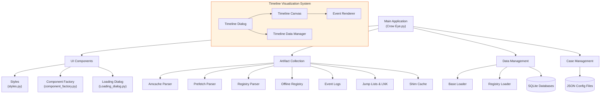
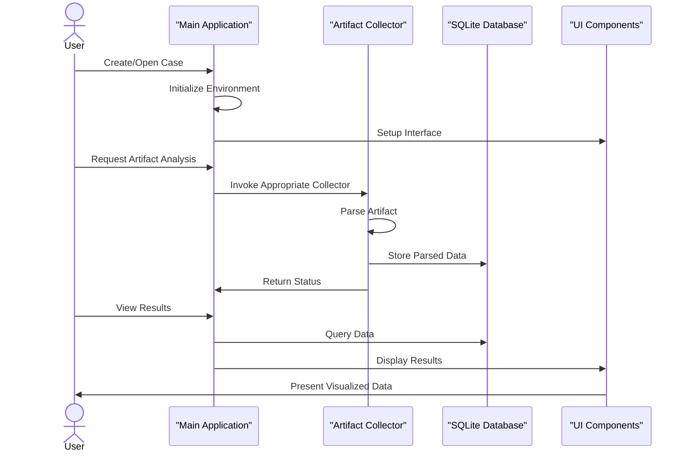

# Crow Eye Project Structure

This document provides a **visualized** overview of the Crow Eye project structure and architecture.

## 1. Visualized Directory Structure

The following diagram represents the physical file structure of the project.

```mermaid
graph TD
    Root["Crow-Eye/"]
    style Root fill:#f9f,stroke:#333,stroke-width:2px
    
    %% Directories
    Root --> Collectors["Artifacts_Collectors/"]
    Root --> Data["data/"]
    Root --> UI["ui/"]
    Root --> Utils["utils/"]
    Root --> Config["config/"]
    Root --> Resources["GUI Resources/"]
    Root --> Timeline["timeline/"]
    
    %% Artifacts_Collectors Files
    Collectors --> CJL["A_CJL_LNK_Claw.py"]
    Collectors --> JL["JLParser.py"]
    Collectors --> Prefetch["Prefetch_claw.py"]
    Collectors --> Reg["Regclaw.py"]
    Collectors --> WinLog["WinLog_Claw.py"]
    Collectors --> Amcache["amcacheparser.py"]
    Collectors --> OffReg["offline_RegClaw.py"]
    Collectors --> Shim["shimcash_claw.py"]
    
    %% Data Files
    Data --> BaseLoader["base_loader.py"]
    Data --> RegLoader["registry_loader.py"]
    
    %% UI Files
    UI --> Loading["Loading_dialog.py"]
    UI --> Factory["component_factory.py"]
    UI --> SearchDlg["search_filter_dialog.py"]
    
    %% Utils Files
    Utils --> Error["error_handler.py"]
    Utils --> FileUtils["file_utils.py"]
    Utils --> SearchUtils["search_utils.py"]
    
    %% Timeline Files
    Timeline --> TLDialog["timeline_dialog.py"]
    Timeline --> TLCanvas["timeline_canvas.py"]
    Timeline --> TLConfig["timeline_config_dialog.py"]
    Timeline --> FilterBar["filter_bar.py"]
    Timeline --> EventPanel["event_details_panel.py"]
    Timeline --> TLData["data/"]
    Timeline --> TLRendering["rendering/"]
    
    %% Root Files
    Root --> Main["Crow Eye.py"]
    Root --> Styles["styles.py"]
    Root --> GUIRes["GUI_resources.py"]
```

## 2. Module Dependency Graph

This diagram shows the high-level dependencies and imports between the main application and its components.

```mermaid
graph TD
    Main["Crow Eye.py"]
    style Main fill:#bbf,stroke:#333,stroke-width:4px
    
    %% External Libs
    PyQt5["PyQt5 Framework"]
    SQLite[("SQLite Database")]
    
    %% Internal Modules
    Styles["styles.py"]
    GUIRes["GUI_resources.py"]
    
    %% Dependencies
    Main --> PyQt5
    Main --> SQLite
    Main --> Styles
    Main --> GUIRes
    
    subgraph Collectors ["Artifact Collectors"]
        style Collectors fill:#e1f5fe,stroke:#01579b
        Main --> OffReg["offline_RegClaw"]
        Main --> Prefetch["Prefetch_claw"]
        Main --> WinLog["WinLog_Claw"]
        Main --> CJL["A_CJL_LNK_Claw"]
        Main --> JL["JLParser"]
        Main --> Reg["Regclaw"]
    end
    
    subgraph UI_Components ["UI Components"]
        style UI_Components fill:#f3e5f5,stroke:#4a148c
        Main --> SearchDialog["ui.search_filter_dialog"]
        Main --> Factory["ui.component_factory"]
    end
    
    subgraph Utilities ["Utilities"]
        style Utilities fill:#e8f5e9,stroke:#1b5e20
        Main --> SearchUtils["utils.SearchUtils"]
    end
    
    %% Note on Timeline
    note["Timeline Module is currently<br/>independent or dynamically loaded"]
    style note fill:#fff9c4,stroke:#fbc02d
```

## 3. Core Architecture

### Main Components

### Component Interaction Flow

## 4. Component Details

### Main Application (`Crow Eye.py`)
The entry point and orchestrator. Handles environment setup, UI initialization, and coordination of artifact collection.

### Artifact Collectors (`Artifacts_Collectors/`)
Specialized modules for parsing Windows artifacts (Prefetch, Registry, Event Logs, etc.).

### Timeline Module (`timeline/`)
A comprehensive visualization system for forensic timelines.
*   **See [timeline/ARCHITECTURE.md](timeline/ARCHITECTURE.md) for detailed architecture.**

### Data Management (`data/`)
Handles database connections and data loading.

### UI Components (`ui/`)
Reusable UI elements and dialogs following the cyberpunk design language.

## 5. Detailed Code Analysis

This section provides a deeper look into the implementation details of key components.

### 5.1 Main Application Logic (`Crow Eye.py`)

The `Crow Eye.py` script is the heart of the application. It performs several critical startup tasks before launching the GUI.

*   **Dependency Management**:
    *   `setup_virtual_environment()`: Checks for and creates a dedicated virtual environment (`crow_eye_venv`) to isolate dependencies.
    *   `check_and_install_requirements()`: Verifies that all required packages (PyQt5, pandas, etc.) are installed.
    *   **Self-Restart**: If dependencies are missing or the virtual environment is created, the script automatically restarts itself within the correct environment.
*   **UI Controller (`Ui_Crow_Eye`)**:
    *   This class (though functionally a mixin or main controller) manages the primary application window.
    *   **Data Loading**: Methods like `load_registry_data_from_db()` orchestrate the fetching of data from SQLite into the UI tables.
    *   **Event Handling**: Connects user actions (buttons, menu clicks) to collector functions.

### 5.2 UI Factory Pattern (`ui/component_factory.py`)

The project uses a **Factory Pattern** to ensure consistent UI styling and reduce boilerplate code.

*   **Class**: `ComponentFactory`
*   **Purpose**: Centralizes the creation of PyQt5 widgets with the application's specific "Cyberpunk" styling.
*   **Key Methods**:
    *   `create_button()`: Returns a styled `QPushButton`.
    *   `create_table()`: Returns a `QTableWidget` with pre-configured headers, sorting, and selection behaviors.
    *   `create_progress_dialog()`: Standardizes loading indicators.
*   **Benefit**: This allows global style changes by modifying only the factory or the `styles.py` file, rather than every individual widget.

### 5.3 Artifact Collector Pattern (Example: `Prefetch_claw.py`)

Most artifact collectors follow a similar structural pattern, exemplified by the Prefetch parser.

*   **Class**: `PrefetchFile`
    *   **Responsibility**: Handles the binary parsing of `.pf` files.
    *   **Version Handling**: Contains specific methods (`_parse_version17`, `_parse_version23`, etc.) to handle different Windows versions (XP to 11).
    *   **Compression**: Includes logic (`_decompress_win10_prefetch`) to handle Windows 10/11 XPRESS compression using native Windows APIs.
*   **Data Structures**:
    *   Uses Python `dataclasses` (`Header`, `FileMetric`, `VolumeInfo`) to represent structured binary data, making the code readable and type-safe.
*   **Forensic Logic**:
    *   Extracts execution timestamps, run counts, and file paths.
    *   Parses MFT references to link execution to specific file system entries.

### 5.4 Data Abstraction Layer (`data/base_loader.py`)

The application employs a robust data abstraction layer to handle SQLite interactions efficiently.

*   **Class**: `BaseDataLoader`
    *   **Purpose**: Acts as a facade for all database operations, ensuring consistent connection handling and error management.
    *   **Performance Optimization**:
        *   Implements **PRAGMA** settings (WAL mode, memory temp store) to optimize for read-heavy forensic workloads.
        *   Uses `iterate_query` to **stream results** via generators, preventing memory exhaustion when loading large datasets (e.g., millions of event logs).
    *   **Schema Management**: Includes methods like `verify_tables` and `ensure_default_indexes` to guarantee the database structure is ready for analysis.

### 5.5 Live Registry Collection (`Artifacts_Collectors/Regclaw.py`)

This module demonstrates the application's capability to interact with the live system for immediate triage.

*   **Core Function**: `main_live_reg`
    *   **Privilege Check**: Enforces Administrator privileges to access protected hives (SAM, SECURITY).
    *   **Comprehensive Schema**: Defines over 20 SQL tables to structure registry artifacts, including:
        *   `USBDevices` & `USBStorageDevices`: For tracking external media.
        *   `UserAssist`: For program execution history.
        *   `Shellbags`: For folder access reconstruction.
    *   **Hybrid Parsing**:
        *   Uses `winreg` for standard string/DWORD values.
        *   Delegates complex binary blobs (like `MRUListEx` or `UserAssist` ROT-13 encoded data) to a specialized `registry_binary_parser` module.

### 5.6 Main Application Details (`Crow Eye.py`)

The `Crow Eye.py` file serves as the monolithic entry point and controller for the application.

*   **Startup Sequence**:
    1.  **Admin Check**: `is_admin()` ensures the tool runs with elevated privileges required for forensic access.
    2.  **Environment Setup**: `setup_virtual_environment()` creates an isolated `crow_eye_venv` to manage dependencies.
    3.  **Dependency Validation**: `check_and_install_requirements()` and `validate_dependencies()` ensure all libraries (including `pywin32` and `PyQt5`) are present and functional.
    4.  **UI Initialization**: The `if __name__ == "__main__":` block initializes the `QApplication`, creates the main window, and loads the last used case.

*   **Architecture**:
    *   **Monolithic Controller**: The `Ui_Crow_Eye` class acts as a central controller, managing UI setup, event handling, and data orchestration.
    *   **Dynamic UI Generation**: Methods like `create_amcache_table_tabs` and `create_mft_usn_table_tabs` dynamically generate tabs and tables based on the schema of the loaded artifacts, allowing for flexible data presentation.
    *   **Data Loading Pattern**: The application uses a consistent pattern for loading data:
        *   `load_registry_data_from_db()`: Master function triggering specific loaders.
        *   `load_data_from_database_[Artifact]()`: Individual functions (e.g., `load_data_from_database_NetworkLists`) that connect to SQLite, fetch data, and populate specific `QTableWidget` instances.

*   **Integration**:
    *   **Search System**: Integrates with `SearchUtils` to provide global search and highlighting capabilities across all loaded tables (`process_highlight_queue`, `highlight_current_result`).
    *   **Event Handling**: Connects UI signals (clicks, menu actions) to backend logic, including a specialized `connect_table_double_click_events` handler for detailed row views.
