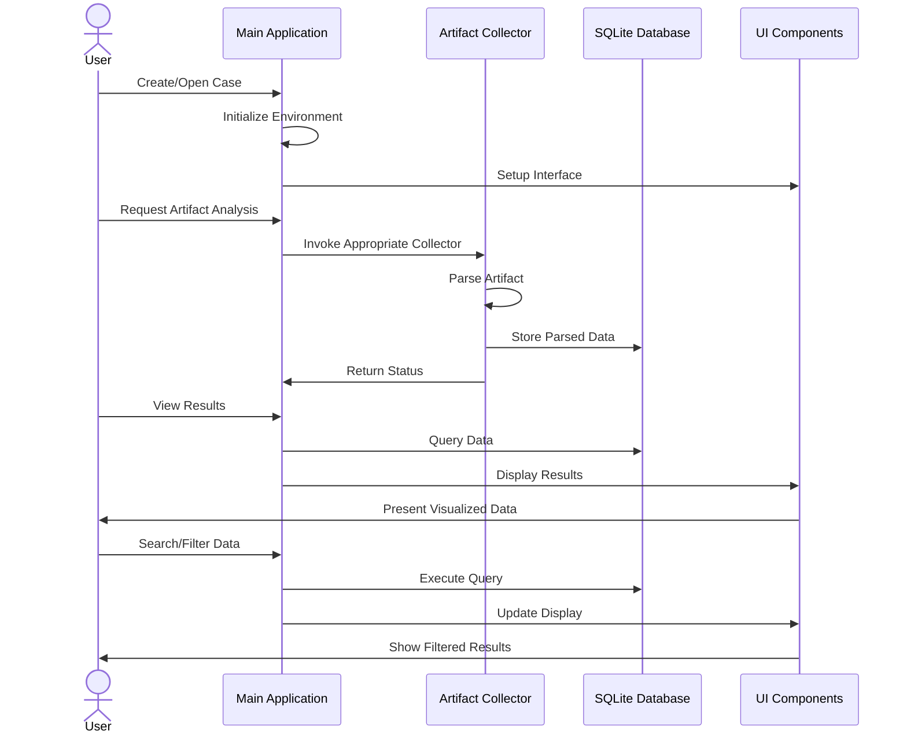
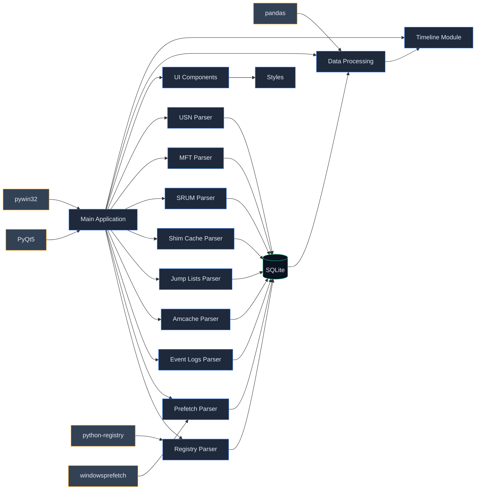

# Crow Eye Technical Documentation

## Table of Contents

- [Overview](#overview)
- [Complete Project Structure](#complete-project-structure)
- [Architecture Overview](#architecture-overview)
- [Core Components](#core-components)
- [Artifact Collectors](#artifact-collectors)
- [Timeline Module](#timeline-module)
- [Data Management Layer](#data-management-layer)
- [UI Components](#ui-components)
- [Utilities](#utilities)
- [Data Flow & Processes](#data-flow--processes)
- [Component Interactions](#component-interactions)
- [Development Guide](#development-guide)
- [Technical Implementation](#technical-implementation)
- [Extension Points](#extension-points)

---

## Overview

Crow Eye is an open-source Windows forensic investigation tool designed to collect, analyze, and visualize various Windows artifacts. It features a modular architecture with specialized components for artifact collection, data processing, and visualization through a cyberpunk-themed GUI.

**Vision**: Crow-Eye aims to democratize digital forensics, making it accessible to everyone—from concerned parents to professional investigators. See [README.md](README.md#vision-forensics-for-everyone) for our complete vision and mission.

### Key Features

- **Comprehensive Artifact Collection**: Supports multiple Windows forensic artifacts (Prefetch, Registry, Event Logs, Amcache, Jump Lists, SRUM, MFT, USN Journal, Recycle Bin)
- **Timeline Visualization**: Advanced timeline view with OpenGL-accelerated rendering
- **Case Management**: Organize investigations into cases with persistent configuration
- **Search & Correlation**: Powerful search capabilities across all artifacts
- **Cyberpunk UI**: Distinctive dark theme with neon accents
- **Modular Architecture**: Easy to extend with new artifact parsers

---

## Complete Project Structure

### Directory Tree

```
Crow-Eye/
├── Artifacts_Collectors/              # Specialized parsers for Windows artifacts
│   ├── A_CJL_LNK_Claw.py             # Jump Lists and LNK file parser
│   ├── JLParser.py                    # Jump List parser utilities
│   ├── Prefetch_claw.py               # Windows Prefetch parser
│   ├── Regclaw.py                     # Live Windows Registry parser
│   ├── WinLog_Claw.py                 # Windows Event Log parser
│   ├── amcacheparser.py               # Amcache.hve parser
│   ├── offline_RegClaw.py             # Offline Registry analysis
│   ├── offlineACJL.py                 # Offline Jump Lists parser
│   ├── shimcash_claw.py               # Application Compatibility Shim Cache parser
│   ├── SRUM_Claw.py                   # System Resource Usage Monitor parser
│   ├── recyclebin_claw.py             # Recycle Bin parser
│   ├── registry_binary_parser.py      # Binary registry data decoder
│   ├── MFT and USN journal/           # File system artifacts
│   │   ├── MFT_Claw.py               # Master File Table parser
│   │   ├── USN_Claw.py               # USN Journal parser
│   │   └── mft_usn_correlator.py     # MFT/USN correlation engine
│   └── modules/                       # Shared collector modules
├── data/                              # Data management components
│   ├── base_loader.py                 # Base class for data loading operations
│   ├── registry_loader.py             # Registry-specific data loader
│   ├── mft_loader.py                  # MFT data loader
│   ├── usn_loader.py                  # USN Journal data loader
│   ├── correlated_loader.py           # Correlated data loader
│   ├── database_manager.py            # Database connection manager
│   ├── database_initializer.py        # Database schema initializer
│   ├── database_discovery_manager.py  # Database discovery and indexing
│   ├── index_manager.py               # Database index management
│   ├── search_engine.py               # Search functionality
│   ├── unified_search_engine.py       # Unified search across artifacts
│   ├── search_history_manager.py      # Search history tracking
│   ├── timestamp_parser.py            # Timestamp parsing utilities
│   └── timestamp_detector.py          # Automatic timestamp detection
├── ui/                                # UI components
│   ├── Loading_dialog.py              # Custom loading dialog
│   ├── component_factory.py           # Factory for creating UI elements
│   ├── search_filter_dialog.py        # Search and filter dialog
│   ├── search_widget.py               # Search widget component
│   ├── search_integration.py          # Search integration layer
│   ├── database_search_dialog.py      # Database search dialog
│   ├── database_search_integration.py # Database search integration
│   ├── case_dialog.py                 # Case management dialog
│   ├── row_detail_dialog.py           # Row detail viewer
│   ├── row_detail_dialog_handler.py   # Row detail handler
│   ├── progress_indicator.py          # Progress indicator widget
│   ├── pagination_widget.py           # Pagination controls
│   ├── pagination_helper.py           # Pagination logic
│   ├── pagination_config.py           # Pagination configuration
│   ├── virtual_table_widget.py        # Virtual table for large datasets
│   ├── mft_virtual_table_integration.py    # MFT virtual table
│   ├── usn_virtual_table_integration.py    # USN virtual table
│   └── correlated_virtual_table_integration.py  # Correlated data virtual table
├── utils/                             # Utility functions
│   ├── error_handler.py               # Error handling and logging
│   ├── file_utils.py                  # File operation utilities
│   ├── search_utils.py                # Search utilities
│   ├── time_utils.py                  # Time and date utilities
│   ├── file_signature_detector.py     # File signature detection
│   ├── memory_monitor.py              # Memory usage monitoring
│   └── raw_file_copy.py               # Raw file copying utilities
├── timeline/                          # Timeline visualization system
│   ├── timeline_dialog.py             # Main timeline dialog
│   ├── timeline_canvas.py             # Timeline canvas (QGraphicsView)
│   ├── timeline_config_dialog.py      # Timeline configuration
│   ├── filter_bar.py                  # Filter controls
│   ├── event_details_panel.py         # Event details panel
│   ├── event_details_dialog.py        # Event details dialog
│   ├── data/                          # Timeline data layer
│   │   ├── timeline_data_manager.py   # Data access layer
│   │   ├── query_worker.py            # Background query worker
│   │   ├── progressive_loader.py      # Progressive data loading
│   │   ├── event_aggregator.py        # Event aggregation
│   │   ├── power_event_extractor.py   # Power event extraction
│   │   ├── timestamp_indexer.py       # Timestamp indexing
│   │   └── srum_app_resolver.py       # SRUM application resolver
│   ├── rendering/                     # Rendering layer
│   │   ├── event_renderer.py          # Event marker rendering
│   │   ├── zoom_manager.py            # Zoom level management
│   │   └── viewport_optimizer.py      # Viewport optimization
│   ├── correlation/                   # Correlation engine
│   │   └── correlation_engine.py      # Event correlation logic
│   ├── persistence/                   # State persistence
│   └── utils/                         # Timeline utilities
├── GUI Resources/                     # UI assets and resources
├── config/                            # Case configuration files (JSON)
├── Crow Eye.py                        # Main application entry point
├── styles.py                          # UI styling definitions
└── GUI_resources.py                   # Compiled UI resources
```

### Visualized Directory Structure

```mermaid
graph TD
    Root["Crow-Eye/"]
    style Root fill:#f9f,stroke:#333,stroke-width:2px
    
    %% Directories
    Root --> Collectors["Artifacts_Collectors/"]
    Root --> Data["data/"]
    Root --> UI["ui/"]
    Root --> Utils["utils/"]
    Root --> Config["config/"]
    Root --> Resources["GUI Resources/"]
    Root --> Timeline["timeline/"]
    
    %% Artifacts_Collectors Files
    Collectors --> CJL["A_CJL_LNK_Claw.py"]
    Collectors --> JL["JLParser.py"]
    Collectors --> Prefetch["Prefetch_claw.py"]
    Collectors --> Reg["Regclaw.py"]
    Collectors --> WinLog["WinLog_Claw.py"]
    Collectors --> Amcache["amcacheparser.py"]
    Collectors --> OffReg["offline_RegClaw.py"]
    Collectors --> OffACJL["offlineACJL.py"]
    Collectors --> Shim["shimcash_claw.py"]
    Collectors --> SRUM["SRUM_Claw.py"]
    Collectors --> Recycle["recyclebin_claw.py"]
    Collectors --> RegBin["registry_binary_parser.py"]
    Collectors --> MFTDir["MFT and USN journal/"]
    
    %% Data Files
    Data --> BaseLoader["base_loader.py"]
    Data --> RegLoader["registry_loader.py"]
    Data --> MFTLoader["mft_loader.py"]
    Data --> USNLoader["usn_loader.py"]
    Data --> DBMgr["database_manager.py"]
    Data --> SearchEngine["search_engine.py"]
    Data --> TimestampParser["timestamp_parser.py"]
    
    %% UI Files
    UI --> Loading["Loading_dialog.py"]
    UI --> Factory["component_factory.py"]
    UI --> SearchDlg["search_filter_dialog.py"]
    UI --> CaseDlg["case_dialog.py"]
    UI --> RowDetail["row_detail_dialog.py"]
    UI --> Pagination["pagination_widget.py"]
    
    %% Utils Files
    Utils --> Error["error_handler.py"]
    Utils --> FileUtils["file_utils.py"]
    Utils --> SearchUtils["search_utils.py"]
    Utils --> TimeUtils["time_utils.py"]
    Utils --> MemMonitor["memory_monitor.py"]
    
    %% Timeline Files
    Timeline --> TLDialog["timeline_dialog.py"]
    Timeline --> TLCanvas["timeline_canvas.py"]
    Timeline --> TLConfig["timeline_config_dialog.py"]
    Timeline --> FilterBar["filter_bar.py"]
    Timeline --> EventPanel["event_details_panel.py"]
    Timeline --> TLData["data/"]
    Timeline --> TLRendering["rendering/"]
    Timeline --> TLCorr["correlation/"]
    
    %% Root Files
    Root --> Main["Crow Eye.py"]
    Root --> Styles["styles.py"]
    Root --> GUIRes["GUI_resources.py"]
```



---

## Architecture Overview

### System Architecture

The following diagram shows the high-level architecture of Crow Eye:

```mermaid
graph TD
    %% Main Components
    Main["Main Application\n(Crow Eye.py)"] --> UI["UI Components"]
    Main --> ArtifactCollection["Artifact Collection"]
    Main --> DataManagement["Data Management"]
    Main --> CaseManagement["Case Management"]
    
    %% UI Components
    UI --> Styles["Styles\n(styles.py)"]
    UI --> ComponentFactory["Component Factory\n(component_factory.py)"]
    UI --> LoadingDialog["Loading Dialog\n(Loading_dialog.py)"]
    
    %% Artifact Collectors
    ArtifactCollection --> Amcache["Amcache Parser\n(amcacheparser.py)"]
    ArtifactCollection --> Prefetch["Prefetch Parser\n(Prefetch_claw.py)"]
    ArtifactCollection --> Registry["Registry Parser\n(Regclaw.py)"]
    ArtifactCollection --> OfflineRegistry["Offline Registry\n(offline_RegClaw.py)"]
    ArtifactCollection --> EventLogs["Event Logs\n(WinLog_Claw.py)"]
    ArtifactCollection --> JumpLists["Jump Lists & LNK\n(A_CJL_LNK_Claw.py)"]
    ArtifactCollection --> ShimCache["Shim Cache\n(shimcash_claw.py)"]
    ArtifactCollection --> SRUM["SRUM Parser\n(SRUM_Claw.py)"]
    ArtifactCollection --> RecycleBin["Recycle Bin\n(recyclebin_claw.py)"]
    ArtifactCollection --> MFT["MFT Parser\n(MFT_Claw.py)"]
    ArtifactCollection --> USN["USN Journal\n(USN_Claw.py)"]
    
    %% Data Management
    DataManagement --> BaseLoader["Base Loader\n(base_loader.py)"]
    DataManagement --> RegistryLoader["Registry Loader\n(registry_loader.py)"]
    DataManagement --> DBManager["Database Manager\n(database_manager.py)"]
    DataManagement --> SearchEngine["Search Engine\n(search_engine.py)"]
    DataManagement --> SQLite[("SQLite Databases")]
    
    %% Case Management
    CaseManagement --> ConfigFiles[("JSON Config Files\n(config/)")]
    
    %% Utilities
    Main --> Utils["Utilities"]
    Utils --> FileUtils["File Utilities\n(file_utils.py)"]
    Utils --> ErrorHandler["Error Handler\n(error_handler.py)"]
    Utils --> TimeUtils["Time Utils\n(time_utils.py)"]
    
    %% Data Flow
    Amcache --> SQLite
    Prefetch --> SQLite
    Registry --> SQLite
    OfflineRegistry --> SQLite
    EventLogs --> SQLite
    JumpLists --> SQLite
    ShimCache --> SQLite
    SRUM --> SQLite
    RecycleBin --> SQLite
    MFT --> SQLite
    USN --> SQLite
    
    SQLite --> Main
    
    %% Styling
    Styles --> UI
    
    %% User Interaction
    User(("User")) --> Main
    Main --> User
    
    %% Timeline Subsystem
    subgraph Timeline_System ["Timeline Visualization System"]
        style Timeline_System fill:#fff3e0,stroke:#e65100
        TL_Dialog["Timeline Dialog"] --> TL_Canvas["Timeline Canvas"]
        TL_Dialog --> TL_Data["Timeline Data Manager"]
        TL_Canvas --> TL_Renderer["Event Renderer"]
    end
    
    Main --> Timeline_System
    
    %% Class Definitions
    classDef mainApp fill:#0F172A,stroke:#00FFFF,stroke-width:2px,color:#E2E8F0
    classDef component fill:#1E293B,stroke:#3B82F6,stroke-width:1px,color:#E2E8F0
    classDef collector fill:#1E293B,stroke:#8B5CF6,stroke-width:1px,color:#E2E8F0
    classDef data fill:#0B1220,stroke:#10B981,stroke-width:1px,color:#E2E8F0
    classDef utility fill:#1E293B,stroke:#F59E0B,stroke-width:1px,color:#E2E8F0
    classDef user fill:#334155,stroke:#00FFFF,stroke-width:2px,color:#E2E8F0
    
    %% Apply Classes
    class Main mainApp
    class UI,ComponentFactory,LoadingDialog,Styles component
    class Amcache,Prefetch,Registry,OfflineRegistry,EventLogs,JumpLists,ShimCache,SRUM,RecycleBin,MFT,USN collector
    class SQLite,BaseLoader,RegistryLoader,DBManager,SearchEngine,DataManagement,ConfigFiles data
    class Utils,FileUtils,ErrorHandler,TimeUtils utility
    class User user
    class ArtifactCollection collector
    class CaseManagement data
```



### Module Dependency Graph

```mermaid
graph TD
    Main["Crow Eye.py"]
    style Main fill:#bbf,stroke:#333,stroke-width:4px
    
    %% External Libs
    PyQt5["PyQt5 Framework"]
    SQLite[("SQLite Database")]
    
    %% Internal Modules
    Styles["styles.py"]
    GUIRes["GUI_resources.py"]
    
    %% Dependencies
    Main --> PyQt5
    Main --> SQLite
    Main --> Styles
    Main --> GUIRes
    
    subgraph Collectors ["Artifact Collectors"]
        style Collectors fill:#e1f5fe,stroke:#01579b
        Main --> OffReg["offline_RegClaw"]
        Main --> Prefetch["Prefetch_claw"]
        Main --> WinLog["WinLog_Claw"]
        Main --> CJL["A_CJL_LNK_Claw"]
        Main --> JL["JLParser"]
        Main --> Reg["Regclaw"]
        Main --> SRUM["SRUM_Claw"]
        Main --> MFT["MFT_Claw"]
    end
    
    subgraph UI_Components ["UI Components"]
        style UI_Components fill:#f3e5f5,stroke:#4a148c
        Main --> SearchDialog["ui.search_filter_dialog"]
        Main --> Factory["ui.component_factory"]
        Main --> CaseDialog["ui.case_dialog"]
    end
    
    subgraph Utilities ["Utilities"]
        style Utilities fill:#e8f5e9,stroke:#1b5e20
        Main --> SearchUtils["utils.SearchUtils"]
        Main --> ErrorHandler["utils.error_handler"]
    end
    
    subgraph Timeline_Module ["Timeline Module"]
        style Timeline_Module fill:#fff9c4,stroke:#fbc02d
        Main --> TimelineDialog["timeline.timeline_dialog"]
    end
```



---

## Core Components

### 1. Main Application (`Crow Eye.py`)

The main application serves as the entry point and orchestrator for the entire system.

#### Responsibilities

- **Environment Setup**: Creates and manages a virtual environment (`crow_eye_venv`) with required dependencies
- **UI Initialization**: Sets up the PyQt5-based user interface with cyberpunk styling
- **Artifact Collection Coordination**: Invokes the appropriate artifact collectors based on user actions
- **Data Visualization**: Displays collected artifacts in tables and other UI components
- **Case Management**: Handles case creation, loading, and configuration persistence

#### Key Functions

- `setup_virtual_environment()`: Creates and activates a Python virtual environment for Crow Eye
- `check_and_install_requirements()`: Ensures all required packages are installed
- `validate_dependencies()`: Validates that all dependencies are functional
- `is_admin()`: Checks for administrator privileges
- `load_registry_data_from_db()`: Master function for loading registry data
- `create_amcache_table_tabs()`: Dynamically generates Amcache tabs
- `create_mft_usn_table_tabs()`: Dynamically generates MFT/USN tabs

#### Startup Sequence

1. **Admin Check**: `is_admin()` ensures the tool runs with elevated privileges
2. **Environment Setup**: `setup_virtual_environment()` creates isolated environment
3. **Dependency Validation**: `check_and_install_requirements()` ensures all libraries are present
4. **UI Initialization**: `QApplication` is initialized and main window is created
5. **Case Loading**: Last used case is loaded automatically

---

## Artifact Collectors

Each artifact collector is a specialized module for extracting and parsing a specific type of Windows forensic artifact.

### Common Collector Pattern

All collectors follow this pattern:

1. **Locate** artifact source (files, registry keys, etc.)
2. **Parse** binary data into structured information
3. **Store** results in SQLite databases
4. **Export** JSON output for interoperability

### Collector Components

- **Data Classes**: Define the structure of parsed artifacts (using `@dataclass`)
- **Parser Functions**: Extract and interpret binary data
- **Database Functions**: Create schemas and store parsed data
- **Export Functions**: Generate JSON or other output formats

### Artifact Collection Process

```mermaid
sequenceDiagram
    actor User
    participant UI as Main UI
    participant Coord as Artifact Coordinator
    participant Collector as Artifact Collector
    participant Parser as Binary Parser
    participant DB as SQLite Database
    participant Loader as Data Loader
    participant Display as UI Display
    
    User->>UI: Select Artifact Type
    UI->>Coord: Request Collection
    
    rect rgb(30, 41, 59)
        Note over Coord,Collector: Artifact Collection Phase
        Coord->>Collector: Invoke Collector
        Collector->>Collector: Locate Artifact Files
        
        loop For Each Artifact File
            Collector->>Parser: Parse Binary Data
            Parser->>Parser: Extract Metadata
            Parser->>Parser: Decode Structures
            Parser-->>Collector: Parsed Data
            
            Collector->>DB: Create/Verify Schema
            Collector->>DB: Insert Parsed Data
            DB-->>Collector: Confirmation
        end
        
        Collector-->>Coord: Collection Complete
    end
    
    Coord->>UI: Update Status
    UI->>User: Show Progress
    
    rect rgb(11, 18, 32)
        Note over User,Display: Data Display Phase
        User->>UI: View Results
        UI->>Loader: Load Data
        Loader->>DB: Query Artifacts
        DB-->>Loader: Result Set
        Loader->>Loader: Format Data
        Loader-->>Display: Formatted Data
        Display->>Display: Render Tables
        Display-->>User: Show Results
    end
    
    opt Export Data
        User->>Display: Request Export
        Display->>DB: Query Full Dataset
        DB-->>Display: Complete Data
        Display->>Display: Generate JSON/CSV
        Display-->>User: Download File
    end
```



**Key Phases:**
1. **Collection Phase**: Artifact files are located, parsed, and stored in SQLite
2. **Display Phase**: Data is queried, formatted, and rendered in the UI
3. **Export Phase** (Optional): Complete datasets can be exported for external analysis

### Supported Artifacts

#### 1. Prefetch Parser (`Prefetch_claw.py`)

Parses Windows Prefetch files (`.pf`) to extract execution history.

**Data Structures**:
```python
class Version(enum.IntEnum):
    WIN_XP_OR_2003 = 17
    VISTA_OR_WIN7 = 23
    WIN8X_OR_WIN2012X = 26
    WIN10_OR_WIN11 = 30
    WIN11 = 31

@dataclass
class Header:
    version: Version
    signature: str
    file_size: int
    executable_filename: str
    hash: str

@dataclass
class FileMetric:
    filename_string_offset: int
    filename_string_size: int
    mft_info: Optional[MFTInformation]
```

**Key Functions**:
- `parse_prefetch_file(file_path)`: Main parsing function
- `extract_execution_times(data, version)`: Extracts execution timestamps
- `extract_file_references(data, version)`: Extracts file references
- `_decompress_win10_prefetch()`: Handles Windows 10/11 XPRESS compression

**Forensic Value**:
- Program execution history
- Last execution times (up to 8 timestamps)
- Run count
- Files and directories accessed by the program

#### 2. Registry Parser (`Regclaw.py`)

Extracts forensic artifacts from live Windows Registry hives.

**Key Functions**:
- `main_live_reg()`: Main entry point for live registry collection
- `extract_user_assist()`: UserAssist data (program execution)
- `extract_shimcache()`: ShimCache data
- `extract_bam()`: Background Activity Moderator data

**Artifacts Collected**:
- USB Devices & Storage
- UserAssist (ROT-13 decoded)
- Shellbags (folder access)
- Recent Documents
- Network Lists
- Run/RunOnce keys
- Installed Programs
- Services
- BAM/DAM (Background Activity Moderator)

**Database Schema**: 20+ tables for different registry artifacts

#### 3. Offline Registry Parser (`offline_RegClaw.py`)

Parses offline registry hives without requiring live system access.


#### 4. Amcache Parser (`amcacheparser.py`)

Parses `Amcache.hve` to identify application execution history.

**Key Functions**:
- `parse_amcache(file_path)`: Main parsing function
- `extract_file_entries()`: File execution entries
- `extract_program_entries()`: Program installation entries

**Database Tables**:
- InventoryApplication
- InventoryApplicationFile
- InventoryDriverBinary
- DeviceCensus

#### 5. Event Log Parser (`WinLog_Claw.py`)

Parses Windows Event Log files (`.evtx`).

**Key Functions**:
- `parse_event_log(file_path)`: Main parsing function
- `extract_logon_events()`: Logon/logoff events
- `extract_process_events()`: Process creation/termination

**Forensic Value**:
- User logon/logoff events
- Process creation (Event ID 4688)
- Service installations
- System events

#### 6. Jump Lists & LNK Parser (`A_CJL_LNK_Claw.py`)

Parses Jump Lists and LNK (shortcut) files.

**Key Functions**:
- `parse_automatic_destinations()`: AutomaticDestinations-MS files
- `parse_custom_destinations()`: CustomDestinations files
- `parse_lnk_file()`: LNK file parsing
- `extract_target_info()`: Target file information

**Forensic Value**:
- Recently accessed files
- Application usage patterns
- File paths and timestamps

#### 7. Offline Jump Lists Parser (`offlineACJL.py`)

Specialized parser for offline Jump Lists analysis.

#### 8. Shim Cache Parser (`shimcash_claw.py`)

Parses Application Compatibility Shim Cache.

**Forensic Value**:
- Program execution evidence
- File paths
- Last modification times

#### 9. SRUM Parser (`SRUM_Claw.py`)

Parses System Resource Usage Monitor database.

**Forensic Value**:
- Application resource usage
- Network connectivity
- Energy usage
- Application timeline

#### 10. Recycle Bin Parser (`recyclebin_claw.py`)

Parses Recycle Bin artifacts (`$I` and `$R` files).

**Forensic Value**:
- Deleted file information
- Original file paths
- Deletion timestamps
- File sizes

#### 11. MFT Parser (`MFT_Claw.py`)

Parses Master File Table (`$MFT`).

**Forensic Value**:
- Complete file system timeline
- File metadata (MACB timestamps)
- File attributes
- Resident data

#### 12. USN Journal Parser (`USN_Claw.py`)

Parses USN (Update Sequence Number) Journal (`$UsnJrnl`).

**Forensic Value**:
- File system changes
- File creation/modification/deletion
- Rename operations
- Detailed change reasons

#### 13. Registry Binary Parser (`registry_binary_parser.py`)

Decodes complex binary registry data structures.

**Supported Formats**:
- UserAssist (ROT-13 encoded)
- Shellbags
- MRUListEx
- Binary timestamps

---

## Timeline Module

A comprehensive visualization system for forensic timelines with OpenGL-accelerated rendering.

### Timeline Architecture

The Timeline module follows a layered architecture separating UI, Visualization, and Data concerns:

```mermaid
graph TB
    subgraph UI_Layer ["UI & Orchestration Layer"]
        style UI_Layer fill:#1E293B,stroke:#3B82F6,stroke-width:2px
        TLDialog["timeline_dialog.py<br/>(Main Controller)"]
        FilterBar["filter_bar.py<br/>(Top Controls)"]
        EventPanel["event_details_panel.py<br/>(Details Panel)"]
        ConfigDialog["timeline_config_dialog.py<br/>(Configuration)"]
    end
    
    subgraph Viz_Layer ["Visualization Layer"]
        style Viz_Layer fill:#0F172A,stroke:#8B5CF6,stroke-width:2px
        TLCanvas["timeline_canvas.py<br/>(QGraphicsView)"]
        EventRenderer["rendering/event_renderer.py<br/>(Drawing Logic)"]
        ZoomMgr["rendering/zoom_manager.py<br/>(Zoom/Scale)"]
        ViewportOpt["rendering/viewport_optimizer.py<br/>(Performance)"]
    end
    
    subgraph Data_Layer ["Data & Logic Layer"]
        style Data_Layer fill:#0B1220,stroke:#10B981,stroke-width:2px
        QueryWorker["data/query_worker.py<br/>(Background Thread)"]
        DataMgr["data/timeline_data_manager.py<br/>(Data Access)"]
        ProgLoader["data/progressive_loader.py<br/>(Streaming)"]
        PowerExtractor["data/power_event_extractor.py<br/>(Power Events)"]
        TimestampIdx["data/timestamp_indexer.py<br/>(Indexing)"]
        EventAgg["data/event_aggregator.py<br/>(Aggregation)"]
        SRUMResolver["data/srum_app_resolver.py<br/>(App Resolution)"]
    end
    
    subgraph Storage ["Storage"]
        style Storage fill:#334155,stroke:#F59E0B,stroke-width:2px
        SQLite[("SQLite Databases<br/>(Per Artifact)")]
    end
    
    %% UI Connections
    TLDialog --> FilterBar
    TLDialog --> EventPanel
    TLDialog --> ConfigDialog
    TLDialog --> TLCanvas
    
    %% Visualization Connections
    TLCanvas --> EventRenderer
    TLCanvas --> ZoomMgr
    TLCanvas --> ViewportOpt
    
    %% Data Connections
    TLDialog --> QueryWorker
    QueryWorker --> DataMgr
    DataMgr --> ProgLoader
    DataMgr --> PowerExtractor
    DataMgr --> TimestampIdx
    DataMgr --> EventAgg
    DataMgr --> SRUMResolver
    DataMgr --> SQLite
    
    %% Rendering Data Flow
    QueryWorker -.results.-> TLDialog
    TLDialog -.events.-> TLCanvas
    
    classDef uiClass fill:#1E293B,stroke:#3B82F6,color:#E2E8F0
    classDef vizClass fill:#0F172A,stroke:#8B5CF6,color:#E2E8F0
    classDef dataClass fill:#0B1220,stroke:#10B981,color:#E2E8F0
    classDef storageClass fill:#334155,stroke:#F59E0B,color:#E2E8F0
    
    class TLDialog,FilterBar,EventPanel,ConfigDialog uiClass
    class TLCanvas,EventRenderer,ZoomMgr,ViewportOpt vizClass
    class QueryWorker,DataMgr,ProgLoader,PowerExtractor,TimestampIdx,EventAgg,SRUMResolver dataClass
    class SQLite storageClass
```



**Key Components:**
- **UI Layer**: Manages user interactions, filtering, and event details display
- **Visualization Layer**: Handles OpenGL-accelerated rendering with zoom/pan capabilities
- **Data Layer**: Manages efficient querying of millions of forensic artifacts with background threading

### Timeline Components

#### 1. Timeline Dialog (`timeline_dialog.py`)

Main controller for the timeline system.

**Responsibilities**:
- Initialize UI components
- Manage time range and filters
- Coordinate data loading
- Handle user interactions

#### 2. Timeline Canvas (`timeline_canvas.py`)

QGraphicsView-based visualization.

**Features**:
- Pan and zoom controls
- Event marker rendering
- LRU cache for performance
- Coordinate transformations (time ↔ pixels)

#### 3. Event Renderer (`rendering/event_renderer.py`)

Draws event markers on the timeline.

**Rendering Logic**:
- Shape selection based on artifact type
- Color coding by category
- Selection highlights
- Clustering for dense areas

#### 4. Zoom Manager (`rendering/zoom_manager.py`)

Manages zoom levels (0-10).

**Features**:
- Time scale calculations
- Max zoom cap logic
- Smooth zoom transitions

#### 5. Timeline Data Manager (`data/timeline_data_manager.py`)

Data access layer for timeline.

**Features**:
- Multi-database connections
- Thread-safe operations
- Query optimization
- Result aggregation

#### 6. Query Worker (`data/query_worker.py`)

Background thread for data loading.

**Features**:
- Non-blocking queries
- Progress signals
- Cancellation support

**See** [timeline/ARCHITECTURE.md](timeline/ARCHITECTURE.md) for detailed timeline architecture.

---

## Data Management Layer

### Base Data Loader (`data/base_loader.py`)

Core functionality for database operations.

**Class**: `BaseDataLoader`

```python
class BaseDataLoader:
    def __init__(self, db_path: Optional[Union[str, Path]] = None):
        self.db_path = Path(db_path) if db_path else None
        self.connection = None
        self.logger = logging.getLogger(self.__class__.__name__)
```

**Methods**:
- `connect(db_path)`: Establishes database connection
- `disconnect()`: Closes connection
- `execute_query(query, params, fetch)`: Executes SQL query
- `get_table_names()`: Lists all tables
- `table_exists(table_name)`: Checks table existence
- `iterate_query()`: Streams results via generator (memory efficient)

**Performance Optimizations**:
- WAL mode for concurrent reads
- Memory temp store
- Prepared statements
- Connection pooling

### Registry Loader (`data/registry_loader.py`)

Extends `BaseDataLoader` with Registry-specific functionality.

**Methods**:
- `load_registry_keys(registry_path)`: Loads Registry keys
- `query_registry_values(key_path)`: Queries values
- `store_registry_key(key_data, table_name)`: Stores key data

### Database Manager (`data/database_manager.py`)

Centralized database connection management.

**Features**:
- Connection pooling
- Thread-local connections
- Automatic cleanup
- Error recovery

### Search Engine (`data/search_engine.py`)

Search functionality across artifacts.

**Features**:
- Full-text search
- Regex support
- Multi-table queries
- Result ranking

### Unified Search Engine (`data/unified_search_engine.py`)

Unified search across all artifact types.

**Features**:
- Cross-artifact correlation
- Weighted results
- Search history
- Saved searches

### Timestamp Parser (`data/timestamp_parser.py`)

Robust timestamp parsing utility.

**Supported Formats**:
- Unix timestamps
- Windows FILETIME
- ISO 8601 strings
- Custom formats

**Features**:
- Automatic format detection
- Timezone handling
- Failure tracking
- Warning logs

---

## UI Components

### Component Factory (`ui/component_factory.py`)

Factory pattern for consistent UI styling.

**Class**: `ComponentFactory`

```python
class ComponentFactory:
    def __init__(self, styles: Optional[Dict[str, str]] = None):
        self.styles = styles or {}
```

**Methods**:
- `create_button(text, style_name, tooltip, icon, on_click)`: Creates styled button
- `create_table(headers, style_name, selection_behavior, selection_mode, sort_enabled)`: Creates styled table
- `create_progress_dialog()`: Creates loading indicator
- `create_label()`: Creates styled label
- `create_line_edit()`: Creates styled input field

**Benefits**:
- Consistent styling across application
- Centralized style management
- Reduced boilerplate code

### Loading Dialog (`ui/Loading_dialog.py`)

Custom loading progress dialog.

**Features**:
- Cyberpunk styling
- Progress bar
- Cancellation support
- Status messages

### Search Filter Dialog (`ui/search_filter_dialog.py`)

Advanced search and filtering interface.

**Features**:
- Multi-field search
- Date range filters
- Artifact type filters
- Regular expression support

### Case Dialog (`ui/case_dialog.py`)

Case management interface.

**Features**:
- Create new cases
- Open existing cases
- Case metadata editing
- Recent cases list

### Row Detail Dialog (`ui/row_detail_dialog.py`)

Detailed view for table rows.

**Features**:
- All field display
- Copy to clipboard
- Export single record
- Related records navigation

### Pagination Widget (`ui/pagination_widget.py`)

Pagination controls for large datasets.

**Features**:
- Page navigation
- Items per page selection
- Jump to page
- Total count display

### Virtual Table Widget (`ui/virtual_table_widget.py`)

Virtual table for handling millions of rows.

**Features**:
- On-demand loading
- Smooth scrolling
- Memory efficient
- Fast rendering

---

## Utilities

### Error Handler (`utils/error_handler.py`)

Centralized error handling and logging.

**Functions**:
- `setup_logging(log_file, level)`: Configures logging
- `handle_error(error, message, log_level)`: Handles errors consistently
- `error_decorator(func)`: Decorator for automatic error handling

### File Utilities (`utils/file_utils.py`)

Common file operations.

**Functions**:
- `ensure_dir_exists(dir_path)`: Creates directory if needed
- `read_json_file(file_path)`: Reads JSON file
- `write_json_file(file_path, data)`: Writes JSON file
- `copy_file(source, destination)`: Copies file safely

### Search Utilities (`utils/search_utils.py`)

Search and highlighting functionality.

**Features**:
- Global search across tables
- Result highlighting
- Search history
- Search queue processing

### Time Utilities (`utils/time_utils.py`)

Time and date manipulation.

**Functions**:
- Format conversions
- Timezone handling
- Duration calculations
- Human-readable formatting

### File Signature Detector (`utils/file_signature_detector.py`)

Detects file types by magic bytes.

**Features**:
- Magic byte detection
- File type identification
- Extension validation

### Memory Monitor (`utils/memory_monitor.py`)

Monitors application memory usage.

**Features**:
- Real-time monitoring
- Memory leak detection
- Usage warnings
- Automatic cleanup triggers

---

## Data Flow & Processes

### Complete Data Flow

The following diagram illustrates the complete data flow lifecycle in Crow Eye:

```mermaid
graph TB
    User["👤 User"]
    
    subgraph Main_App ["Main Application (Crow Eye.py)"]
        style Main_App fill:#0F172A,stroke:#00FFFF,stroke-width:2px
        UI_Init["UI Initialization"]
        Case_Mgmt["Case Management"]
        Artifact_Coord["Artifact Coordinator"]
        Data_Display["Data Display Engine"]
    end
    
    subgraph Collectors ["Artifact Collectors"]
        style Collectors fill:#1E293B,stroke:#8B5CF6,stroke-width:2px
        Prefetch["Prefetch Parser"]
        Registry["Registry Parser"]
        Amcache["Amcache Parser"]
        EventLog["Event Log Parser"]
        JumpList["Jump List/LNK Parser"]
        ShimCache["Shim Cache Parser"]
        SRUM["SRUM Parser"]
        RecycleBin["Recycle Bin Parser"]
        MFT["MFT Parser"]
        USN["USN Parser"]
    end
    
    subgraph Data_Processing ["Data Processing"]
        style Data_Processing fill:#0B1220,stroke:#10B981,stroke-width:2px
        Parser["Binary Parser"]
        Validator["Data Validator"]
        Transformer["Data Transformer"]
    end
    
    subgraph Storage_Layer ["Storage Layer"]
        style Storage_Layer fill:#334155,stroke:#F59E0B,stroke-width:2px
        DB_Schema["Schema Manager"]
        DB_Writer["Database Writer"]
        DB_Reader["Database Reader"]
        SQLite[("SQLite DBs")]
    end
    
    subgraph UI_Layer ["UI Components"]
        style UI_Layer fill:#1E293B,stroke:#3B82F6,stroke-width:2px
        Tables["Data Tables"]
        Timeline["Timeline View"]
        Search["Search/Filter"]
        Export["Export Tools"]
    end
    
    %% User Interactions
    User -->|1. Create/Open Case| Case_Mgmt
    User -->|2. Select Artifacts| Artifact_Coord
    User -->|5. View/Search| Data_Display
    
    %% Case Management
    Case_Mgmt -->|Initialize| UI_Init
    Case_Mgmt -.->|Config| ConfigFiles[("JSON Config")]
    
    %% Artifact Collection Flow
    Artifact_Coord -->|Invoke| Prefetch
    Artifact_Coord -->|Invoke| Registry
    Artifact_Coord -->|Invoke| Amcache
    Artifact_Coord -->|Invoke| EventLog
    Artifact_Coord -->|Invoke| JumpList
    Artifact_Coord -->|Invoke| ShimCache
    Artifact_Coord -->|Invoke| SRUM
    Artifact_Coord -->|Invoke| RecycleBin
    Artifact_Coord -->|Invoke| MFT
    Artifact_Coord -->|Invoke| USN
    
    %% Data Processing Flow
    Prefetch -->|Raw Data| Parser
    Registry -->|Raw Data| Parser
    Amcache -->|Raw Data| Parser
    EventLog -->|Raw Data| Parser
    JumpList -->|Raw Data| Parser
    ShimCache -->|Raw Data| Parser
    SRUM -->|Raw Data| Parser
    RecycleBin -->|Raw Data| Parser
    MFT -->|Raw Data| Parser
    USN -->|Raw Data| Parser
    
    Parser -->|Parsed Data| Validator
    Validator -->|Validated| Transformer
    Transformer -->|Structured| DB_Schema
    
    %% Storage Flow
    DB_Schema -->|Create Tables| SQLite
    Transformer -->|Insert| DB_Writer
    DB_Writer -->|Write| SQLite
    
    %% Display Flow
    Data_Display -->|Query| DB_Reader
    DB_Reader -->|Read| SQLite
    DB_Reader -->|Results| Tables
    DB_Reader -->|Results| Timeline
    DB_Reader -->|Results| Search
    
    %% Export
    Tables -->|Export| Export
    Timeline -->|Export| Export
    Search -->|Export| Export
    Export -.->|JSON/CSV| User
    
    %% Feedback Loop
    SQLite -.->|Status| Artifact_Coord
    Artifact_Coord -.->|Progress| User
    
    classDef userClass fill:#334155,stroke:#00FFFF,stroke-width:2px,color:#E2E8F0
    classDef mainClass fill:#0F172A,stroke:#00FFFF,color:#E2E8F0
    classDef collectorClass fill:#1E293B,stroke:#8B5CF6,color:#E2E8F0
    classDef dataClass fill:#0B1220,stroke:#10B981,color:#E2E8F0
    classDef storageClass fill:#334155,stroke:#F59E0B,color:#E2E8F0
    classDef uiClass fill:#1E293B,stroke:#3B82F6,color:#E2E8F0
    
    class User userClass
    class UI_Init,Case_Mgmt,Artifact_Coord,Data_Display mainClass
    class Prefetch,Registry,Amcache,EventLog,JumpList,ShimCache,SRUM,RecycleBin,MFT,USN collectorClass
    class Parser,Validator,Transformer dataClass
    class DB_Schema,DB_Writer,DB_Reader,SQLite,ConfigFiles storageClass
    class Tables,Timeline,Search,Export uiClass
```



**Flow Steps:**
1. **User Initiates Analysis**: Through the GUI, the user creates/opens a case and selects artifacts to analyze
2. **Artifact Collection**: The appropriate collector module is invoked to extract data from Windows artifacts
3. **Data Processing**: Raw binary data is parsed, validated, and transformed into structured format
4. **Data Storage**: Parsed artifacts are stored in SQLite databases with optimized schemas
5. **Data Loading**: The main application loads data from databases into UI tables and timeline views
6. **Visualization**: Data is presented to the user through styled UI components with search/filter capabilities
7. **Export**: Users can export findings in various formats (JSON, CSV)

---

## Component Interactions

### Component Interaction Sequence



### Module Dependencies



---

## Development Guide

### Adding a New Artifact Parser

Follow these steps to add support for a new Windows artifact:

1. **Create Parser File**: Create a new file in `Artifacts_Collectors/` directory
   ```python
   # Artifacts_Collectors/new_artifact_claw.py
   ```

2. **Define Data Structures**: Use `@dataclass` for parsed data
   ```python
   from dataclasses import dataclass
   from typing import Optional
   
   @dataclass
   class ArtifactEntry:
       timestamp: str
       artifact_data: str
       metadata: Optional[dict] = None
   ```

3. **Implement Parser Functions**:
   ```python
   def parse_artifact(file_path: str) -> List[ArtifactEntry]:
       """Parse the artifact file and return structured data."""
       # Implementation
       pass
   ```

4. **Add Database Storage**:
   ```python
   def create_database_schema(conn):
       """Create SQLite tables for this artifact."""
       cursor = conn.cursor()
       cursor.execute('''
           CREATE TABLE IF NOT EXISTS artifact_table (
               id INTEGER PRIMARY KEY,
               timestamp TEXT,
               data TEXT
           )
       ''')
   ```

5. **Integrate with Main Application**:
   - Add import in `Crow Eye.py`
   - Add menu item or button
   - Connect to event handler
   - Add table view for results

6. **Update Case Management**: Add artifact type to case configuration

7. **Test**: Verify with sample files from different Windows versions

### Enhancing the UI

1. **Use ComponentFactory**: Create consistent UI elements
   ```python
   from ui.component_factory import ComponentFactory
   
   factory = ComponentFactory(CrowEyeStyles.STYLES)
   button = factory.create_button("Click Me", on_click=handler)
   ```

2. **Follow Cyberpunk Styling**: Use colors from `styles.py`

3. **Ensure Responsive Design**: Test on different screen sizes

4. **Add Error Handling**: Use `utils.error_handler`

### Database Integration

1. **Use BaseDataLoader**: Extend for custom functionality
   ```python
   from data.base_loader import BaseDataLoader
   
   class CustomLoader(BaseDataLoader):
       def load_custom_data(self):
           # Implementation
           pass
   ```

2. **Optimize Queries**: Use indexes and prepared statements

3. **Handle Large Datasets**: Use `iterate_query()` for streaming

---

## Technical Implementation

### Design Patterns

#### 1. Factory Pattern (`ComponentFactory`)

Centralizes UI widget creation with consistent styling.

**Benefits**:
- Consistent look and feel
- Easy global style changes
- Reduced code duplication

#### 2. Observer Pattern (Signals & Slots)

PyQt5 signals and slots for component communication.

**Usage**:
```python
# Emit signal
self.data_loaded.emit(data)

# Connect to slot
self.data_loaded.connect(self.on_data_loaded)
```

#### 3. Strategy Pattern (Timeline Rendering)

Different rendering strategies for different zoom levels.

**Strategies**:
- Individual markers (low density)
- Clustered markers (high density)
- Aggregated view (very high density)

#### 4. Singleton Pattern (Database Manager)

Single database manager instance per application.

### Performance Optimizations

#### 1. Database Optimizations

- **WAL Mode**: Write-Ahead Logging for concurrent reads
- **Memory Temp Store**: Faster temporary operations
- **Indexes**: Automatic index creation on timestamp columns
- **Prepared Statements**: Reuse compiled queries
- **Streaming Results**: Generator-based iteration for large datasets

#### 2. UI Optimizations

- **Virtual Tables**: On-demand loading for millions of rows
- **LRU Cache**: Cache frequently accessed event markers
- **Viewport Culling**: Only render visible items
- **Progressive Loading**: Load data in chunks

#### 3. Threading

- **Background Workers**: `QThread` for long-running operations
- **Thread-Local Connections**: Separate database connections per thread
- **Signal-Based Communication**: Thread-safe updates to UI

### Error Handling

#### Centralized Error Handling

```python
from utils.error_handler import error_decorator

@error_decorator
def risky_operation():
    # Code that might fail
    pass
```

#### Logging

```python
import logging

logger = logging.getLogger(__name__)
logger.info("Operation started")
logger.error("Operation failed", exc_info=True)
```

### Thread Safety

#### Database Connections

- Each thread gets its own connection
- Managed by `TimelineDataManager`
- Automatic cleanup on thread exit

#### UI Updates

- Always use signals to update UI from worker threads
- Never access UI elements directly from background threads

---

## Extension Points

Crow Eye is designed for extensibility in several areas:

### 1. New Artifact Collectors

Add new parsers to `Artifacts_Collectors/` directory following the common pattern.

**Requirements**:
- Parse binary/text data
- Store in SQLite
- Provide JSON export
- Follow naming convention: `*_claw.py`

### 2. UI Enhancements

Use `ComponentFactory` for consistent styling.

**Extension Areas**:
- New dialogs
- Custom widgets
- Visualization types
- Export formats

### 3. Data Correlation

Extend correlation engine to link artifacts.

**Correlation Types**:
- Timestamp correlation
- File path correlation
- Process correlation
- User correlation

### 4. Timeline Visualizations

Add new rendering modes or event types.

**Extension Points**:
- Custom event markers
- New zoom strategies
- Additional filters
- Export formats

### 5. Search Capabilities

Enhance search with new algorithms or data sources.

**Extension Areas**:
- Fuzzy matching
- Semantic search
- Cross-artifact queries
- Saved search templates

---

## Dependencies

### Required Libraries

- **PyQt5**: Graphical user interface framework
- **python-registry**: Windows Registry parsing
- **pywin32**: Windows-specific functionality
- **pandas**: Data manipulation and analysis
- **windowsprefetch**: Prefetch file parsing
- **sqlite3**: Database operations (built-in)

### Optional Libraries

- **streamlit**: Additional visualization capabilities
- **matplotlib**: Chart generation
- **networkx**: Graph-based correlation

---

## Deployment Considerations

### System Requirements

- **Operating System**: Windows 7/10/11 (Windows required for live analysis)
- **Python**: 3.12.4 or higher
- **Privileges**: Administrator rights (for live system analysis)
- **Disk Space**: Varies based on case size (databases can be large)

### Installation

1. Clone repository
2. Run `Crow Eye.py`
3. Automatic environment setup:
   - Creates `crow_eye_venv` virtual environment
   - Installs all dependencies
   - Restarts in virtual environment

### Case Storage

- Cases stored in `config/` directory as JSON
- Databases stored per case
- Portable case folders

---

## For AI Agents & Contributors

### Understanding the Codebase

1. **Start with Architecture**: Review this document and `timeline/ARCHITECTURE.md`
2. **Examine Main Application**: `Crow Eye.py` is the entry point
3. **Study a Collector**: Pick one (e.g., `Prefetch_claw.py`) to understand the pattern
4. **Review ComponentFactory**: Understand UI creation pattern
5. **Explore Timeline**: Complex subsystem with detailed architecture

### Making Enhancements

1. **Follow Modular Architecture**: Keep components separated
2. **Maintain Cyberpunk Styling**: Use `styles.py` and `ComponentFactory`
3. **Ensure Proper Error Handling**: Use `error_handler` utilities
4. **Add Comprehensive Documentation**: Update this file and code comments
5. **Use Type Hints**: Improve code clarity and IDE support
6. **Write Docstrings**: Document all functions and classes

### Testing Changes

1. **Test with Different Windows Versions**: 7, 10, 11
2. **Verify Artifact Parsing**: Use known test files
3. **Check UI Rendering**: Different screen sizes and resolutions
4. **Validate Database Operations**: Check data integrity
5. **Test Error Handling**: Malformed or corrupted files
6. **Performance Testing**: Large datasets (millions of records)

### Code Style

- Follow **PEP 8** guidelines
- Use meaningful variable and function names
- Keep functions focused on single responsibility
- Add docstrings to all public functions and classes
- Use type hints where possible

---

## Roadmap

Planned enhancements for Crow Eye:

- **Enhanced LNK and Jump List Parsing**: More detailed structure parsing
- **Advanced Timeline Visualization**: Interactive features and filtering
- **Reporting Functionality**: Generate investigation reports
- **Correlation Engine**: Automated artifact correlation
- **Enhanced Search**: Advanced filtering and query capabilities
- **AI Integration**: Natural language queries, summarization, assistance for non-technical users
- **Cloud Integration**: Cloud storage for cases
- **Multi-Platform Support**: Linux/Mac support for offline analysis

---

## License & Contact

Crow Eye is open-source software. For contributions, bug reports, or feature requests, please visit the project repository.

---

**Document Version**: 1.0  
**Last Updated**: 2025-11-22  
**Maintained By**: Ghassan elsman
