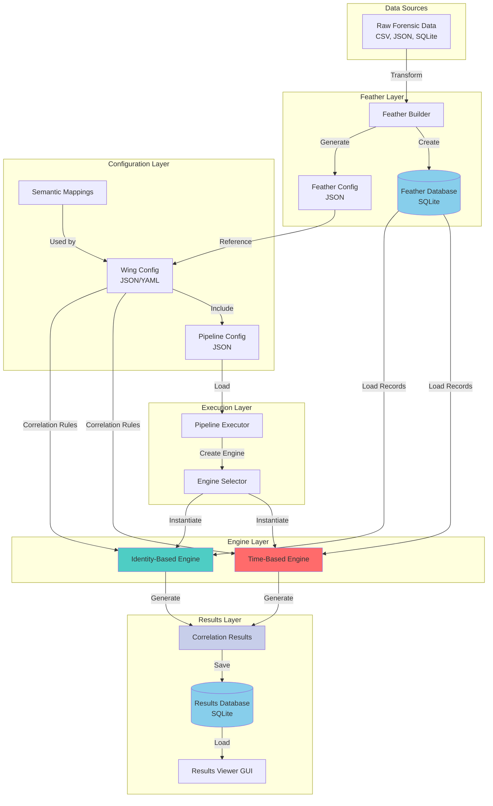
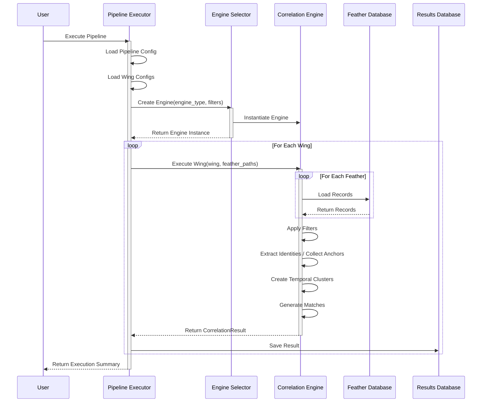
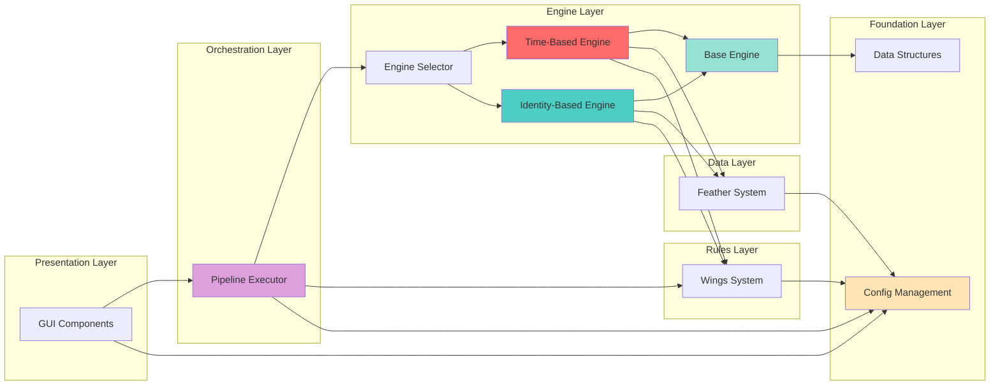
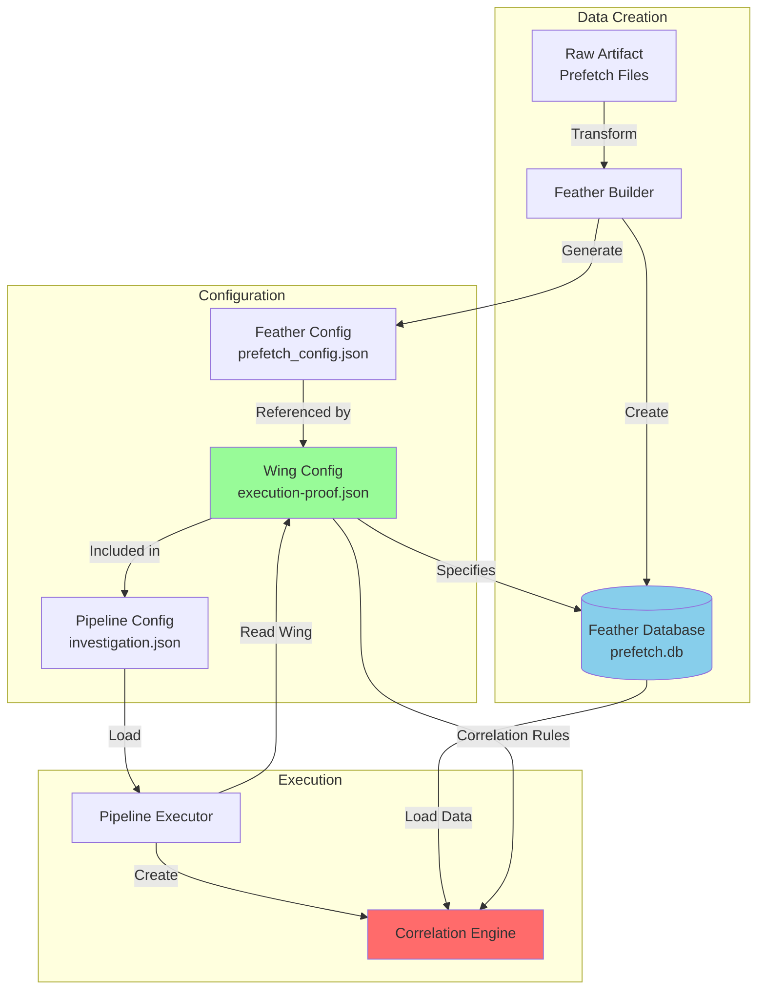

# Correlation Engine Architecture

This document describes the architecture of the Crow-Eye Correlation Engine, explaining how the various components work together to process forensic data and produce correlation results.

## Overview

The Correlation Engine is a modular system for correlating forensic artifacts across multiple data sources (feathers). It implements a **dual-engine architecture** that provides two distinct correlation strategies optimized for different use cases and dataset sizes:

- **Time-Based Correlation Engine**: Uses temporal proximity as the primary correlation factor with comprehensive field matching. Best for small datasets (< 1,000 records) requiring detailed analysis. Complexity: O(N²)

- **Identity-Based Correlation Engine**: Groups records by identity (application/file) first, then creates temporal anchors. Best for large datasets (> 1,000 records) requiring fast execution and identity tracking. Complexity: O(N log N)

Both engines implement the `BaseCorrelationEngine` interface, allowing seamless switching between strategies based on dataset characteristics and analysis requirements. The `EngineSelector` factory provides a unified interface for engine creation and metadata retrieval.

**Key Benefits of Dual-Engine Architecture**:
- **Flexibility**: Choose the right engine for your dataset size and analysis goals
- **Performance**: Identity-Based engine scales to millions of records with streaming mode
- **Compatibility**: Both engines produce compatible result formats
- **Extensibility**: Common interface allows adding new correlation strategies

For detailed engine documentation, see [ENGINE_DOCUMENTATION.md](docs/engine/ENGINE_DOCUMENTATION.md).

```
┌─────────────────────────────────────────────────────────────────────────────┐
│                              USER INTERFACE                                  │
│  ┌─────────────────┐  ┌─────────────────┐  ┌─────────────────────────────┐  │
│  │ Pipeline Builder│  │ Results Viewer  │  │ Identity Results View       │  │
│  │ (pipeline_      │  │ (results_       │  │ (identity_results_view.py)  │  │
│  │  builder.py)    │  │  viewer.py)     │  │                             │  │
│  └────────┬────────┘  └────────┬────────┘  └──────────────┬──────────────┘  │
└───────────┼─────────────────────┼─────────────────────────┼─────────────────┘
            │                     │                         │
            ▼                     │                         │
┌───────────────────────┐         │                         │
│   Pipeline Executor   │         │                         │
│ (pipeline_executor.py)│         │                         │
└───────────┬───────────┘         │                         │
            │                     │                         │
            ▼                     │                         │
┌───────────────────────┐         │                         │
│   Engine Selector     │         │                         │
│ (engine_selector.py)  │         │                         │
└───────────┬───────────┘         │                         │
            │                     │                         │
     ┌──────┴──────┐              │                         │
     ▼             ▼              │                         │
┌─────────┐  ┌──────────────┐     │                         │
│Time-    │  │Identity-Based│     │                         │
│Based    │  │Engine Adapter│     │                         │
│Engine   │  │              │     │                         │
└────┬────┘  └──────┬───────┘     │                         │
     │              │             │                         │
     └──────┬───────┘             │                         │
            ▼                     │                         │
┌───────────────────────┐         │                         │
│  Correlation Result   │◄────────┴─────────────────────────┘
│ (correlation_result.py)│
└───────────┬───────────┘
            │
            ▼
┌───────────────────────┐
│ Database Persistence  │
│(database_persistence.py)│
└───────────────────────┘
            │
            ▼
    ┌───────────────┐
    │ SQLite DB     │
    │ (.db file)    │
    └───────────────┘
```

## Component Details

---

## 1. Pipeline Builder (`gui/pipeline_builder.py`)

**Purpose**: GUI for creating and configuring correlation pipelines.

**Responsibilities**:
- Create/edit pipeline configurations
- Add/remove feathers (data sources)
- Configure wings (correlation rules)
- Set engine type (time-based or identity-based)
- Configure filters (time period, identity patterns)
- Save/load pipeline configurations

**Key Classes**:
- `PipelineBuilderWidget`: Main widget for pipeline configuration

**Outputs**:
- `PipelineConfig` object containing all pipeline settings

---

## 2. Pipeline Executor (`pipeline/pipeline_executor.py`)

**Purpose**: Orchestrates the execution of correlation pipelines.

**Responsibilities**:
- Load pipeline configuration
- Create appropriate correlation engine via `EngineSelector`
- Execute wings (correlation rules) against feathers
- Collect results from engine
- Save results to database via `ResultsDatabase`
- Generate JSON summaries

**Key Classes**:
- `PipelineExecutor`: Main executor class

**Flow**:
```
1. Load PipelineConfig
2. Create FilterConfig from pipeline settings
3. Use EngineSelector to create appropriate engine
4. For each wing:
   a. Resolve feather database paths
   b. Call engine.execute_wing(wing, feather_paths)
   c. Collect CorrelationResult
5. Call _generate_report() to save to database
6. Return execution summary
```

**Key Method**: `_generate_report()`
- Creates `ResultsDatabase` instance
- Calls `db.save_execution()` with all results
- Handles streaming mode results (already in DB)

---

## 3. Engine Selector (`engine/engine_selector.py`)

**Purpose**: Factory for creating correlation engine instances.

**Responsibilities**:
- Create engine based on type string
- Provide metadata about available engines
- Validate engine types

**Key Classes**:
- `EngineType`: Constants for engine types
- `EngineSelector`: Factory class with static methods

**Engine Types**:
| Type | Class | Complexity | Best For |
|------|-------|------------|----------|
| `time_based` | `TimeBasedCorrelationEngine` | O(N²) | Small datasets, detailed analysis |
| `identity_based` | `IdentityBasedEngineAdapter` | O(N log N) | Large datasets, identity tracking |

---

## 4. Base Engine (`engine/base_engine.py`)

**Purpose**: Abstract base class defining the engine interface.

**Key Classes**:
- `EngineMetadata`: Dataclass describing engine capabilities
- `FilterConfig`: Dataclass for filter settings
- `BaseCorrelationEngine`: Abstract base class

**Required Methods** (must be implemented by engines):
```python
@abstractmethod
def execute(self, wing_configs: List[Any]) -> Dict[str, Any]

@abstractmethod
def get_results(self) -> Any

@abstractmethod
def get_statistics(self) -> Dict[str, Any]

@property
@abstractmethod
def metadata(self) -> EngineMetadata
```

**Provided Methods** (common implementations):
- `apply_time_period_filter()`: Filter records by time range
- `_parse_timestamp()`: Parse various timestamp formats

---

## 5. Identity Correlation Engine (`engine/identity_correlation_engine.py`)

**Purpose**: Implements identity-first correlation with temporal anchors.

**Key Classes**:
- `IdentityCorrelationEngine`: Core correlation logic
- `IdentityBasedEngineAdapter`: Adapter implementing `BaseCorrelationEngine`

**Algorithm**:
```
1. Extract identities from all records
   - Use field patterns (name, path, hash)
   - Normalize identity keys
   - Group records by identity

2. For each identity:
   - Sort evidence by timestamp
   - Create temporal anchors (clusters)
   - Classify evidence (primary/secondary/supporting)

3. Convert to CorrelationMatch objects
   - One match per anchor
   - Include feather_records from each source
```

**Streaming Mode** (for large datasets > 5000 anchors):
```
1. Create StreamingMatchWriter
2. Create result record with execution_id=0 (placeholder)
3. Write matches directly to database
4. Later, save_result() updates execution_id
```

**Key Fields for Identity Extraction**:
- Name fields: `executable_name`, `app_name`, `fn_filename`, `Source`, etc.
- Path fields: `app_path`, `Local_Path`, `reconstructed_path`, etc.
- Hash fields: `sha256`, `md5`, `Hashes`, etc.

---

## 6. Correlation Result (`engine/correlation_result.py`)

**Purpose**: Data structures for storing correlation results.

**Key Classes**:

### `CorrelationMatch`
Represents a single correlation match:
```python
@dataclass
class CorrelationMatch:
    match_id: str              # Unique identifier
    timestamp: str             # Central timestamp
    feather_records: Dict      # feather_id -> record data
    match_score: float         # 0.0 to 1.0
    feather_count: int         # Number of feathers matched
    time_spread_seconds: float # Time range of match
    anchor_feather_id: str     # Primary feather
    anchor_artifact_type: str  # Artifact type
    matched_application: str   # Application name
    matched_file_path: str     # File path
    weighted_score: Dict       # Weighted scoring data
    semantic_data: Dict        # Identity metadata
```

### `CorrelationResult`
Represents results from executing a wing:
```python
@dataclass
class CorrelationResult:
    wing_id: str
    wing_name: str
    matches: List[CorrelationMatch]
    total_matches: int
    feathers_processed: int
    feather_metadata: Dict     # feather_id -> metadata
    
    # Streaming support
    streaming_mode: bool
    _result_id: int            # Database result_id (for streaming)
```

**Streaming Mode Methods**:
- `enable_streaming(db_writer, result_id)`: Enable streaming to database
- `add_match(match)`: Add match (streams if enabled)
- `finalize_streaming()`: Flush and close writer

---

## 7. Database Persistence (`engine/database_persistence.py`)

**Purpose**: SQLite storage for correlation results.

**Key Classes**:

### `StreamingMatchWriter`
Efficient batch writer for large result sets:
```python
class StreamingMatchWriter:
    def create_result(...) -> int    # Create result record, return result_id
    def write_match(result_id, match) # Add match to batch
    def flush()                       # Write batch to database
    def update_result_count(...)      # Update final counts
```

### `ResultsDatabase`
Main database interface:
```python
class ResultsDatabase:
    def save_execution(...) -> int   # Save execution + results
    def save_result(execution_id, result)  # Save single result
    def get_execution_results(execution_id) -> List[Dict]
    def get_matches(result_id) -> List[Dict]
    def get_match_details(match_id) -> Dict
```

**Database Schema**:
```sql
-- Pipeline executions
executions (
    execution_id, pipeline_name, execution_time,
    total_wings, total_matches, engine_type, ...
)

-- Wing results
results (
    result_id, execution_id, wing_id, wing_name,
    total_matches, feathers_processed, ...
)

-- Individual matches
matches (
    match_id, result_id, timestamp, match_score,
    feather_count, feather_records (JSON), ...
)

-- Feather metadata
feather_metadata (
    result_id, feather_id, artifact_type, total_records
)
```

**Streaming Mode Handling**:
When `save_result()` detects a streamed result (`_result_id > 0`):
1. Updates existing result record with correct `execution_id`
2. Skips saving matches (already in database)
3. Updates feather metadata

---

## 8. Results Viewer (`gui/results_viewer.py`)

**Purpose**: GUI for viewing and filtering correlation results.

**Key Classes**:
- `ResultsTableWidget`: Table displaying matches
- `MatchDetailViewer`: Detail panel for selected match
- `FilterPanelWidget`: Filter controls
- `DynamicResultsTabWidget`: Tab container for wing results

**Loading Flow**:
```
1. Check for pipeline_summary.json
2. If results truncated or full_results_in_database:
   a. Load from SQLite via _load_results_from_database()
3. Else:
   a. Load from JSON files via CorrelationResult.load_from_file()
4. Create tabs for each wing
5. For identity-based results, use IdentityResultsView
```

---

## 9. Identity Results View (`gui/identity_results_view.py`)

**Purpose**: Specialized view for identity-based correlation results.

**Features**:
- Groups matches by identity
- Shows identity hierarchy (name → anchors → evidence)
- Displays feather contribution per identity
- Timeline visualization

**Key Classes**:
- `IdentityResultsView`: Main widget
- `IdentityTreeWidget`: Tree view of identities
- `AnchorDetailWidget`: Details for selected anchor

---

## Data Flow

### Execution Flow
```
User clicks "Execute" in Pipeline Builder
         │
         ▼
PipelineExecutor.execute()
         │
         ├─► EngineSelector.create_engine(engine_type)
         │            │
         │            ▼
         │   TimeBasedEngine OR IdentityBasedEngineAdapter
         │
         ├─► engine.execute_wing(wing, feather_paths)
         │            │
         │            ▼
         │   CorrelationResult (with matches)
         │   [If streaming: matches written to DB directly]
         │
         ▼
PipelineExecutor._generate_report()
         │
         ├─► ResultsDatabase.save_execution()
         │            │
         │            ▼
         │   save_result() for each result
         │   [If streamed: updates execution_id, skips match save]
         │
         ▼
Returns execution_id + summary
```

### Viewing Flow
```
User opens Results Viewer
         │
         ▼
DynamicResultsTabWidget.load_results(output_dir)
         │
         ├─► Check pipeline_summary.json for execution_id
         │
         ├─► If large/streamed results:
         │   │
         │   ▼
         │   _load_results_from_database(db_path, execution_id)
         │            │
         │            ├─► db.get_execution_results(execution_id)
         │            │
         │            ├─► For each result:
         │            │   db.get_matches(result_id)
         │            │   db.get_match_details(match_id)
         │            │
         │            ▼
         │   Create CorrelationResult objects
         │
         ├─► Else:
         │   │
         │   ▼
         │   CorrelationResult.load_from_file(json_path)
         │
         ▼
Create tabs (IdentityResultsView or standard view)
```

---

## Key Relationships

```
PipelineConfig ──────► PipelineExecutor
                              │
                              ▼
                       EngineSelector
                              │
              ┌───────────────┴───────────────┐
              ▼                               ▼
    TimeBasedEngine              IdentityBasedEngineAdapter
              │                               │
              └───────────┬───────────────────┘
                          ▼
                  CorrelationResult
                          │
              ┌───────────┴───────────┐
              ▼                       ▼
    In-Memory Matches         StreamingMatchWriter
              │                       │
              └───────────┬───────────┘
                          ▼
                  ResultsDatabase
                          │
                          ▼
                    SQLite DB
                          │
              ┌───────────┴───────────┐
              ▼                       ▼
       ResultsViewer          IdentityResultsView
```

---

## File Summary

| File | Purpose | Key Classes |
|------|---------|-------------|
| `pipeline_builder.py` | GUI for pipeline config | `PipelineBuilderWidget` |
| `pipeline_executor.py` | Execute pipelines | `PipelineExecutor` |
| `engine_selector.py` | Engine factory | `EngineSelector`, `EngineType` |
| `base_engine.py` | Engine interface | `BaseCorrelationEngine`, `FilterConfig` |
| `identity_correlation_engine.py` | Identity correlation | `IdentityCorrelationEngine`, `IdentityBasedEngineAdapter` |
| `time_based_engine.py` | Time correlation | `TimeBasedCorrelationEngine` |
| `correlation_result.py` | Result data structures | `CorrelationResult`, `CorrelationMatch` |
| `database_persistence.py` | SQLite storage | `ResultsDatabase`, `StreamingMatchWriter` |
| `results_viewer.py` | Results GUI | `DynamicResultsTabWidget`, `ResultsTableWidget` |
| `identity_results_view.py` | Identity results GUI | `IdentityResultsView` |

---

## Streaming Mode (Large Datasets)

For datasets with > 5000 anchors, the identity engine uses streaming mode to avoid memory issues:

1. **During Execution**:
   - `StreamingMatchWriter` created
   - Result record created with `execution_id=0` (placeholder)
   - Matches written directly to database in batches
   - `CorrelationResult.matches` list stays empty

2. **During Report Generation**:
   - `save_result()` detects `_result_id > 0`
   - Updates existing result record with correct `execution_id`
   - Skips match saving (already in DB)

3. **During Viewing**:
   - Detects `full_results_in_database: true` in JSON
   - Loads from SQLite instead of JSON
   - Queries matches by `result_id`


---

## Component Integration

This section provides comprehensive diagrams and explanations showing how Feathers, Wings, Config, Pipeline, and Engines interact to form the complete correlation system.

### Complete Data Flow Diagram



### Component Interaction Sequence



### How Feather Configurations Affect Engines

**Feather Configuration Structure**:
```json
{
  "feather_id": "prefetch",
  "artifact_type": "Prefetch",
  "database_path": "path/to/prefetch.db",
  "field_mappings": {
    "timestamp": "last_executed",
    "application": "executable_name",
    "path": "path"
  }
}
```

**Impact on Engines**:

1. **Field Mappings** → Engine knows which fields contain identity/timestamp data
2. **Artifact Type** → Engine uses artifact-specific extraction patterns
3. **Database Path** → Engine loads records from correct location
4. **Metadata** → Engine uses for anchor priority and scoring

**Example**:
```python
# Feather config specifies artifact type
feather_config = {
    "artifact_type": "Prefetch"
}

# Identity Engine uses artifact-specific mappings
if artifact_type == "Prefetch":
    name_fields = ["executable_name", "filename"]
    path_fields = ["path", "file_path"]
```

### How Wing Configurations Control Correlation

**Wing Configuration Structure**:
```json
{
  "wing_id": "execution-proof",
  "wing_name": "Execution Proof",
  "correlation_rules": {
    "time_window_minutes": 5,
    "minimum_matches": 2,
    "anchor_priority": ["Prefetch", "SRUM", "AmCache"]
  },
  "feathers": [
    {
      "feather_id": "prefetch",
      "feather_config_name": "prefetch_config",
      "weight": 0.4
    }
  ]
}
```

**Impact on Engines**:

1. **time_window_minutes** → Defines temporal proximity threshold
2. **minimum_matches** → Filters weak correlations
3. **anchor_priority** → Determines which artifacts are preferred as anchors
4. **feather weights** → Affects confidence scoring (Time-Based Engine)
5. **feather selection** → Determines which data sources are correlated

**Example**:
```python
# Wing specifies time window
time_window = wing.correlation_rules.time_window_minutes  # 5 minutes

# Engine uses this to cluster evidence
if (evidence.timestamp - anchor.start_time).total_seconds() / 60 <= time_window:
    anchor.add_evidence(evidence)
```

### How Pipeline Configurations Orchestrate Workflow

**Pipeline Configuration Structure**:
```json
{
  "pipeline_name": "Investigation Pipeline",
  "engine_type": "identity_based",
  "output_directory": "output/results",
  "wings": [
    {"wing_id": "execution-proof"},
    {"wing_id": "file-access"}
  ],
  "feathers": [
    {"feather_id": "prefetch", "database_path": "..."},
    {"feather_id": "srum", "database_path": "..."}
  ],
  "filters": {
    "time_period_start": "2024-01-01T00:00:00",
    "time_period_end": "2024-12-31T23:59:59",
    "identity_filters": ["chrome.exe", "firefox.exe"]
  }
}
```

**Impact on Execution**:

1. **engine_type** → Determines which engine is created
2. **wings** → Defines correlation rules to execute
3. **feathers** → Specifies data sources and their locations
4. **filters** → Applies global filtering before correlation
5. **output_directory** → Determines where results are saved

**Execution Flow**:
```python
# Pipeline Executor orchestrates everything
pipeline = PipelineExecutor(pipeline_config)

# 1. Create engine based on config
engine = EngineSelector.create_engine(
    config=pipeline_config,
    engine_type=pipeline_config.engine_type,
    filters=pipeline_config.filters
)

# 2. Execute each wing
for wing_config in pipeline_config.wings:
    wing = load_wing(wing_config)
    result = engine.execute_wing(wing, pipeline_config.feathers)
    save_result(result, pipeline_config.output_directory)
```

### Component Dependency Diagram



### Impact of Schema Changes

#### Feather Schema Changes

**Scenario**: Adding a new field to a feather database

**Impact**:
1. **Feather Config** → Update field mappings if new field is important
2. **Wing Config** → No change required (uses feather_id reference)
3. **Engine** → Automatically picks up new field in records
4. **Identity Engine** → May improve extraction if field contains identity info

**Example**:
```sql
-- Add new field to feather
ALTER TABLE prefetch_data ADD COLUMN file_size INTEGER;

-- Update feather config (optional)
{
  "field_mappings": {
    "size": "file_size"  // Map new field
  }
}

-- Engine automatically includes in records
record = {
    "executable_name": "chrome.exe",
    "file_size": 1024000  // New field available
}
```

#### Wing Configuration Changes

**Scenario**: Changing time window in wing

**Impact**:
1. **Pipeline** → No change required
2. **Engine** → Uses new time window for correlation
3. **Results** → Different matches found (wider/narrower window)
4. **Feathers** → No change required

**Example**:
```json
// Before
"correlation_rules": {
  "time_window_minutes": 5
}

// After
"correlation_rules": {
  "time_window_minutes": 10  // Wider window = more matches
}
```

---

## Wing vs Feather: Key Differences

This section clarifies the distinction between Wings and Feathers, two fundamental concepts that are often confused.

### Comparison Table

| Aspect | Feather | Wing |
|--------|---------|------|
| **Purpose** | Data storage | Correlation rules |
| **Format** | SQLite database | JSON/YAML configuration |
| **Contains** | Normalized forensic records | Correlation parameters |
| **Created By** | Feather Builder | Wings Creator / Manual |
| **Used By** | Correlation Engines | Pipeline Executor |
| **Lifecycle** | Created once per artifact | Reusable across cases |
| **Size** | Large (MB-GB) | Small (KB) |
| **Content** | Actual data | Metadata and rules |

### Feather Database Structure

**Purpose**: Store normalized forensic artifact data in a queryable format

**SQLite Schema**:
```sql
-- Feather metadata table
CREATE TABLE feather_metadata (
    feather_id TEXT PRIMARY KEY,
    artifact_type TEXT,
    source_file TEXT,
    record_count INTEGER,
    created_timestamp TEXT
);

-- Artifact data table (structure varies by artifact type)
CREATE TABLE prefetch_data (
    row_id INTEGER PRIMARY KEY,
    executable_name TEXT,
    path TEXT,
    last_executed TEXT,
    run_count INTEGER,
    hash TEXT,
    -- ... artifact-specific fields
);

-- Indexes for performance
CREATE INDEX idx_timestamp ON prefetch_data(last_executed);
CREATE INDEX idx_name ON prefetch_data(executable_name);
```

**Example Feather Database**:
```
prefetch.db (SQLite)
├── feather_metadata (1 row)
│   └── feather_id: "prefetch"
│       artifact_type: "Prefetch"
│       record_count: 500
├── prefetch_data (500 rows)
│   ├── row_id: 1, executable_name: "CHROME.EXE", last_executed: "2024-01-15 10:30:00"
│   ├── row_id: 2, executable_name: "FIREFOX.EXE", last_executed: "2024-01-15 10:32:00"
│   └── ...
└── Indexes
```

### Wing Configuration Format

**Purpose**: Define correlation rules and feather relationships

**JSON Structure**:
```json
{
  "wing_id": "execution-proof",
  "wing_name": "Execution Proof",
  "description": "Correlate execution artifacts to prove program execution",
  "correlation_rules": {
    "time_window_minutes": 5,
    "minimum_matches": 2,
    "anchor_priority": ["Prefetch", "SRUM", "AmCache"]
  },
  "feathers": [
    {
      "feather_id": "prefetch",
      "feather_config_name": "prefetch_config",
      "artifact_type": "Prefetch",
      "weight": 0.4,
      "required": true
    },
    {
      "feather_id": "shimcache",
      "feather_config_name": "shimcache_config",
      "artifact_type": "ShimCache",
      "weight": 0.3,
      "required": false
    }
  ]
}
```

### Relationship Flow Diagram



### How Pipeline Reads Wing Configs

**Step-by-Step Process**:

1. **Pipeline Loads Configuration**
   ```python
   pipeline_config = load_pipeline_config("investigation.json")
   # Contains: engine_type, wings[], feathers[]
   ```

2. **Pipeline Reads Wing Configs**
   ```python
   for wing_ref in pipeline_config.wings:
       wing = load_wing(wing_ref.wing_id)
       # Wing contains: correlation_rules, feathers[]
   ```

3. **Pipeline Resolves Feather Databases**
   ```python
   for feather_spec in wing.feathers:
       # Get database path from pipeline config
       db_path = pipeline_config.get_feather_path(feather_spec.feather_id)
       feather_paths[feather_spec.feather_id] = db_path
   ```

4. **Pipeline Executes Wing**
   ```python
   result = engine.execute_wing(wing, feather_paths)
   ```

### How Engine Uses Wing Correlation Rules

**Wing Rules → Engine Behavior**:

```python
# Wing specifies correlation rules
wing.correlation_rules = {
    "time_window_minutes": 5,
    "minimum_matches": 2,
    "anchor_priority": ["Prefetch", "SRUM"]
}

# Time-Based Engine uses rules
for anchor in anchors:
    # Use time window
    matches = find_records_within_window(
        anchor.timestamp,
        time_window=wing.correlation_rules.time_window_minutes
    )
    
    # Check minimum matches
    if len(matches) >= wing.correlation_rules.minimum_matches:
        create_correlation_match(anchor, matches)

# Identity-Based Engine uses rules
for identity in identities:
    # Use time window for anchor clustering
    anchors = cluster_by_time_window(
        identity.evidence,
        time_window=wing.correlation_rules.time_window_minutes
    )
```

### How Feather Metadata Affects Identity Extraction

**Feather Metadata → Identity Engine**:

```python
# Feather metadata includes artifact type
feather_metadata = {
    "feather_id": "prefetch",
    "artifact_type": "Prefetch"
}

# Identity Engine uses artifact type for field mapping
if artifact_type == "Prefetch":
    # Use Prefetch-specific field patterns
    name_fields = ["executable_name", "filename"]
    path_fields = ["path", "file_path"]
    hash_fields = ["hash", "prefetch_hash"]
elif artifact_type == "SRUM":
    # Use SRUM-specific field patterns
    name_fields = ["app_name", "application"]
    path_fields = ["app_path", "ExePath"]
    hash_fields = []

# Extract identity using artifact-specific patterns
identity = extract_identity(record, name_fields, path_fields, hash_fields)
```

### Concrete Example

**Scenario**: Correlating Prefetch and ShimCache artifacts

**1. Feather Databases**:
```
prefetch.db:
  - Table: prefetch_data
  - Records: 500 rows
  - Fields: executable_name, path, last_executed, hash

shimcache.db:
  - Table: shimcache_data
  - Records: 2000 rows
  - Fields: filename, path, last_modified, entry_hash
```

**2. Feather Configs**:
```json
// prefetch_config.json
{
  "feather_id": "prefetch",
  "artifact_type": "Prefetch",
  "database_path": "prefetch.db"
}

// shimcache_config.json
{
  "feather_id": "shimcache",
  "artifact_type": "ShimCache",
  "database_path": "shimcache.db"
}
```

**3. Wing Config**:
```json
// execution-proof.json
{
  "wing_id": "execution-proof",
  "correlation_rules": {
    "time_window_minutes": 5,
    "minimum_matches": 1
  },
  "feathers": [
    {"feather_id": "prefetch", "feather_config_name": "prefetch_config"},
    {"feather_id": "shimcache", "feather_config_name": "shimcache_config"}
  ]
}
```

**4. Pipeline Config**:
```json
// investigation.json
{
  "pipeline_name": "Investigation",
  "engine_type": "identity_based",
  "wings": [
    {"wing_id": "execution-proof"}
  ],
  "feathers": [
    {"feather_id": "prefetch", "database_path": "data/prefetch.db"},
    {"feather_id": "shimcache", "database_path": "data/shimcache.db"}
  ]
}
```

**5. Execution Flow**:
```
Pipeline Executor
  ↓ Load pipeline config
  ↓ Load wing: execution-proof
  ↓ Resolve feather paths: prefetch.db, shimcache.db
  ↓ Create Identity-Based Engine
  ↓ Execute wing
    ↓ Load records from prefetch.db (500 records)
    ↓ Load records from shimcache.db (2000 records)
    ↓ Extract identities (e.g., "chrome.exe")
    ↓ Cluster by time window (5 minutes)
    ↓ Create correlation matches
  ↓ Save results
```

**6. Result**:
```
Identity: chrome.exe
  Anchor 1 (2024-01-15 10:30:00):
    - prefetch: CHROME.EXE executed at 10:30:00
    - shimcache: chrome.exe modified at 10:32:00
  Anchor 2 (2024-01-15 14:45:00):
    - prefetch: CHROME.EXE executed at 14:45:00
    - shimcache: chrome.exe modified at 14:47:00
```

---

