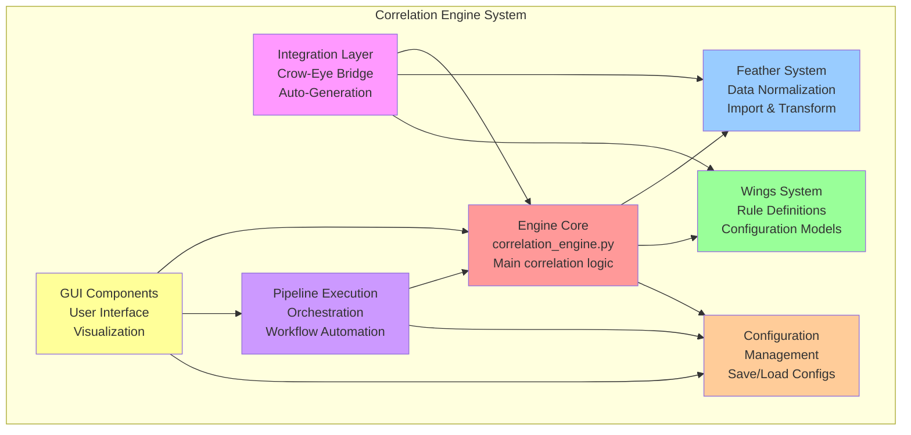
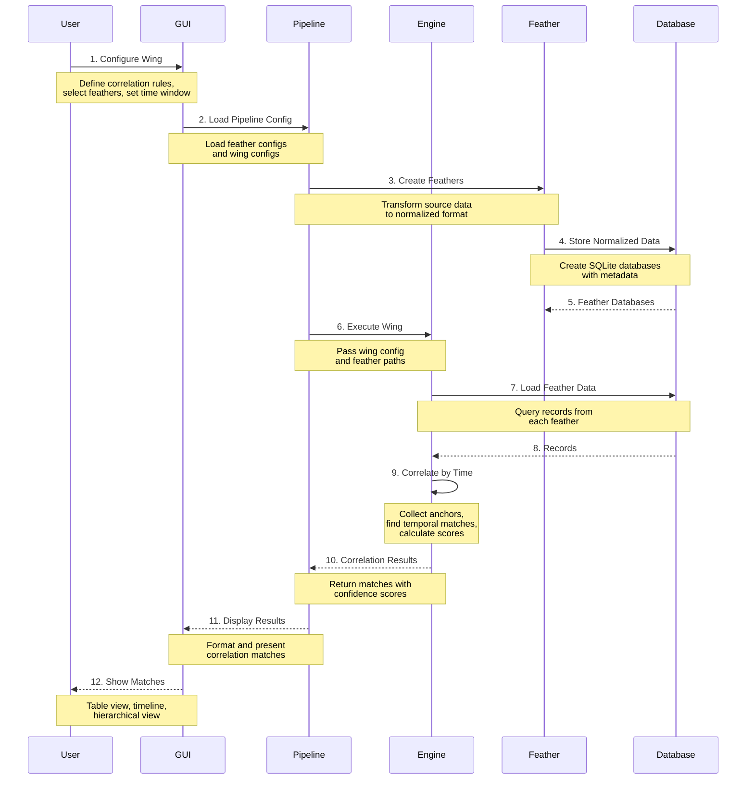
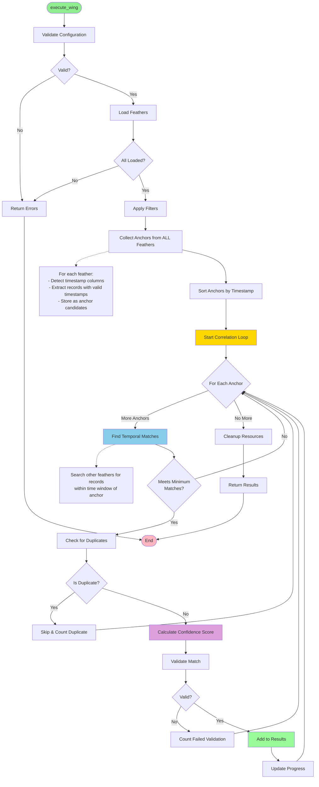
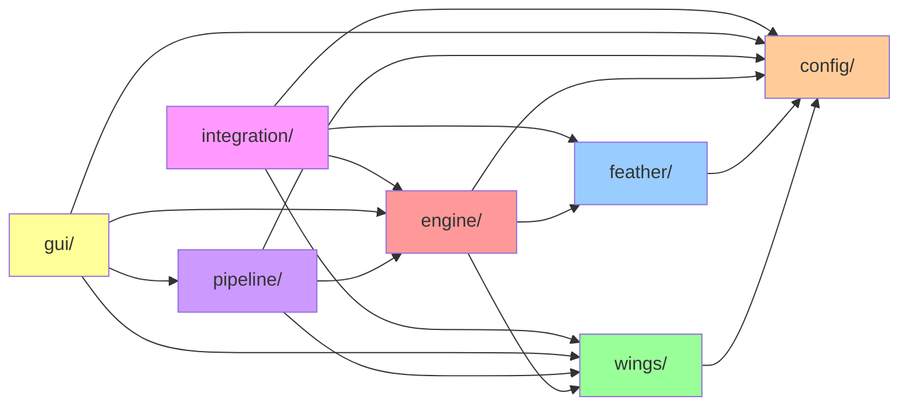
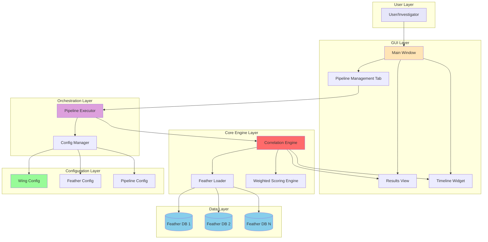

# Correlation Engine Overview

## Table of Contents

- [Introduction](#introduction)
- [What is the Correlation Engine?](#what-is-the-correlation-engine)
- [Architecture Diagrams](#architecture-diagrams)
  - [System Architecture](#system-architecture)
  - [Data Flow](#data-flow)
  - [Correlation Execution Flow](#correlation-execution-flow)
  - [Dependency Graph](#dependency-graph)
  - [Component Interaction](#component-interaction)
- [Directory Structure](#directory-structure)
  - [engine/](#engine---core-correlation-engine)
  - [feather/](#feather---data-normalization)
  - [wings/](#wings---correlation-rules)
  - [config/](#config---configuration-management)
  - [pipeline/](#pipeline---workflow-orchestration)
  - [gui/](#gui---user-interface)
  - [integration/](#integration---crow-eye-bridge)
- [Quick Start Guide](#quick-start-guide)
  - [Common Tasks](#common-tasks)
  - [Modification Scenarios](#modification-scenarios)
- [Detailed Documentation](#detailed-documentation)

---

## Introduction

This document provides a comprehensive overview of the Crow-Eye Correlation Engine architecture. It serves as the main entry point for developers and contributors who want to understand, modify, or extend the correlation engine system.

### Purpose of This Document

- **Understand the System**: Get a high-level view of how all components work together
- **Navigate the Codebase**: Find the right files to modify for specific tasks
- **Visualize Architecture**: See diagrams that illustrate system structure and data flow
- **Quick Reference**: Access common modification scenarios and development tasks

### Who Should Read This

- Developers new to the Crow-Eye project
- Contributors adding new features
- Maintainers debugging issues
- Anyone needing to understand the correlation engine architecture

---

## What is the Correlation Engine?

The **Correlation Engine** is a forensic analysis system that finds temporal and semantic relationships between different types of forensic artifacts. It helps investigators discover connections between events that occurred on a system by correlating data from multiple sources.

The system implements an **advanced dual-engine architecture** with two distinct correlation strategies:

1. **Time-Window Scanning Engine** - Revolutionary O(N log N) systematic temporal analysis that scans through time in fixed intervals. Delivers 76x faster performance with universal timestamp support. Ideal for any dataset size with exceptional memory efficiency.

2. **Identity-Based Correlation Engine** - Groups records by identity first, then creates temporal anchors. Optimized for large datasets (> 1,000 records) with O(N log N) performance and streaming support.

### Key Capabilities

1. **Dual-Engine Architecture**: Choose between Time-Window Scanning (O(N log N)) and Identity-Based (O(N log N)) engines
2. **Engine Selection**: Automatic or manual engine selection via `EngineSelector` factory
3. **Temporal Correlation**: Find events within specified time windows with systematic scanning
4. **Identity Tracking**: Track applications and files across multiple artifacts (Identity-Based engine)
5. **Multi-Artifact Support**: Correlate data from Prefetch, ShimCache, AmCache, Event Logs, LNK files, Jumplists, MFT, SRUM, Registry, and 20+ artifact types
6. **Flexible Rules**: Define custom correlation rules (Wings) with configurable parameters
7. **Semantic Mapping**: Map different column names to common semantic meanings with rule evaluation
8. **Weighted Scoring**: Calculate confidence scores based on multiple factors
9. **Streaming Mode**: Process millions of records with constant memory usage (Identity-Based engine)
10. **Error Resilience**: Automatic retry with exponential backoff and graceful degradation
11. **Pipeline Automation**: Execute complete analysis workflows automatically
12. **Enhanced Visualization**: Dual GUI viewers (Time-Based and Identity) with semantic columns

### Core Concepts

- **Feather**: A normalized SQLite database containing forensic artifact data from a single source
- **Wing**: A configuration that defines correlation rules (which feathers to correlate, time window, filters)
- **Engine**: The correlation strategy (Time-Window Scanning or Identity-Based) used to find relationships
- **Engine Selector**: Factory for creating engine instances based on configuration
- **Time Window**: A fixed temporal interval used for systematic scanning (Time-Window Scanning engine)
- **Anchor**: A temporal cluster of evidence within an identity (Identity-Based engine)
- **Identity**: A normalized representation of an application, file, or entity across artifacts
- **Match**: A set of temporally-related records from different feathers
- **Pipeline**: An automated workflow that creates feathers and executes wings
- **Streaming Mode**: Memory-efficient processing that writes results directly to database

For detailed information about engine selection and capabilities, see the [Engine Selection Guide](docs/engine/ENGINE_DOCUMENTATION.md#engine-selection-guide).

---

## Architecture Diagrams

### System Architecture

The Correlation Engine is organized into 7 major subsystems:

**Color Legend:**
- 🔴 Red: Engine Core (correlation logic)
- 🔵 Blue: Feather System (data normalization)
- 🟢 Green: Wings System (rule definitions)
- 🟠 Orange: Configuration (settings management)
- 🟣 Purple: Pipeline (workflow orchestration)
- 🟡 Yellow: GUI (user interface)
- 🟣 Magenta: Integration (Crow-Eye bridge)

### Data Flow

This diagram shows how forensic data flows through the system from source to results:

### Correlation Execution Flow

This flowchart shows the detailed steps when executing a Wing:

### Dependency Graph

This diagram shows how the major directories depend on each other:

**Dependency Rules:**
- **config/**: No dependencies on other correlation_engine modules (base layer)
- **wings/**: Depends only on config/
- **feather/**: Depends only on config/
- **engine/**: Depends on feather/, wings/, config/
- **pipeline/**: Depends on engine/, config/, wings/
- **gui/**: Depends on engine/, pipeline/, config/, wings/
- **integration/**: Depends on all other modules (top layer)

### Component Interaction

This diagram shows how key components interact during a typical correlation workflow:

---

## Directory Structure

The correlation_engine is organized into 7 main directories, each with a specific responsibility:

### engine/ - Core Correlation Engine

**Purpose**: Contains the core correlation logic, feather loading, scoring, and result management.

**Key Files**: 15 Python files
- `correlation_engine.py` (1854 lines) - Main correlation engine
- `feather_loader.py` - Loads and queries feather databases
- `correlation_result.py` - Result data structures
- `weighted_scoring.py` - Confidence score calculation
- `identifier_correlation_engine.py` - Identifier-based correlation
- `identity_extractor.py` - Extract identity information
- `timestamp_parser.py` - Parse various timestamp formats
- `query_interface.py` - Query correlation results
- `results_formatter.py` - Format results for display

**[📖 Detailed Documentation](engine/ENGINE_DOCUMENTATION.md)**

### feather/ - Data Normalization

**Purpose**: Handles importing forensic artifact data from various sources and normalizing it into the feather format.

**Key Files**: 4 Python files + UI subdirectory
- `feather_builder.py` - Main application entry point
- `database.py` - Database operations
- `transformer.py` - Data transformation pipeline
- `ui/` - GUI components for Feather Builder

**[📖 Detailed Documentation](feather/FEATHER_DOCUMENTATION.md)**

### wings/ - Correlation Rules

**Purpose**: Defines the data models and validation logic for Wing configurations (correlation rules).

**Key Files**: 3 Python files in core/ + UI subdirectory
- `core/wing_model.py` - Wing, FeatherSpec, CorrelationRules data models
- `core/artifact_detector.py` - Detect artifact types
- `core/wing_validator.py` - Validate wing configurations
- `ui/` - GUI components for Wings Creator

**[📖 Detailed Documentation](wings/WINGS_DOCUMENTATION.md)**

### config/ - Configuration Management

**Purpose**: Manages all configuration files (feathers, wings, pipelines) and semantic mappings.

**Key Files**: 10 Python files
- `config_manager.py` - Central configuration management
- `feather_config.py` - Feather configuration model
- `wing_config.py` - Wing configuration model
- `pipeline_config.py` - Pipeline configuration model
- `semantic_mapping.py` - Semantic field mappings
- `session_state.py` - GUI session state
- `pipeline_config_manager.py` - Pipeline-specific config management

**[📖 Detailed Documentation](config/CONFIG_DOCUMENTATION.md)**

### pipeline/ - Workflow Orchestration

**Purpose**: Orchestrates complete analysis workflows, including feather creation, wing execution, and report generation.

**Key Files**: 7 Python files
- `pipeline_executor.py` (671 lines) - Main pipeline execution
- `pipeline_loader.py` - Load pipeline configurations
- `feather_auto_registration.py` - Auto-register feathers
- `discovery_service.py` - Discover available configs
- `database_connection_manager.py` - Manage DB connections
- `error_handler.py` - Centralized error handling
- `path_resolver.py` - Resolve configuration paths

**[📖 Detailed Documentation](pipeline/PIPELINE_DOCUMENTATION.md)**

### gui/ - User Interface

**Purpose**: Provides all GUI components for the correlation engine, including pipeline management, results visualization, and configuration editing.

**Key Files**: 26 Python files
- `main_window.py` - Main application window
- `pipeline_management_tab.py` - Pipeline creation/management
- `correlation_results_view.py` - Results table view
- `hierarchical_results_view.py` - Tree view of results
- `timeline_widget.py` - Timeline visualization
- `execution_control.py` - Control pipeline execution
- `pipeline_builder.py` - Visual pipeline builder
- `semantic_mapping_viewer.py` - Edit semantic mappings
- Plus 18 more UI components

**[📖 Detailed Documentation](gui/GUI_DOCUMENTATION.md)**

### integration/ - Crow-Eye Bridge

**Purpose**: Integrates the correlation engine with the main Crow-Eye application, providing auto-generation features and default configurations.

**Key Files**: 7 Python files + default_wings/ subdirectory
- `crow_eye_integration.py` - Main integration bridge
- `case_initializer.py` - Initialize correlation engine for a case
- `auto_feather_generator.py` - Auto-generate feathers from Crow-Eye data
- `feather_config_generator.py` - Generate feather configs
- `default_pipeline_creator.py` - Create default pipelines
- `default_wings_loader.py` - Load default wings
- `feather_mappings.py` - Standard artifact mappings

**[📖 Detailed Documentation](integration/INTEGRATION_DOCUMENTATION.md)**

---

## Quick Start Guide

### Common Tasks

#### 1. Understanding the Correlation Process

**Start here**: Read the [Correlation Execution Flow](#correlation-execution-flow) diagram above and the [Engine Selection Guide](docs/engine/ENGINE_DOCUMENTATION.md#engine-selection-guide).

**Key files to understand**:
- `engine/engine_selector.py` - Engine factory and selection
- `engine/base_engine.py` - Common engine interface
- `engine/time_based_engine.py` - Time-Window Scanning correlation strategy (O(N))
- `engine/identity_correlation_engine.py` - Identity-Based correlation strategy (O(N log N))
- `engine/two_phase_correlation.py` - Two-phase architecture components
- `engine/feather_loader.py` - How feathers are loaded
- `wings/core/wing_model.py` - Wing configuration structure

**Engine Selection**: Choose the appropriate engine based on your needs:
- **Any dataset size**: Time-Window Scanning Engine for O(N) performance and systematic analysis
- **> 1,000 records with identity tracking**: Identity-Based Engine for O(N log N) performance

#### 2. Selecting the Right Correlation Engine

**Decision Factors**:
- **Dataset Size**: Time-Window Scanning for any size, Identity-Based for large datasets with identity tracking
- **Analysis Goal**: Time-Window Scanning for systematic temporal analysis, Identity-Based for identity tracking
- **Performance**: Both provide O(N log N) performance with different optimization strategies
- **Memory**: Both support memory-efficient processing; Identity-Based has streaming mode

**See**: [Engine Selection Guide](docs/engine/ENGINE_DOCUMENTATION.md#engine-selection-guide) for detailed decision criteria and use case scenarios.

#### 3. Adding Support for a New Artifact Type

**Files to modify**:
1. `integration/feather_mappings.py` - Add column mappings for the new artifact
2. `feather/transformer.py` - Add transformation logic if needed
3. `wings/core/artifact_detector.py` - Add detection logic
4. `engine/identity_correlation_engine.py` - Add artifact-specific field mappings for Identity-Based engine
5. `engine/time_based_engine.py` - Update timestamp detection if needed for Time-Window Scanning engine

**See**: [Feather Documentation - Adding New Artifact Type](feather/FEATHER_DOCUMENTATION.md#scenario-adding-support-for-a-new-artifact-type)

#### 4. Modifying Correlation Logic

**Files to modify**:
1. `engine/time_based_engine.py` - Time-Window Scanning correlation algorithm
2. `engine/identity_correlation_engine.py` - Identity-Based correlation algorithm
3. `engine/weighted_scoring.py` - Scoring logic
4. Test with various wings to ensure changes work correctly

**See**: [Engine Documentation - Modifying Correlation Logic](engine/ENGINE_DOCUMENTATION.md#scenario-modifying-correlation-logic)

#### 4. Adding a New GUI Feature

**Files to modify**:
1. `gui/main_window.py` - Add new tab or menu item
2. Create new widget file in `gui/` directory
3. Connect to backend via `pipeline/pipeline_executor.py` or `engine/correlation_engine.py`

**See**: [GUI Documentation - Adding New Feature](gui/GUI_DOCUMENTATION.md#scenario-adding-a-new-tab-to-main-window)

#### 5. Adding a New Configuration Option

**Files to modify**:
1. `wings/core/wing_model.py` - Add field to `CorrelationRules` or `Wing`
2. `config/wing_config.py` - Update `WingConfig` if needed
3. `engine/correlation_engine.py` - Use the new configuration option
4. `gui/` - Add UI controls for the new option

**See**: [Config Documentation - Adding Configuration Option](config/CONFIG_DOCUMENTATION.md#scenario-adding-a-new-configuration-option)

### Modification Scenarios

#### Scenario 1: Adding a New Timestamp Format

**Problem**: You have forensic artifacts with a custom timestamp format that isn't currently supported.

**Solution**:
1. Open `engine/timestamp_parser.py`
2. Add your format to the `TIMESTAMP_FORMATS` list
3. Test with sample data

**Impact**: Low - only affects timestamp parsing

**Files affected**: 1 file

---

#### Scenario 2: Changing the Correlation Algorithm

**Problem**: You want to modify how anchors are collected or how matches are generated.

**Solution**:
1. Open `engine/correlation_engine.py`
2. Modify `_correlate_records()` method
3. Consider impact on `_generate_match_combinations()`
4. Update scoring logic in `weighted_scoring.py` if needed

**Impact**: High - affects all correlation results

**Files affected**: 2-3 files

**Testing**: Test with multiple wings and artifact types

---

#### Scenario 3: Adding a New Pipeline Stage

**Problem**: You want to add a new step in the pipeline execution (e.g., post-processing, validation).

**Solution**:
1. Open `pipeline/pipeline_executor.py`
2. Add new method for your stage (e.g., `_post_process_results()`)
3. Call it in the `execute()` method
4. Update `pipeline_config.py` if configuration is needed

**Impact**: Medium - affects pipeline execution

**Files affected**: 2-3 files

---

#### Scenario 4: Creating a Custom Results View

**Problem**: You want to add a new way to visualize correlation results.

**Solution**:
1. Create new file in `gui/` (e.g., `graph_view.py`)
2. Inherit from `QWidget`
3. Accept `CorrelationResult` in constructor
4. Add tab in `gui/main_window.py`

**Impact**: Low - only affects GUI

**Files affected**: 2 files (new file + main_window.py)

---

#### Scenario 5: Modifying Semantic Mappings

**Problem**: You want to add new semantic field mappings or modify existing ones.

**Solution**:
1. Open `config/semantic_mapping.py`
2. Modify `SemanticMappingManager` class
3. Update default mappings in `config/default_mappings/`
4. Test with `gui/semantic_mapping_viewer.py`

**Impact**: Medium - affects field matching across all correlations

**Files affected**: 2-3 files

---

## Detailed Documentation

For in-depth information about each directory, including file-by-file documentation, dependency analysis, and impact assessments, see the detailed documentation files:

- **[Engine Documentation](engine/ENGINE_DOCUMENTATION.md)** - Core correlation engine, feather loading, scoring
- **[Feather Documentation](feather/FEATHER_DOCUMENTATION.md)** - Data normalization, import, transformation
- **[Wings Documentation](wings/WINGS_DOCUMENTATION.md)** - Correlation rule definitions, validation
- **[Config Documentation](config/CONFIG_DOCUMENTATION.md)** - Configuration management, semantic mappings
- **[Pipeline Documentation](pipeline/PIPELINE_DOCUMENTATION.md)** - Workflow orchestration, automation
- **[GUI Documentation](gui/GUI_DOCUMENTATION.md)** - User interface components, visualization
- **[Integration Documentation](integration/INTEGRATION_DOCUMENTATION.md)** - Crow-Eye integration, auto-generation

---

## Additional Resources

- **[Feather Metadata Documentation](FEATHER_METADATA_OPTIONAL.md)** - Details on feather metadata tables
- **[Pipeline Config Manager README](PIPELINE_CONFIG_MANAGER_README.md)** - Pipeline configuration management
- **[Identifier Extraction README](../engine/IDENTIFIER_EXTRACTION_README.md)** - Identifier extraction system
- **[GUI README](../gui/README.md)** - GUI architecture overview

---

## Contributing

When contributing to the correlation engine:

1. **Read the relevant detailed documentation** for the area you're modifying
2. **Check the dependency graph** to understand what might be affected
3. **Review modification scenarios** for similar changes
4. **Test thoroughly** with multiple artifact types and wings
5. **Update documentation** if you add new features or change behavior

---

## Getting Help

If you need help understanding the correlation engine:

1. Start with this overview document
2. Read the detailed documentation for the specific directory
3. Look at the diagrams to understand data flow
4. Review the code with the documentation as a guide
5. Check existing modification scenarios for similar tasks

---

*Last Updated: January 2026*
*Correlation Engine Version: 0.7.1*
