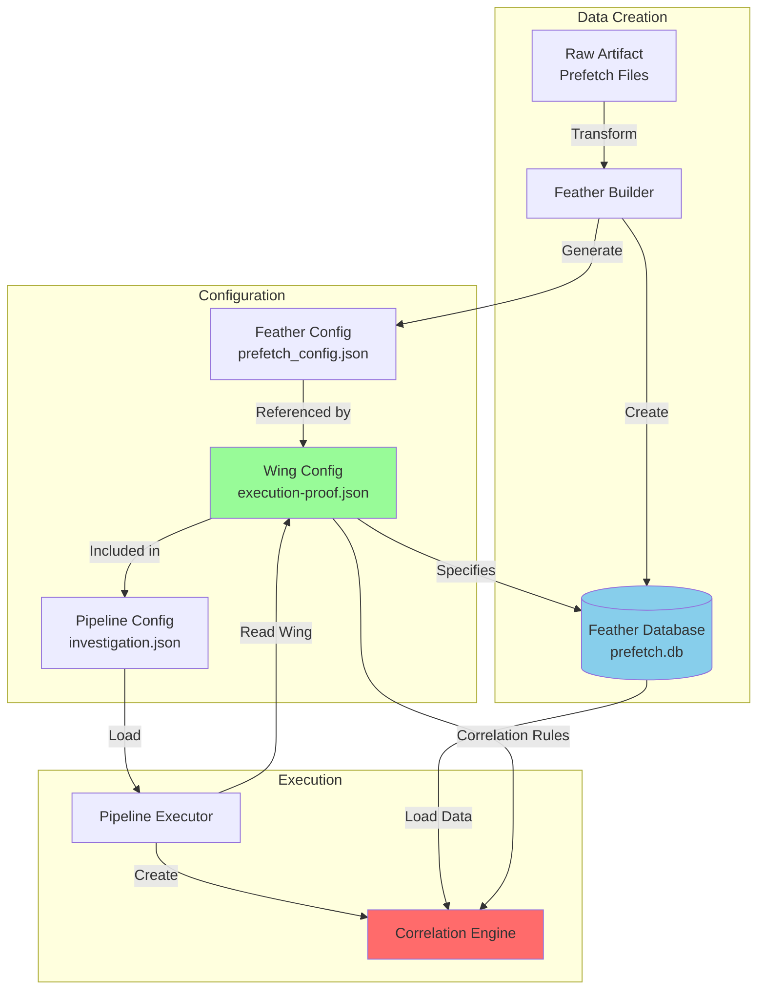

# Wing vs Feather: Key Differences

This document clarifies the distinction between Wings and Feathers, two fundamental concepts in the Crow-Eye Correlation Engine.

## Comparison Table

| Aspect | Feather | Wing |
|--------|---------|------|
| **Purpose** | Data storage | Correlation rules |
| **Format** | SQLite database | JSON/YAML configuration |
| **Contains** | Normalized forensic records | Correlation parameters |
| **Created By** | Feather Builder | Wings Creator / Manual |
| **Used By** | Correlation Engines | Pipeline Executor |
| **Lifecycle** | Created once per artifact | Reusable across cases |
| **Size** | Large (MB-GB) | Small (KB) |
| **Content** | Actual data | Metadata and rules |

## Feather Database Structure

**Purpose**: Store normalized forensic artifact data in a queryable format

**SQLite Schema**:
```sql
-- Feather metadata table
CREATE TABLE feather_metadata (
    feather_id TEXT PRIMARY KEY,
    artifact_type TEXT,
    source_file TEXT,
    record_count INTEGER,
    created_timestamp TEXT
);

-- Artifact data table (structure varies by artifact type)
CREATE TABLE prefetch_data (
    row_id INTEGER PRIMARY KEY,
    executable_name TEXT,
    path TEXT,
    last_executed TEXT,
    run_count INTEGER,
    hash TEXT,
    -- ... artifact-specific fields
);

-- Indexes for performance
CREATE INDEX idx_timestamp ON prefetch_data(last_executed);
CREATE INDEX idx_name ON prefetch_data(executable_name);
```

**Example Feather Database**:
```
prefetch.db (SQLite)
├── feather_metadata (1 row)
│   └── feather_id: "prefetch"
│       artifact_type: "Prefetch"
│       record_count: 500
├── prefetch_data (500 rows)
│   ├── row_id: 1, executable_name: "CHROME.EXE", last_executed: "2024-01-15 10:30:00"
│   ├── row_id: 2, executable_name: "FIREFOX.EXE", last_executed: "2024-01-15 10:32:00"
│   └── ...
└── Indexes
```

## Wing Configuration Format

**Purpose**: Define correlation rules and feather relationships

**JSON Structure**:
```json
{
  "wing_id": "execution-proof",
  "wing_name": "Execution Proof",
  "description": "Correlate execution artifacts to prove program execution",
  "correlation_rules": {
    "time_window_minutes": 5,
    "minimum_matches": 2,
    "anchor_priority": ["Prefetch", "SRUM", "AmCache"]
  },
  "feathers": [
    {
      "feather_id": "prefetch",
      "feather_config_name": "prefetch_config",
      "artifact_type": "Prefetch",
      "weight": 0.4,
      "required": true
    },
    {
      "feather_id": "shimcache",
      "feather_config_name": "shimcache_config",
      "artifact_type": "ShimCache",
      "weight": 0.3,
      "required": false
    }
  ]
}
```

## Relationship Flow Diagram



## How Pipeline Reads Wing Configs

**Step-by-Step Process**:

1. **Pipeline Loads Configuration**
   ```python
   pipeline_config = load_pipeline_config("investigation.json")
   # Contains: engine_type, wings[], feathers[]
   ```

2. **Pipeline Reads Wing Configs**
   ```python
   for wing_ref in pipeline_config.wings:
       wing = load_wing(wing_ref.wing_id)
       # Wing contains: correlation_rules, feathers[]
   ```

3. **Pipeline Resolves Feather Databases**
   ```python
   for feather_spec in wing.feathers:
       # Get database path from pipeline config
       db_path = pipeline_config.get_feather_path(feather_spec.feather_id)
       feather_paths[feather_spec.feather_id] = db_path
   ```

4. **Pipeline Executes Wing**
   ```python
   result = engine.execute_wing(wing, feather_paths)
   ```

## How Engine Uses Wing Correlation Rules

**Wing Rules → Engine Behavior**:

```python
# Wing specifies correlation rules
wing.correlation_rules = {
    "time_window_minutes": 5,
    "minimum_matches": 2,
    "anchor_priority": ["Prefetch", "SRUM"]
}

# Time-Based Engine uses rules
for anchor in anchors:
    # Use time window
    matches = find_records_within_window(
        anchor.timestamp,
        time_window=wing.correlation_rules.time_window_minutes
    )
    
    # Check minimum matches
    if len(matches) >= wing.correlation_rules.minimum_matches:
        create_correlation_match(anchor, matches)

# Identity-Based Engine uses rules
for identity in identities:
    # Use time window for anchor clustering
    anchors = cluster_by_time_window(
        identity.evidence,
        time_window=wing.correlation_rules.time_window_minutes
    )
```

## How Feather Metadata Affects Identity Extraction

**Feather Metadata → Identity Engine**:

```python
# Feather metadata includes artifact type
feather_metadata = {
    "feather_id": "prefetch",
    "artifact_type": "Prefetch"
}

# Identity Engine uses artifact type for field mapping
if artifact_type == "Prefetch":
    # Use Prefetch-specific field patterns
    name_fields = ["executable_name", "filename"]
    path_fields = ["path", "file_path"]
    hash_fields = ["hash", "prefetch_hash"]
elif artifact_type == "SRUM":
    # Use SRUM-specific field patterns
    name_fields = ["app_name", "application"]
    path_fields = ["app_path", "ExePath"]
    hash_fields = []

# Extract identity using artifact-specific patterns
identity = extract_identity(record, name_fields, path_fields, hash_fields)
```

## Concrete Example

**Scenario**: Correlating Prefetch and ShimCache artifacts

**1. Feather Databases**:
```
prefetch.db:
  - Table: prefetch_data
  - Records: 500 rows
  - Fields: executable_name, path, last_executed, hash

shimcache.db:
  - Table: shimcache_data
  - Records: 2000 rows
  - Fields: filename, path, last_modified, entry_hash
```

**2. Feather Configs**:
```json
// prefetch_config.json
{
  "feather_id": "prefetch",
  "artifact_type": "Prefetch",
  "database_path": "prefetch.db"
}

// shimcache_config.json
{
  "feather_id": "shimcache",
  "artifact_type": "ShimCache",
  "database_path": "shimcache.db"
}
```

**3. Wing Config**:
```json
// execution-proof.json
{
  "wing_id": "execution-proof",
  "correlation_rules": {
    "time_window_minutes": 5,
    "minimum_matches": 1
  },
  "feathers": [
    {"feather_id": "prefetch", "feather_config_name": "prefetch_config"},
    {"feather_id": "shimcache", "feather_config_name": "shimcache_config"}
  ]
}
```

**4. Pipeline Config**:
```json
// investigation.json
{
  "pipeline_name": "Investigation",
  "engine_type": "identity_based",
  "wings": [
    {"wing_id": "execution-proof"}
  ],
  "feathers": [
    {"feather_id": "prefetch", "database_path": "data/prefetch.db"},
    {"feather_id": "shimcache", "database_path": "data/shimcache.db"}
  ]
}
```

**5. Execution Flow**:
```
Pipeline Executor
  ↓ Load pipeline config
  ↓ Load wing: execution-proof
  ↓ Resolve feather paths: prefetch.db, shimcache.db
  ↓ Create Identity-Based Engine
  ↓ Execute wing
    ↓ Load records from prefetch.db (500 records)
    ↓ Load records from shimcache.db (2000 records)
    ↓ Extract identities (e.g., "chrome.exe")
    ↓ Cluster by time window (5 minutes)
    ↓ Create correlation matches
  ↓ Save results
```

**6. Result**:
```
Identity: chrome.exe
  Anchor 1 (2024-01-15 10:30:00):
    - prefetch: CHROME.EXE executed at 10:30:00
    - shimcache: chrome.exe modified at 10:32:00
  Anchor 2 (2024-01-15 14:45:00):
    - prefetch: CHROME.EXE executed at 14:45:00
    - shimcache: chrome.exe modified at 14:47:00
```