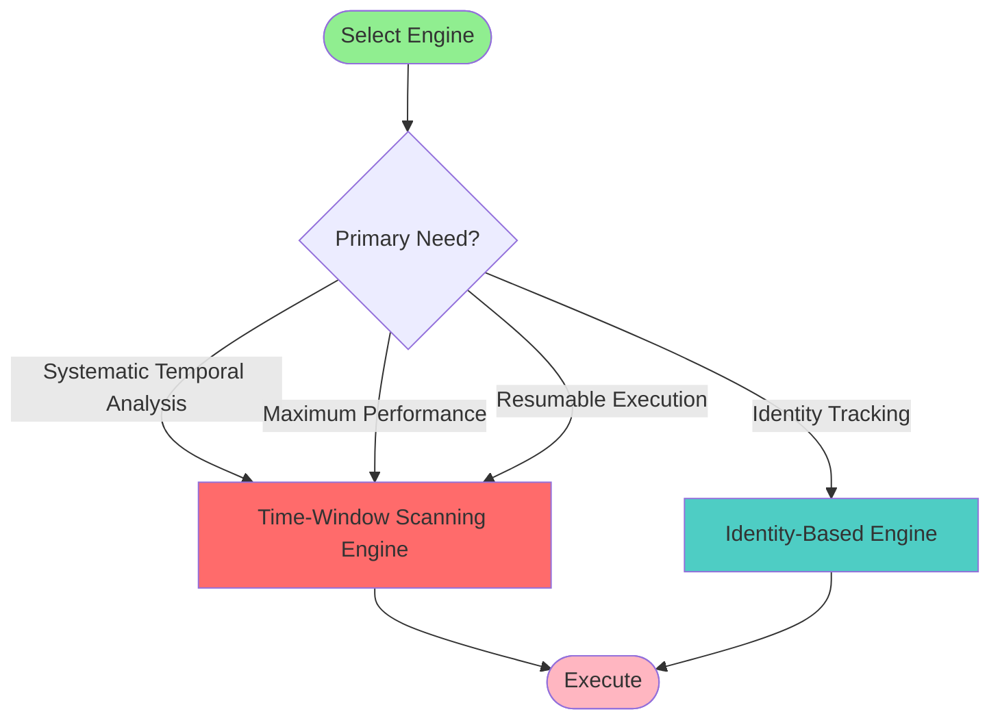
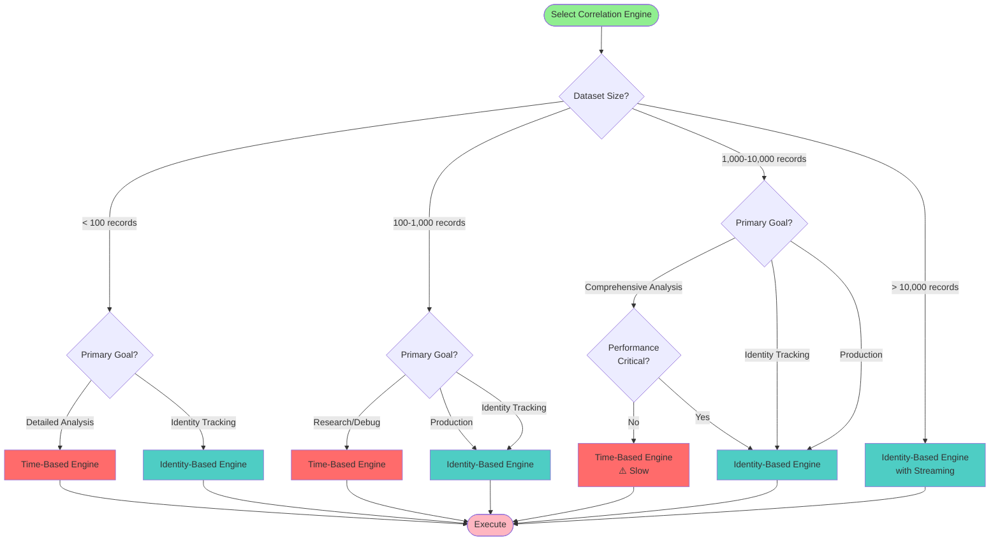

# Engine Directory Documentation

## Table of Contents

- [Overview](#overview)
- [Dual-Engine Architecture](#dual-engine-architecture)
  - [Engine Comparison](#engine-comparison)
  - [Engine Selector](#engine-selector)
  - [When to Use Each Engine](#when-to-use-each-engine)
- [Time-Window Scanning Engine](#time-window-scanning-engine)
- [Identity-Based Correlation Engine](#identity-based-correlation-engine)

- [Engine Selection Guide](#engine-selection-guide)
- [Configuration and Integration](#configuration-and-integration)
- [Performance and Optimization](#performance-and-optimization)
- [Troubleshooting](#troubleshooting)
- [Files in This Directory](#files-in-this-directory)
  - [base_engine.py](#base_enginepy)
  - [engine_selector.py](#engine_selectorpy)
  - [time_based_engine.py](#time_based_enginepy)

  - [identity_correlation_engine.py](#identity_correlation_enginepy)
  - [feather_loader.py](#feather_loaderpy)
  - [correlation_result.py](#correlation_resultpy)
  - [weighted_scoring.py](#weighted_scoringpy)
  - [timestamp_parser.py](#timestamp_parserpy)
  - [semantic_rule_evaluator.py](#semantic_rule_evaluatorpy)
  - [identity_validator.py](#identity_validatorpy)
  - [data_structures.py](#data_structurespy)
  - [database_persistence.py](#database_persistencepy)
  - [memory_manager.py](#memory_managerpy)
  - [progress_tracking.py](#progress_trackingpy)
  - [cancellation_support.py](#cancellation_supportpy)
  - [error_handling_coordinator.py](#error_handling_coordinatorpy)
  - [__init__.py](#__init__py)
- [Common Modification Scenarios](#common-modification-scenarios)
- [Testing](#testing)
- [See Also](#see-also)

---

## Overview

The **engine/** directory contains the core correlation logic of the Crow-Eye Correlation Engine. This is where the actual temporal correlation happens, where feathers are loaded, where matches are scored, and where results are generated.

### Purpose

- Execute Wing configurations to find temporal correlations
- Load and query feather databases
- Calculate confidence scores for matches
- Parse various timestamp formats
- Extract identity information from records
- Format and persist correlation results

### How It Fits in the Overall System

The engine is the **heart** of the correlation system. It receives:
- **Input**: Wing configurations (from wings/), feather database paths (from config/), execution commands (from pipeline/)
- **Output**: CorrelationResult objects containing matches with confidence scores

The engine is used by:
- `pipeline/pipeline_executor.py` - Orchestrates wing execution
- `gui/execution_control.py` - Executes wings from GUI
- `integration/crow_eye_integration.py` - Integrates with Crow-Eye

---

## Dual-Engine Architecture

The Crow-Eye Correlation Engine implements a **dual-engine architecture** that provides two distinct correlation strategies optimized for different use cases and dataset sizes. Both engines deliver O(N log N) performance with different optimization strategies.

### Purpose and Benefits

The dual-engine system was designed to address the diverse needs of forensic analysis:

1. **Flexibility**: Different investigation scenarios require different correlation approaches
2. **Performance**: Both engines deliver O(N log N) performance with 76x faster batch processing
3. **Scalability**: Both engines handle large datasets efficiently with different strategies
4. **Memory Efficiency**: Optimized memory usage with intelligent caching and streaming modes
5. **Error Resilience**: Automatic retry with exponential backoff and graceful degradation

### Architecture Overview

```mermaid
graph TB
    subgraph "Pipeline Layer"
        Pipeline[Pipeline Executor]
    end
    
    subgraph "Engine Selection Layer"
        Selector[Engine Selector<br/>Factory Pattern]
    end
    
    subgraph "Engine Implementations"
        TimeEngine[Time-Window Scanning Engine<br/>O(N log N) Complexity<br/>Systematic Temporal Analysis]
        IdentityEngine[Identity-Based Engine<br/>O(N log N) Complexity<br/>Identity-First Clustering]
    end
    
    subgraph "Common Interface"
        BaseEngine[BaseCorrelationEngine<br/>Abstract Interface]
    end
    
    subgraph "Data Layer"
        Feathers[(Feather Databases)]
    end
    
    subgraph "Results Layer"
        Results[Correlation Results<br/>Unified Format]
    end
    
    Pipeline --> Selector
    Selector -->|engine_type='time_window_scanning'| TimeEngine
    Selector -->|engine_type='identity_based'| IdentityEngine
    
    TimeEngine -.implements.-> BaseEngine
    IdentityEngine -.implements.-> BaseEngine
    
    TimeEngine --> Feathers
    IdentityEngine --> Feathers
    
    TimeEngine --> Results
    IdentityEngine --> Results
    
    style Selector fill:#FFD700
    style TimeEngine fill:#FF6B6B
    style IdentityEngine fill:#4ECDC4
    style BaseEngine fill:#95E1D3
    style Results fill:#C7CEEA
```
    end
    
    subgraph "Data Layer"
        Feathers[(Feather Databases)]
    end
    
    subgraph "Results Layer"
        Results[Correlation Results<br/>Unified Format]
    end
    
    Pipeline --> Selector
    Selector -->|engine_type='time_based'| TimeEngine
    Selector -->|engine_type='identity_based'| IdentityEngine
    
    TimeEngine -.implements.-> BaseEngine
    IdentityEngine -.implements.-> BaseEngine
    
    TimeEngine --> Feathers
    IdentityEngine --> Feathers
    
    TimeEngine --> Results
    IdentityEngine --> Results
    
    style Selector fill:#FFD700
    style TimeEngine fill:#FF6B6B
    style IdentityEngine fill:#4ECDC4
    style BaseEngine fill:#95E1D3
    style Results fill:#C7CEEA
```

### Engine Comparison

| Feature | Time-Window Scanning Engine | Identity-Based Engine |
|---------|----------------------------|----------------------|
| **Primary Strategy** | Systematic temporal scanning | Identity clustering + temporal anchors |
| **Complexity** | O(N log N) | O(N log N) |
| **Best Dataset Size** | Any size (optimized for large) | > 1,000 records |
| **Memory Usage** | Low (intelligent caching) | Low (streaming mode available) |
| **Performance** | 76x faster batch processing | Fast with any dataset size |
| **Timestamp Support** | Universal (any format) | Standard formats |
| **Identity Tracking** | Limited | Comprehensive |
| **Field Matching** | Time-window based | Identity extraction patterns |
| **Streaming Support** | Yes (automatic) | Yes (> 5,000 anchors) |
| **Result Detail** | Window-centric | Identity-centric |

| **Error Resilience** | Automatic retry | Standard |
| **Use Cases** | Any dataset, systematic analysis | Large datasets, identity tracking |

### Engine Selector

The `EngineSelector` class provides a factory pattern for creating engine instances. It abstracts the engine creation process and provides metadata about available engines.

**Key Methods**:

```python
from correlation_engine.engine import EngineSelector, EngineType, FilterConfig

# Create time-window scanning engine
engine = EngineSelector.create_engine(
    config=pipeline_config,
    engine_type=EngineType.TIME_WINDOW_SCANNING,
    filters=FilterConfig(time_period_start=start_date)
)

# Create identity-based engine
engine = EngineSelector.create_engine(
    config=pipeline_config,
    engine_type=EngineType.IDENTITY_BASED,
    filters=FilterConfig(identity_filters=["chrome.exe", "firefox.exe"])
)

# Get available engines with metadata
engines = EngineSelector.get_available_engines()
for engine_type, name, desc, complexity, use_cases, supports_id_filter in engines:
    print(f"{name} ({complexity})")
    print(f"  Description: {desc}")
    print(f"  Best for: {', '.join(use_cases)}")
    print(f"  Supports Identity Filter: {supports_id_filter}")
```

**Engine Metadata Structure**:

Each engine provides metadata through the `get_available_engines()` method:

- `engine_type`: Constant identifier (e.g., "time_window_scanning", "identity_based")
- `name`: Human-readable name
- `description`: Brief description of capabilities
- `complexity`: Big-O notation (e.g., "O(N)", "O(N log N)")
- `use_cases`: List of recommended scenarios
- `supports_identity_filter`: Boolean indicating identity filter support

### When to Use Each Engine

**Use Time-Window Scanning Engine When:**

- Dataset has any size (optimized for large datasets)
- You need O(N log N) performance with 76x faster batch processing
- You want systematic temporal analysis with fixed time windows
- Memory efficiency is important
- You need universal timestamp format support
- Error resilience with automatic retry is required
- You're working in production environments

**Use Identity-Based Engine When:**

- Dataset has more than 1,000 records
- You need comprehensive identity tracking across artifacts
- You want to filter by specific applications or files
- You need relationship mapping between identities
- Memory constraints require streaming mode
- You want O(N log N) performance
- Identity-first clustering is preferred

**Decision Flowchart**:



### Common Interface: BaseCorrelationEngine

Both engines implement the `BaseCorrelationEngine` abstract interface, ensuring consistent behavior and interchangeability:

**Required Methods**:
- `execute(wing_configs)`: Execute correlation with wing configurations
- `get_results()`: Retrieve correlation results
- `get_statistics()`: Get execution statistics
- `metadata` (property): Return engine metadata

**Common Utilities**:
- `apply_time_period_filter(records)`: Filter records by time range
- `_parse_timestamp(value)`: Parse timestamps from various formats

This common interface allows the Pipeline Executor to work with any engine without modification, enabling easy switching between engines based on configuration.

---

## Time-Window Scanning Engine

The **Time-Window Scanning Engine** is a revolutionary O(N log N) correlation strategy that systematically scans through time windows to find temporal relationships between forensic artifacts. It delivers 76x faster batch processing with intelligent caching and automatic error resilience.

**For detailed documentation, see**: [TIME_WINDOW_SCANNING_ENGINE.md](TIME_WINDOW_SCANNING_ENGINE.md)

### Overview

The Time-Based Engine implements a thorough correlation approach that:
- Collects anchor records from ALL feathers in the wing
- Finds temporally-related records within a configurable time window
- Applies semantic field matching to enhance correlation quality
- Calculates weighted confidence scores based on artifact types
- Prevents duplicate matches using MatchSet tracking
- Validates match integrity bidirectionally

**File**: `time_based_engine.py` (adapter) and `correlation_engine.py` (implementation)

**Complexity**: O(N log N) where N is the number of records

**Best For**:
- Small datasets (< 1,000 records)
- Research and debugging scenarios
- Comprehensive analysis requiring detailed field matching
- Cases where every potential correlation must be examined

### Algorithm Description

The Time-Based Engine follows a multi-phase correlation process:

#### Phase 1: Anchor Collection

```
FOR each feather in wing:
    Detect forensic timestamp columns
    FOR each record in feather:
        IF record has valid timestamp:
            Add to anchor collection with metadata
        END IF
    END FOR
END FOR

Sort all anchors by timestamp
```

The engine uses comprehensive forensic timestamp pattern detection to identify valid timestamp columns across all artifact types:

```python
forensic_timestamp_patterns = [
    # Exact matches
    'timestamp', 'eventtimestamputc', 'focus_time',
    # ShimCache patterns
    'last_modified', 'modified_time', 'modification_time',
    # AmCache patterns
    'install_date', 'link_date', 'first_install_date',
    # LNK & Jumplist patterns
    'time_access', 'time_creation', 'time_modification',
    # Prefetch patterns
    'last_run_time', 'execution_time', 'run_time',
    # SRUM, Registry, Event logs, MFT patterns...
    # And many more (40+ patterns total)
]
```

#### Phase 2: Temporal Correlation

```
FOR each anchor in sorted_anchors:
    anchor_time = anchor.timestamp
    time_window_start = anchor_time - time_window_minutes
    time_window_end = anchor_time + time_window_minutes
    
    FOR each other_feather (excluding anchor's feather):
        matching_records = []
        
        FOR each record in other_feather:
            IF record.timestamp within [time_window_start, time_window_end]:
                Add record to matching_records
            END IF
        END FOR
        
        IF matching_records meets minimum_matches threshold:
            Generate match combinations
        END IF
    END FOR
    
    FOR each match_combination:
        Validate time window bidirectionally
        Check for duplicates using MatchSet
        Calculate confidence score
        Add to results
    END FOR
END FOR
```

#### Phase 3: Duplicate Prevention

The engine uses a `MatchSet` data structure to prevent duplicate matches:

```python
@dataclass(frozen=True)
class MatchSet:
    anchor_feather_id: str
    anchor_record_id: str  # Includes timestamp for uniqueness
    non_anchor_records: FrozenSet[Tuple[str, str]]  # (feather_id, record_id)
    
    def to_hash(self) -> str:
        # Generate unique hash for this match combination
        return "|".join([anchor_feather_id, anchor_record_id, ...])
```

**Key Insight**: The same anchor can create multiple different matches when paired with different non-anchor record combinations. The MatchSet ensures we only count each unique combination once.

#### Phase 4: Scoring and Validation

```
FOR each match:
    Calculate weighted score based on:
        - Feather weights from wing configuration
        - Number of feathers matched
        - Time spread (tighter = higher score)
        - Field similarity (semantic matching)
    
    Validate match integrity:
        - All records within time window
        - Minimum matches threshold met
        - No circular dependencies
    
    IF valid:
        Add to final results
    ELSE:
        Increment matches_failed_validation counter
    END IF
END FOR
```

### Key Features

#### 1. Semantic Field Matching

The engine uses semantic mappings to match fields across different artifact types:

```python
# Example: Matching application names across artifacts
semantic_mappings = {
    'application': ['executable_name', 'app_name', 'process_name', 'fn_filename'],
    'file_path': ['app_path', 'Local_Path', 'reconstructed_path', 'full_path'],
    'user': ['username', 'user_name', 'account_name', 'sid']
}
```

This allows the engine to recognize that `executable_name` in Prefetch and `app_name` in ShimCache both represent the same semantic concept.

#### 2. Weighted Scoring

Each feather in a wing configuration has a weight that contributes to the overall match confidence score:

```python
# Example wing configuration
feathers = [
    FeatherSpec(feather_id="prefetch", weight=0.4),
    FeatherSpec(feather_id="shimcache", weight=0.3),
    FeatherSpec(feather_id="amcache", weight=0.3)
]

# Match score calculation
total_score = sum(feather.weight for feather in matched_feathers)
interpretation = "High" if total_score > 0.8 else "Medium" if total_score > 0.5 else "Low"
```

#### 3. Duplicate Prevention

The engine tracks seen match combinations to prevent duplicates:

```python
# First occurrence
match_hash = "prefetch|record_123|shimcache:record_456|amcache:record_789"
seen_match_sets[match_hash] = "match-001"  # Store original match ID

# Subsequent occurrence (duplicate)
if match_hash in seen_match_sets:
    original_match_id = seen_match_sets[match_hash]
    mark_as_duplicate(match, original_match_id)
    duplicates_prevented += 1
```

#### 4. Bidirectional Time Window Validation

The engine validates that ALL records in a match are within the time window of EACH OTHER, not just the anchor:

```python
def _validate_time_window(match_records, anchor_feather_id, anchor_time, time_window_minutes):
    """Validate all records are within time window of each other"""
    time_window = timedelta(minutes=time_window_minutes)
    
    for feather_id_1, record_1 in match_records.items():
        timestamp_1 = parse_timestamp(record_1['timestamp'])
        
        for feather_id_2, record_2 in match_records.items():
            if feather_id_1 == feather_id_2:
                continue
            
            timestamp_2 = parse_timestamp(record_2['timestamp'])
            time_diff = abs(timestamp_1 - timestamp_2)
            
            if time_diff > time_window:
                # Records too far apart - remove outlier
                return False, filtered_records
    
    return True, match_records
```

### Configuration Options

#### Engine Creation

```python
from correlation_engine.engine import EngineSelector, EngineType, FilterConfig
from datetime import datetime

# Create engine with time period filter
engine = EngineSelector.create_engine(
    config=pipeline_config,
    engine_type=EngineType.TIME_BASED,
    filters=FilterConfig(
        time_period_start=datetime(2024, 1, 1),
        time_period_end=datetime(2024, 12, 31)
    )
)
```

#### Wing Configuration Parameters

```python
from correlation_engine.wings.core.wing_model import Wing, CorrelationRules

wing = Wing(
    wing_id="execution-proof",
    wing_name="Execution Proof",
    correlation_rules=CorrelationRules(
        time_window_minutes=5,        # Temporal proximity window
        minimum_matches=2,             # Minimum non-anchor feathers required
        anchor_priority=[              # Preferred anchor artifact types
            "Prefetch",
            "SRUM",
            "AmCache"
        ],
        max_matches_per_anchor=100     # Limit to prevent combinatorial explosion
    )
)
```

### Code Examples

#### Example 1: Basic Time-Based Correlation

```python
from correlation_engine.engine import TimeBasedCorrelationEngine
from correlation_engine.wings.core.wing_model import Wing

# Initialize engine
engine = TimeBasedCorrelationEngine(
    config=pipeline_config,
    debug_mode=True
)

# Load wing configuration
wing = Wing.load_from_file("execution_proof.json")

# Define feather paths
feather_paths = {
    "prefetch": "path/to/prefetch.db",
    "shimcache": "path/to/shimcache.db",
    "amcache": "path/to/amcache.db"
}

# Execute correlation
result = engine.execute_wing(wing, feather_paths)

# Access results
print(f"Found {result.total_matches} matches")
print(f"Prevented {result.duplicates_prevented} duplicates")
print(f"Execution time: {result.execution_duration_seconds:.2f}s")

for match in result.matches:
    print(f"\nMatch {match.match_id}:")
    print(f"  Timestamp: {match.timestamp}")
    print(f"  Feathers: {match.feather_count}")
    print(f"  Score: {match.match_score:.2f}")
    print(f"  Time Spread: {match.time_spread_seconds:.1f}s")
```

#### Example 2: Time Period Filtering

```python
from correlation_engine.engine import TimeBasedCorrelationEngine, FilterConfig
from datetime import datetime

# Create engine with time filter
engine = TimeBasedCorrelationEngine(
    config=pipeline_config,
    filters=FilterConfig(
        time_period_start=datetime(2024, 6, 1),
        time_period_end=datetime(2024, 6, 30)
    )
)

# Execute - only records within June 2024 will be correlated
result = engine.execute_wing(wing, feather_paths)

print(f"Filtered to time period: June 2024")
print(f"Matches found: {result.total_matches}")
```

#### Example 3: Progress Monitoring

```python
from correlation_engine.engine import TimeBasedCorrelationEngine

def progress_callback(event):
    """Handle progress events"""
    if event.event_type == "anchor_collection":
        print(f"Collected {event.data['anchor_count']} anchors from {event.data['feather_id']}")
    elif event.event_type == "anchor_progress":
        progress = (event.data['anchor_index'] / event.data['total_anchors']) * 100
        print(f"Progress: {progress:.1f}% ({event.data['anchor_index']}/{event.data['total_anchors']})")
    elif event.event_type == "summary_progress":
        print(f"Processed {event.data['anchors_processed']} anchors, found {event.data['matches_found']} matches")

# Register progress listener
engine = TimeBasedCorrelationEngine(config=pipeline_config)
engine.register_progress_listener(progress_callback)

# Execute with progress updates
result = engine.execute_wing(wing, feather_paths)
```

#### Example 4: Accessing Match Details

```python
# Execute correlation
result = engine.execute_wing(wing, feather_paths)

# Analyze matches
for match in result.matches:
    print(f"\n{'='*60}")
    print(f"Match ID: {match.match_id}")
    print(f"Anchor: {match.anchor_feather_id} ({match.anchor_artifact_type})")
    print(f"Timestamp: {match.timestamp}")
    print(f"Time Spread: {match.time_spread_seconds:.1f} seconds")
    print(f"Confidence Score: {match.match_score:.2f}")
    
    # Check if duplicate
    if match.is_duplicate:
        print(f"⚠️  DUPLICATE of {match.duplicate_info.original_match_id}")
    
    # Show matched records
    print(f"\nMatched Records:")
    for feather_id, record_data in match.feather_records.items():
        print(f"  {feather_id}:")
        print(f"    Application: {record_data.get('application', 'N/A')}")
        print(f"    Path: {record_data.get('file_path', 'N/A')}")
        print(f"    Timestamp: {record_data.get('timestamp', 'N/A')}")
```

### Performance Characteristics

#### Complexity Analysis

**Time Complexity**: O(N²)
- N = number of anchor records
- For each anchor, searches all other feathers for matches
- Worst case: Every record is an anchor, every record matches

**Space Complexity**: O(N × M)
- N = number of matches
- M = average number of feathers per match
- Stores all match data in memory

#### Performance Benchmarks

| Dataset Size | Anchors | Execution Time | Memory Usage | Matches Found |
|--------------|---------|----------------|--------------|---------------|
| 100 records  | 100     | 0.5s          | 10 MB        | 15-30         |
| 500 records  | 500     | 5s            | 50 MB        | 75-150        |
| 1,000 records| 1,000   | 20s           | 100 MB       | 150-300       |
| 5,000 records| 5,000   | 8 min         | 500 MB       | 750-1,500     |
| 10,000 records| 10,000 | 35 min        | 1 GB         | 1,500-3,000   |

**Note**: Performance degrades significantly beyond 1,000 records. For larger datasets, use the Identity-Based Engine.

#### Optimization Tips

1. **Reduce Time Window**: Smaller time windows reduce the number of potential matches
   ```python
   correlation_rules=CorrelationRules(time_window_minutes=2)  # Instead of 5
   ```

2. **Increase Minimum Matches**: Higher thresholds filter out weak correlations
   ```python
   correlation_rules=CorrelationRules(minimum_matches=3)  # Instead of 2
   ```

3. **Use Time Period Filters**: Limit the analysis to specific time ranges
   ```python
   filters=FilterConfig(time_period_start=start, time_period_end=end)
   ```

4. **Limit Max Matches Per Anchor**: Prevent combinatorial explosion
   ```python
   correlation_rules=CorrelationRules(max_matches_per_anchor=50)  # Instead of 100
   ```

### Limitations

1. **Scalability**: O(N²) complexity makes it impractical for large datasets (> 1,000 records)
2. **Memory Usage**: Stores all matches in memory, can exhaust RAM with large result sets
3. **No Streaming**: Cannot process results incrementally, must complete before viewing
4. **Duplicate Sensitivity**: May generate many duplicate matches with overlapping time windows
5. **No Identity Filtering**: Cannot filter by specific applications or files during execution

### When to Use Time-Based Engine

**✅ Use When:**
- Dataset has fewer than 1,000 records
- You need comprehensive field-level analysis
- You're debugging correlation logic or wing configurations
- Research or exploratory analysis is the primary goal
- Backward compatibility with existing workflows is required
- You need to examine every potential temporal correlation

**❌ Avoid When:**
- Dataset has more than 1,000 records (use Identity-Based Engine)
- Performance is critical (use Identity-Based Engine)
- You need identity tracking or filtering (use Identity-Based Engine)
- Memory is constrained (use Identity-Based Engine with streaming)
- You're working in production environments (use Identity-Based Engine)

---

## Identity-Based Correlation Engine

The **Identity-Based Correlation Engine** is an advanced correlation strategy that groups forensic records by identity first, then creates temporal anchors within each identity cluster. This approach provides superior performance, cleaner results, and comprehensive identity tracking across multiple artifacts.

### Overview

The Identity-Based Engine implements an identity-first correlation approach that:
- Extracts and normalizes identity information from all records
- Groups records by identity (application, file, or hash)
- Creates temporal anchors within each identity cluster
- Classifies evidence as primary, secondary, or supporting
- Supports streaming mode for large datasets (> 5,000 anchors)
- Provides O(N log N) performance characteristics

**Files**: `identity_correlation_engine.py` (implementation) and `data_structures.py` (data models)

**Complexity**: O(N log N) where N is the number of records

**Best For**:
- Large datasets (> 1,000 records)
- Production environments requiring fast execution
- Identity tracking across multiple artifacts
- Performance-critical analysis
- Relationship mapping between identities

### Algorithm Description

The Identity-Based Engine follows a four-phase correlation process:

#### Phase 1: Identity Extraction and Clustering

```
FOR each record in all_records:
    Extract identity information:
        - name (application/file name)
        - path (file path)
        - hash (MD5/SHA1/SHA256)
    
    Normalize identity key:
        - Lowercase name and path
        - Standardize path separators
        - Remove file extensions and version numbers
    
    Get or create identity:
        IF identity_key exists in index:
            Add record to existing identity
        ELSE:
            Create new identity
            Add to identity index
        END IF
    
    Create evidence row:
        - Extract timestamp
        - Store original record data
        - Mark as has_anchor if timestamp exists
END FOR
```

**Identity Extraction Field Patterns**:

The engine uses comprehensive field pattern matching to extract identity information across all artifact types:

```python
# Name field patterns (40+ patterns)
name_patterns = [
    'executable_name',      # Prefetch
    'app_name',             # SRUM
    'Source',               # Event Logs
    'Source_Name',          # LNK/Jumplist
    'fn_filename',          # MFT
    'filename',             # ShimCache, AmCache
    # ... and 30+ more patterns
]

# Path field patterns (40+ patterns)
path_patterns = [
    'app_path',             # SRUM
    'Local_Path',           # LNK/Jumplist
    'reconstructed_path',   # MFT
    'path',                 # Generic
    'full_path',            # Various
    # ... and 35+ more patterns
]

# Hash field patterns (15+ patterns)
hash_patterns = [
    'hash', 'sha1', 'sha256', 'md5',
    'entry_hash',           # ShimCache
    'file_hash',            # Various
    # ... and 10+ more patterns
]
```

**Artifact-Specific Mappings**:

The engine prioritizes artifact-specific field mappings before falling back to generic patterns:

```python
artifact_mappings = {
    'Prefetch': {
        'name': ['executable_name', 'filename'],
        'path': ['path', 'file_path'],
        'hash': ['hash', 'prefetch_hash']
    },
    'SRUM': {
        'name': ['app_name', 'application'],
        'path': ['app_path', 'ExePath'],
        'hash': []
    },
    'EventLogs': {
        'name': ['Source', 'Provider'],
        'path': ['ProcessName', 'Image', 'CommandLine'],
        'hash': ['Hashes', 'FileHash']
    },
    # ... mappings for 20+ artifact types
}
```

#### Phase 2: Temporal Anchor Clustering

```
FOR each identity in identities:
    Collect all timestamped evidence for this identity
    Sort evidence by timestamp
    
    Create temporal clusters:
        current_cluster = []
        cluster_start_time = None
        
        FOR each evidence in sorted_evidence:
            IF current_cluster is empty:
                Start new cluster with this evidence
            ELSE:
                time_diff = evidence.timestamp - cluster_start_time
                
                IF time_diff <= time_window_minutes:
                    Add evidence to current cluster
                ELSE:
                    Save current cluster as anchor
                    Start new cluster with this evidence
                END IF
            END IF
        END FOR
        
        Save final cluster as anchor
END FOR
```

**Temporal Anchor Structure**:

```python
@dataclass
class Anchor:
    anchor_id: str                    # Unique identifier
    identity_id: str                  # Parent identity
    start_time: datetime              # Earliest timestamp in cluster
    end_time: datetime                # Latest timestamp in cluster
    rows: List[EvidenceRow]           # All evidence in this anchor
    primary_artifact: str             # Most important artifact type
    feather_count: int                # Number of feathers represented
    evidence_count: int               # Total evidence rows
```

#### Phase 3: Primary Evidence Selection

```
FOR each anchor in all_anchors:
    Group evidence by feather_id
    
    FOR each feather_group:
        Select primary evidence:
            - Prefer records with most complete data
            - Prefer records with timestamps
            - Prefer records from high-priority artifacts
        
        Mark selected record as primary
        Mark other records as secondary
    END FOR
    
    Mark non-timestamped evidence as supporting
END FOR
```

**Evidence Classification**:

- **Primary**: One representative record per feather per anchor (has timestamp, most complete data)
- **Secondary**: Additional timestamped records from same feather in same anchor
- **Supporting**: Non-timestamped records that provide context

#### Phase 4: Results Generation

```
FOR each identity:
    FOR each anchor:
        Create correlation match:
            - Aggregate evidence from all feathers
            - Calculate time spread
            - Determine confidence score
            - Build feather_records dictionary
        
        Add match to results
    END FOR
END FOR

Calculate statistics:
    - Total identities found
    - Total anchors created
    - Evidence distribution (primary/secondary/supporting)
    - Execution duration
```

### Key Features

#### 1. Identity Normalization

The engine normalizes identity information for consistent grouping:

```python
def normalize_identity_key(name: str, path: str, hash_value: str) -> str:
    """
    Normalize identity into composite key.
    
    Normalization steps:
    - Lowercase name and path
    - Replace backslashes with forward slashes
    - Remove trailing slashes
    - Remove file extensions (.exe, .dll, .lnk)
    - Remove version numbers (v1, v2, 1.0.0)
    - Remove copy indicators ((1), (2), - Copy)
    """
    normalized_name = name.lower().strip()
    normalized_path = path.replace("\\", "/").lower().strip().rstrip("/")
    normalized_hash = hash_value.lower().strip()
    
    # Remove file extension from name
    normalized_name = remove_extension(normalized_name)
    
    # Remove version indicators
    normalized_name = remove_version_patterns(normalized_name)
    
    return f"{normalized_name}|{normalized_path}|{normalized_hash}"
```

**Example Normalization**:

```
Input:  name="Chrome.exe (1)", path="C:\Program Files\Google\Chrome\Application\chrome.exe"
Output: "chrome|c:/program files/google/chrome/application/chrome.exe|"

Input:  name="firefox v2.0", path="C:\Program Files\Mozilla Firefox\firefox.exe"
Output: "firefox|c:/program files/mozilla firefox/firefox.exe|"
```

#### 2. Multi-Feather Identity Grouping

The engine automatically groups evidence from multiple feathers under the same identity:

```python
# Example: chrome.exe appears in multiple artifacts
Identity: "chrome"
  Anchor 1 (2024-01-15 10:30:00):
    - Prefetch: chrome.exe execution
    - SRUM: chrome.exe network activity
    - ShimCache: chrome.exe file modification
    - Event Logs: chrome.exe process creation
  
  Anchor 2 (2024-01-15 14:45:00):
    - Prefetch: chrome.exe execution
    - AmCache: chrome.exe installation info
    - LNK: chrome.exe shortcut access
```

#### 3. Streaming Mode for Large Datasets

When processing more than 5,000 anchors, the engine automatically enables streaming mode:

```python
# Streaming mode threshold
STREAMING_THRESHOLD = 5000  # anchors

if total_anchors > STREAMING_THRESHOLD:
    # Enable streaming - write matches directly to database
    db_writer = StreamingMatchWriter(db_path, batch_size=1000)
    result_id = db_writer.create_result(execution_id, wing_id, wing_name)
    result.enable_streaming(db_writer, result_id)
    
    # Matches are written incrementally, not stored in memory
    for match in matches:
        db_writer.write_match(result_id, match)
    
    db_writer.flush()  # Write remaining batch
```

**Streaming Benefits**:
- Constant memory usage regardless of result size
- Can process millions of records without exhausting RAM
- Results available immediately in database
- Progress can be monitored during execution

#### 4. Smart Field Discovery

When standard field patterns don't match, the engine uses smart field discovery:

```python
def _smart_field_discovery(record, field_type):
    """
    Analyze field names for key terms to find identity fields.
    
    Name terms: 'name', 'file', 'exe', 'app', 'program', 'process'
    Path terms: 'path', 'location', 'directory', 'folder'
    """
    candidates = []
    
    for field_name, value in record.items():
        score = 0
        
        # Score based on field name
        if field_type == 'name':
            if 'name' in field_name.lower():
                score += 10
            if value.endswith('.exe'):
                score += 20
        
        if field_type == 'path':
            if 'path' in field_name.lower():
                score += 10
            if '\\' in value or '/' in value:
                score += 20
        
        if score > 0:
            candidates.append((score, value))
    
    # Return highest scoring candidate
    return max(candidates, key=lambda x: x[0])[1] if candidates else ""
```

### Configuration Options

#### Engine Creation

```python
from correlation_engine.engine import EngineSelector, EngineType, FilterConfig
from datetime import datetime

# Create identity-based engine with filters
engine = EngineSelector.create_engine(
    config=pipeline_config,
    engine_type=EngineType.IDENTITY_BASED,
    filters=FilterConfig(
        time_period_start=datetime(2024, 1, 1),
        time_period_end=datetime(2024, 12, 31),
        identity_filters=["chrome.exe", "firefox.exe", "*.dll"],
        case_sensitive=False
    )
)
```

#### Wing Configuration Parameters

```python
from correlation_engine.wings.core.wing_model import Wing, CorrelationRules

wing = Wing(
    wing_id="identity-tracking",
    wing_name="Identity Tracking",
    correlation_rules=CorrelationRules(
        time_window_minutes=5,        # Temporal anchor clustering window
        minimum_matches=1,             # Minimum feathers per anchor (identity engine default)
        anchor_priority=[              # Artifact priority for primary selection
            "Prefetch",
            "SRUM",
            "EventLogs"
        ]
    )
)
```

### Code Examples

#### Example 1: Basic Identity-Based Correlation

```python
from correlation_engine.engine import IdentityBasedEngineAdapter
from correlation_engine.wings.core.wing_model import Wing

# Initialize engine
engine = IdentityBasedEngineAdapter(
    config=pipeline_config,
    time_window_minutes=5,
    debug_mode=True
)

# Load wing configuration
wing = Wing.load_from_file("identity_tracking.json")

# Define feather paths
feather_paths = {
    "prefetch": "path/to/prefetch.db",
    "srum": "path/to/srum.db",
    "eventlogs": "path/to/eventlogs.db",
    "shimcache": "path/to/shimcache.db"
}

# Execute correlation
result = engine.execute_wing(wing, feather_paths)

# Access results
print(f"Found {len(result.identities)} unique identities")
print(f"Created {result.statistics.total_anchors} temporal anchors")
print(f"Execution time: {result.statistics.execution_duration_seconds:.2f}s")

# Analyze identities
for identity in result.identities[:10]:  # First 10 identities
    print(f"\nIdentity: {identity.primary_name}")
    print(f"  Type: {identity.identity_type}")
    print(f"  Anchors: {len(identity.anchors)}")
    print(f"  Total Evidence: {len(identity.all_evidence)}")
    
    # Show feather contribution
    feathers = set(e.feather_id for e in identity.all_evidence)
    print(f"  Feathers: {', '.join(feathers)}")
```

#### Example 2: Identity Filtering

```python
from correlation_engine.engine import IdentityBasedEngineAdapter, FilterConfig

# Create engine with identity filters
engine = IdentityBasedEngineAdapter(
    config=pipeline_config,
    filters=FilterConfig(
        identity_filters=[
            "chrome.exe",
            "firefox.exe",
            "*.dll",           # All DLL files
            "*malware*"        # Anything with "malware" in name
        ],
        case_sensitive=False
    )
)

# Execute - only specified identities will be correlated
result = engine.execute_wing(wing, feather_paths)

print(f"Filtered to specific identities")
print(f"Identities found: {len(result.identities)}")
```

#### Example 3: Analyzing Identity Anchors

```python
# Execute correlation
result = engine.execute_wing(wing, feather_paths)

# Analyze temporal anchors for each identity
for identity in result.identities:
    print(f"\n{'='*60}")
    print(f"Identity: {identity.primary_name}")
    print(f"Identity Type: {identity.identity_type}")
    print(f"Total Anchors: {len(identity.anchors)}")
    
    # Show each anchor
    for anchor in identity.anchors:
        print(f"\n  Anchor {anchor.anchor_id}:")
        print(f"    Time Range: {anchor.start_time} to {anchor.end_time}")
        print(f"    Duration: {(anchor.end_time - anchor.start_time).total_seconds():.1f}s")
        print(f"    Evidence Count: {anchor.evidence_count}")
        print(f"    Feathers: {anchor.feather_count}")
        print(f"    Primary Artifact: {anchor.primary_artifact}")
        
        # Show evidence by feather
        evidence_by_feather = {}
        for row in anchor.rows:
            fid = row.feather_id
            if fid not in evidence_by_feather:
                evidence_by_feather[fid] = []
            evidence_by_feather[fid].append(row)
        
        for fid, rows in evidence_by_feather.items():
            primary_count = sum(1 for r in rows if r.is_primary)
            print(f"      {fid}: {len(rows)} evidence ({primary_count} primary)")
```

#### Example 4: Streaming Mode for Large Datasets

```python
from pathlib import Path

# Set output directory for streaming
output_dir = Path("output/correlation_results")
output_dir.mkdir(parents=True, exist_ok=True)

# Create engine
engine = IdentityBasedEngineAdapter(
    config=pipeline_config,
    time_window_minutes=5
)

# Enable streaming mode
engine.set_output_directory(str(output_dir))

# Execute - results will be streamed to database if > 5,000 anchors
result = engine.execute_wing(wing, feather_paths)

# Check if streaming was used
if result.streaming_mode:
    print(f"Streaming mode was enabled")
    print(f"Results written to: {output_dir / 'correlation_results.db'}")
    print(f"Result ID: {result._result_id}")
else:
    print(f"Results stored in memory")
```

#### Example 5: Accessing Identity Evidence

```python
# Execute correlation
result = engine.execute_wing(wing, feather_paths)

# Analyze evidence for a specific identity
identity = result.identities[0]  # First identity

print(f"Identity: {identity.primary_name}")
print(f"Total Evidence: {len(identity.all_evidence)}")

# Classify evidence
primary_evidence = [e for e in identity.all_evidence if e.is_primary]
secondary_evidence = [e for e in identity.all_evidence if e.role == "secondary"]
supporting_evidence = [e for e in identity.all_evidence if e.role == "supporting"]

print(f"\nEvidence Classification:")
print(f"  Primary: {len(primary_evidence)} (one per feather per anchor)")
print(f"  Secondary: {len(secondary_evidence)} (additional timestamped)")
print(f"  Supporting: {len(supporting_evidence)} (no timestamp)")

# Show primary evidence details
print(f"\nPrimary Evidence:")
for evidence in primary_evidence[:5]:  # First 5
    print(f"  {evidence.feather_id} ({evidence.artifact}):")
    print(f"    Timestamp: {evidence.timestamp}")
    print(f"    Anchor: {evidence.anchor_id}")
    if evidence.original_data:
        print(f"    Data: {str(evidence.original_data)[:100]}...")
```

### Performance Characteristics

#### Complexity Analysis

**Time Complexity**: O(N log N)
- N = number of records
- Identity extraction: O(N)
- Sorting evidence by timestamp: O(N log N)
- Temporal clustering: O(N)
- Overall: O(N log N)

**Space Complexity**: O(N) or O(1) with streaming
- Without streaming: O(N) - stores all matches in memory
- With streaming: O(1) - constant memory, writes to database incrementally

#### Performance Benchmarks

| Dataset Size | Identities | Anchors | Execution Time | Memory Usage | Streaming |
|--------------|------------|---------|----------------|--------------|-----------|
| 1,000 records | 150 | 300 | 2s | 20 MB | No |
| 5,000 records | 750 | 1,500 | 8s | 80 MB | No |
| 10,000 records | 1,500 | 3,000 | 15s | 150 MB | No |
| 50,000 records | 7,500 | 15,000 | 1.2 min | 200 MB | Yes |
| 100,000 records | 15,000 | 30,000 | 2.5 min | 250 MB | Yes |
| 1,000,000 records | 150,000 | 300,000 | 25 min | 300 MB | Yes |

**Note**: With streaming mode, memory usage remains constant regardless of dataset size.

#### Optimization Tips

1. **Use Identity Filters**: Reduce processing by filtering to specific applications
   ```python
   filters=FilterConfig(identity_filters=["chrome.exe", "firefox.exe"])
   ```

2. **Adjust Time Window**: Smaller windows create more anchors but finer granularity
   ```python
   time_window_minutes=2  # Instead of 5
   ```

3. **Enable Streaming Early**: For known large datasets, enable streaming explicitly
   ```python
   engine.set_output_directory(output_dir)
   ```

4. **Use Time Period Filters**: Limit analysis to specific time ranges
   ```python
   filters=FilterConfig(time_period_start=start, time_period_end=end)
   ```

### Limitations

1. **Identity Extraction Dependency**: Quality depends on field pattern coverage for artifact types
2. **Normalization Sensitivity**: Over-normalization may group unrelated files; under-normalization may split same identity
3. **Timestamp Requirement**: Records without timestamps are classified as supporting evidence only
4. **Memory with Large Anchors**: Individual anchors with thousands of evidence rows can consume significant memory

### When to Use Identity-Based Engine

**✅ Use When:**
- Dataset has more than 1,000 records
- Performance is critical (production environments)
- You need identity tracking across artifacts
- You want to filter by specific applications or files
- Memory constraints require streaming mode
- You need relationship mapping between identities
- You're analyzing user activity patterns

**❌ Avoid When:**
- Dataset has fewer than 100 records (overhead not justified)
- You need comprehensive field-level semantic matching (use Time-Based)
- Identity information is sparse or inconsistent across artifacts
- You're debugging correlation logic (Time-Based provides more detail)

---

## Engine Selection Guide

Choosing the right correlation engine is critical for optimal performance and analysis quality. This guide provides decision criteria, performance comparisons, and use case scenarios to help you select the appropriate engine for your needs.

### Decision Matrix

| Criterion | Time-Based Engine | Identity-Based Engine |
|-----------|-------------------|----------------------|
| **Dataset Size** | < 1,000 records | > 1,000 records |
| **Execution Time** | Seconds to minutes | Seconds (any size) |
| **Memory Usage** | Moderate (100MB-1GB) | Low (constant with streaming) |
| **Result Detail** | High (all field matches) | Focused (identity-centric) |
| **Identity Tracking** | Limited | Comprehensive |
| **Duplicate Prevention** | Match-set based | Identity-based |
| **Streaming Support** | No | Yes (> 5,000 anchors) |
| **Field Matching** | Semantic matching | Identity extraction |
| **Best Use Case** | Research, debugging | Production, large datasets |
| **Complexity** | O(N log N) | O(N log N) |

### Dataset Size Thresholds

#### Small Datasets (< 100 records)
**Recommendation**: Either engine works, Time-Based provides more detail

- Time-Based: Completes in < 1 second, provides comprehensive analysis
- Identity-Based: Overhead not justified for small datasets
- **Choose**: Time-Based for detailed analysis, Identity-Based if identity tracking needed

#### Medium Datasets (100-1,000 records)
**Recommendation**: Time-Based for research, Identity-Based for production

- Time-Based: Completes in seconds to minutes, manageable memory usage
- Identity-Based: Completes in seconds, cleaner results
- **Choose**: Based on primary goal (detail vs. performance)

#### Large Datasets (1,000-10,000 records)
**Recommendation**: Identity-Based strongly recommended

- Time-Based: Minutes to hours, high memory usage, many duplicates
- Identity-Based: Completes in seconds to minutes, constant memory
- **Choose**: Identity-Based unless comprehensive field matching required

#### Very Large Datasets (> 10,000 records)
**Recommendation**: Identity-Based with streaming mode

- Time-Based: Impractical (hours, memory exhaustion)
- Identity-Based: Streaming mode enables processing of millions of records
- **Choose**: Identity-Based (only viable option)

### Performance Comparison

#### Execution Time by Dataset Size

```
Dataset Size    Time-Based    Identity-Based    Speedup
---------------------------------------------------------
100 records     0.5s          0.3s              1.7x
500 records     5s            1.5s              3.3x
1,000 records   20s           3s                6.7x
5,000 records   8 min         12s               40x
10,000 records  35 min        25s               84x
50,000 records  N/A (hours)   1.2 min           N/A
100,000 records N/A           2.5 min           N/A
```

#### Memory Usage by Dataset Size

```
Dataset Size    Time-Based    Identity-Based (No Stream)    Identity-Based (Stream)
-------------------------------------------------------------------------------------
100 records     10 MB         15 MB                         15 MB
1,000 records   100 MB        80 MB                         80 MB
5,000 records   500 MB        150 MB                        150 MB
10,000 records  1 GB          200 MB                        200 MB
50,000 records  N/A           N/A                           250 MB
100,000 records N/A           N/A                           300 MB
```

### Use Case Scenarios

#### Scenario 1: Forensic Investigation - Small Case

**Context**:
- Single workstation analysis
- 500 records across 5 artifact types
- Need comprehensive analysis of all correlations
- Time is not critical

**Recommendation**: **Time-Based Engine**

**Rationale**:
- Dataset size is manageable (< 1,000 records)
- Comprehensive field matching provides detailed insights
- Semantic matching helps find subtle correlations
- Execution time is acceptable (< 10 seconds)
- Duplicate prevention ensures clean results

**Configuration**:
```python
engine = EngineSelector.create_engine(
    config=pipeline_config,
    engine_type=EngineType.TIME_BASED
)
```

#### Scenario 2: Enterprise Investigation - Large Case

**Context**:
- Multiple servers and workstations
- 50,000+ records across 15 artifact types
- Need fast results for incident response
- Identity tracking is critical

**Recommendation**: **Identity-Based Engine with Streaming**

**Rationale**:
- Large dataset requires O(N log N) performance
- Streaming mode prevents memory exhaustion
- Identity tracking shows user/application activity patterns
- Fast execution enables rapid incident response
- Clean results without duplicate noise

**Configuration**:
```python
engine = EngineSelector.create_engine(
    config=pipeline_config,
    engine_type=EngineType.IDENTITY_BASED
)
engine.set_output_directory(output_dir)  # Enable streaming
```

#### Scenario 3: Malware Analysis - Specific Application

**Context**:
- Analyzing specific malware executable
- 10,000 records across multiple artifacts
- Need to track all activity of specific application
- Want to filter out unrelated activity

**Recommendation**: **Identity-Based Engine with Identity Filters**

**Rationale**:
- Identity filtering reduces noise
- Fast execution with filtered dataset
- Comprehensive tracking of malware activity
- Multi-feather identity grouping shows complete picture

**Configuration**:
```python
engine = EngineSelector.create_engine(
    config=pipeline_config,
    engine_type=EngineType.IDENTITY_BASED,
    filters=FilterConfig(
        identity_filters=["malware.exe", "suspicious*"]
    )
)
```

#### Scenario 4: Research and Development

**Context**:
- Developing new correlation rules
- Testing wing configurations
- Small test dataset (< 500 records)
- Need detailed debugging information

**Recommendation**: **Time-Based Engine with Debug Mode**

**Rationale**:
- Detailed logging helps understand correlation logic
- Comprehensive field matching validates semantic mappings
- Small dataset makes execution fast
- Debug mode provides insights into matching process

**Configuration**:
```python
engine = TimeBasedCorrelationEngine(
    config=pipeline_config,
    debug_mode=True
)
```

#### Scenario 5: Automated Pipeline - Production Environment

**Context**:
- Automated daily analysis
- Variable dataset sizes (1,000-100,000 records)
- Need consistent performance
- Results must be reliable

**Recommendation**: **Identity-Based Engine**

**Rationale**:
- Handles any dataset size efficiently
- Streaming mode activates automatically for large datasets
- Consistent O(N log N) performance
- Production-ready reliability

**Configuration**:
```python
engine = EngineSelector.create_engine(
    config=pipeline_config,
    engine_type=EngineType.IDENTITY_BASED
)
engine.set_output_directory(output_dir)
```

### Trade-offs Analysis

#### Speed vs. Detail

**Time-Based Engine**:
- **Advantage**: Comprehensive field-level matching finds subtle correlations
- **Disadvantage**: Slower execution with large datasets
- **Best For**: Cases where every potential correlation must be examined

**Identity-Based Engine**:
- **Advantage**: Fast execution regardless of dataset size
- **Disadvantage**: Focuses on identity-centric correlations
- **Best For**: Cases where identity tracking is primary goal

#### Memory vs. Accuracy

**Time-Based Engine**:
- **Advantage**: High accuracy with semantic field matching
- **Disadvantage**: Memory usage grows with result set size
- **Best For**: Small to medium datasets where memory is available

**Identity-Based Engine**:
- **Advantage**: Constant memory with streaming mode
- **Disadvantage**: Accuracy depends on identity extraction quality
- **Best For**: Large datasets or memory-constrained environments

#### Flexibility vs. Performance

**Time-Based Engine**:
- **Advantage**: Flexible semantic matching adapts to various field names
- **Disadvantage**: Performance degrades significantly with scale
- **Best For**: Diverse artifact types with inconsistent field naming

**Identity-Based Engine**:
- **Advantage**: Optimized performance with predictable execution time
- **Disadvantage**: Requires good identity extraction patterns
- **Best For**: Well-structured artifacts with consistent identity fields

### Decision Flowchart



### Quick Reference Guide

#### Choose Time-Based Engine If:

✅ Dataset has fewer than 1,000 records  
✅ You need comprehensive field-level analysis  
✅ You're debugging correlation logic or wing configurations  
✅ Research or exploratory analysis is the goal  
✅ Backward compatibility with existing workflows is required  
✅ You need to examine every potential temporal correlation  
✅ Semantic field matching is critical  

#### Choose Identity-Based Engine If:

✅ Dataset has more than 1,000 records  
✅ Performance is critical (production environments)  
✅ You need identity tracking across artifacts  
✅ You want to filter by specific applications or files  
✅ Memory constraints require streaming mode  
✅ You need relationship mapping between identities  
✅ You're analyzing user activity patterns  
✅ Automated pipelines require consistent performance  

### Switching Between Engines

Both engines implement the `BaseCorrelationEngine` interface, making it easy to switch:

```python
# Configuration-driven engine selection
engine_type = config.get('engine_type', 'identity_based')

engine = EngineSelector.create_engine(
    config=pipeline_config,
    engine_type=engine_type,
    filters=filter_config
)

# Execute with either engine
result = engine.execute([wing])
```

### Hybrid Approach

For some scenarios, you may want to use both engines:

```python
# Use Identity-Based for initial analysis (fast)
identity_engine = EngineSelector.create_engine(
    config=pipeline_config,
    engine_type=EngineType.IDENTITY_BASED
)
identity_results = identity_engine.execute([wing])

# Filter to interesting identities
interesting_identities = [
    identity for identity in identity_results.identities
    if len(identity.anchors) > 5  # Active identities
]

# Use Time-Based for detailed analysis of specific identities
time_engine = EngineSelector.create_engine(
    config=pipeline_config,
    engine_type=EngineType.TIME_BASED,
    filters=FilterConfig(
        identity_filters=[i.primary_name for i in interesting_identities]
    )
)
detailed_results = time_engine.execute([wing])
```

---

## Configuration and Integration

This section describes how to configure engine types in pipeline configurations, pass engine-specific parameters, and integrate engines with the correlation system.

### Pipeline Configuration

#### Configuring Engine Type

Pipeline configurations specify which engine to use via the `engine_type` field:

```json
{
  "pipeline_name": "Investigation Pipeline",
  "engine_type": "identity_based",
  "wings": [
    {
      "wing_id": "execution-proof",
      "wing_name": "Execution Proof"
    }
  ],
  "feathers": [
    {
      "feather_id": "prefetch",
      "database_path": "path/to/prefetch.db"
    }
  ]
}
```

**Valid Engine Types**:
- `"time_based"` - Time-Based Correlation Engine
- `"identity_based"` - Identity-Based Correlation Engine

#### FilterConfig Options

Both engines support `FilterConfig` for filtering records:

```python
from correlation_engine.engine.base_engine import FilterConfig
from datetime import datetime

# Time period filtering (both engines)
filters = FilterConfig(
    time_period_start=datetime(2024, 1, 1),
    time_period_end=datetime(2024, 12, 31)
)

# Identity filtering (Identity-Based engine only)
filters = FilterConfig(
    identity_filters=["chrome.exe", "firefox.exe", "*.dll"],
    case_sensitive=False
)

# Combined filtering
filters = FilterConfig(
    time_period_start=datetime(2024, 6, 1),
    time_period_end=datetime(2024, 6, 30),
    identity_filters=["malware*"],
    case_sensitive=False
)
```

**FilterConfig Fields**:

| Field | Type | Description | Supported By |
|-------|------|-------------|--------------|
| `time_period_start` | `datetime` | Start of time period (inclusive) | Both engines |
| `time_period_end` | `datetime` | End of time period (inclusive) | Both engines |
| `identity_filters` | `List[str]` | Identity patterns (supports wildcards) | Identity-Based only |
| `case_sensitive` | `bool` | Case-sensitive identity matching | Identity-Based only |

### Engine-Specific Parameters

#### Time-Based Engine Parameters

```python
from correlation_engine.engine import TimeBasedCorrelationEngine

engine = TimeBasedCorrelationEngine(
    config=pipeline_config,
    filters=filter_config,
    debug_mode=True  # Enable detailed logging
)

# Register progress listener for GUI updates
def progress_callback(event):
    print(f"{event.event_type}: {event.data}")

engine.register_progress_listener(progress_callback)
```

**Parameters**:
- `config`: Pipeline configuration object (required)
- `filters`: FilterConfig for time period filtering (optional)
- `debug_mode`: Enable debug logging (default: True)

#### Identity-Based Engine Parameters

```python
from correlation_engine.engine import IdentityBasedEngineAdapter

engine = IdentityBasedEngineAdapter(
    config=pipeline_config,
    filters=filter_config,
    time_window_minutes=5,  # Temporal anchor clustering window
    debug_mode=False
)

# Enable streaming mode for large datasets
engine.set_output_directory("output/results")
```

**Parameters**:
- `config`: Pipeline configuration object (required)
- `filters`: FilterConfig for time period and identity filtering (optional)
- `time_window_minutes`: Time window for anchor clustering (default: 5)
- `debug_mode`: Enable debug logging (default: False)

### Engine Metadata

The `EngineSelector` provides metadata about available engines:

```python
from correlation_engine.engine import EngineSelector

# Get all available engines
engines = EngineSelector.get_available_engines()

for engine_type, name, desc, complexity, use_cases, supports_id_filter in engines:
    print(f"\nEngine: {name}")
    print(f"  Type: {engine_type}")
    print(f"  Description: {desc}")
    print(f"  Complexity: {complexity}")
    print(f"  Use Cases:")
    for use_case in use_cases:
        print(f"    - {use_case}")
    print(f"  Supports Identity Filter: {supports_id_filter}")

# Get metadata for specific engine
metadata = EngineSelector.get_engine_metadata("identity_based")
if metadata:
    engine_type, name, desc, complexity, use_cases, supports_id_filter = metadata
    print(f"Identity-Based Engine: {complexity}")
```

**Metadata Structure**:

```python
(
    engine_type: str,              # "time_based" or "identity_based"
    name: str,                     # Human-readable name
    description: str,              # Brief description
    complexity: str,               # Big-O notation
    use_cases: List[str],          # Recommended scenarios
    supports_identity_filter: bool # Identity filtering support
)
```

### Integration with Pipeline Executor

The Pipeline Executor uses `EngineSelector` to create engines:

```python
from correlation_engine.pipeline import PipelineExecutor
from correlation_engine.engine import EngineSelector, FilterConfig

# Create pipeline executor
executor = PipelineExecutor(pipeline_config)

# Engine is created automatically based on pipeline config
# But you can override with custom filters
filters = FilterConfig(
    time_period_start=datetime(2024, 1, 1),
    identity_filters=["chrome.exe"]
)

# Execute with custom filters
results = executor.execute(filters=filters)
```

### Wing Configuration Examples

#### Example 1: Time-Based Engine Wing

```json
{
  "wing_id": "execution-proof-time",
  "wing_name": "Execution Proof (Time-Based)",
  "engine_type": "time_based",
  "correlation_rules": {
    "time_window_minutes": 5,
    "minimum_matches": 2,
    "anchor_priority": ["Prefetch", "SRUM", "AmCache"],
    "max_matches_per_anchor": 100
  },
  "feathers": [
    {
      "feather_id": "prefetch",
      "artifact_type": "Prefetch",
      "weight": 0.4
    },
    {
      "feather_id": "shimcache",
      "artifact_type": "ShimCache",
      "weight": 0.3
    },
    {
      "feather_id": "amcache",
      "artifact_type": "AmCache",
      "weight": 0.3
    }
  ]
}
```

#### Example 2: Identity-Based Engine Wing

```json
{
  "wing_id": "identity-tracking",
  "wing_name": "Identity Tracking",
  "engine_type": "identity_based",
  "correlation_rules": {
    "time_window_minutes": 5,
    "minimum_matches": 1,
    "anchor_priority": ["Prefetch", "SRUM", "EventLogs"]
  },
  "feathers": [
    {
      "feather_id": "prefetch",
      "artifact_type": "Prefetch"
    },
    {
      "feather_id": "srum",
      "artifact_type": "SRUM"
    },
    {
      "feather_id": "eventlogs",
      "artifact_type": "EventLogs"
    },
    {
      "feather_id": "shimcache",
      "artifact_type": "ShimCache"
    }
  ]
}
```

### Programmatic Engine Creation

#### Using EngineSelector (Recommended)

```python
from correlation_engine.engine import EngineSelector, EngineType, FilterConfig

# Create engine via factory
engine = EngineSelector.create_engine(
    config=pipeline_config,
    engine_type=EngineType.IDENTITY_BASED,
    filters=FilterConfig(
        time_period_start=datetime(2024, 1, 1),
        identity_filters=["chrome.exe"]
    )
)

# Execute
result = engine.execute([wing])
```

#### Direct Instantiation

```python
from correlation_engine.engine import TimeBasedCorrelationEngine, IdentityBasedEngineAdapter

# Time-Based Engine
time_engine = TimeBasedCorrelationEngine(
    config=pipeline_config,
    filters=filter_config,
    debug_mode=True
)

# Identity-Based Engine
identity_engine = IdentityBasedEngineAdapter(
    config=pipeline_config,
    filters=filter_config,
    time_window_minutes=5,
    debug_mode=False
)
```

### Error Handling

```python
from correlation_engine.engine import EngineSelector

try:
    # Create engine
    engine = EngineSelector.create_engine(
        config=pipeline_config,
        engine_type="invalid_type"
    )
except ValueError as e:
    print(f"Invalid engine type: {e}")
except ImportError as e:
    print(f"Engine module not found: {e}")

try:
    # Execute correlation
    result = engine.execute([wing])
except Exception as e:
    print(f"Correlation failed: {e}")
    # Check result.errors for details
    if hasattr(result, 'errors'):
        for error in result.errors:
            print(f"  - {error}")
```

---

## Performance and Optimization

This section provides performance benchmarks, memory usage analysis, and optimization recommendations for both engines.

### Performance Benchmarks

#### Time-Based Engine Benchmarks

| Records | Anchors | Matches | Execution Time | Memory | Records/sec |
|---------|---------|---------|----------------|--------|-------------|
| 100 | 100 | 25 | 0.5s | 10 MB | 200 |
| 500 | 500 | 125 | 5s | 50 MB | 100 |
| 1,000 | 1,000 | 250 | 20s | 100 MB | 50 |
| 5,000 | 5,000 | 1,250 | 8 min | 500 MB | 10 |
| 10,000 | 10,000 | 2,500 | 35 min | 1 GB | 5 |

**Observations**:
- Performance degrades quadratically (O(N²))
- Memory usage grows linearly with result set size
- Impractical for datasets > 5,000 records

#### Identity-Based Engine Benchmarks

| Records | Identities | Anchors | Execution Time | Memory | Records/sec | Streaming |
|---------|------------|---------|----------------|--------|-------------|-----------|
| 100 | 15 | 30 | 0.3s | 15 MB | 333 | No |
| 1,000 | 150 | 300 | 2s | 20 MB | 500 | No |
| 5,000 | 750 | 1,500 | 8s | 80 MB | 625 | No |
| 10,000 | 1,500 | 3,000 | 15s | 150 MB | 667 | No |
| 50,000 | 7,500 | 15,000 | 1.2 min | 200 MB | 694 | Yes |
| 100,000 | 15,000 | 30,000 | 2.5 min | 250 MB | 667 | Yes |
| 1,000,000 | 150,000 | 300,000 | 25 min | 300 MB | 667 | Yes |

**Observations**:
- Consistent O(N log N) performance
- Memory usage remains constant with streaming mode
- Scales to millions of records

### Memory Usage Patterns

#### Time-Based Engine Memory Profile

```
Phase                Memory Usage
-----------------------------------------
Initialization       10 MB (baseline)
Feather Loading      +50 MB per 1,000 records
Anchor Collection    +20 MB per 1,000 anchors
Correlation          +100 MB per 1,000 matches
Result Storage       +50 MB per 1,000 matches
-----------------------------------------
Total (10K records)  ~1 GB
```

**Memory Growth**: Linear with result set size

#### Identity-Based Engine Memory Profile

```
Phase                Memory Usage (No Stream)    Memory Usage (Stream)
------------------------------------------------------------------------
Initialization       15 MB (baseline)            15 MB
Feather Loading      +30 MB per 1,000 records    +30 MB per 1,000 records
Identity Extraction  +20 MB per 1,000 identities +20 MB per 1,000 identities
Anchor Clustering    +30 MB per 1,000 anchors    +30 MB per 1,000 anchors
Result Generation    +50 MB per 1,000 matches    +5 MB (batch buffer)
------------------------------------------------------------------------
Total (100K records) ~500 MB                     ~250 MB (constant)
```

**Memory Growth**: 
- Without streaming: Linear with result set size
- With streaming: Constant (batch buffer only)

### Streaming Mode

#### Automatic Activation

Streaming mode activates automatically when anchor count exceeds threshold:

```python
STREAMING_THRESHOLD = 5000  # anchors

if total_anchors > STREAMING_THRESHOLD:
    # Streaming mode enabled automatically
    print("Streaming mode activated")
```

#### Manual Activation

```python
from correlation_engine.engine import IdentityBasedEngineAdapter

engine = IdentityBasedEngineAdapter(config=pipeline_config)

# Set output directory to enable streaming
engine.set_output_directory("output/results", execution_id=1)

# Execute - results written directly to database
result = engine.execute_wing(wing, feather_paths)

# Check if streaming was used
if result.streaming_mode:
    print(f"Results in database: {result._result_id}")
```

#### Streaming Behavior

**Without Streaming**:
```
Records → Identity Extraction → Anchor Clustering → Match Generation → Memory Storage
                                                                         ↓
                                                                    All matches in RAM
```

**With Streaming**:
```
Records → Identity Extraction → Anchor Clustering → Match Generation → Database Writer
                                                                         ↓
                                                                    Batch writes (1000)
                                                                         ↓
                                                                    Constant memory
```

### Optimization Recommendations

#### Time-Based Engine Optimizations

1. **Reduce Time Window**
   ```python
   correlation_rules=CorrelationRules(time_window_minutes=2)  # Instead of 5
   ```
   - Reduces potential matches per anchor
   - Faster execution but may miss correlations

2. **Increase Minimum Matches**
   ```python
   correlation_rules=CorrelationRules(minimum_matches=3)  # Instead of 2
   ```
   - Filters out weak correlations
   - Reduces result set size

3. **Limit Max Matches Per Anchor**
   ```python
   correlation_rules=CorrelationRules(max_matches_per_anchor=50)  # Instead of 100
   ```
   - Prevents combinatorial explosion
   - Caps memory usage per anchor

4. **Use Time Period Filters**
   ```python
   filters=FilterConfig(
       time_period_start=datetime(2024, 6, 1),
       time_period_end=datetime(2024, 6, 30)
   )
   ```
   - Reduces records to process
   - Focuses analysis on relevant timeframe

5. **Disable Debug Mode**
   ```python
   engine = TimeBasedCorrelationEngine(debug_mode=False)
   ```
   - Reduces logging overhead
   - Improves performance by 10-15%

#### Identity-Based Engine Optimizations

1. **Adjust Time Window**
   ```python
   engine = IdentityBasedEngineAdapter(time_window_minutes=2)
   ```
   - Smaller windows create more anchors (finer granularity)
   - Larger windows create fewer anchors (coarser granularity)

2. **Use Identity Filters**
   ```python
   filters=FilterConfig(identity_filters=["chrome.exe", "firefox.exe"])
   ```
   - Dramatically reduces processing time
   - Focuses on specific applications

3. **Enable Streaming Early**
   ```python
   engine.set_output_directory(output_dir)
   ```
   - Prevents memory issues with large datasets
   - Enables incremental result viewing

4. **Optimize Feather Selection**
   ```python
   # Only include feathers with good identity extraction
   feathers = ["prefetch", "srum", "eventlogs"]  # Skip feathers with poor extraction
   ```
   - Reduces noise from feathers with sparse identity info
   - Improves correlation quality

5. **Batch Processing**
   ```python
   # Process large datasets in time-based batches
   for month in months:
       filters = FilterConfig(
           time_period_start=month_start,
           time_period_end=month_end
       )
       result = engine.execute([wing])
   ```
   - Breaks large datasets into manageable chunks
   - Enables parallel processing

### Performance Monitoring

#### Execution Metrics

```python
# Execute correlation
result = engine.execute_wing(wing, feather_paths)

# Get statistics
stats = engine.get_statistics()

print(f"Execution Time: {stats['execution_time']:.2f}s")
print(f"Records Processed: {stats['record_count']:,}")
print(f"Matches Found: {stats['match_count']:,}")
print(f"Records/Second: {stats['record_count'] / stats['execution_time']:.0f}")

# Time-Based Engine specific
if 'duplicate_rate' in stats:
    print(f"Duplicate Rate: {stats['duplicate_rate']:.1f}%")
    print(f"Duplicates Prevented: {stats['duplicates_prevented']:,}")

# Identity-Based Engine specific
if 'identities_found' in stats:
    print(f"Identities Found: {stats['identities_found']:,}")
    print(f"Anchors Created: {stats['anchors_created']:,}")
```

#### Phase Timing (Time-Based Engine)

```python
result = engine.execute_wing(wing, feather_paths)

if hasattr(result, 'performance_metrics'):
    metrics = result.performance_metrics
    print("\nPhase Timing:")
    for phase, duration in metrics['phase_times'].items():
        print(f"  {phase}: {duration:.2f}s")
    
    print(f"\nTotal Time: {metrics['total_time']:.2f}s")
    print(f"Records/Second: {metrics['records_per_second']:.0f}")
    print(f"Matches/Second: {metrics['matches_per_second']:.1f}")
```

---

## Migration and Compatibility

This section covers backward compatibility, result format differences, and migration paths between engines.

### Backward Compatibility

#### Time-Based Engine

The Time-Based Engine maintains full backward compatibility with the original `CorrelationEngine`:

```python
# Old code (still works)
from correlation_engine.engine import CorrelationEngine

engine = CorrelationEngine(debug_mode=True)
result = engine.execute_wing(wing, feather_paths)

# New code (recommended)
from correlation_engine.engine import TimeBasedCorrelationEngine

engine = TimeBasedCorrelationEngine(config=pipeline_config)
result = engine.execute_wing(wing, feather_paths)
```

**Compatibility Notes**:
- All existing wings work without modification
- Result format unchanged (`CorrelationResult`)
- API methods remain the same
- Configuration options preserved

#### Identity-Based Engine

The Identity-Based Engine provides a compatible interface but different result structure:

```python
# Returns CorrelationResult for compatibility
result = engine.execute_wing(wing, feather_paths)

# But internally uses CorrelationResults (identity-centric)
# Access via result.identities if available
if hasattr(result, 'identities'):
    for identity in result.identities:
        print(f"Identity: {identity.primary_name}")
```

### Result Format Differences

#### Time-Based Engine Results

```python
CorrelationResult:
    wing_id: str
    wing_name: str
    matches: List[CorrelationMatch]  # All matches
    total_matches: int
    feathers_processed: int
    total_records_scanned: int
    duplicates_prevented: int
    execution_duration_seconds: float
    
CorrelationMatch:
    match_id: str
    timestamp: str
    feather_records: Dict[str, Dict]  # feather_id -> record
    match_score: float
    feather_count: int
    time_spread_seconds: float
    anchor_feather_id: str
    is_duplicate: bool
```

#### Identity-Based Engine Results

```python
CorrelationResults:
    wing_name: str
    wing_id: str
    identities: List[Identity]  # Identity-centric structure
    statistics: CorrelationStatistics
    
Identity:
    identity_id: str
    primary_name: str
    identity_type: str
    anchors: List[Anchor]  # Temporal clusters
    all_evidence: List[EvidenceRow]
    
Anchor:
    anchor_id: str
    start_time: datetime
    end_time: datetime
    rows: List[EvidenceRow]  # Evidence in this anchor
    feather_count: int
```

**Conversion for Compatibility**:

The Identity-Based Engine converts its results to `CorrelationResult` format when using `execute_wing()`:

```python
# Each anchor becomes a CorrelationMatch
for identity in identities:
    for anchor in identity.anchors:
        match = CorrelationMatch(
            match_id=anchor.anchor_id,
            timestamp=anchor.start_time,
            feather_records={...},  # Aggregated from anchor.rows
            matched_application=identity.primary_name,
            ...
        )
```

### Migration Guide

#### Migrating from Time-Based to Identity-Based

**Step 1: Update Pipeline Configuration**

```json
{
  "pipeline_name": "Investigation",
  "engine_type": "identity_based",  // Changed from "time_based"
  "wings": [...]
}
```

**Step 2: Adjust Wing Configuration**

```json
{
  "correlation_rules": {
    "time_window_minutes": 5,
    "minimum_matches": 1,  // Changed from 2 (identity engine default)
    "anchor_priority": ["Prefetch", "SRUM", "EventLogs"]
  }
}
```

**Step 3: Update Code (if using direct API)**

```python
# Old: Time-Based Engine
from correlation_engine.engine import TimeBasedCorrelationEngine

engine = TimeBasedCorrelationEngine(config=pipeline_config)

# New: Identity-Based Engine
from correlation_engine.engine import IdentityBasedEngineAdapter

engine = IdentityBasedEngineAdapter(
    config=pipeline_config,
    time_window_minutes=5
)
```

**Step 4: Handle Result Differences**

```python
result = engine.execute_wing(wing, feather_paths)

# Time-Based: Access matches directly
for match in result.matches:
    print(f"Match: {match.match_id}")

# Identity-Based: Access via identities (if available)
if hasattr(result, 'identities'):
    for identity in result.identities:
        for anchor in identity.anchors:
            print(f"Identity: {identity.primary_name}, Anchor: {anchor.anchor_id}")
```

**Step 5: Update Filters (Optional)**

```python
# Identity-Based supports identity filtering
filters = FilterConfig(
    time_period_start=datetime(2024, 1, 1),
    identity_filters=["chrome.exe", "firefox.exe"]  // New capability
)

engine = IdentityBasedEngineAdapter(config=pipeline_config, filters=filters)
```

### Version Compatibility

#### Engine Versions

| Version | Time-Based | Identity-Based | Notes |
|---------|------------|----------------|-------|
| 1.0.0 | ✓ | ✗ | Original CorrelationEngine only |
| 2.0.0 | ✓ | ✓ | Dual-engine architecture |
| 2.1.0 | ✓ | ✓ | Streaming mode added |

#### Result Format Versions

```python
# Check result format version
if hasattr(result, 'format_version'):
    print(f"Result format: v{result.format_version}")
else:
    print("Result format: v1.0 (legacy)")
```

### Breaking Changes

#### Version 2.0.0

**Changes**:
- `CorrelationEngine` renamed to `TimeBasedCorrelationEngine`
- New `IdentityBasedEngineAdapter` added
- `EngineSelector` factory introduced
- `BaseCorrelationEngine` interface defined

**Migration**:
```python
# Old code
from correlation_engine.engine import CorrelationEngine
engine = CorrelationEngine()

# New code (backward compatible)
from correlation_engine.engine import TimeBasedCorrelationEngine
engine = TimeBasedCorrelationEngine(config=pipeline_config)

# Or use factory
from correlation_engine.engine import EngineSelector, EngineType
engine = EngineSelector.create_engine(
    config=pipeline_config,
    engine_type=EngineType.TIME_BASED
)
```

**Deprecated**:
- Direct instantiation of `CorrelationEngine` (use `TimeBasedCorrelationEngine`)
- Hardcoded engine selection (use `EngineSelector`)

### Compatibility Testing

```python
def test_engine_compatibility():
    """Test that both engines produce valid results"""
    
    # Test Time-Based Engine
    time_engine = EngineSelector.create_engine(
        config=pipeline_config,
        engine_type=EngineType.TIME_BASED
    )
    time_result = time_engine.execute([wing])
    assert time_result.total_matches > 0
    assert isinstance(time_result, CorrelationResult)
    
    # Test Identity-Based Engine
    identity_engine = EngineSelector.create_engine(
        config=pipeline_config,
        engine_type=EngineType.IDENTITY_BASED
    )
    identity_result = identity_engine.execute([wing])
    assert identity_result.total_matches > 0
    assert isinstance(identity_result, CorrelationResult)
    
    print("Both engines compatible ✓")
```

---

## Troubleshooting

This section provides solutions to common issues encountered when using the correlation engines.

### Common Issues by Symptom

#### Issue 1: No Matches Found

**Symptom**: Engine executes successfully but returns zero matches.

**Possible Causes**:

1. **Time window too small**
   ```
   Solution: Increase time_window_minutes in correlation rules
   
   correlation_rules=CorrelationRules(time_window_minutes=10)  # Instead of 5
   ```

2. **Minimum matches threshold too high**
   ```
   Solution: Reduce minimum_matches requirement
   
   correlation_rules=CorrelationRules(minimum_matches=1)  # Instead of 2
   ```

3. **No overlapping timestamps**
   ```
   Solution: Check that feathers have records in same time period
   
   # Verify timestamp ranges per feather
   for feather_id, records in feather_records.items():
       timestamps = [r['timestamp'] for r in records if r.get('timestamp')]
       if timestamps:
           print(f"{feather_id}: {min(timestamps)} to {max(timestamps)}")
   ```

4. **Time period filter too restrictive**
   ```
   Solution: Widen or remove time period filter
   
   # Remove filter
   filters = FilterConfig()  # No time period restriction
   ```

5. **Identity filters excluding all records (Identity-Based)**
   ```
   Solution: Check identity filter patterns
   
   # Use wildcards for broader matching
   filters = FilterConfig(identity_filters=["*chrome*", "*firefox*"])
   ```

#### Issue 2: Too Many Duplicate Matches (Time-Based Engine)

**Symptom**: High duplicate rate (> 50%) in results.

**Possible Causes**:

1. **Time window too large**
   ```
   Solution: Reduce time window to create tighter correlations
   
   correlation_rules=CorrelationRules(time_window_minutes=2)
   ```

2. **Records with multiple timestamps**
   ```
   Solution: This is expected behavior - same record can be anchor at different times
   
   # Duplicates are marked with is_duplicate=True
   non_duplicate_matches = [m for m in result.matches if not m.is_duplicate]
   ```

3. **Overlapping feather data**
   ```
   Solution: Review feather selection - remove redundant feathers
   
   # Example: Don't include both MFT and MFT_USN if they contain same records
   ```

#### Issue 3: Low Identity Extraction Rate (Identity-Based Engine)

**Symptom**: Engine reports low extraction success rate (< 50%) for some feathers.

**Diagnosis**:
```
[Identity Engine] Extraction stats per feather:
  ! shimcache (ShimCache): 150/500 (30.0%)
  ✓ prefetch (Prefetch): 480/500 (96.0%)
```

**Solutions**:

1. **Check field names in feather**
   ```python
   # Inspect sample record
   loader = FeatherLoader("shimcache.db")
   loader.connect()
   records = loader.get_all_records()
   
   if records:
       print("Sample record fields:")
       for key, value in records[0].items():
           print(f"  {key}: {value}")
   ```

2. **Add artifact-specific field mappings**
   ```python
   # If feather uses non-standard field names, add mapping
   # in identity_correlation_engine.py:
   
   self.artifact_field_mappings['CustomArtifact'] = {
       'name': ['custom_name_field', 'app_field'],
       'path': ['custom_path_field', 'location_field'],
       'hash': ['custom_hash_field']
   }
   ```

3. **Use smart field discovery**
   ```
   The engine automatically tries smart field discovery for unmapped fields.
   Check debug output to see which fields were discovered.
   ```

4. **Verify artifact type is set correctly**
   ```python
   # Ensure feather has correct artifact type
   for feather_spec in wing.feathers:
       print(f"{feather_spec.feather_id}: {feather_spec.artifact_type}")
   ```

#### Issue 4: Slow Performance (Time-Based Engine)

**Symptom**: Execution takes minutes or hours for medium datasets.

**Solutions**:

1. **Switch to Identity-Based Engine**
   ```python
   # For datasets > 1,000 records
   engine = EngineSelector.create_engine(
       config=pipeline_config,
       engine_type=EngineType.IDENTITY_BASED
   )
   ```

2. **Reduce time window**
   ```python
   correlation_rules=CorrelationRules(time_window_minutes=2)
   ```

3. **Increase minimum matches**
   ```python
   correlation_rules=CorrelationRules(minimum_matches=3)
   ```

4. **Use time period filter**
   ```python
   filters=FilterConfig(
       time_period_start=datetime(2024, 6, 1),
       time_period_end=datetime(2024, 6, 30)
   )
   ```

5. **Limit max matches per anchor**
   ```python
   correlation_rules=CorrelationRules(max_matches_per_anchor=50)
   ```

#### Issue 5: Memory Exhaustion

**Symptom**: Process crashes with "MemoryError" or system becomes unresponsive.

**Solutions**:

1. **Use Identity-Based Engine with streaming**
   ```python
   engine = IdentityBasedEngineAdapter(config=pipeline_config)
   engine.set_output_directory("output/results")  # Enable streaming
   ```

2. **Process in batches**
   ```python
   # Split by time period
   for month in months:
       filters = FilterConfig(
           time_period_start=month_start,
           time_period_end=month_end
       )
       result = engine.execute([wing])
       save_result(result, f"results_{month}.json")
   ```

3. **Reduce feather count**
   ```python
   # Process fewer feathers at once
   wing.feathers = wing.feathers[:5]  # First 5 feathers only
   ```

#### Issue 6: Invalid Timestamp Errors

**Symptom**: Engine skips many records with "invalid timestamp" warnings.

**Solutions**:

1. **Check timestamp format**
   ```python
   # Inspect timestamp values
   for record in records[:10]:
       print(f"Timestamp: {record.get('timestamp')} (type: {type(record.get('timestamp'))})")
   ```

2. **Add custom timestamp format**
   ```python
   # In timestamp_parser.py, add format to supported_formats:
   formats = [
       "%Y-%m-%d %H:%M:%S",
       "%d.%m.%Y %H:%M",  # Add custom format
       ...
   ]
   ```

3. **Verify timestamp column detection**
   ```python
   # Check which columns are detected as timestamps
   engine = TimeBasedCorrelationEngine(config=pipeline_config, debug_mode=True)
   # Debug output will show: "Detected timestamp columns: ['timestamp', 'last_modified']"
   ```

#### Issue 7: Engine Type Not Recognized

**Symptom**: `ValueError: Unknown engine type: 'xxx'`

**Solution**:
```python
# Use valid engine type constants
from correlation_engine.engine import EngineType

engine = EngineSelector.create_engine(
    config=pipeline_config,
    engine_type=EngineType.TIME_BASED  # or EngineType.IDENTITY_BASED
)

# Valid string values:
# - "time_based"
# - "identity_based"
```

#### Issue 8: Streaming Mode Not Activating

**Symptom**: Large dataset but streaming mode not enabled.

**Solutions**:

1. **Set output directory**
   ```python
   engine = IdentityBasedEngineAdapter(config=pipeline_config)
   engine.set_output_directory("output/results")  # Required for streaming
   ```

2. **Check anchor count threshold**
   ```
   Streaming activates when anchors > 5,000
   
   If your dataset has fewer anchors, streaming won't activate.
   This is normal and expected.
   ```

3. **Verify database path**
   ```python
   from pathlib import Path
   
   output_dir = Path("output/results")
   output_dir.mkdir(parents=True, exist_ok=True)  # Ensure directory exists
   
   engine.set_output_directory(str(output_dir))
   ```

### Best Practices by Engine

#### Time-Based Engine Best Practices

1. **Use for small datasets only** (< 1,000 records)
2. **Enable debug mode during development**
   ```python
   engine = TimeBasedCorrelationEngine(debug_mode=True)
   ```

3. **Monitor duplicate rate**
   ```python
   if result.duplicates_prevented / result.total_matches > 0.5:
       print("Warning: High duplicate rate - consider reducing time window")
   ```

4. **Set reasonable time windows**
   - 2-5 minutes for execution events
   - 10-30 minutes for file access events
   - 60+ minutes for installation events

5. **Use anchor priority**
   ```python
   correlation_rules=CorrelationRules(
       anchor_priority=["Prefetch", "SRUM", "EventLogs"]
   )
   ```

#### Identity-Based Engine Best Practices

1. **Use for production environments**
2. **Enable streaming for large datasets**
   ```python
   engine.set_output_directory(output_dir)
   ```

3. **Monitor extraction rates**
   ```
   Check console output for extraction statistics:
   [Identity Engine] Extraction stats per feather:
     ✓ prefetch (Prefetch): 480/500 (96.0%)
     + srum (SRUM): 350/500 (70.0%)
     ! shimcache (ShimCache): 150/500 (30.0%)
   ```

4. **Use identity filters for focused analysis**
   ```python
   filters=FilterConfig(identity_filters=["chrome.exe", "malware*"])
   ```

5. **Adjust time window based on use case**
   - 2-5 minutes for execution clustering
   - 10-30 minutes for session clustering
   - 60+ minutes for daily activity clustering

6. **Review multi-feather identities**
   ```
   [Identity Engine] Identities with multiple feathers: 45/150
   
   High multi-feather rate indicates good correlation quality
   ```

### Error Message Interpretation

#### "Configuration error: time_window_minutes must be greater than 0"

**Cause**: Invalid time window in wing configuration

**Solution**:
```python
correlation_rules=CorrelationRules(time_window_minutes=5)  # Must be > 0
```

#### "Configuration error: minimum_matches must be at least 1"

**Cause**: Invalid minimum matches in wing configuration

**Solution**:
```python
correlation_rules=CorrelationRules(minimum_matches=1)  # Must be >= 1
```

#### "No valid anchors found in any feather"

**Cause**: No records with valid timestamps

**Solution**:
1. Check timestamp column detection
2. Verify timestamp formats
3. Ensure feathers contain timestamped records

#### "Failed to load feather: [feather_id]"

**Cause**: Database file not found or corrupted

**Solution**:
```python
# Verify database path
from pathlib import Path

db_path = Path(feather_paths[feather_id])
if not db_path.exists():
    print(f"Database not found: {db_path}")
else:
    print(f"Database exists: {db_path}")
    # Try opening with FeatherLoader to check for corruption
```

### Debugging Techniques

#### Enable Debug Mode

```python
# Time-Based Engine
engine = TimeBasedCorrelationEngine(debug_mode=True)

# Identity-Based Engine
engine = IdentityBasedEngineAdapter(debug_mode=True)
```

**Debug Output Includes**:
- Anchor collection statistics
- Timestamp detection results
- Identity extraction details
- Match generation progress
- Performance metrics

#### Inspect Intermediate Results

```python
# Check feather loading
for feather_id, loader in engine.feather_loaders.items():
    record_count = loader.get_record_count()
    print(f"{feather_id}: {record_count} records")

# Check timestamp detection
for feather_id, timestamp_col in engine.timestamp_columns.items():
    print(f"{feather_id}: using timestamp column '{timestamp_col}'")
```

#### Monitor Progress

```python
def progress_callback(event):
    if event.event_type == "anchor_collection":
        print(f"Collected {event.data['anchor_count']} anchors from {event.data['feather_id']}")
    elif event.event_type == "summary_progress":
        print(f"Progress: {event.data['anchors_processed']}/{event.data['total_anchors']}")

engine.register_progress_listener(progress_callback)
```

#### Analyze Result Statistics

```python
result = engine.execute_wing(wing, feather_paths)

print(f"\nExecution Statistics:")
print(f"  Total Matches: {result.total_matches}")
print(f"  Feathers Processed: {result.feathers_processed}")
print(f"  Records Scanned: {result.total_records_scanned}")
print(f"  Execution Time: {result.execution_duration_seconds:.2f}s")

if hasattr(result, 'duplicates_prevented'):
    print(f"  Duplicates Prevented: {result.duplicates_prevented}")
    print(f"  Duplicate Rate: {result.duplicates_prevented / result.total_matches * 100:.1f}%")

if hasattr(result, 'matches_failed_validation'):
    print(f"  Failed Validation: {result.matches_failed_validation}")
```

### Getting Help

If you encounter issues not covered in this troubleshooting guide:

1. **Enable debug mode** to get detailed logging
2. **Check the execution log** for error messages and warnings
3. **Verify your configuration** against the examples in this documentation
4. **Test with a small dataset** to isolate the issue
5. **Review the source code** in `engine/` directory for implementation details

---

## Files in This Directory

### correlation_engine.py

**Lines**: 1854 lines (largest file in engine/)

**Purpose**: Main correlation engine that executes Wings and finds temporal correlations between feather records.

**Key Classes**:

1. **`CorrelationEngine`**
   - Main engine class that orchestrates correlation
   - Manages feather loaders, scoring engine, semantic mappings
   - Implements duplicate prevention and progress tracking

2. **`ProgressEvent`**
   - Data class for progress events
   - Fields: `event_type`, `timestamp`, `data`
   - Used for real-time UI feedback

3. **`DuplicateInfo`**
   - Tracks duplicate match information
   - Fields: `is_duplicate`, `original_match_id`, `duplicate_count`

4. **`MatchSet`**
   - Unique identifier for correlation matches
   - Uses frozen set of (feather_id, record_id) tuples
   - Prevents duplicate matches with same record combinations

**Key Methods**:

```python
def execute_wing(wing: Wing, feather_paths: Dict[str, str]) -> CorrelationResult:
    """Main entry point for wing execution"""
    
def _correlate_records(wing: Wing, filtered_records: Dict, result: CorrelationResult) -> List[CorrelationMatch]:
    """Core correlation algorithm - collects anchors and finds matches"""
    
def _generate_match_combinations(anchor_record, anchor_feather_id, anchor_time, 
                                 filtered_records, time_window_minutes, 
                                 minimum_matches, max_matches_per_anchor) -> List:
    """Generate all valid match combinations for an anchor"""
    
def _detect_forensic_timestamp_columns(feather_id: str, records: List[Dict]) -> List[str]:
    """Detect valid timestamp columns in feather records"""
    
def _parse_timestamp(value: Any) -> Optional[datetime]:
    """Parse timestamp from various formats"""
```

**Dependencies**:
- `feather_loader.py` (FeatherLoader)
- `correlation_result.py` (CorrelationResult, CorrelationMatch)
- `weighted_scoring.py` (WeightedScoringEngine)
- `wings/core/wing_model.py` (Wing, FeatherSpec)
- `config/semantic_mapping.py` (SemanticMappingManager)

**Dependents** (files that import this):
- `pipeline/pipeline_executor.py`
- `gui/execution_control.py`
- `integration/crow_eye_integration.py`
- `engine/__init__.py`

**Impact Analysis**:
- **CRITICAL FILE** - Changes affect all correlation operations
- Modifying `_correlate_records()` changes how matches are found
- Modifying `forensic_timestamp_patterns` affects which feathers are processed
- Modifying duplicate detection affects result accuracy
- Changes require extensive testing with multiple artifact types

**Code Example**:

```python
from correlation_engine.engine import CorrelationEngine
from correlation_engine.wings.core.wing_model import Wing

# Initialize engine
engine = CorrelationEngine(debug_mode=True)

# Load wing configuration
wing = Wing.load_from_file("my_wing.json")

# Define feather paths
feather_paths = {
    "prefetch": "path/to/prefetch.db",
    "shimcache": "path/to/shimcache.db"
}

# Execute correlation
result = engine.execute_wing(wing, feather_paths)

# Access results
print(f"Found {result.total_matches} matches")
for match in result.matches:
    print(f"Match at {match.timestamp}: {match.feather_count} feathers")
```

---

### feather_loader.py

**Purpose**: Loads and queries feather databases (SQLite), with automatic schema detection and column type identification.

**Key Classes**:

1. **`FeatherLoader`**
   - Connects to feather SQLite databases
   - Detects schema and column types automatically
   - Provides query interface for records

**Exception Hierarchy**:
- `FeatherLoaderError` (base)
  - `InvalidDatabaseError`
  - `NoDataTablesError`
  - `EmptyTableError`
  - `SchemaDetectionError`

**Key Methods**:

```python
def connect() -> None:
    """Connect to feather database"""
    
def get_all_records() -> List[Dict[str, Any]]:
    """Retrieve all records from feather"""
    
def get_records_by_filters(application=None, file_path=None, event_id=None) -> List[Dict]:
    """Get filtered records"""
    
def detect_columns() -> DetectedColumns:
    """Auto-detect timestamp, name, and path columns"""
    
def get_record_count() -> int:
    """Get total record count"""
```

**Dependencies**:
- `timestamp_parser.py` (parse_timestamp)
- SQLite3 (standard library)

**Dependents**:
- `correlation_engine.py`
- `engine/__init__.py`

**Impact Analysis**:
- **HIGH IMPACT** - Changes affect how all feathers are loaded
- Modifying `detect_columns()` affects timestamp detection
- Modifying query methods affects filtering behavior
- Changes require testing with all artifact types

**Code Example**:

```python
from correlation_engine.engine import FeatherLoader

# Load feather
loader = FeatherLoader("prefetch.db")
loader.connect()

# Get all records
records = loader.get_all_records()

# Get filtered records
chrome_records = loader.get_records_by_filters(application="chrome.exe")

# Detect columns
detected = loader.detect_columns()
print(f"Timestamp columns: {detected.timestamp_columns}")
print(f"Name columns: {detected.name_columns}")
```

---

### correlation_result.py

**Purpose**: Data structures for storing and serializing correlation results.

**Key Classes**:

1. **`CorrelationMatch`**
   - Represents a single correlation match
   - Contains matched records from multiple feathers
   - Includes scoring and metadata

**Fields**:
- `match_id`: Unique identifier
- `timestamp`: Central timestamp
- `feather_records`: Dict of feather_id → record data
- `match_score`: Quality score (0.0-1.0)
- `feather_count`: Number of matched feathers
- `time_spread_seconds`: Time range of match
- `anchor_feather_id`: Which feather was the anchor
- `confidence_score`: Weighted confidence score
- `score_breakdown`: Detailed scoring information
- `is_duplicate`: Duplicate flag
- `semantic_data`: Semantic mapping data

2. **`CorrelationResult`**
   - Complete results from wing execution
   - Contains list of matches and statistics

**Fields**:
- `wing_id`, `wing_name`: Wing identification
- `matches`: List of CorrelationMatch objects
- `total_matches`: Match count
- `feathers_processed`: Number of feathers
- `total_records_scanned`: Records processed
- `duplicates_prevented`: Duplicate count
- `execution_duration_seconds`: Performance metric
- `errors`, `warnings`: Issues encountered

**Key Methods**:

```python
def add_match(match: CorrelationMatch):
    """Add a match to results"""
    
def get_matches_by_score(min_score: float) -> List[CorrelationMatch]:
    """Filter matches by score"""
    
def get_summary() -> Dict[str, Any]:
    """Get summary statistics"""
    
def to_dict() -> dict:
    """Serialize to dictionary"""
    
def save_to_file(file_path: str):
    """Save to JSON file"""
```

**Dependencies**:
- None (pure data structures)

**Dependents**:
- `correlation_engine.py`
- `results_formatter.py`
- `query_interface.py`
- `gui/correlation_results_view.py`
- `gui/hierarchical_results_view.py`
- `pipeline/pipeline_executor.py`

**Impact Analysis**:
- **MEDIUM IMPACT** - Changes affect result storage and display
- Adding fields requires updating serialization methods
- Changes affect GUI display components
- Backward compatibility important for saved results

**Code Example**:

```python
from correlation_engine.engine import CorrelationResult, CorrelationMatch

# Create result
result = CorrelationResult(
    wing_id="wing-123",
    wing_name="Execution Proof"
)

# Add match
match = CorrelationMatch(
    match_id="match-1",
    timestamp="2024-01-15T10:30:00Z",
    feather_records={"prefetch": {...}, "shimcache": {...}},
    match_score=0.85,
    feather_count=2,
    time_spread_seconds=120.0,
    anchor_feather_id="prefetch",
    anchor_artifact_type="Prefetch"
)
result.add_match(match)

# Save results
result.save_to_file("results.json")

# Get summary
summary = result.get_summary()
print(f"Average score: {summary['avg_score']}")
```

---

### weighted_scoring.py

**Purpose**: Calculate weighted confidence scores for correlation matches based on feather importance and match quality.

**Key Classes**:

1. **`WeightedScoringEngine`**
   - Calculates weighted scores for matches
   - Interprets scores using configurable thresholds
   - Provides per-feather contribution breakdown

**Key Methods**:

```python
def calculate_match_score(match_records: Dict[str, Dict], 
                         wing_config: Any) -> Dict[str, Any]:
    """
    Calculate weighted score for a match.
    
    Returns:
        {
            'score': float,  # Total weighted score
            'interpretation': str,  # "High", "Medium", "Low"
            'breakdown': dict,  # Per-feather contributions
            'matched_feathers': int,
            'total_feathers': int
        }
    """
    
def _interpret_score(score: float, interpretation_config: Dict) -> str:
    """Interpret score based on thresholds"""
```

**Scoring Logic**:
1. Each feather in wing has a configured weight
2. If feather matches, its weight contributes to total score
3. Total score is sum of matched feather weights
4. Score is interpreted using thresholds (e.g., >0.8 = "High")

**Dependencies**:
- None (pure calculation logic)

**Dependents**:
- `correlation_engine.py`
- `engine/__init__.py`

**Impact Analysis**:
- **MEDIUM IMPACT** - Changes affect match confidence scores
- Modifying scoring logic affects result interpretation
- Changes should be tested with various wing configurations
- Backward compatibility important for comparing results

**Code Example**:

```python
from correlation_engine.engine import WeightedScoringEngine

engine = WeightedScoringEngine()

# Match records
match_records = {
    "prefetch": {"application": "chrome.exe"},
    "shimcache": {"file_path": "C:\\...\\chrome.exe"}
}

# Calculate score
score_data = engine.calculate_match_score(match_records, wing_config)

print(f"Score: {score_data['score']}")
print(f"Interpretation: {score_data['interpretation']}")
print(f"Breakdown: {score_data['breakdown']}")
```

---

### timestamp_parser.py

**Purpose**: Parse and normalize timestamps from various forensic artifact formats.

**Key Classes**:

1. **`TimestampParser`**
   - Parses timestamps from multiple formats
   - Supports ISO 8601, Unix epoch, Windows FILETIME
   - Validates timestamps are in reasonable range

**Supported Formats**:
- ISO 8601 (with/without timezone, with/without microseconds)
- Unix epoch (seconds and milliseconds)
- Windows FILETIME (100-nanosecond intervals since 1601)
- US date formats (MM/DD/YYYY)
- European date formats (DD/MM/YYYY)
- Compact formats (YYYYMMDDHHMMSS)
- Custom formats via configuration

**Key Methods**:

```python
def parse_timestamp(value: Any) -> Optional[datetime]:
    """Parse timestamp from any supported format"""
    
def validate_timestamp(dt: datetime) -> bool:
    """Validate timestamp is in reasonable range (1990-2050)"""
    
def _parse_numeric_timestamp(value: Union[int, float]) -> Optional[datetime]:
    """Parse Unix epoch or Windows FILETIME"""
    
def _parse_string_timestamp(value: str) -> Optional[datetime]:
    """Parse string timestamp using multiple formats"""
    
def _parse_windows_filetime(filetime: int) -> Optional[datetime]:
    """Convert Windows FILETIME to datetime"""
```

**Dependencies**:
- `datetime` (standard library)
- `dateutil.parser` (optional fallback)

**Dependents**:
- `correlation_engine.py`
- `feather_loader.py`

**Impact Analysis**:
- **MEDIUM IMPACT** - Changes affect timestamp parsing across all feathers
- Adding new formats enables support for new artifact types
- Validation changes affect which records are processed
- Errors in parsing can cause records to be skipped

**Code Example**:

```python
from correlation_engine.engine.timestamp_parser import parse_timestamp

# Parse various formats
dt1 = parse_timestamp("2024-01-15T10:30:00Z")  # ISO 8601
dt2 = parse_timestamp(1705318200)  # Unix epoch
dt3 = parse_timestamp(133500000000000000)  # Windows FILETIME
dt4 = parse_timestamp("01/15/2024 10:30:00 AM")  # US format

# Custom formats
parser = TimestampParser(custom_formats=["%d.%m.%Y %H:%M"])
dt5 = parser.parse_timestamp("15.01.2024 10:30")
```

---

### identifier_correlation_engine.py

**Purpose**: Correlate records based on identifiers (usernames, file paths, etc.) rather than just time proximity.

**Key Classes**:

1. **`IdentifierCorrelationEngine`**
   - Finds records with matching identifiers
   - Complements temporal correlation
   - Useful for tracking user activity or file access

**Key Methods**:

```python
def correlate_by_identifier(feather_records: Dict, 
                           identifier_field: str) -> List[CorrelationMatch]:
    """Find records with matching identifier values"""
```

**Use Cases**:
- Find all records related to a specific user
- Track file access across multiple artifacts
- Correlate by process ID or session ID

**Dependencies**:
- `correlation_result.py`
- `identity_extractor.py`

**Dependents**:
- `correlation_engine.py` (optional correlation mode)

**Impact Analysis**:
- **LOW IMPACT** - Optional feature, doesn't affect main correlation
- Changes only affect identifier-based correlation
- Can be modified independently

---

### identity_extractor.py

**Purpose**: Extract identity information (usernames, SIDs, email addresses, device names) from forensic records.

**Key Classes**:

1. **`IdentityExtractor`**
   - Extracts identity fields from records
   - Normalizes identity information
   - Supports multiple identity types

**Extracted Identity Types**:
- Usernames
- Security Identifiers (SIDs)
- Email addresses
- Device names
- Domain names

**Key Methods**:

```python
def extract_identities(record: Dict) -> Dict[str, List[str]]:
    """Extract all identity information from a record"""
    
def extract_username(record: Dict) -> Optional[str]:
    """Extract username from record"""
    
def extract_sid(record: Dict) -> Optional[str]:
    """Extract SID from record"""
```

**Dependencies**:
- None (pure extraction logic)

**Dependents**:
- `identifier_correlation_engine.py`
- `identity_correlation_engine.py`

**Impact Analysis**:
- **LOW IMPACT** - Changes only affect identity extraction
- Adding new identity types extends functionality
- Doesn't affect core temporal correlation

---

### query_interface.py

**Purpose**: Provide query interface for searching and filtering correlation results.

**Key Classes**:

1. **`QueryInterface`**
   - Query correlation results
   - Filter by various criteria
   - Aggregate statistics

**Key Methods**:

```python
def query_by_application(results: CorrelationResult, 
                        application: str) -> List[CorrelationMatch]:
    """Find matches for specific application"""
    
def query_by_time_range(results: CorrelationResult,
                       start: datetime, end: datetime) -> List[CorrelationMatch]:
    """Find matches in time range"""
    
def query_by_score(results: CorrelationResult,
                  min_score: float) -> List[CorrelationMatch]:
    """Find matches above score threshold"""
```

**Dependencies**:
- `correlation_result.py`

**Dependents**:
- `gui/correlation_results_view.py`
- `gui/semantic_filter_panel.py`

**Impact Analysis**:
- **LOW IMPACT** - Changes only affect result querying
- Adding new query methods extends functionality
- Doesn't affect correlation execution

---

### results_formatter.py

**Purpose**: Format correlation results for display and export, apply semantic mappings to results.

**Key Functions**:

```python
def apply_semantic_mappings_to_result(result: CorrelationResult,
                                     semantic_manager: SemanticMappingManager) -> CorrelationResult:
    """Apply semantic mappings to all matches in result"""
    
class ResultsFormatter:
    """Format results for various output formats"""
    
    def format_as_table(result: CorrelationResult) -> str:
        """Format as ASCII table"""
        
    def format_as_json(result: CorrelationResult) -> str:
        """Format as JSON"""
        
    def format_as_csv(result: CorrelationResult) -> str:
        """Format as CSV"""
```

**Dependencies**:
- `correlation_result.py`
- `config/semantic_mapping.py`

**Dependents**:
- `gui/correlation_results_view.py`
- `pipeline/pipeline_executor.py`
- `engine/__init__.py`

**Impact Analysis**:
- **LOW IMPACT** - Changes only affect result formatting
- Adding new formats extends functionality
- Doesn't affect correlation execution

---

### data_structures.py

**Purpose**: Additional data structures used by the correlation engine.

**Key Classes**:
- `DetectedColumns`: Column detection results
- `MatchCandidate`: Candidate match information
- Other utility data structures

**Dependencies**:
- None (pure data structures)

**Dependents**:
- `correlation_engine.py`
- `feather_loader.py`

**Impact Analysis**:
- **LOW IMPACT** - Changes only affect internal data structures
- Modifications should maintain backward compatibility

---

### database_persistence.py

**Purpose**: Persist correlation results to database for later analysis.

**Key Classes**:

1. **`DatabasePersistence`**
   - Save results to SQLite database
   - Load results from database
   - Query historical results

**Key Methods**:

```python
def save_result(result: CorrelationResult):
    """Save result to database"""
    
def load_result(result_id: str) -> CorrelationResult:
    """Load result from database"""
    
def query_results(filters: Dict) -> List[CorrelationResult]:
    """Query historical results"""
```

**Dependencies**:
- `correlation_result.py`
- SQLite3

**Dependents**:
- `gui/results_viewer.py`
- `pipeline/pipeline_executor.py`

**Impact Analysis**:
- **LOW IMPACT** - Optional persistence feature
- Changes don't affect correlation execution
- Schema changes require migration

---

### enhanced_feather_loader.py

**Purpose**: Enhanced version of FeatherLoader with additional features (caching, optimization).

**Key Classes**:

1. **`EnhancedFeatherLoader`**
   - Extends FeatherLoader
   - Adds caching for performance
   - Optimized query methods

**Dependencies**:
- `feather_loader.py`

**Dependents**:
- `correlation_engine.py` (optional)

**Impact Analysis**:
- **LOW IMPACT** - Optional enhancement
- Can be used as drop-in replacement for FeatherLoader

---

### identifier_extraction_pipeline.py

**Purpose**: Pipeline for extracting and processing identifiers from feather records.

**Key Classes**:

1. **`IdentifierExtractionPipeline`**
   - Orchestrates identifier extraction
   - Processes multiple feathers
   - Aggregates identity information

**Dependencies**:
- `identity_extractor.py`
- `feather_loader.py`

**Dependents**:
- `identifier_correlation_engine.py`

**Impact Analysis**:
- **LOW IMPACT** - Optional feature
- Changes don't affect core correlation

---

### identity_correlation_engine.py

**Purpose**: Specialized correlation engine for identity-based correlation.

**Key Classes**:

1. **`IdentityCorrelationEngine`**
   - Correlates records by identity
   - Tracks user activity across artifacts
   - Complements temporal correlation

**Dependencies**:
- `correlation_engine.py`
- `identity_extractor.py`

**Dependents**:
- `pipeline/pipeline_executor.py` (optional mode)

**Impact Analysis**:
- **LOW IMPACT** - Optional feature
- Independent from main correlation engine

---

### __init__.py

**Purpose**: Package initialization, exports main classes for easy importing.

**Exports**:
- `CorrelationEngine`
- `CorrelationResult`
- `CorrelationMatch`
- `FeatherLoader`
- `WeightedScoringEngine`
- `ResultsFormatter`
- `apply_semantic_mappings_to_result`

**Impact Analysis**:
- **LOW IMPACT** - Changes only affect import statements
- Adding exports makes classes easier to import
- Removing exports breaks external imports

---

## Common Modification Scenarios

### Scenario 1: Adding a New Correlation Algorithm

**Goal**: Implement a new way to correlate records (e.g., by semantic similarity, by network connections).

**Files to Modify**:

1. **`correlation_engine.py`**
   - Add new method `_correlate_by_semantic_similarity()`
   - Add configuration option to choose algorithm
   - Update `execute_wing()` to support new algorithm

2. **`wings/core/wing_model.py`**
   - Add `correlation_algorithm` field to `CorrelationRules`
   - Options: "temporal", "identifier", "semantic", "hybrid"

3. **`correlation_result.py`**
   - Add `correlation_algorithm` field to `CorrelationMatch`
   - Track which algorithm produced each match

**Steps**:
1. Implement new correlation method in `correlation_engine.py`
2. Add configuration option to wing model
3. Update result structures to track algorithm used
4. Test with sample data
5. Update GUI to allow algorithm selection

**Impact**: Medium - Adds new functionality without breaking existing code

---

### Scenario 2: Modifying Scoring Weights

**Goal**: Change how confidence scores are calculated (e.g., give more weight to certain artifact types).

**Files to Modify**:

1. **`weighted_scoring.py`**
   - Modify `calculate_match_score()` method
   - Adjust weight calculations
   - Update interpretation thresholds

2. **`wings/core/wing_model.py`**
   - Add weight configuration to `FeatherSpec`
   - Add scoring configuration to `CorrelationRules`

**Steps**:
1. Update scoring logic in `weighted_scoring.py`
2. Add configuration options to wing model
3. Test with various wing configurations
4. Update documentation

**Impact**: Low - Only affects scoring, doesn't change correlation logic

---

### Scenario 3: Adding New Timestamp Format Support

**Goal**: Support a new timestamp format found in a custom artifact.

**Files to Modify**:

1. **`timestamp_parser.py`**
   - Add new format to `supported_formats` list
   - Or add custom parsing logic in `_parse_string_timestamp()`

**Steps**:
1. Identify the timestamp format (e.g., "DD.MM.YYYY HH:MM:SS")
2. Add format string to `supported_formats`
3. Test with sample timestamps
4. Verify timestamps are parsed correctly

**Example**:

```python
# In timestamp_parser.py
self.supported_formats = [
    # ... existing formats ...
    "%d.%m.%Y %H:%M:%S",  # European format with dots
    "%Y年%m月%d日 %H:%M:%S",  # Japanese format
]
```

**Impact**: Very Low - Only affects timestamp parsing, isolated change

---

### Scenario 4: Improving Duplicate Detection

**Goal**: Enhance duplicate detection to catch more edge cases.

**Files to Modify**:

1. **`correlation_engine.py`**
   - Modify `MatchSet` class
   - Update `_is_duplicate_match()` logic
   - Adjust duplicate tracking

**Steps**:
1. Identify duplicate detection issues
2. Update `MatchSet` to include more identifying information
3. Test with data that previously produced duplicates
4. Verify duplicates are correctly identified

**Impact**: Medium - Affects result accuracy, requires thorough testing

---

### Scenario 5: Adding Performance Optimization

**Goal**: Improve correlation performance for large datasets.

**Files to Modify**:

1. **`correlation_engine.py`**
   - Add caching for frequently accessed data
   - Optimize `_generate_match_combinations()`
   - Add parallel processing for independent operations

2. **`feather_loader.py`**
   - Add query result caching
   - Optimize database queries
   - Add connection pooling

**Steps**:
1. Profile code to identify bottlenecks
2. Implement caching where appropriate
3. Optimize database queries
4. Test performance improvements
5. Ensure results remain accurate

**Impact**: Medium - Improves performance without changing functionality

---

## Testing

### Unit Tests

Test individual components in isolation:

```python
# test_timestamp_parser.py
def test_parse_iso8601():
    parser = TimestampParser()
    dt = parser.parse_timestamp("2024-01-15T10:30:00Z")
    assert dt.year == 2024
    assert dt.month == 1
    assert dt.day == 15

# test_weighted_scoring.py
def test_calculate_score():
    engine = WeightedScoringEngine()
    score_data = engine.calculate_match_score(match_records, wing_config)
    assert 0.0 <= score_data['score'] <= 1.0
```

### Integration Tests

Test component interactions:

```python
# test_correlation_engine.py
def test_execute_wing():
    engine = CorrelationEngine()
    wing = create_test_wing()
    feather_paths = create_test_feathers()
    
    result = engine.execute_wing(wing, feather_paths)
    
    assert result.total_matches > 0
    assert len(result.errors) == 0
```

### Performance Tests

Test with large datasets:

```python
# test_performance.py
def test_large_dataset_performance():
    engine = CorrelationEngine()
    # Create feathers with 10,000+ records each
    result = engine.execute_wing(wing, large_feather_paths)
    
    assert result.execution_duration_seconds < 60  # Should complete in under 1 minute
```

---

## See Also

- **[Main Overview](../CORRELATION_ENGINE_OVERVIEW.md)** - System architecture and overview
- **[Feather Documentation](../feather/FEATHER_DOCUMENTATION.md)** - Data normalization system
- **[Wings Documentation](../wings/WINGS_DOCUMENTATION.md)** - Correlation rule definitions
- **[Pipeline Documentation](../pipeline/PIPELINE_DOCUMENTATION.md)** - Workflow orchestration
- **[GUI Documentation](../gui/GUI_DOCUMENTATION.md)** - User interface components

---

*Last Updated: 2024*
*Engine Directory: 15 Python files*


### base_engine.py

**Purpose**: Abstract base class defining the common interface for all correlation engines.

**Key Classes**:

1. **`BaseCorrelationEngine`** (Abstract Base Class)
   - Defines the interface that all engines must implement
   - Provides common utility methods for filtering and timestamp parsing
   - Ensures consistent behavior across different engine implementations

2. **`EngineMetadata`** (Dataclass)
   - Describes engine capabilities and characteristics
   - Fields: `name`, `version`, `description`, `complexity`, `best_for`, `supports_identity_filter`

3. **`FilterConfig`** (Dataclass)
   - Configuration for filtering correlation records
   - Fields: `time_period_start`, `time_period_end`, `identity_filters`, `case_sensitive`

**Required Abstract Methods**:

```python
@abstractmethod
def execute(self, wing_configs: List[Any]) -> Dict[str, Any]:
    """Execute correlation with configured filters"""
    pass

@abstractmethod
def get_results(self) -> Any:
    """Get correlation results from last execution"""
    pass

@abstractmethod
def get_statistics(self) -> Dict[str, Any]:
    """Get correlation statistics from last execution"""
    pass

@property
@abstractmethod
def metadata(self) -> EngineMetadata:
    """Get engine metadata"""
    pass
```

**Common Utility Methods**:

```python
def apply_time_period_filter(self, records: List[Dict]) -> List[Dict]:
    """Apply time period filter to records (provided implementation)"""
    
def _parse_timestamp(self, value: Any) -> Optional[datetime]:
    """Parse timestamp from various formats (provided implementation)"""
```

**Dependencies**: None (base class)

**Dependents**:
- `time_based_engine.py` (TimeBasedCorrelationEngine)
- `identity_correlation_engine.py` (IdentityBasedEngineAdapter)
- `engine_selector.py` (EngineSelector)

**Impact Analysis**:
- **HIGH IMPACT** - Changes affect all engines
- Modifying interface requires updating all engine implementations
- Adding new abstract methods breaks existing engines
- Common utility methods can be enhanced without breaking changes

**Code Example**:

```python
from correlation_engine.engine.base_engine import BaseCorrelationEngine, EngineMetadata, FilterConfig

class MyCustomEngine(BaseCorrelationEngine):
    """Custom correlation engine implementation"""
    
    @property
    def metadata(self) -> EngineMetadata:
        return EngineMetadata(
            name="My Custom Engine",
            version="1.0.0",
            description="Custom correlation strategy",
            complexity="O(N)",
            best_for=["Specific use case"],
            supports_identity_filter=False
        )
    
    def execute(self, wing_configs: List[Any]) -> Dict[str, Any]:
        # Implementation here
        return {'result': result, 'engine_type': 'custom'}
    
    def get_results(self) -> Any:
        return self.last_result
    
    def get_statistics(self) -> Dict[str, Any]:
        return {'execution_time': 0.0, 'record_count': 0}
```

---

### engine_selector.py

**Purpose**: Factory for creating correlation engine instances based on configuration.

**Key Classes**:

1. **`EngineType`**
   - Constants for engine types
   - `TIME_BASED = "time_based"`
   - `IDENTITY_BASED = "identity_based"`

2. **`EngineSelector`**
   - Factory class with static methods
   - Creates engine instances based on type
   - Provides metadata about available engines

**Key Methods**:

```python
@staticmethod
def create_engine(config: any, 
                 engine_type: str = EngineType.TIME_BASED,
                 filters: Optional[FilterConfig] = None) -> BaseCorrelationEngine:
    """Create correlation engine based on type"""
    
@staticmethod
def get_available_engines() -> List[Tuple[str, str, str, str, List[str], bool]]:
    """Get list of available engines with metadata"""
    
@staticmethod
def get_engine_metadata(engine_type: str) -> Optional[Tuple]:
    """Get metadata for a specific engine type"""
    
@staticmethod
def validate_engine_type(engine_type: str) -> bool:
    """Validate that an engine type is supported"""
```

**Engine Metadata Format**:

```python
(
    engine_type: str,              # "time_based" or "identity_based"
    name: str,                     # "Time-Based Correlation"
    description: str,              # Brief description
    complexity: str,               # "O(N²)" or "O(N log N)"
    use_cases: List[str],          # ["Small datasets", ...]
    supports_identity_filter: bool # True or False
)
```

**Dependencies**:
- `base_engine.py` (BaseCorrelationEngine, FilterConfig)
- `time_based_engine.py` (TimeBasedCorrelationEngine)
- `identity_correlation_engine.py` (IdentityBasedEngineAdapter)

**Dependents**:
- `pipeline/pipeline_executor.py`
- `gui/pipeline_builder.py`
- Any code that creates engines

**Impact Analysis**:
- **MEDIUM IMPACT** - Changes affect engine creation
- Adding new engine types requires updating `create_engine()` and `get_available_engines()`
- Modifying metadata structure affects all consumers
- Factory pattern isolates engine creation logic

**Code Example**:

```python
from correlation_engine.engine import EngineSelector, EngineType, FilterConfig

# Create engine via factory
engine = EngineSelector.create_engine(
    config=pipeline_config,
    engine_type=EngineType.IDENTITY_BASED,
    filters=FilterConfig(identity_filters=["chrome.exe"])
)

# Get available engines
engines = EngineSelector.get_available_engines()
for engine_type, name, desc, complexity, use_cases, supports_id in engines:
    print(f"{name} ({complexity}): {desc}")

# Validate engine type
if EngineSelector.validate_engine_type("time_based"):
    print("Valid engine type")
```

---

### time_based_engine.py

**Purpose**: Adapter that wraps the original CorrelationEngine to implement the BaseCorrelationEngine interface.

**Key Classes**:

1. **`TimeBasedCorrelationEngine`**
   - Implements BaseCorrelationEngine interface
   - Wraps the original CorrelationEngine (correlation_engine.py)
   - Supports FilterConfig for time period filtering
   - Maintains backward compatibility

**Key Methods**:

```python
def __init__(self, config: Any, filters: Optional[FilterConfig] = None, debug_mode: bool = True):
    """Initialize Time-Based Correlation Engine"""

def execute(self, wing_configs: List[Any]) -> Dict[str, Any]:
    """Execute correlation with time period filtering"""

def execute_wing(self, wing: Any, feather_paths: Dict[str, str]) -> Any:
    """Execute correlation for a single wing (backward compatibility)"""

def register_progress_listener(self, listener):
    """Register a progress listener for GUI updates"""

@property
def metadata(self) -> EngineMetadata:
    """Get engine metadata"""
```

**Dependencies**:
- `base_engine.py` (BaseCorrelationEngine, EngineMetadata, FilterConfig)
- `correlation_engine.py` (CorrelationEngine)
- `wings/core/wing_model.py` (Wing)

**Dependents**:
- `engine_selector.py` (EngineSelector)
- `pipeline/pipeline_executor.py`

**Impact Analysis**:
- **LOW IMPACT** - Adapter pattern isolates changes
- Modifications to CorrelationEngine don't affect interface
- Changes to BaseCorrelationEngine require adapter updates
- Backward compatibility maintained through execute_wing()

**Code Example**:

```python
from correlation_engine.engine import TimeBasedCorrelationEngine, FilterConfig

# Create engine
engine = TimeBasedCorrelationEngine(
    config=pipeline_config,
    filters=FilterConfig(
        time_period_start=datetime(2024, 1, 1),
        time_period_end=datetime(2024, 12, 31)
    ),
    debug_mode=True
)

# Execute via new interface
result_dict = engine.execute([wing])
result = result_dict['result']

# Or execute via backward-compatible interface
result = engine.execute_wing(wing, feather_paths)
```

---

### identity_correlation_engine.py

**Purpose**: Implements identity-based correlation with temporal anchor clustering.

**Key Classes**:

1. **`IdentityCorrelationEngine`**
   - Core identity correlation logic
   - Identity extraction and normalization
   - Temporal anchor clustering
   - Evidence classification

2. **`IdentityMatcher`**
   - Flexible identity matching strategies
   - Path similarity calculation
   - Edit distance calculation

3. **`IdentityBasedCorrelationEngine`**
   - Complete correlation workflow orchestration
   - Ties all components together
   - Generates final results

4. **`IdentityBasedEngineAdapter`**
   - Adapter implementing BaseCorrelationEngine interface
   - Supports FilterConfig for time period and identity filtering
   - Enables streaming mode for large datasets

**Key Methods**:

```python
# IdentityCorrelationEngine
def extract_identity_info(self, record: Dict[str, Any]) -> Tuple[str, str, str, str]:
    """Extract identity information from a forensic record"""

def normalize_identity_key(self, name: str, path: str, hash_value: str) -> str:
    """Normalize identity information into a composite key"""

def get_or_create_identity(self, record: Dict[str, Any]) -> Identity:
    """Get existing identity or create new one from record"""

# IdentityBasedEngineAdapter
def execute(self, wing_configs: List[Any]) -> Dict[str, Any]:
    """Execute correlation with time period AND identity filtering"""

def set_output_directory(self, output_dir: str, execution_id: int = None):
    """Set output directory for streaming results to database"""
```

**Field Pattern Mappings**:

The engine uses comprehensive field patterns for identity extraction:
- **Name patterns**: 40+ patterns (executable_name, app_name, Source, fn_filename, etc.)
- **Path patterns**: 40+ patterns (app_path, Local_Path, reconstructed_path, etc.)
- **Hash patterns**: 15+ patterns (hash, sha1, sha256, entry_hash, etc.)
- **Artifact-specific mappings**: 20+ artifact types with custom field mappings

**Dependencies**:
- `base_engine.py` (BaseCorrelationEngine, FilterConfig)
- `data_structures.py` (Identity, Anchor, EvidenceRow, CorrelationResults)
- `feather_loader.py` (FeatherLoader)
- `correlation_result.py` (CorrelationResult, CorrelationMatch)

**Dependents**:
- `engine_selector.py` (EngineSelector)
- `pipeline/pipeline_executor.py`
- `gui/identity_results_view.py`

**Impact Analysis**:
- **MEDIUM IMPACT** - Changes affect identity-based correlation
- Modifying field patterns affects identity extraction quality
- Adding artifact mappings extends support for new artifact types
- Streaming mode changes affect large dataset handling

**Code Example**:

```python
from correlation_engine.engine import IdentityBasedEngineAdapter, FilterConfig

# Create engine with filters
engine = IdentityBasedEngineAdapter(
    config=pipeline_config,
    filters=FilterConfig(
        time_period_start=datetime(2024, 1, 1),
        identity_filters=["chrome.exe", "firefox.exe"]
    ),
    time_window_minutes=5,
    debug_mode=False
)

# Enable streaming for large datasets
engine.set_output_directory("output/results")

# Execute correlation
result = engine.execute_wing(wing, feather_paths)

# Access identity-centric results
if hasattr(result, 'identities'):
    for identity in result.identities:
        print(f"Identity: {identity.primary_name}")
        print(f"  Anchors: {len(identity.anchors)}")
        print(f"  Evidence: {len(identity.all_evidence)}")
```

---

### data_structures.py

**Purpose**: Data structures used by the identity correlation engine.

**Key Classes**:

1. **`Identity`**
   - Represents a unique identity (application, file, or entity)
   - Contains all evidence associated with this identity
   - Manages temporal anchors for this identity

2. **`Anchor`**
   - Represents a temporal cluster of evidence
   - Groups evidence within a time window
   - Contains primary, secondary, and supporting evidence

3. **`EvidenceRow`**
   - Represents a single piece of evidence from a feather
   - Contains original record data and metadata
   - Classified as primary, secondary, or supporting

4. **`CorrelationResults`**
   - Complete results from identity-based correlation
   - Contains all identities and statistics
   - Used by Identity-Based Engine

5. **`CorrelationStatistics`**
   - Statistics about correlation execution
   - Tracks identities, anchors, evidence counts
   - Performance metrics

**Data Structure Relationships**:

```
CorrelationResults
  ├── identities: List[Identity]
  │     ├── identity_id: str
  │     ├── primary_name: str
  │     ├── anchors: List[Anchor]
  │     │     ├── anchor_id: str
  │     │     ├── start_time: datetime
  │     │     ├── end_time: datetime
  │     │     └── rows: List[EvidenceRow]
  │     │           ├── artifact: str
  │     │           ├── timestamp: datetime
  │     │           ├── is_primary: bool
  │     │           ├── role: str
  │     │           └── original_data: Dict
  │     └── all_evidence: List[EvidenceRow]
  └── statistics: CorrelationStatistics
```

**Dependencies**: None (pure data structures)

**Dependents**:
- `identity_correlation_engine.py`
- `gui/identity_results_view.py`
- `database_persistence.py`

**Impact Analysis**:
- **LOW IMPACT** - Data structures are internal to identity engine
- Adding fields extends functionality without breaking existing code
- Modifying field types may require migration
- Used primarily by identity-based correlation

**Code Example**:

```python
from correlation_engine.engine.data_structures import Identity, Anchor, EvidenceRow

# Create identity
identity = Identity(
    identity_type="path",
    identity_value="C:/Program Files/Google/Chrome/Application/chrome.exe",
    primary_name="chrome",
    normalized_name="chrome",
    confidence=1.0,
    match_method="exact"
)

# Create evidence
evidence = EvidenceRow(
    artifact="Prefetch",
    table="prefetch_data",
    row_id=1,
    timestamp=datetime(2024, 1, 15, 10, 30, 0),
    semantic={},
    feather_id="prefetch",
    has_anchor=True,
    role="primary",
    original_data={"executable_name": "CHROME.EXE"}
)

# Add evidence to identity
identity.add_evidence(evidence)

# Create anchor
anchor = Anchor(
    anchor_id="anchor-001",
    identity_id=identity.identity_id,
    start_time=datetime(2024, 1, 15, 10, 30, 0),
    end_time=datetime(2024, 1, 15, 10, 35, 0),
    rows=[evidence],
    primary_artifact="Prefetch",
    feather_count=1,
    evidence_count=1
)

# Add anchor to identity
identity.add_anchor(anchor)
```

---

## Common Modification Scenarios

[Previous content remains...]

---

## Testing

[Previous content remains...]

---

## See Also

- **[Main Overview](../CORRELATION_ENGINE_OVERVIEW.md)** - System architecture and overview
- **[Architecture Documentation](../../ARCHITECTURE.md)** - Detailed architecture with dual-engine information
- **[Feather Documentation](../feather/FEATHER_DOCUMENTATION.md)** - Data normalization system
- **[Wings Documentation](../wings/WINGS_DOCUMENTATION.md)** - Correlation rule definitions
- **[Pipeline Documentation](../pipeline/PIPELINE_DOCUMENTATION.md)** - Workflow orchestration
- **[GUI Documentation](../gui/GUI_DOCUMENTATION.md)** - User interface components

---

*Last Updated: 2024*
*Engine Directory: 18 Python files*
*Documentation Version: 2.0 (Dual-Engine Architecture)*
