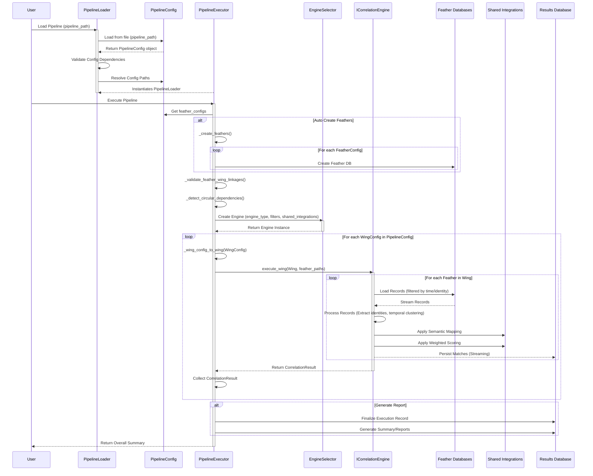

# Pipeline Directory Documentation

## Overview

The **pipeline/** directory orchestrates complete analysis workflows, including feather creation, wing execution, dependency validation, and report generation.

### Purpose
- Execute complete analysis pipelines
- Validate feather-wing linkages
- Detect circular dependencies
- Manage database connections
- Handle errors gracefully
- Resolve configuration paths

---

## Files in This Directory

### pipeline_executor.py

**Purpose**: The central orchestrator responsible for executing entire analysis pipelines defined by `PipelineConfig` objects. It coordinates feather creation, wing execution (using the selected engine), dependency handling, integration with shared services (semantic mapping, weighted scoring), and report generation.

**Key Classes**:
- `PipelineExecutor`: The main class responsible for the end-to-end execution of a correlation pipeline.

**Key Methods**:
```python
def __init__(self, pipeline_config: PipelineConfig):
    """Initializes the executor, sets up filters, integrations, and the correlation engine."""
    
def execute(self, resume_execution_id: int = None) -> Dict[str, Any]:
    """
    The main method to execute the complete pipeline.
    Orchestrates feather creation, wing execution, and report generation.
    Supports resuming from a paused state.
    """
    
def _create_shared_integrations(self, pipeline_config: PipelineConfig):
    """Creates and configures instances of WeightedScoringIntegration and SemanticMappingIntegration."""
    
def _on_config_changed(self, old_config, new_config):
    """Callback triggered on configuration changes, reloads integrations."""
    
def _create_engine_with_integrations(self, pipeline_config: PipelineConfig, engine_type: EngineType) -> BaseCorrelationEngine:
    """Factory method to create a correlation engine instance with injected shared integrations."""
    
def _create_feathers() -> Dict[str, str]:
    """Simulates/orchestrates the creation of feather databases based on FeatherConfig."""
    
def _execute_wings(self, feather_paths: Dict[str, str]):
    """
    Executes all configured wings in the pipeline, integrating with the chosen correlation engine.
    Includes validation, dynamic path resolution, and streaming setup.
    """
    
def _validate_feather_wing_linkages(self, feather_paths: Dict[str, str]) -> Dict[str, Any]:
    """Validates that wings correctly reference existing feathers before execution."""
    
def _detect_circular_dependencies(self, feather_paths: Dict[str, str]) -> Dict[str, Any]:
    """Detects issues in feather references and circular dependencies, generating errors/warnings."""
    
def _generate_dependency_graph_dot(self, feather_paths: Dict[str, str]) -> str:
    """Generates a dependency graph of feathers and wings in DOT format for visualization."""
    
def _wing_config_to_wing(self, wing_config: WingConfig) -> Wing:
    """Converts a WingConfig object to a Wing object, performing comprehensive validation."""
    
def _generate_report(self) -> Optional[int]:
    """Generates the analysis report, saving results to the SQLite database (supporting streaming)."""
```

**Execution Flow**:
1.  Initialize with `PipelineConfig`, setting up filters, shared integrations, and the selected correlation engine.
2.  Orchestrate feather creation (if `auto_create_feathers` is enabled).
3.  Perform pre-execution validation (feather-wing linkages, circular dependencies).
4.  Execute each `WingConfig` by converting it to a `Wing` object and calling `engine.execute_wing()`.
5.  Integrate with shared services (semantic mapping, weighted scoring) during wing execution.
6.  Stream results to a SQLite database.
7.  Generate a final report (if `generate_report` is enabled).
8.  Return an overall summary of the execution.

**Dependencies**:
-   `config/pipeline_config.py`, `config/feather_config.py`, `config/wing_config.py` (for configuration objects)
-   `engine/engine_selector.py`, `engine/base_engine.py`, `engine/time_based_engine.py`, `engine/identity_based_engine_adapter.py` (for engine instantiation and execution)
-   `engine/database_persistence.py` (for results persistence)
-   `integration/weighted_scoring_integration.py`, `integration/semantic_mapping_integration.py` (for shared services)
-   `wings/core/wing_model.py` (for Wing object definition)

**Dependents**:
-   `gui/execution_control.py` (for GUI-driven execution)
-   `integration/crow_eye_integration.py`

**Impact**: CRITICAL - This module is the **central orchestrator** of the entire correlation analysis workflow. Changes profoundly affect pipeline operations, engine execution, and results generation.

---

### pipeline_loader.py

**Purpose**: Designed to load a complete pipeline bundle, including its `PipelineConfig` and all associated `FeatherConfig` and `WingConfig` files. It handles validation of dependencies, resolves file paths (both absolute and relative to the case directory), and manages database connections, preparing all necessary components for the `PipelineExecutor`.

**Key Classes**:
- `PipelineLoader`: The main class responsible for loading, validating, and assembling pipeline components.

**Key Methods**:
```python
def __init__(selfself, case_directory: Path):
    """Initializes the loader with the base case_directory and a DatabaseConnectionManager."""

def load_pipeline(self, pipeline_path: str) -> PipelineBundle:
    """
    Loads a PipelineConfig from the specified path, validates its dependencies,
    resolves all file paths, loads associated feather and wing configurations,
    and returns a PipelineBundle ready for execution.
    """
    
def validate_pipeline_dependencies(self, pipeline_config: PipelineConfig) -> ValidationResult:
    """Validates that all referenced feather and wing configuration files (or their databases) exist."""
    
def resolve_config_paths(self, pipeline_config: PipelineConfig) -> Dict[str, str]:
    """Converts all relative paths found in the pipeline configuration to absolute paths."""
    
def unload_pipeline(self, bundle: PipelineBundle):
    """Closes all database connections associated with a loaded PipelineBundle."""

def _load_feather_configs(self, pipeline_config: PipelineConfig, resolved_paths: Dict[str, str]) -> tuple[List[FeatherConfig], List[str]]:
    """Helper method to load all FeatherConfig objects referenced in the PipelineConfig."""

def _load_wing_configs(self, pipeline_config: PipelineConfig, resolved_paths: Dict[str, str]) -> tuple[List[WingConfig], List[str]]:
    """Helper method to load all WingConfig objects referenced in the PipelineConfig."""

def _resolve_path(self, path: str) -> Path:
    """Resolves a given path string, making it absolute relative to the case_directory if not already absolute."""
```

**Dependencies**:
- `config/pipeline_config.py`, `config/feather_config.py`, `config/wing_config.py` (for configuration objects)
- `config/session_state.py` (for `PipelineBundle`, `LoadStatus`, `ValidationResult` data models)
- `pipeline/database_connection_manager.py`

**Dependents**:
- `pipeline_executor.py` (utilizes the loaded `PipelineBundle`)
- `gui/` components (for loading pipelines via the UI)

**Impact**: CRITICAL - This module performs the crucial initial step of loading, validating, and preparing all configurations and dependencies for an entire correlation analysis pipeline. Errors here prevent any analysis from starting.

---

### feather_auto_registration.py

**Purpose**: Automatically register newly created feather databases.

**Key Classes**:
- `FeatherAutoRegistrationService`: Auto-registers feathers

**Key Methods**:
```python
def scan_for_feathers(directory):
    """Scan directory for feather databases"""
    
def register_feather(feather_path):
    """Register feather in configuration"""
```

**Impact**: LOW - Optional feature

---

### discovery_service.py

**Purpose**: Discover available feathers, wings, and pipelines.

**Key Classes**:
- `ConfigurationDiscoveryService`: Discovers configurations

**Key Methods**:
```python
def discover_feathers(directory):
    """Discover feather configurations"""
    
def discover_wings(directory):
    """Discover wing configurations"""
    
def discover_pipelines(directory):
    """Discover pipeline configurations"""
```

**Dependencies**: `config/config_manager.py`

**Dependents**: `gui/` components

**Impact**: LOW - Only affects discovery

---

### database_connection_manager.py

**Purpose**: Manage database connections for feather databases.

**Key Classes**:
- `DatabaseConnectionManager`: Manages DB connections

**Key Methods**:
```python
def get_connection(db_path):
    """Get or create database connection"""
    
def close_all_connections():
    """Close all open connections"""
```

**Impact**: MEDIUM - Affects database access

---

### error_handler.py

**Purpose**: Centralized error handling for pipeline operations.

**Key Classes**:
- `ErrorHandler`: Handles errors gracefully

**Key Methods**:
```python
def handle_error(error, context):
    """Handle error with context"""
    
def log_error(error, context):
    """Log error details"""
```

**Impact**: LOW - Only affects error handling

---

### path_resolver.py

**Purpose**: Resolve relative and absolute configuration paths.

**Key Classes**:
- `PathResolver`: Resolves paths

**Key Methods**:
```python
def resolve_path(path, base_dir):
    """Resolve relative or absolute path"""
    
def validate_path(path):
    """Validate path exists"""
```

**Impact**: MEDIUM - Affects path resolution

---

## Common Modification Scenarios

### Scenario 1: Adding a New Pipeline Stage

**Files to Modify**:
1. `pipeline_executor.py` - Add new stage method
2. `config/pipeline_config.py` - Add configuration option
3. Test with sample pipeline

**Steps**:
1. Add method for new stage (e.g., `_post_process_results()`)
2. Call method in `execute()`
3. Add configuration option if needed
4. Test execution

**Impact**: MEDIUM - Extends pipeline functionality

---

### Scenario 2: Modifying Dependency Resolution

**Files to Modify**:
1. `pipeline_executor.py` - Update `_detect_circular_dependencies()`
2. `pipeline_loader.py` - Update dependency resolution
3. Test with complex pipelines

**Impact**: MEDIUM - Affects dependency validation

---

### Scenario 3: Adding New Validation Check

**Files to Modify**:
1. `pipeline_executor.py` - Add validation method
2. Call in `_validate_feather_wing_linkages()`
3. Test with valid and invalid configs

**Impact**: LOW - Only affects validation

---

## Pipeline Execution Sequence



---

## See Also
- [Main Overview](../CORRELATION_ENGINE_OVERVIEW.md)
- [Engine Documentation](../engine/ENGINE_DOCUMENTATION.md)
- [Config Documentation](../config/CONFIG_DOCUMENTATION.md)
