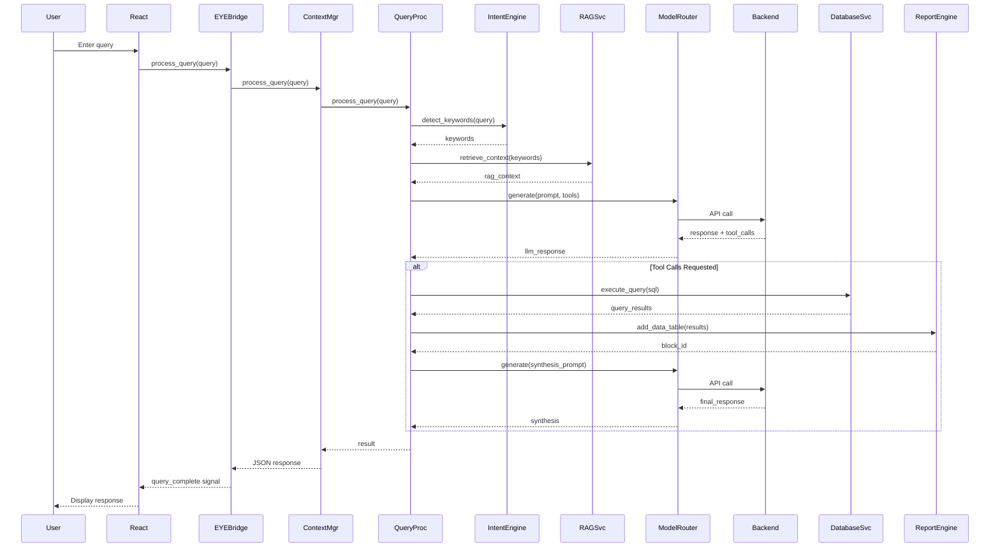
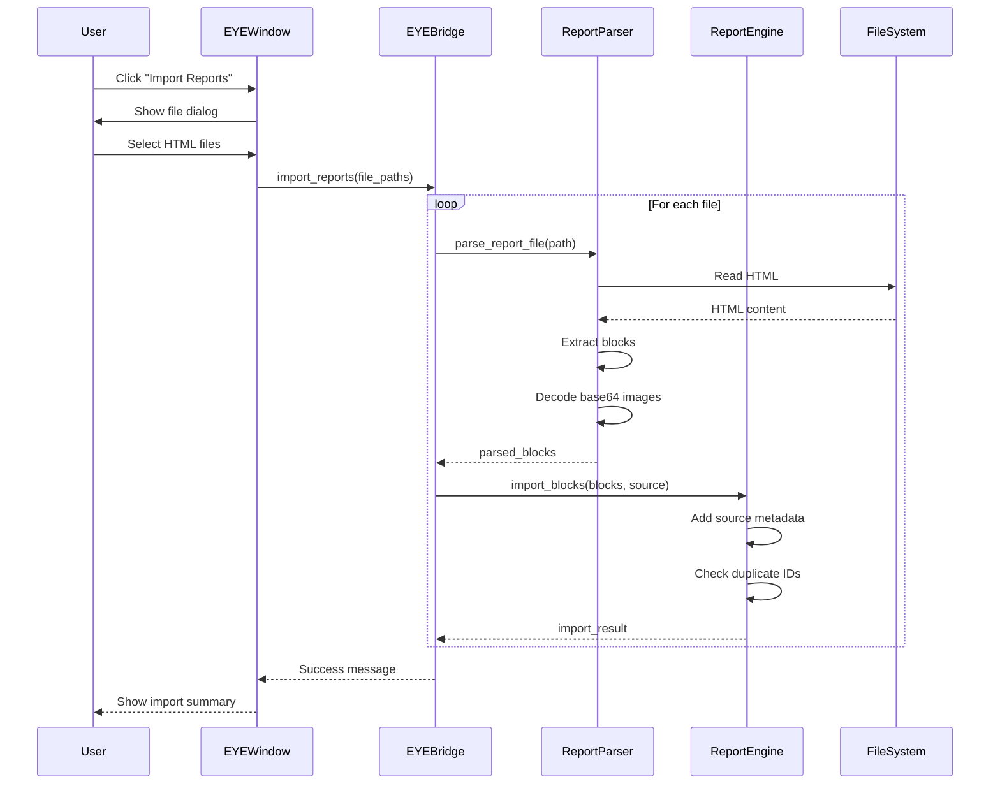

# EYE AI Forensic Assistant - Architecture Documentation

## System Overview

The **EYE (Evidence Yield Engine) AI Forensic Assistant** is an advanced digital forensics investigation platform that combines artificial intelligence with traditional forensic analysis techniques. EYE provides forensic investigators with a natural language interface to query, analyze, and document findings from Windows forensic artifacts.

### Core Capabilities

- **Natural Language Investigation**: Query forensic artifacts using conversational AI
- **Multi-Source Data Integration**: Unified access to Prefetch, MFT, Registry, Event Logs, Browser History, and more
- **Living Report Workspace**: Real-time collaborative documentation with charts, tables, and evidence tracking
- **RAG-Enhanced Analysis**: Retrieval-Augmented Generation for artifact-specific forensic knowledge
- **Multi-Backend AI Support**: OpenAI, Anthropic, Google Gemini, Ollama, LM Studio, and CLI-based models
- **Human-in-the-Loop Validation**: Critical decisions require investigator approval
- **Automated Forensic Triage**: One-click comprehensive system analysis

### Key Features

1. **Intelligent Query Processing**: Transforms natural language questions into SQL queries, searches, and forensic analysis
2. **Database Abstraction**: Automatic discovery and querying of forensic artifact databases
3. **Semantic Search**: Cross-artifact correlation using embeddings and similarity matching
4. **Report Generation**: Export findings as HTML or PDF with embedded charts and tables
5. **Context-Aware Conversations**: Maintains investigation timeline and conversation history
6. **Extensible Architecture**: Plugin-based backend system for AI model integration

---

## Directory Structure

```
eye/
├── __init__.py                 # Package initialization
├── README.md                   # This file
│
├── backends/                   # AI Backend Implementations
│   ├── base.py                # Abstract LLMBackend interface
│   ├── cloud_api/             # Cloud API backends
│   │   ├── openai_backend.py
│   │   ├── anthropic_backend.py
│   │   └── gemini_backend.py
│   ├── local_server/          # Local server backends
│   │   ├── ollama_backend.py
│   │   └── lmstudio_backend.py
│   └── local_cli/             # CLI-based backends
│       ├── generic_cli_backend.py
│       └── cli_profiles.py
│
├── brain/                      # Core Intelligence Layer
│   ├── context_manager.py     # Central orchestrator for investigations
│   └── ...
│
├── bridge/                     # UI ↔ Backend Communication
│   └── eye_bridge.py          # QWebChannel bridge for React frontend
│
├── cli_agents/                 # Command-line interface agents
│   └── ...
│
├── examples/                   # Usage examples and demos
│   └── ...
│
├── models/                     # Data Models
│   ├── report_blocks.py       # ReportBlock types (Text, Table, Image, Chart)
│   └── ...
│
├── scratch/                    # Development scratch space
│   └── ...
│
├── services/                   # Service Layer
│   ├── query_processor.py     # Main query orchestration pipeline
│   ├── model_router.py        # AI backend routing and management
│   ├── report_engine.py       # Living Report Workspace manager
│   ├── report_parser.py       # HTML forensic report parser
│   ├── credential_manager.py  # Secure API key storage
│   ├── context_window_config_manager.py
│   ├── correlation_service.py # Cross-artifact correlation
│   ├── error_handler.py       # Centralized error handling
│   ├── forensic_handlers.py   # Forensic tool implementations
│   ├── history_manager.py     # Conversation history management
│   ├── intent_engine.py       # Query intent detection
│   ├── internet_search_service.py
│   ├── rag_service.py         # Retrieval-Augmented Generation
│   ├── report_handlers.py     # Report manipulation tools
│   ├── search_service.py      # Cross-artifact search
│   ├── timestamp_service.py   # Forensic timestamp parsing
│   └── token_counter.py       # Token usage tracking
│
├── tests/                      # Test Suite
│   ├── test_report_parser.py
│   ├── test_report_parser_properties.py
│   ├── test_report_engine_extensions.py
│   ├── test_report_import_ui.py
│   ├── test_eye_bridge_import.py
│   ├── test_eye_window_manager.py
│   └── ...
│
└── ui/                         # User Interface Components
    ├── eye_manager.py         # EYE window lifecycle manager
    ├── case_summary_dialog.py # Investigation timeline dialog
    ├── case_setup_dialog.py  # Case initialization wizard
    └── ...
```

### Directory Descriptions

- **backends/**: Implements the Strategy pattern for AI model integration. Each backend provides a unified interface for different LLM providers (cloud APIs, local servers, CLI tools).

- **brain/**: Contains the `ContextManager`, the central orchestrator that coordinates all investigation activities, manages state, and routes requests to appropriate services.

- **bridge/**: Provides QWebChannel-based communication between the PyQt5 backend and React frontend, exposing Python functionality as JavaScript-callable methods.

- **models/**: Defines data structures for report blocks, forensic artifacts, and investigation metadata.

- **services/**: Core business logic layer containing specialized services for query processing, database access, search, RAG, reporting, and AI routing.

- **ui/**: PyQt5-based user interface components including dialogs, windows, and Qt-specific UI logic.

- **tests/**: Comprehensive test suite including unit tests, integration tests, and property-based tests.

---

## Architecture Diagram

```mermaid
graph TB
    subgraph "UI Layer"
        EYEWindow[EYEAssistantWindow<br/>PyQt5 + React]
        EYEManager[EyeWindowManager<br/>Window Lifecycle]
        CaseSummary[CaseSummaryDialog<br/>Timeline & Charts]
        CaseSetup[CaseSetupDialog<br/>Case Initialization]
    end
    
    subgraph "Bridge Layer"
        EYEBridge[EYEBridge<br/>QWebChannel Communication]
    end
    
    subgraph "Brain Layer"
        ContextMgr[ContextManager<br/>Central Orchestrator]
        QueryProc[QueryProcessor<br/>Investigation Pipeline]
    end
    
    subgraph "Services Layer"
        ModelRouter[ModelRouter<br/>AI Backend Routing]
        ReportEngine[ReportEngine<br/>Living Report Workspace]
        ReportParser[ForensicReportParser<br/>HTML Report Import]
        DatabaseSvc[DatabaseService<br/>Forensic DB Access]
        SearchSvc[ForensicSearchService<br/>Cross-Artifact Search]
        RAGSvc[RAGService<br/>Knowledge Retrieval]
        IntentEngine[IntentEngine<br/>Query Analysis]
        HistoryMgr[HistoryManager<br/>Conversation Tracking]
        CredentialMgr[CredentialManager<br/>Secure Key Storage]
    end
    
    subgraph "Backend Layer"
        OpenAI[OpenAIBackend]
        Anthropic[AnthropicBackend]
        Gemini[GeminiBackend]
        Ollama[OllamaBackend]
        LMStudio[LMStudioBackend]
        CLI[GenericCLIBackend]
    end
    
    subgraph "Data Layer"
        ReportBlocks[ReportBlock Models<br/>Text, Table, Image, Chart]
        Databases[(Forensic Databases<br/>SQLite)]
        FileSystem[File System<br/>Artifacts & Reports]
    end
    
    EYEManager -->|creates| EYEWindow
    EYEWindow -->|embeds| EYEBridge
    EYEWindow -->|opens| CaseSummary
    EYEWindow -->|opens| CaseSetup
    
    EYEBridge <-->|QWebChannel| ContextMgr
    EYEBridge --> ReportEngine
    EYEBridge --> DatabaseSvc
    EYEBridge --> SearchSvc
    
    ContextMgr --> QueryProc
    ContextMgr --> ModelRouter
    ContextMgr --> ReportEngine
    ContextMgr --> DatabaseSvc
    ContextMgr --> RAGSvc
    ContextMgr --> HistoryMgr
    
    QueryProc --> IntentEngine
    QueryProc --> RAGSvc
    QueryProc --> ModelRouter
    
    ModelRouter --> OpenAI
    ModelRouter --> Anthropic
    ModelRouter --> Gemini
    ModelRouter --> Ollama
    ModelRouter --> LMStudio
    ModelRouter --> CLI
    
    ReportEngine --> ReportBlocks
    ReportEngine --> FileSystem
    ReportParser --> FileSystem
    ReportParser --> ReportBlocks
    
    DatabaseSvc --> Databases
    SearchSvc --> Databases
    RAGSvc --> Databases
    
    CaseSummary --> ReportEngine
    CaseSummary --> HistoryMgr
    
    ModelRouter -.->|uses| CredentialMgr
    
    style ContextMgr fill:#f97316
    style QueryProc fill:#f97316
    style ModelRouter fill:#06b6d4
    style ReportEngine fill:#10b981
    style EYEBridge fill:#ec4899
```



---

## Component Descriptions

### UI Layer

#### EYEAssistantWindow
**File**: `eye/ui/eye_window.py`

The main application window that hosts the React-based chat interface. Uses QWebEngineView to embed a modern web frontend while maintaining Python backend integration.

**Responsibilities**:
- Embed React frontend via QWebEngineView
- Initialize EYEBridge for frontend ↔ backend communication
- Manage toolbar actions (Case Summary, Import Reports, Settings)
- Handle window lifecycle and case directory changes

#### EyeWindowManager
**File**: `eye/ui/eye_manager.py`

Singleton manager for EYE window lifecycle. Handles window creation, reinitialization on case changes, and splash screen display.

**Responsibilities**:
- Manage EYE window singleton instance
- Display splash screen during initialization (when config exists)
- Detect case directory changes and reinitialize window
- Handle window cleanup and resource management

#### CaseSummaryDialog
**File**: `eye/ui/case_summary_dialog.py`

Dialog displaying investigation timeline, imported report findings, and analytical charts.

**Responsibilities**:
- Display investigation timeline with filtering
- Show imported report blocks with detail pane
- Generate activity charts, evidence ratio charts, and artifact type charts
- Export case summary as HTML or PDF

#### CaseSetupDialog
**File**: `eye/ui/case_setup_dialog.py`

Wizard for first-time case context initialization. Guides investigators through case metadata entry.

**Responsibilities**:
- Collect case metadata (case number, investigator, description)
- Initialize case context JSON file
- Validate required fields
- Provide edit dialog for existing case context

---

### Bridge Layer

#### EYEBridge
**File**: `eye/bridge/eye_bridge.py`

QWebChannel bridge exposing Python backend functionality to React frontend. All methods are decorated with `@pyqtSlot` and return JSON strings.

**Key Methods**:
- `process_query(query: str)` - Process natural language investigation queries
- `query_database(database: str, sql: str)` - Execute SQL against forensic databases
- `search_artifacts(config_json: str)` - Cross-artifact search
- `get_schema(database: str, table: str)` - Database schema introspection
- `import_reports(file_paths_json: str)` - Import HTML forensic reports
- `get_context_stats()` - Conversation history and token usage stats
- `get_available_models_with_quota()` - List AI models and quota status
- `switch_active_model(model_name: str)` - Change active AI model

**Signals**:
- `query_complete` - Emitted when async query finishes
- `report_updated` - Emitted when report blocks change
- `status_updated` - Emitted during query processing (thinking steps)
- `error_occurred` - Emitted on backend errors

---

### Brain Layer

#### ContextManager
**File**: `eye/brain/context_manager.py`

Central orchestrator for all investigation activities. Maintains case state, coordinates services, and manages AI interactions.

**Responsibilities**:
- Coordinate query processing pipeline
- Manage conversation history and context window
- Route tool calls to appropriate handlers
- Maintain case directory and artifact references
- Orchestrate RAG retrieval and database queries
- Generate action chips and data viewers for UI

#### QueryProcessor
**File**: `eye/services/query_processor.py`

Implements the complete forensic investigation pipeline from natural language query to verified conclusion.

**Pipeline Stages**:
1. **Intent Detection**: Parse query for forensic targets
2. **RAG Retrieval**: Pull relevant knowledge base articles
3. **Prompt Construction**: Merge case context, RAG results, history
4. **AI Consultation**: Call configured LLM with tools
5. **Tool Execution**: Run SQL/Search handlers based on AI requests
6. **Forensic Synthesis**: Final validation and reporting

**Special Modes**:
- Automated Triage: `initialize_case_report` - Generates comprehensive system report
- Model Switching: `switch model` - Interactive model selection
- Human-in-the-Loop: Approval dialogs for critical decisions

---

### Services Layer

#### ModelRouter
**File**: `eye/services/model_router.py`

Central controller for AI backend management. Implements Strategy pattern to provide unified interface across different LLM providers.

**Supported Backends**:
- **Cloud API**: OpenAI, Anthropic, Google Gemini
- **Local Server**: Ollama, LM Studio
- **Local CLI**: Generic CLI tools (Gemini CLI, Llama.cpp, etc.)

**Key Methods**:
- `generate()` - Generate AI response with tool support
- `validate_connectivity()` - Check backend availability
- `list_models()` - Discover available models
- `switch_model()` - Change active model within same backend
- `get_models_with_quota()` - Get models with usage statistics

#### ReportEngine
**File**: `eye/services/report_engine.py`

Manages the Living Report Workspace, providing CRUD operations for report blocks and maintaining edit history.

**Block Types**:
- **TextBlock**: Markdown-formatted narrative sections
- **TableBlock**: SQL query results with DataTables.js rendering
- **ImageBlock**: Embedded images with captions
- **ChartBlock**: Chart.js visualizations (bar, line, pie)
- **ChatBlock**: AI conversation transcripts
- **ReferenceBlock**: External reference links

**Key Methods**:
- `append_section()` - Add text block
- `add_data_table()` - Add table from SQL results
- `add_chart()` - Add Chart.js visualization
- `add_image()` - Add image with caption
- `import_blocks()` - Import blocks from external reports
- `get_blocks_by_source()` - Filter blocks by import source
- `render_html()` - Export report as standalone HTML
- `export_pdf()` - Export report as PDF (requires weasyprint)

#### ForensicReportParser
**File**: `eye/services/report_parser.py`

Parses HTML forensic reports and extracts structured data into ReportBlock objects.

**Capabilities**:
- Parse HTML report files matching `forensic_report_*.html` pattern
- Extract text blocks, table blocks, and image blocks
- Decode base64-encoded images and save to case directory
- Handle malformed HTML gracefully with error logging
- Preserve original block IDs and metadata

**Key Methods**:
- `parse_report_file()` - Parse single HTML report
- `parse_reports_directory()` - Parse all reports in directory
- `convert_to_report_blocks()` - Convert parsed data to ReportBlock objects

#### DatabaseService
**File**: `eye/services/database_service.py` (referenced)

Provides read-only access to forensic artifact databases with automatic discovery and schema introspection.

**Capabilities**:
- Discover SQLite databases in case directory
- Execute parameterized SQL queries
- Get table schemas and sample data
- Track row counts and database metadata

#### ForensicSearchService
**File**: `eye/services/search_service.py`

Cross-artifact search with support for full-text, regex, exact match, and case-sensitive options.

**Search Features**:
- Search across multiple tables and columns
- Regex pattern matching
- Case-sensitive and exact match modes
- Result truncation and timeout handling
- Match highlighting and statistics

#### RAGService
**File**: `eye/services/rag_service.py`

Retrieval-Augmented Generation service for forensic knowledge. Uses embeddings to find relevant artifact documentation.

**Capabilities**:
- Generate embeddings using Ollama or cloud APIs
- Semantic similarity search across knowledge base
- Context-aware article retrieval
- Cosine similarity ranking

#### IntentEngine
**File**: `eye/services/intent_engine.py`

Analyzes investigator queries to determine forensic intent and target artifacts.

**Detection Capabilities**:
- Keyword extraction (prefetch, registry, MFT, etc.)
- Artifact type identification
- Query classification (database, search, analysis)

#### HistoryManager
**File**: `eye/services/history_manager.py`

Manages conversation history, persistence, and summarization.

**Capabilities**:
- Track user and assistant messages
- Persist history to case directory
- Token counting and context window management
- History truncation and summarization

#### CredentialManager
**File**: `eye/services/credential_manager.py`

Secure credential storage using OS-native keychains (Windows Credential Manager, macOS Keychain, Linux Secret Service).

**Capabilities**:
- Store API keys securely
- Retrieve credentials for AI backends
- Validate credential existence
- Cross-platform keychain integration

---

## Data Flow

### Query Processing Sequence



### Report Import Flow



---

## Service Dependencies

### Dependency Graph

```
ContextManager
├── QueryProcessor
│   ├── IntentEngine
│   ├── RAGService
│   └── ModelRouter
│       ├── OpenAIBackend
│       ├── AnthropicBackend
│       ├── GeminiBackend
│       ├── OllamaBackend
│       ├── LMStudioBackend
│       └── GenericCLIBackend
├── DatabaseService
├── SearchService
├── ReportEngine
├── HistoryManager
└── CredentialManager

EYEBridge
├── ContextManager (primary)
├── DatabaseService (direct access)
├── SearchService (direct access)
└── ReportEngine (direct access)

ReportEngine
└── (no dependencies - standalone)

ForensicReportParser
└── ReportEngine (for block models)
```

### Service Interaction Patterns

1. **ContextManager as Orchestrator**: All investigation activities flow through ContextManager, which coordinates services and maintains state.

2. **EYEBridge as Facade**: Provides simplified interface to React frontend, delegating to appropriate services.

3. **ModelRouter as Strategy**: Abstracts AI backend differences, allowing runtime switching between providers.

4. **ReportEngine as Repository**: Centralized storage for report blocks with CRUD operations and export capabilities.

5. **QueryProcessor as Pipeline**: Implements multi-stage investigation pipeline with tool execution and synthesis.

---

## Configuration

### ConfigManager
**File**: `eye/services/config_manager.py` (referenced)

Manages EYE configuration stored in `~/.kiro/eye/config.json`.

**Configuration Structure**:
```json
{
  "backend": "openai",
  "model_name": "gpt-4",
  "integration_type": "cloud_api",
  "api_endpoint": "https://api.openai.com/v1",
  "executable_path": "",
  "max_tokens": 8000,
  "temperature": 0.7
}
```

**Configuration Locations**:
- User config: `~/.kiro/eye/config.json`
- Case context: `<case_directory>/case_context.json`
- Credentials: OS keychain (Windows Credential Manager, macOS Keychain, Linux Secret Service)

### CredentialManager

Stores API keys securely in OS-native keychains:

**Windows**: Windows Credential Manager
**macOS**: Keychain Access
**Linux**: Secret Service API (GNOME Keyring, KWallet)

**Credential Keys**:
- `eye_openai_api_key`
- `eye_anthropic_api_key`
- `eye_gemini_api_key`

---

## Report System

### ReportBlock Types

#### TextBlock
Markdown-formatted narrative sections with title and content.

**Fields**:
- `title`: Section heading
- `markdown_content`: Markdown text
- `metadata`: Author, timestamp, source

**Rendering**: Markdown → HTML with syntax highlighting

#### TableBlock
SQL query results rendered as interactive DataTables.

**Fields**:
- `sql_query`: Original SQL query
- `columns`: Column names
- `rows`: List of row dictionaries
- `caption`: Table description
- `metadata`: Author, timestamp, source

**Rendering**: DataTables.js with sorting, filtering, pagination

#### ImageBlock
Embedded images with captions.

**Fields**:
- `image_path`: Path to image file
- `caption`: Image description
- `metadata`: Author, timestamp, source

**Rendering**: Base64-encoded image embedded in HTML

#### ChartBlock
Chart.js visualizations (bar, line, pie).

**Fields**:
- `chart_type`: "bar", "line", "pie"
- `title`: Chart title
- `labels`: X-axis labels
- `datasets`: Chart.js dataset format
- `metadata`: Author, timestamp, source

**Rendering**: Chart.js canvas with dark theme styling

#### ChatBlock
AI conversation transcripts.

**Fields**:
- `messages`: List of {role, content} dictionaries
- `metadata`: Author, timestamp

**Rendering**: Styled message bubbles with role indicators

#### ReferenceBlock
External reference links.

**Fields**:
- `reference_text`: Link text
- `source_link`: URL
- `metadata`: Author, timestamp

**Rendering**: Collapsible details element

### HTML Export Format

Reports are exported as standalone HTML files with:
- Embedded CSS (dark theme, forensic styling)
- Embedded JavaScript (jQuery, DataTables.js, Chart.js)
- Base64-encoded images
- Responsive layout
- Print-friendly styling

**Color Scheme**:
- Background: `#0a0c10` (dark)
- Accent: `#f97316` (orange)
- Identity: `#06b6d4` (cyan)
- Text: `#e8edf5` (light gray)
- Border: `#1e2a3a` (dark gray)

**Fonts**:
- Headings: Syne (bold, modern)
- Body: Inter (readable, professional)
- Code/Data: Space Mono (monospace)

---

## Development Setup

### Prerequisites

- Python 3.8+
- PyQt5
- Node.js 16+ (for React frontend)
- SQLite3

### Installation

1. **Clone the repository**:
   ```bash
   git clone <repository-url>
   cd Crow-Eye
   ```

2. **Install Python dependencies**:
   ```bash
   ```

3. **Install optional dependencies**:
   ```bash
   # For PDF export
   pip install weasyprint
   
   # For property-based testing
   pip install hypothesis
   ```

4. **Configure AI backend**:
   ```bash
   # Run EYE and open Settings dialog
   # Or manually edit ~/.kiro/eye/config.json
   ```

5. **Set API keys** (for cloud backends):
   ```bash
   # Keys are stored in OS keychain
   # Use Settings dialog or CredentialManager API
   ```

### Running Tests

```bash
# Run all tests
python -m pytest eye/tests/

# Run specific test file
python -m pytest eye/tests/test_report_parser.py

# Run with coverage
python -m pytest --cov=eye eye/tests/

# Run property-based tests
python -m pytest eye/tests/test_report_parser_properties.py
```

### Running EYE

```bash
# From main application
python main.py

# Or import and use programmatically
from eye.brain.context_manager import ContextManager
from eye.services.model_router import ModelRouter

# Initialize
config = {"backend": "openai", "model_name": "gpt-4"}
router = ModelRouter(config)
cm = ContextManager(case_directory="/path/to/case", model_router=router)

# Process query
result = cm.process_query("Show me all prefetch files")
print(result["response"])
```

### Development Workflow

1. **Create feature branch**:
   ```bash
   git checkout -b feature/my-feature
   ```

2. **Make changes and test**:
   ```bash
   # Edit code
   # Run tests
   python -m pytest eye/tests/
   ```

3. **Run linters**:
   ```bash
   # Format code
   black eye/
   
   # Check types
   mypy eye/
   
   # Lint
   pylint eye/
   ```

4. **Commit and push**:
   ```bash
   git add .
   git commit -m "Add feature: description"
   git push origin feature/my-feature
   ```

5. **Create pull request**

### Project Structure Guidelines

- **Services**: Stateless business logic, no UI dependencies
- **UI**: PyQt5 components, no direct service imports (use bridge)
- **Bridge**: Thin layer, delegates to services
- **Models**: Pure data classes, no logic
- **Tests**: Mirror source structure, comprehensive coverage

### Coding Standards

- **Style**: PEP 8 with Black formatting
- **Docstrings**: Google style
- **Type Hints**: Required for public APIs
- **Logging**: Use `logging` module, not `print()`
- **Error Handling**: Specific exceptions, informative messages
- **Testing**: Unit tests for logic, integration tests for UI

### Debugging Tips

1. **Enable debug logging**:
   ```python
   import logging
   logging.basicConfig(level=logging.DEBUG)
   ```

2. **Inspect QWebChannel communication**:
   ```javascript
   // In React DevTools console
   window.bridge.get_context_stats()
   ```

3. **Check database connections**:
   ```python
   cm.database_service.discover_databases()
   print(cm.database_service.db_manager.resolved_paths)
   ```

4. **Verify AI backend**:
   ```python
   cm.model_router.validate_connectivity()
   models = cm.model_router.list_models()
   ```

---

## Additional Resources

### Related Documentation

- **Design**: `.kiro/specs/eye-system-enhancements/design.md`
- **Tasks**: `.kiro/specs/eye-system-enhancements/tasks.md`
- **API Reference**: See docstrings in source files

### External Dependencies

- **PyQt5**: https://www.riverbankcomputing.com/software/pyqt/
- **BeautifulSoup4**: https://www.crummy.com/software/BeautifulSoup/
- **Markdown**: https://python-markdown.github.io/
- **Hypothesis**: https://hypothesis.readthedocs.io/
- **DataTables.js**: https://datatables.net/
- **Chart.js**: https://www.chartjs.org/

### Contributing

Contributions are welcome! Please:
1. Follow coding standards
2. Write tests for new features
3. Update documentation
4. Submit pull requests with clear descriptions

### License

[License information]

### Contact

[Contact information]

---

**Last Updated**: 2024
**Version**: 1.0
**Maintainer**: EYE Development Team
