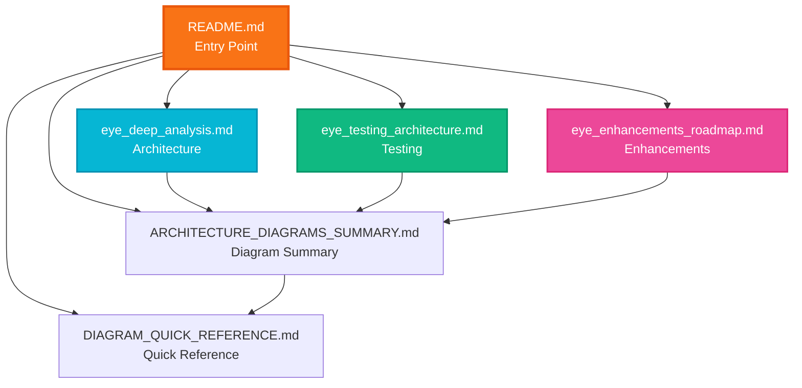

# EYE Documentation Structure

## Overview

The EYE documentation has been reorganized into focused, single-purpose files for better maintainability and readability.

---

## File Structure

```
eye/docs/
├── README.md                           # Documentation index and navigation
├── eye_deep_analysis.md                # Architecture documentation (MAIN FILE)
├── eye_testing_architecture.md         # Testing strategy and test suite
├── eye_enhancements_roadmap.md         # v2.0 enhancement roadmap
├── ARCHITECTURE_DIAGRAMS_SUMMARY.md    # Summary of all diagrams
├── DIAGRAM_QUICK_REFERENCE.md          # Quick navigation guide
└── DOCUMENTATION_STRUCTURE.md          # This file
```

---

## File Purposes

### 1. eye_deep_analysis.md (MAIN ARCHITECTURE FILE)
**Purpose**: Complete architecture documentation with diagrams

**Contains**:
- Executive architecture overview
- Detailed component architecture
- Security posture ("Ghassan Elsman Boundary")
- Model backend strategy patterns
- Service layer architecture
- Data flow diagrams
- Deployment scenarios
- Security and compliance architecture

**Sections**:
1. Executive Architecture Overview
2. Architectural Overview & The Nervous System
3. Detailed Component Architecture (1.5)
4. Security Posture
5. Model Backend Strategy
6. Validation Layer
7. Token Economy & State Management

**Diagrams**: 20+ architecture diagrams
**Length**: ~1,070 lines
**Audience**: Developers, architects, security auditors

---

### 2. eye_testing_architecture.md
**Purpose**: Testing strategy and test suite documentation

**Contains**:
- Test suite structure
- Unit, integration, property-based, and E2E tests
- Testing best practices
- CI/CD pipeline
- Test fixtures and maintenance
- Running and debugging tests

**Sections**:
1. Testing Architecture
2. Test Categories
3. Testing Best Practices
4. Running Tests
5. Test Fixtures
6. Continuous Integration
7. Test Maintenance

**Diagrams**: 3 testing diagrams
**Length**: ~450 lines
**Audience**: QA engineers, developers

---

### 3. eye_enhancements_roadmap.md
**Purpose**: v2.0 enhancement roadmap and future features

**Contains**:
- Performance enhancements
- Intelligence upgrades
- Advanced forensic features
- Implementation roadmap
- Success metrics
- Risk assessment

**Sections**:
1. Executive Summary
2. Performance Enhancements
3. Intelligence Enhancements
4. Advanced Forensic Features
5. Implementation Roadmap
6. Success Metrics
7. Risk Assessment

**Diagrams**: 7+ enhancement diagrams
**Length**: ~650 lines
**Audience**: Product managers, architects, stakeholders

---

### 4. ARCHITECTURE_DIAGRAMS_SUMMARY.md
**Purpose**: Summary of all diagrams added to documentation

**Contains**:
- List of all diagrams
- Diagram types and purposes
- Key architectural insights
- Color coding conventions
- Usage recommendations by role

**Length**: ~200 lines
**Audience**: Anyone looking for diagram overview

---

### 5. DIAGRAM_QUICK_REFERENCE.md
**Purpose**: Quick navigation guide for finding specific diagrams

**Contains**:
- "I need to understand..." index
- Diagram legend (colors, arrows, shapes)
- Common architectural patterns
- Quick start paths by role
- Diagram maintenance notes

**Length**: ~300 lines
**Audience**: Anyone looking for specific diagrams

---

### 6. README.md
**Purpose**: Documentation index and navigation hub

**Contains**:
- Overview of all documentation files
- Quick navigation by role
- Quick navigation by topic
- Diagram statistics
- Document updates

**Length**: ~400 lines
**Audience**: All users (entry point)

---

## Navigation Guide

### By Role

#### Developers
1. Start with `README.md` → Developer section
2. Read `eye_deep_analysis.md` → Service Layer Architecture
3. Review `eye_testing_architecture.md` → Test Categories
4. Check `DIAGRAM_QUICK_REFERENCE.md` for specific diagrams

#### Architects
1. Start with `README.md` → Architect section
2. Read `eye_deep_analysis.md` → Executive Architecture Overview
3. Review `eye_enhancements_roadmap.md` → Implementation Roadmap
4. Check `ARCHITECTURE_DIAGRAMS_SUMMARY.md` for diagram overview

#### QA Engineers
1. Start with `README.md` → QA Engineers section
2. Read `eye_testing_architecture.md` → Complete testing guide
3. Review `eye_deep_analysis.md` → Error Handling Flow
4. Check `DIAGRAM_QUICK_REFERENCE.md` → Testing diagrams

#### Security Auditors
1. Start with `README.md` → Security Auditors section
2. Read `eye_deep_analysis.md` → Security Posture section
3. Review security diagrams in `DIAGRAM_QUICK_REFERENCE.md`
4. Check `eye_testing_architecture.md` → Security Testing

#### Product Managers
1. Start with `README.md` → Overview
2. Read `eye_enhancements_roadmap.md` → Complete roadmap
3. Review `eye_deep_analysis.md` → Executive Overview
4. Check `ARCHITECTURE_DIAGRAMS_SUMMARY.md` → Key insights

---

## Maintenance Guidelines

### When to Update Each File

#### eye_deep_analysis.md
Update when:
- Adding new services or components
- Modifying architecture patterns
- Changing security mechanisms
- Adding new backends or integrations
- Updating data flow

#### eye_testing_architecture.md
Update when:
- Adding new test categories
- Changing testing strategy
- Updating CI/CD pipeline
- Adding new test fixtures
- Modifying test best practices

#### eye_enhancements_roadmap.md
Update when:
- Completing roadmap items
- Adding new enhancement proposals
- Changing priorities
- Updating success metrics
- Revising risk assessments

#### ARCHITECTURE_DIAGRAMS_SUMMARY.md
Update when:
- Adding new diagrams to any file
- Changing diagram conventions
- Adding new usage recommendations

#### DIAGRAM_QUICK_REFERENCE.md
Update when:
- Adding new diagrams
- Changing diagram locations
- Adding new navigation paths
- Updating diagram legend

#### README.md
Update when:
- Adding new documentation files
- Changing file purposes
- Updating navigation structure
- Adding new roles or topics

---

## Diagram Distribution

### Architecture Diagrams (eye_deep_analysis.md)
- Complete System Architecture
- Technology Stack
- Backend Strategy Pattern
- Service Layer Architecture
- Query Processing Pipeline
- Database Service Security
- Report Engine Block System
- UI Layer Communication
- Configuration & Credential Management
- Tool Execution Dispatch
- RAG Service Architecture
- TOON Engine
- Error Handling Flow
- History Management
- Case Directory Structure
- Deployment Scenarios
- Data Flow Diagrams
- Security Layers
- Performance Optimization

**Total**: 20+ diagrams

### Testing Diagrams (eye_testing_architecture.md)
- Test Suite Structure
- Property-Based Testing Strategy
- CI/CD Pipeline

**Total**: 3 diagrams

### Enhancement Diagrams (eye_enhancements_roadmap.md)
- UI Streaming Architecture
- Semantic Caching Flow
- Multi-Agent Orchestration
- HyDE Process
- Ghost Report System
- Cross-Case Search
- Timeline Generation

**Total**: 7+ diagrams

---

## Color Coding Convention

All diagrams use consistent color coding:

- 🟠 **Orange** (#f97316): Core brain components (ContextManager, QueryProcessor)
- 🔵 **Cyan** (#06b6d4): AI/Model components (ModelRouter, backends)
- 🟢 **Green** (#10b981): Report and output components (ReportEngine)
- 🔴 **Pink** (#ec4899): Bridge and communication layers (EYEBridge)
- 🔴 **Red** (#ef4444): Security and credential components
- ⚫ **Gray** (#475569): Data storage components (SQLite, files)

---

## Document Relationships



---

## Best Practices

### For Writers
1. Keep each file focused on its single purpose
2. Use consistent diagram styling and colors
3. Update all related files when making changes
4. Maintain cross-references between files
5. Keep README.md as the central navigation hub

### For Readers
1. Start with README.md for navigation
2. Use DIAGRAM_QUICK_REFERENCE.md to find specific diagrams
3. Read files in order based on your role
4. Use ARCHITECTURE_DIAGRAMS_SUMMARY.md for overview

### For Maintainers
1. Update all affected files when making changes
2. Keep diagram counts and statistics accurate
3. Maintain consistent formatting across files
4. Test all internal links regularly
5. Update version numbers and dates

---

## Version History

### v1.5 (Current) - Documentation Reorganization
- Split monolithic file into focused documents
- Created separate testing and enhancement files
- Maintained all 30+ diagrams across files
- Improved navigation and discoverability

### v1.0 - Initial Documentation
- Single monolithic file
- Combined architecture, testing, and enhancements
- ~1,700 lines in one file

---

**Last Updated**: 2024
**Version**: 1.5
**Maintainer**: EYE Development Team
