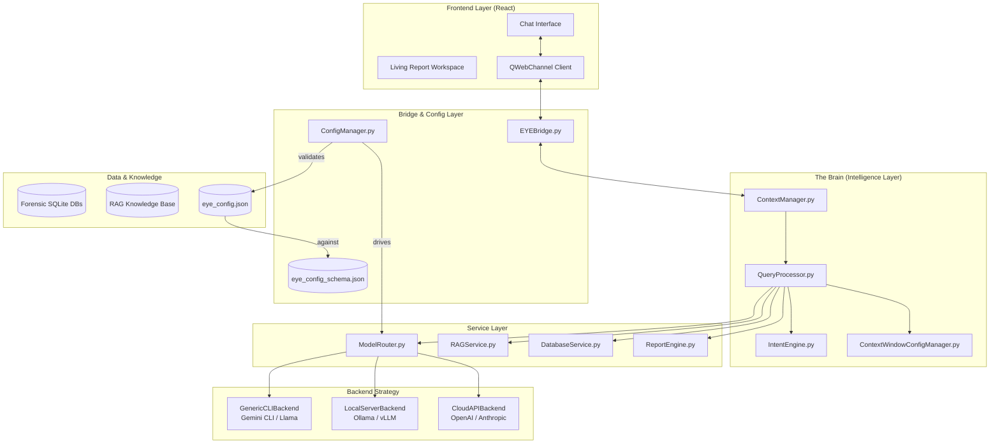

# EYE Assistant: Comprehensive Architecture (v1.5)

## 1. System Overview
The **EYE (Evidence Yield Engine)** is a multi-layered AI forensic assistant. It is designed to be model-agnostic, security-centric, and strictly follows the **Ghassan Elsman Protocol** for technical reporting.

## 2. Structural Blueprint

---

## 3. Core Mechanics

### A. The Configuration DNA (`eye_config.json`)
The engine's behavior is dictated by its configuration. 
- **`integration_type`**: Determines the communication protocol (`local_cli`, `local_api`, `cloud_api`).
- **`backend`**: Identifies the specific model provider.
- **`executable_path`**: For CLI-based agents (like your Gemini CLI setup), this is the physical pointer to the AI's binary.

### B. Schema-Driven Validation (`eye_config_schema.json`)
Before the engine initializes, the **ConfigManager** performs a rigorous validation against the JSON Schema. This ensures:
1.  **Required Integrity**: Fields like `model_name` must exist.
2.  **Conditional logic**: If `integration_type` is `local_cli`, an `executable_path` **must** be provided.
3.  **Token Budgeting**: Validates the `context_window` settings to prevent buffer overflows or memory exhaustion.

### C. The Token Economy (`ContextWindowConfigManager`)
EYE manages its limited "memory" through a strict token budget:
- **System Prompt**: Core instructions & GEP rules.
- **RAG Context**: Retrieved artifact knowledge.
- **History**: Sliding window of previous messages.
- **Tool Definitions**: Descriptions of what the AI can actually do (SQL/Search).

---

## 4. The Investigation Pipeline (8 Stages)

1.  **Intent Interception**: Heuristic check for commands (e.g., `switch model`).
2.  **Forensic Keyword Analysis**: Identifying targets (Prefetch, Registry, MFT).
3.  **RAG Lookup**: Contextual retrieval from the knowledge base.
4.  **Token Balancing**: `TokenMgr` trims history to fit RAG & System prompts.
5.  **AI Consultation**: Model generates reasoning + tool calls.
6.  **Tool Execution**: `DBSvc` runs SQL; `SearchSvc` runs regex.
7.  **Forensic Synthesis**: Applying the **Ghassan Elsman Protocol**.
8.  **Completion**: Pushing the final payload + action chips to the UI.

---

## 5. The Ghassan Elsman Protocol (GEP)
This is the "Forensic Integrity Boundary" enforced during Stage 7:
- **Chronology**: Mandatory timeline-based reporting.
- **Specificity**: No summaries; must report exact timestamps, SIDs, and paths.
- **Evidence-Link**: Every statement must correlate to a database record.
- **Anti-Fluff**: Zero conversational filler in synthesis results.
