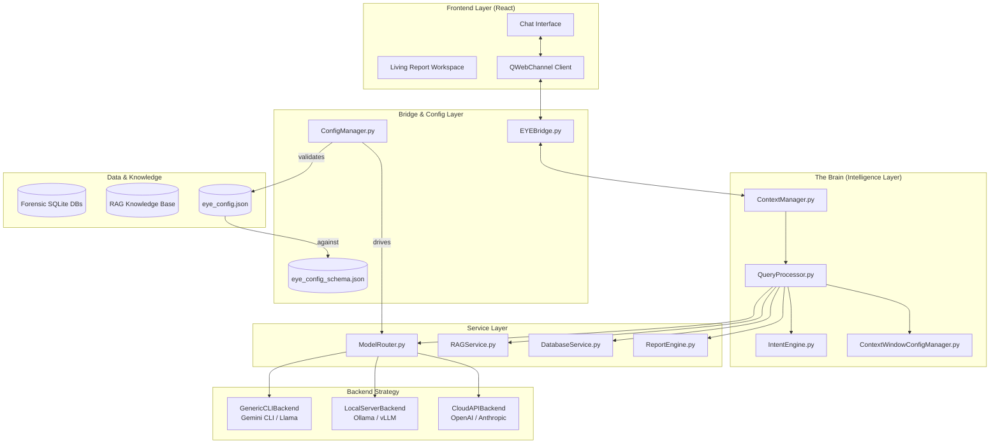

# EYE Assistant: Comprehensive Architecture (v1.5)

## 1. System Overview
The **EYE (Evidence Yield Engine)** is a multi-layered AI forensic assistant. It is designed to be model-agnostic, security-centric, and strictly follows the **Ghassan Elsman Protocol** for technical reporting.

## 2. Structural Blueprint

```mermaid
graph TB
    subgraph "Frontend Layer (React)"
        ChatUI[Chat Interface]
        ReportUI[Living Report Workspace]
        BridgeJS[QWebChannel Client]
    end

    subgraph "Bridge & Config Layer"
        EYEBridge[EYEBridge.py]
        ConfigMgr[ConfigManager.py]
        Schema[(eye_config_schema.json)]
    end

    subgraph "The Brain (Intelligence Layer)"
        ContextMgr[ContextManager.py]
        QueryProc[QueryProcessor.py]
        IntentEng[IntentEngine.py]
        TokenMgr[ContextWindowConfigManager.py]
    end

    subgraph "Service Layer"
        ModelRouter[ModelRouter.py]
        RAGSvc[RAGService.py]
        DBSvc[DatabaseService.py]
        ReportEng[ReportEngine.py]
    end

    subgraph "Backend Strategy"
        LocalCLI[GenericCLIBackend<br/>Gemini CLI / Llama]
        LocalAPI[LocalServerBackend<br/>Ollama / vLLM]
        CloudAPI[CloudAPIBackend<br/>OpenAI / Anthropic]
    end

    subgraph "Data & Knowledge"
        ForensicDB[(Forensic SQLite DBs)]
        KnowledgeBase[(RAG Knowledge Base)]
        ActiveConfig[(eye_config.json)]
    end

    ChatUI <--> BridgeJS
    BridgeJS <--> EYEBridge
    EYEBridge <--> ContextMgr
    
    ConfigMgr -- validates --> ActiveConfig
    ActiveConfig -- against --> Schema
    ConfigMgr -- drives --> ModelRouter
    
    ContextMgr --> QueryProc
    QueryProc --> IntentEng
    QueryProc --> RAGSvc
    QueryProc --> TokenMgr
    QueryProc --> ModelRouter
    
    ModelRouter --> LocalCLI
    ModelRouter --> LocalAPI
    ModelRouter --> CloudAPI
    
    QueryProc --> DBSvc
    QueryProc --> ReportEng
```

---

## 3. Core Mechanics

### A. The Configuration DNA (`eye_config.json`)
The engine's behavior is dictated by its configuration. 
- **`integration_type`**: Determines the communication protocol (`local_cli`, `local_api`, `cloud_api`).
- **`backend`**: Identifies the specific model provider.
- **`executable_path`**: For CLI-based agents (like your Gemini CLI setup), this is the physical pointer to the AI's binary.

### B. Schema-Driven Validation (`eye_config_schema.json`)
Before the engine initializes, the **ConfigManager** performs a rigorous validation against the JSON Schema. This ensures:
1.  **Required Integrity**: Fields like `model_name` must exist.
2.  **Conditional logic**: If `integration_type` is `local_cli`, an `executable_path` **must** be provided.
3.  **Token Budgeting**: Validates the `context_window` settings to prevent buffer overflows or memory exhaustion.

### C. The Token Economy (`ContextWindowConfigManager`)
EYE manages its limited "memory" through a strict token budget:
- **System Prompt**: Core instructions & GEP rules.
- **RAG Context**: Retrieved artifact knowledge.
- **History**: Sliding window of previous messages.
- **Tool Definitions**: Descriptions of what the AI can actually do (SQL/Search).

---

## 4. The Investigation Pipeline (8 Stages)

1.  **Intent Interception**: Heuristic check for commands (e.g., `switch model`).
2.  **Forensic Keyword Analysis**: Identifying targets (Prefetch, Registry, MFT).
3.  **RAG Lookup**: Contextual retrieval from the knowledge base.
4.  **Token Balancing**: `TokenMgr` trims history to fit RAG & System prompts.
5.  **AI Consultation**: Model generates reasoning + tool calls.
6.  **Tool Execution**: `DBSvc` runs SQL; `SearchSvc` runs regex.
7.  **Forensic Synthesis**: Applying the **Ghassan Elsman Protocol**.
8.  **Completion**: Pushing the final payload + action chips to the UI.

---

## 5. The Ghassan Elsman Protocol (GEP)
This is the "Forensic Integrity Boundary" enforced during Stage 7
(synthesis) and Stages where EYE writes durable artifacts:

### Read / synthesis side
- **Chronology**: Mandatory timeline-based reporting.
- **Specificity**: No summaries; must report exact timestamps, SIDs, and paths.
- **Evidence-Link**: Every statement must correlate to a database record.
- **Anti-Fluff**: Zero conversational filler in synthesis results.

### Write side (Rules 9 / 10 / 11 — apply to authoring tools)
The four write-capable EYE tools — `correlation_create_wing`,
`correlation_edit_wing`, `correlation_create_semantic_mapping`,
`correlation_edit_semantic_mapping` — execute under three additional
GEP rules. Their handlers refuse calls that don't comply.

- **Rule 9 — Reason-Required**: every write or edit call must supply a
  non-empty `reason` (forensic justification). The handler returns
  `{success: false, gep_violation: "rule_9"}` on empty values. Edits
  require a *fresh* reason — the edit history accumulates them.
- **Rule 10 — Evidence-Link (write-side)**: every authored Wing or
  Mapping must list at least one `related_evidence` reference in
  `database:table:rowid` form. The handler attempts to resolve each
  ref against the case databases:
  - **Resolved**: GEP Rule 10 logged as `"satisfied"`.
  - **Unresolved** (DB locked, row deleted, schema drift): the artifact
    is **still persisted** (soft-warning model). Failed refs are
    recorded in `eye_authorship.unresolved_evidence_refs` and Rule 10
    is logged as `"partially_satisfied"`. Empty `related_evidence`
    remains a hard block.
- **Rule 11 — Eye-Stamped**: every artifact EYE persists carries a
  populated `EyeAuthorship` block (see
  `correlation_engine/config/eye_authorship.py`). This block records
  the model, timestamp, reason, evidence refs, GEP per-rule status,
  and the full edit history. Items where
  `eye_authorship.created_by` does not start with `"eye"` (built-in
  mappings, human-authored wings, legacy items without authorship)
  are read-only to EYE — the edit handlers refuse to mutate them.

---

## 6. Context Integrity & Chain of Custody

Court-defensibility requires that EYE **never silently truncates** what the model
sees, and that exactly what it saw is provable. This is enforced in
`query_processor.guarded_generate` (the single choke point for every model call)
plus supporting services.

### A. Self-Healing Fail-Hard Guardrail (`guarded_generate`)
Before any payload reaches the model, its tokens (system prompt + message +
history + tools) are compared to the model's usable context
(`max_total_tokens` minus an output reserve = `min(max(512,10%), ctx//2)`).
If it would overflow, EYE **self-heals on a per-call working copy** (the
persistent on-disk history is never altered):
1. **Summarize** the old *non-evidence* messages via
   `HistoryManager._summarize_chunk` → one summary message (logged `SUMMARIZED`).
2. **Drop** the oldest *non-evidence* messages if still over (logged `TRUNCATED`).
3. Messages with `metadata.pinned`, `preserve_evidence`, or `is_tool_result`
   are **protected** — never summarized or dropped.
4. **Hard floor**: if the irreducible evidence core still overflows, EYE
   **refuses** (logged `REFUSED_OVERFLOW`) and hands off to
   `analyze_large_dataset` (map-reduce) — evidence is never dropped to fit.

### B. EvidenceSeal — proving what the model saw (`eye/services/evidence_seal.py`)
Every payload sent is sealed to `EYE_Logs/eye_payload_seal.jsonl`: the SHA-256
of the exact bytes, token count, model + context limit, a `truncated` flag (set
when self-heal compacted the payload), the **evidence provenance**
(`database:table:rowid`, source path, and computed MFT offset = `record×1024`
where derivable), and a `prev_seal_hash → seal_hash` **hash chain** — altering or
removing any record breaks the chain.

### C. Map-Reduce whole-artifact analysis (`eye/services/map_reduce_service.py`)
The `analyze_large_dataset` tool processes an entire oversized artifact in
token-sized chunks (every row covered exactly once; each chunk sealed),
Map-summarizing then Reduce-synthesizing — see `eye_tools_reference.md`.

### D. Compliance panel surfaces (chain of custody is visible)
`ProtocolCompliancePanel` renders, per case: **Per-Answer GEP Compliance**,
**Evidence Seals** (with an `AUTO-COMPACTED` badge on self-healed payloads and a
hash-chain VERIFIED/BROKEN banner), **Chain-of-Custody Events**
(`PRESERVED / SUMMARIZED / TRUNCATED / PINNED / UNPINNED / REFUSED_OVERFLOW`
from the audit log), **Execution Steps**, the **EYE ↔ LLM Conversation**, and the
**Activity Window**. Bridge methods: `get_payload_seals`, `get_truncation_events`,
`get_gep_turns`, `get_step_history`, `get_dialogue_history`, `get_activity_audit`.

### E. `EYE_Logs/` chain-of-custody artifacts
- `truncation_audit.log` — append-only event log (hashes per event).
- `audit_trail.json` — machine-readable export of the above.
- `eye_payload_seal.jsonl` — per-payload SHA-256 seals (hash-chained).
- `eye_step_log.jsonl` — per-step execution timeline.
- `eye_dialogue_log.jsonl` — full Eye↔LLM conversation transcript.
- `eye_gep_turns.jsonl` — per-answer behavioral GEP evaluations.
- `eye_conversation_history.json` — full persistent history (never trimmed by self-heal).
