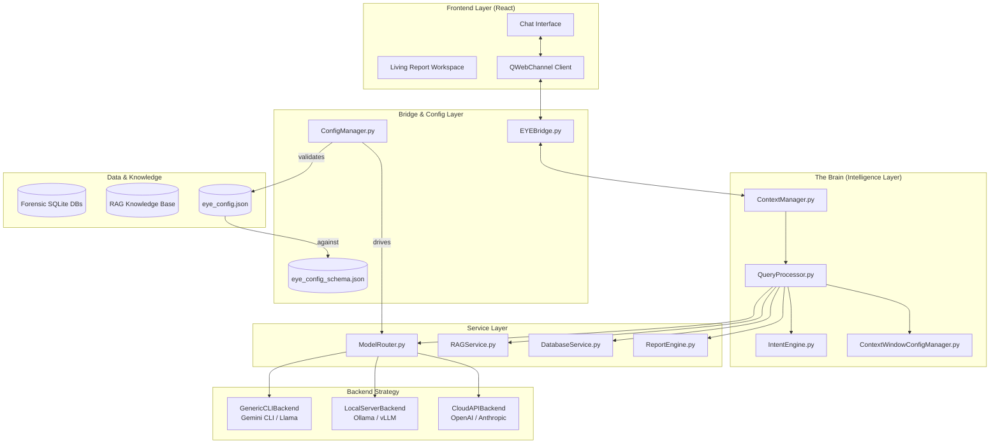

# EYE Assistant: Comprehensive Architecture (v1.5)

## 1. System Overview
The **EYE (Evidence Yield Engine)** is a multi-layered AI forensic assistant. It is designed to be model-agnostic, security-centric, and strictly follows the **Ghassan Elsman Protocol** for technical reporting.

## 2. Structural Blueprint

```mermaid
graph TB
    subgraph "Frontend Layer (React)"
        ChatUI[Chat Interface]
        ReportUI[Living Report Workspace]
        BridgeJS[QWebChannel Client]
    end

    subgraph "Bridge & Config Layer"
        EYEBridge[EYEBridge.py]
        ConfigMgr[ConfigManager.py]
        Schema[(eye_config_schema.json)]
    end

    subgraph "The Brain (Intelligence Layer)"
        ContextMgr[ContextManager.py]
        QueryProc[QueryProcessor.py]
        IntentEng[IntentEngine.py]
        TokenMgr[ContextWindowConfigManager.py]
    end

    subgraph "Service Layer"
        ModelRouter[ModelRouter.py]
        RAGSvc[RAGService.py]
        DBSvc[DatabaseService.py]
        ReportEng[ReportEngine.py]
    end

    subgraph "Backend Strategy"
        LocalCLI[GenericCLIBackend<br/>Gemini CLI / Llama]
        LocalAPI[LocalServerBackend<br/>Ollama / vLLM]
        CloudAPI[CloudAPIBackend<br/>OpenAI / Anthropic]
    end

    subgraph "Data & Knowledge"
        ForensicDB[(Forensic SQLite DBs)]
        KnowledgeBase[(RAG Knowledge Base)]
        ActiveConfig[(eye_config.json)]
    end

    ChatUI <--> BridgeJS
    BridgeJS <--> EYEBridge
    EYEBridge <--> ContextMgr
    
    ConfigMgr -- validates --> ActiveConfig
    ActiveConfig -- against --> Schema
    ConfigMgr -- drives --> ModelRouter
    
    ContextMgr --> QueryProc
    QueryProc --> IntentEng
    QueryProc --> RAGSvc
    QueryProc --> TokenMgr
    QueryProc --> ModelRouter
    
    ModelRouter --> LocalCLI
    ModelRouter --> LocalAPI
    ModelRouter --> CloudAPI
    
    QueryProc --> DBSvc
    QueryProc --> ReportEng
```

---

## 3. Core Mechanics

### A. The Configuration DNA (`eye_config.json`)
The engine's behavior is dictated by its configuration. 
- **`integration_type`**: Determines the communication protocol (`local_cli`, `local_api`, `cloud_api`).
- **`backend`**: Identifies the specific model provider.
- **`executable_path`**: For CLI-based agents (like your Gemini CLI setup), this is the physical pointer to the AI's binary.

### B. Schema-Driven Validation (`eye_config_schema.json`)
Before the engine initializes, the **ConfigManager** performs a rigorous validation against the JSON Schema. This ensures:
1.  **Required Integrity**: Fields like `model_name` must exist.
2.  **Conditional logic**: If `integration_type` is `local_cli`, an `executable_path` **must** be provided.
3.  **Token Budgeting**: Validates the `context_window` settings to prevent buffer overflows or memory exhaustion.

### C. The Token Economy (`ContextWindowConfigManager`)
EYE manages its limited "memory" through a strict token budget:
- **System Prompt**: Core instructions & GEP rules.
- **RAG Context**: Retrieved artifact knowledge.
- **History**: Sliding window of previous messages.
- **Tool Definitions**: Descriptions of what the AI can actually do (SQL/Search).

---

## 4. The Investigation Pipeline (8 Stages)

1.  **Intent Interception**: Heuristic check for commands (e.g., `switch model`).
2.  **Forensic Keyword Analysis**: Identifying targets (Prefetch, Registry, MFT).
3.  **RAG Lookup**: Contextual retrieval from the knowledge base.
4.  **Token Balancing**: `TokenMgr` trims history to fit RAG & System prompts.
5.  **AI Consultation**: Model generates reasoning + tool calls.
6.  **Tool Execution**: `DBSvc` runs SQL; `SearchSvc` runs regex.
7.  **Forensic Synthesis**: Applying the **Ghassan Elsman Protocol**.
8.  **Completion**: Pushing the final payload + action chips to the UI.

---

## 5. How the Eye implements the GEP
The **Ghassan Elsman Protocol (GEP)** is a *vendor-neutral standard for how AI should be used in
digital forensics* — 10 principles that apply to **any** AI-forensics tool. The canonical
definition lives in **[`GEP_standard.md`](./GEP_standard.md)** (the source of truth). The GEP is
**not** a list of Eye features. This section maps each GEP principle to the **Eye mechanisms +
Operating Rules** that uphold it; the Eye's Operating Rules are *how it gets answers* and exist to
**satisfy** the GEP.

| GEP principle | How the Eye upholds it |
|---|---|
| **GEP-1 Evidence Primacy** | Read-only DB access; "never assume" operating rule; schema-grounded SQL (no invented identifiers); pre-flight connectivity gate (never answers without a live backend). |
| **GEP-2 Traceability** | Evidence anchoring (raw markers embedded in history); `EvidenceSeal` provenance (`database:table:rowid`, file offsets, hashes); write-side evidence-link (`related_evidence`). |
| **GEP-3 Specificity & Chronology** | "Timestamp priority" + the 7-step chronological reporting operating rules. |
| **GEP-4 Cross-Corroboration** | Cross-source correlation operating rule + the cross-iteration evidence ledger; multi-source sweep. |
| **GEP-5 Premise Verification** | Premise-verification operating rule + the planning pre-pass that turns asserted claims into `verify:` checklist items with explicit CONFIRMED/REFUTED/INCONCLUSIVE verdicts. |
| **GEP-6 Completeness** | No-silent-truncation: `guarded_generate` self-heal → fail-hard refuse; automatic map-reduce over oversized data/questions; every reduction disclosed + audited. **Coverage disclosure**: `_emit_coverage` records which databases were consulted vs. available + a sampled flag (`EYE_Logs/eye_coverage_log.jsonl`), and the per-turn **GEP-6 Completeness & Coverage** check (`_evaluate_gep_turn`) grades it (PARTIAL when a sample stood in for the full set without map-reduce) so the gap is visible in the Compliance panel. |
| **GEP-7 Integrity & Non-Repudiation** | Read-only evidence; SHA-256 hash-chained message & report-block IDs; `EvidenceSeal` payload hash chain; tamper-evident `EYE_Logs/`. |
| **GEP-8 Transparency & Explainability** | Tool traceability (every call logged + LLM-visible); live thinking/dialogue stream; machine-readable per-turn compliance export to the Compliance panel; dual output to the report. |
| **GEP-9 Human Authority** | "Assistant, not replacement" framing; write-side authorship (`EyeAuthorship`: author + reason + edit history); read-only on non-Eye-authored items; reversible artifacts. |
| **GEP-10 Defensibility** | Professional tone operating rule; structured report blocks; objective output structured for independent review. |

**Per-answer compliance** (`_evaluate_gep_turn`) grades every answer against **all 10 GEP
principles** — Evidence Primacy (GEP-1), Traceability (GEP-2, via sealed provenance refs),
Specificity & Chronology (GEP-3), Cross-Corroboration (GEP-4, ≥2 consulted sources), Premise
Verification (GEP-5, premise checklist verdicts), Completeness & Coverage (GEP-6, consulted-vs-
available + sample-vs-full), Integrity/Dual-Output (GEP-7), Transparency (GEP-8, tool traceability),
Human Authority (GEP-9, write-side authorship), and Defensibility/Direct-Answer (GEP-10) — marked
N-A where a principle doesn't apply to that turn, and persists the result for the Compliance panel.

**Write-side enforcement** — the authoring tools (`correlation_create/edit_wing`,
`correlation_create/edit_semantic_mapping`) refuse non-compliant calls and stamp every artifact:
- **`reason_required`** (upholds GEP-9 Human Authority + GEP-2): a non-empty `reason`; missing →
  `{success:false, gep_violation:"reason_required"}`.
- **`evidence_link`** (upholds GEP-2 Traceability): ≥1 `related_evidence` ref in
  `database:table:rowid` form; resolved → `gep_rules.evidence_link == "satisfied"`, unresolved are
  still persisted (soft-warning) as `"partially_satisfied"` + `unresolved_evidence_refs`, empty is a
  hard block (`gep_violation:"evidence_link"`).
- **`eye_stamped`** (upholds GEP-7 Non-Repudiation + GEP-9): every artifact carries an
  `EyeAuthorship` block (model, timestamp, reason, evidence refs, `gep_rules_applied`, edit history);
  items whose `created_by` does not start with `"eye"` are read-only to the Eye.

> **Operating Rules ≠ GEP.** The Eye's system-prompt rules (tagged `[Operating · GEP-k]` where they
> uphold a principle, or `[Operating]` for pure UX/tooling — action chips, tool disclosure,
> internet search, etc.) describe **how the Eye works**. They are followed, but the **GEP itself is
> the tool-agnostic standard** in `GEP_standard.md`; the rules merely implement it.

---

## 6. Context Integrity & Chain of Custody

Traceability to source records requires that EYE **never silently truncates** what the model
sees, and that exactly what it saw is provable. This is enforced in
`query_processor.guarded_generate` (the single choke point for every model call)
plus supporting services.

### A. Self-Healing Fail-Hard Guardrail (`guarded_generate`)
Before any payload reaches the model, its tokens (system prompt + message +
history + tools) are compared to the model's usable context
(`max_total_tokens` minus an output reserve = `min(max(512,10%), ctx//2)`).
If it would overflow, EYE **self-heals on a per-call working copy** (the
persistent on-disk history is never altered):
1. **Summarize** the old *non-evidence* messages via
   `HistoryManager._summarize_chunk` → one summary message (logged `SUMMARIZED`).
2. **Drop** the oldest *non-evidence* messages if still over (logged `TRUNCATED`).
3. Messages with `metadata.pinned`, `preserve_evidence`, or `is_tool_result`
   are **protected** — never summarized or dropped.
4. **Hard floor**: if the irreducible evidence core still overflows, EYE
   **refuses** (logged `REFUSED_OVERFLOW`) and hands off to
   `analyze_large_dataset` (map-reduce) — evidence is never dropped to fit.

### B. EvidenceSeal — proving what the model saw (`eye/services/evidence_seal.py`)
Every payload sent is sealed to `EYE_Logs/eye_payload_seal.jsonl`: the SHA-256
of the exact bytes, token count, model + context limit, a `truncated` flag (set
when self-heal compacted the payload), the **evidence provenance**
(`database:table:rowid`, source path, and computed MFT offset = `record×1024`
where derivable), and a `prev_seal_hash → seal_hash` **hash chain** — altering or
removing any record breaks the chain.

### C. Map-Reduce whole-artifact analysis (`eye/services/map_reduce_service.py`)
The `analyze_large_dataset` tool processes an entire oversized artifact in
token-sized chunks (every row covered exactly once; each chunk sealed),
Map-summarizing then Reduce-synthesizing — see `eye_tools_reference.md`.

### D. Compliance panel surfaces (chain of custody is visible)
`ProtocolCompliancePanel` renders, per case: **Per-Answer GEP Compliance**,
**Evidence Seals** (with an `AUTO-COMPACTED` badge on self-healed payloads and a
hash-chain VERIFIED/BROKEN banner), **Chain-of-Custody Events**
(`PRESERVED / SUMMARIZED / TRUNCATED / PINNED / UNPINNED / REFUSED_OVERFLOW`
from the audit log), **Execution Steps**, the **EYE ↔ LLM Conversation**, and the
**Activity Window**. Bridge methods: `get_payload_seals`, `get_truncation_events`,
`get_gep_turns`, `get_step_history`, `get_dialogue_history`, `get_activity_audit`.

### E. `EYE_Logs/` chain-of-custody artifacts
- `truncation_audit.log` — append-only event log (hashes per event).
- `audit_trail.json` — machine-readable export of the above.
- `eye_payload_seal.jsonl` — per-payload SHA-256 seals (hash-chained).
- `eye_step_log.jsonl` — per-step execution timeline.
- `eye_dialogue_log.jsonl` — full Eye↔LLM conversation transcript.
- `eye_gep_turns.jsonl` — per-answer behavioral GEP evaluations.
- `eye_conversation_history.json` — full persistent history (never trimmed by self-heal).
