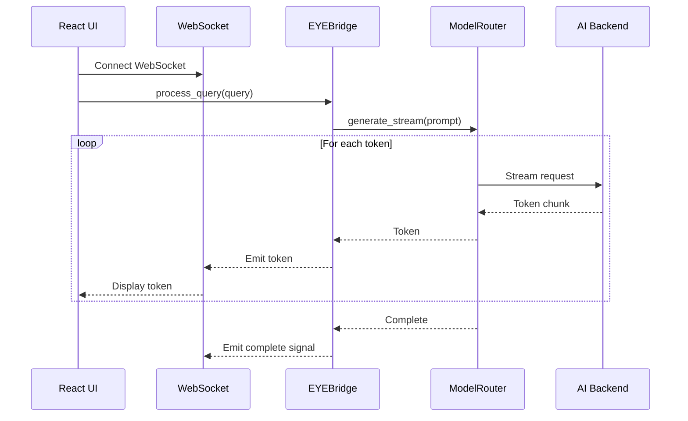
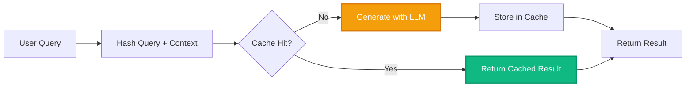
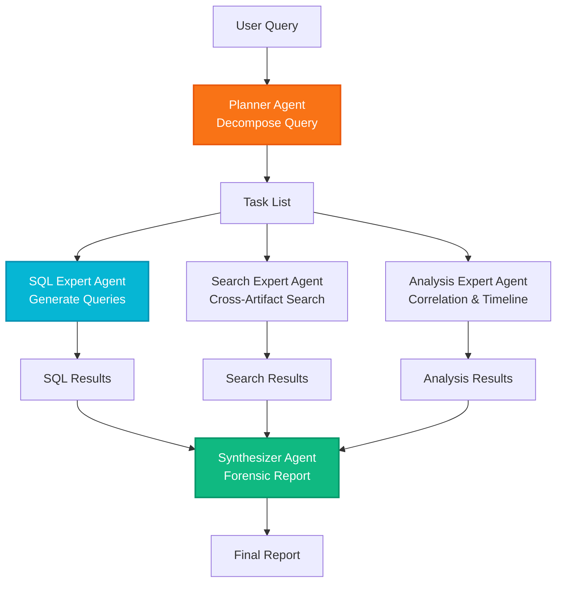
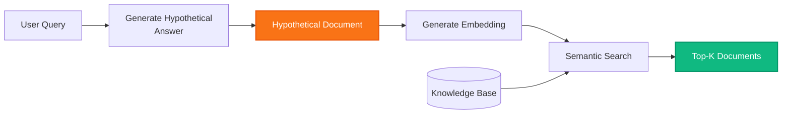
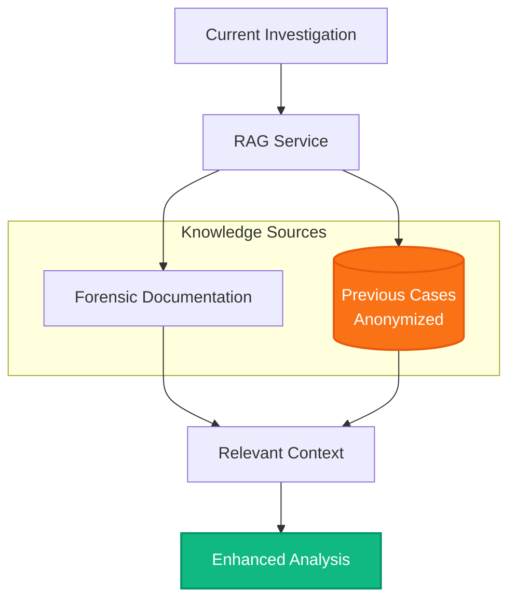
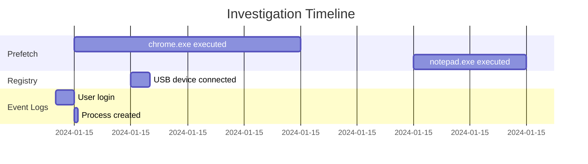

# EYE v2.0 Enhancement Roadmap

This document outlines the strategic enhancements planned for EYE (Evidence Yield Engine) version 2.0, focusing on performance improvements, intelligence upgrades, and advanced forensic features.

---

## Executive Summary

The EYE engine is architecturally sound with a **strong validation backbone** and excellent separation of concerns. To evolve into a faster and smarter agent, this roadmap focuses on three key areas:

1. **Performance Enhancements**: Reduce latency and improve responsiveness
2. **Intelligence Upgrades**: Enhance AI capabilities and reduce hallucinations
3. **Advanced Forensic Features**: Add proactive investigation capabilities

---

## 1. Performance Enhancements

### 1.1 Direct UI Streaming

**Current State**: Responses are sent to the UI only after complete generation.

**Enhancement**: Upgrade the `EYEBridge` to stream LLM tokens to the React UI character-by-character using WebSockets.

**Benefits**:
- Reduces perceived latency to zero
- Users see the AI "typing" the forensic analysis in real-time
- Improves user experience during long analyses

**Implementation**:


**Technical Details**:
- Add WebSocket support to EYEBridge
- Implement streaming in ModelRouter for supported backends
- Update React UI to handle token streams
- Maintain backward compatibility with non-streaming backends

**Priority**: High
**Estimated Effort**: 2-3 weeks
**Dependencies**: None

---

### 1.2 Semantic Caching

**Current State**: Every query triggers a full LLM generation, even for repeated questions.

**Enhancement**: Cache identical tool call results (e.g., exact SQL queries) locally to bypass the LLM entirely for repeated triage questions.

**Benefits**:
- Instant responses for repeated queries
- Reduced API costs for cloud backends
- Lower latency for common forensic questions

**Implementation**:


**Cache Strategy**:
- **Key**: Hash of (query + case_context + tool_definitions)
- **Value**: Complete response including tool results
- **TTL**: 1 hour (configurable)
- **Storage**: SQLite database in case directory
- **Invalidation**: On case context changes or manual clear

**Priority**: Medium
**Estimated Effort**: 1-2 weeks
**Dependencies**: None

---

### 1.3 Parallel Tool Execution

**Current State**: Tool calls are executed sequentially, one after another.

**Enhancement**: Allow the `ContextManager` to execute independent tool calls (e.g., querying Prefetch and Event Logs) asynchronously.

**Benefits**:
- Faster query processing for multi-tool queries
- Better resource utilization
- Reduced total execution time

**Implementation**:
```python
async def execute_tools_parallel(self, tool_calls):
    """Execute independent tool calls in parallel."""
    tasks = []
    for call in tool_calls:
        if self._is_independent(call, tool_calls):
            tasks.append(asyncio.create_task(self._execute_tool_async(call)))
        else:
            # Execute dependent tools sequentially
            await self._execute_tool_async(call)
    
    results = await asyncio.gather(*tasks)
    return results
```

**Dependency Detection**:
- Tools reading from different databases: Independent
- Tools writing to report: Dependent (sequential)
- Tools with shared state: Dependent (sequential)

**Priority**: Medium
**Estimated Effort**: 2 weeks
**Dependencies**: Async refactoring of tool handlers

---

### 1.4 Pre-emptive Connection Pooling

**Current State**: Backend connections are established on first query.

**Enhancement**: The `ModelRouter` should "warm up" the backend (e.g., wake up Ollama or verify the `gemini_cli` path) as soon as the app starts.

**Benefits**:
- Saves 2-5 seconds on the very first investigation query
- Better user experience on app startup
- Early detection of configuration issues

**Implementation**:
```python
class ModelRouter:
    def __init__(self, config):
        self.config = config
        self.backend = self._initialize_backend()
        # Warm up connection in background thread
        threading.Thread(target=self._warmup_connection, daemon=True).start()
    
    def _warmup_connection(self):
        """Pre-emptively establish backend connection."""
        try:
            self.backend.validate_connectivity()
            logger.info("Backend connection warmed up successfully")
        except Exception as e:
            logger.warning(f"Backend warmup failed: {e}")
```

**Priority**: Low
**Estimated Effort**: 1 week
**Dependencies**: None

---

### 1.5 Parallel Metadata Discovery

**Current State**: Database discovery and RAG initialization run sequentially during boot.

**Enhancement**: Run `DBSvc.discover_databases()` and `RAGSvc.initialize()` in parallel background threads during boot.

**Benefits**:
- Faster app startup
- Instant readiness when the UI displays
- Better resource utilization

**Implementation**:
```python
def initialize_services_parallel(case_directory):
    """Initialize services in parallel."""
    with concurrent.futures.ThreadPoolExecutor(max_workers=3) as executor:
        db_future = executor.submit(discover_databases, case_directory)
        rag_future = executor.submit(initialize_rag, case_directory)
        corr_future = executor.submit(initialize_correlation, case_directory)
        
        databases = db_future.result()
        rag_service = rag_future.result()
        correlation_service = corr_future.result()
    
    return databases, rag_service, correlation_service
```

**Priority**: Low
**Estimated Effort**: 1 week
**Dependencies**: Thread-safe service initialization

---

## 2. Intelligence Enhancements

### 2.1 Multi-Agent Orchestration

**Current State**: Single massive `QueryProcessor` prompt handles all tasks.

**Enhancement**: Split the massive `QueryProcessor` prompt into smaller, specialized agents (a Planner, an SQL Expert, and a Synthesizer).

**Benefits**:
- Reduced hallucinations through specialization
- Improved SQL accuracy with dedicated SQL expert
- Better error handling and recovery
- Easier to debug and maintain

**Architecture**:


**Agent Responsibilities**:

1. **Planner Agent**:
   - Decomposes user query into subtasks
   - Determines which expert agents to invoke
   - Manages task dependencies

2. **SQL Expert Agent**:
   - Specialized in generating forensic SQL queries
   - Understands database schemas deeply
   - Validates SQL before execution

3. **Search Expert Agent**:
   - Handles cross-artifact searches
   - Optimizes search patterns
   - Manages result ranking

4. **Analysis Expert Agent**:
   - Performs correlation analysis
   - Builds timelines
   - Identifies patterns

5. **Synthesizer Agent**:
   - Combines results from all experts
   - Applies Ghassan Elsman Protocol
   - Generates final forensic report

**Priority**: High
**Estimated Effort**: 4-6 weeks
**Dependencies**: None

---

### 2.2 Self-Correction SQL Loop

**Current State**: SQL syntax errors are returned to the user immediately.

**Enhancement**: Catch SQLite syntax errors in Python and silently feed them back to the LLM for self-correction before returning an error to the user.

**Benefits**:
- Improved user experience (fewer errors)
- Higher SQL success rate
- Reduced need for user intervention

**Implementation**:
```python
def execute_sql_with_retry(self, sql_query, max_retries=3):
    """Execute SQL with automatic error correction."""
    for attempt in range(max_retries):
        try:
            return self.database_service.execute_query(sql_query)
        except sqlite3.OperationalError as e:
            if attempt < max_retries - 1:
                # Ask LLM to fix the SQL
                correction_prompt = f"""
                The following SQL query failed with error: {e}
                
                Original query:
                {sql_query}
                
                Please provide a corrected SQL query that fixes this error.
                """
                corrected_sql = self.model_router.generate(correction_prompt)
                sql_query = corrected_sql["content"]
            else:
                raise
```

**Priority**: Medium
**Estimated Effort**: 1-2 weeks
**Dependencies**: None

---

### 2.3 Advanced RAG (HyDE)

**Current State**: RAG uses direct keyword matching for retrieval.

**Enhancement**: Implement Hypothetical Document Embeddings (HyDE) in the `RAGService` to improve the retrieval accuracy of highly technical forensic documentation.

**Benefits**:
- Better retrieval of relevant documentation
- Improved handling of technical queries
- More accurate forensic guidance

**HyDE Process**:


**Implementation Steps**:
1. Generate hypothetical answer to user query
2. Embed the hypothetical answer
3. Search knowledge base using hypothetical embedding
4. Return top-K most similar documents

**Priority**: Low
**Estimated Effort**: 2-3 weeks
**Dependencies**: None

---

### 2.4 Dynamic Token Budgeting

**Current State**: Static token limits in `eye_config.json`.

**Enhancement**: The `ContextWindowConfigManager` should auto-adjust based on artifact complexity.

**Benefits**:
- Optimized "memory" usage for every specific forensic scenario
- Better handling of complex artifacts (MFT, Event Logs)
- Reduced blind spots in analysis

**Strategy**:
```python
def calculate_dynamic_budget(self, query, artifact_type):
    """Calculate token budget based on query complexity."""
    base_budget = {
        "system_prompt": 4000,
        "conversation_history": 8000,
        "rag_context": 4000,
        "query": 1000
    }
    
    # Adjust based on artifact complexity
    if artifact_type in ["mft", "eventlog"]:
        # High density artifacts need more RAG context
        base_budget["rag_context"] = 8000
        base_budget["conversation_history"] = 4000
    elif artifact_type in ["prefetch", "registry"]:
        # Medium density artifacts
        base_budget["rag_context"] = 6000
        base_budget["conversation_history"] = 6000
    
    return base_budget
```

**Priority**: Medium
**Estimated Effort**: 2 weeks
**Dependencies**: Artifact type detection

---

### 2.5 Schema-Driven Intelligent Settings

**Current State**: Settings UI is manually coded.

**Enhancement**: The Onboarding Wizard and Settings UI should be dynamically generated from `eye_config_schema.json`.

**Benefits**:
- Error-proof configuration
- Future-proof UI (auto-updates with schema changes)
- Real-time validation as user types

**Implementation**:
```python
def generate_settings_ui(schema):
    """Generate Qt widgets from JSON schema."""
    widgets = []
    for field, definition in schema["properties"].items():
        if definition["type"] == "string":
            widget = QLineEdit()
            if "pattern" in definition:
                widget.setValidator(QRegExpValidator(definition["pattern"]))
        elif definition["type"] == "number":
            widget = QSpinBox()
            widget.setRange(definition.get("minimum", 0), 
                          definition.get("maximum", 999999))
        widgets.append((field, widget))
    return widgets
```

**Priority**: Low
**Estimated Effort**: 2-3 weeks
**Dependencies**: None

---

### 2.6 Forensic Hypothesis Generation

**Current State**: `IntentEngine` only detects keywords.

**Enhancement**: Use the `IntentEngine` to not just detect keywords, but to suggest an "Investigative Hypothesis" to the user before the LLM even runs.

**Benefits**:
- Helps investigator stay focused on goals
- Provides guidance for complex investigations
- Aligns with Ghassan Elsman Protocol

**Example**:
```
User Query: "Show me all prefetch files from yesterday"

Generated Hypothesis:
"Investigating recent program execution activity. 
Hypothesis: Identify programs executed in the last 24 hours to establish user activity timeline."

Suggested Follow-ups:
- Correlate with Event Logs for process creation events
- Check Registry for program persistence mechanisms
- Review MFT for file access patterns
```

**Priority**: Low
**Estimated Effort**: 2 weeks
**Dependencies**: None

---

## 3. Advanced Forensic Features

### 3.1 Ghost Report Automation

**Current State**: If final synthesis fails, evidence is lost.

**Enhancement**: As tools are executed in Stage 6, the `ReportEngine` automatically drafts a hidden "Evidence Scratchpad."

**Benefits**:
- Evidence preservation even if synthesis fails
- Backup for LLM timeouts or errors
- Raw data always available to investigator

**Implementation**:
```python
class ReportEngine:
    def __init__(self):
        self.ghost_report = []  # Hidden scratchpad
        self.published_report = []  # Visible report
    
    def add_tool_result(self, tool_name, result):
        """Automatically add tool results to ghost report."""
        ghost_block = {
            "timestamp": datetime.now(),
            "tool": tool_name,
            "result": result,
            "status": "unpublished"
        }
        self.ghost_report.append(ghost_block)
    
    def publish_ghost_report(self):
        """Promote ghost report to published report."""
        for block in self.ghost_report:
            if block["status"] == "unpublished":
                self.published_report.append(block)
                block["status"] = "published"
```

**Priority**: High
**Estimated Effort**: 1-2 weeks
**Dependencies**: None

---

### 3.2 Cross-Case Semantic Search

**Current State**: RAG only queries documentation.

**Enhancement**: Allow RAG to query not just documentation, but *previous* investigation reports from other cases (anonymized).

**Benefits**:
- Discover patterns across different investigations
- Learn from past cases
- Identify recurring malware signatures or attack patterns

**Architecture**:


**Privacy Considerations**:
- Anonymize all PII before indexing
- Store only technical indicators (hashes, IPs, domains)
- Require explicit opt-in from investigators
- Implement access controls

**Priority**: Low
**Estimated Effort**: 4-6 weeks
**Dependencies**: Case anonymization pipeline

---

### 3.3 Automated Timeline Generation

**Current State**: Timelines are manually constructed from query results.

**Enhancement**: Automatically generate visual timelines from correlated events across all artifacts.

**Benefits**:
- Faster investigation workflow
- Visual representation of events
- Easier to identify gaps or anomalies

**Implementation**:


**Priority**: Medium
**Estimated Effort**: 3-4 weeks
**Dependencies**: Correlation service enhancements

---

### 3.4 Proactive Anomaly Detection

**Current State**: EYE is reactive, responding only to user queries.

**Enhancement**: Implement background anomaly detection that alerts investigators to suspicious patterns.

**Benefits**:
- Proactive investigation assistance
- Early detection of suspicious activity
- Reduced investigation time

**Anomaly Types**:
- Unusual program execution times
- Suspicious registry modifications
- Abnormal network connections
- File access patterns inconsistent with user behavior

**Implementation**:
```python
class AnomalyDetector:
    def detect_anomalies(self, case_directory):
        """Detect anomalies across all artifacts."""
        anomalies = []
        
        # Check for execution at unusual times
        prefetch_anomalies = self._check_prefetch_timing()
        
        # Check for suspicious registry keys
        registry_anomalies = self._check_registry_persistence()
        
        # Check for unusual file access patterns
        mft_anomalies = self._check_mft_patterns()
        
        return anomalies
```

**Priority**: Low
**Estimated Effort**: 4-6 weeks
**Dependencies**: Baseline behavior modeling

---

## 4. Implementation Roadmap

### Phase 1: Quick Wins (1-2 months)
**Focus**: Performance improvements with minimal architectural changes

- ✅ Pre-emptive Connection Pooling (1 week)
- ✅ Parallel Metadata Discovery (1 week)
- ✅ Semantic Caching (1-2 weeks)
- ✅ Self-Correction SQL Loop (1-2 weeks)
- ✅ Ghost Report Automation (1-2 weeks)

**Total Effort**: 5-8 weeks

---

### Phase 2: Intelligence Upgrades (2-3 months)
**Focus**: Enhanced AI capabilities and accuracy

- ✅ Multi-Agent Orchestration (4-6 weeks)
- ✅ Dynamic Token Budgeting (2 weeks)
- ✅ Advanced RAG (HyDE) (2-3 weeks)
- ✅ Forensic Hypothesis Generation (2 weeks)

**Total Effort**: 10-13 weeks

---

### Phase 3: Advanced Features (3-4 months)
**Focus**: Proactive forensic capabilities

- ✅ Direct UI Streaming (2-3 weeks)
- ✅ Parallel Tool Execution (2 weeks)
- ✅ Automated Timeline Generation (3-4 weeks)
- ✅ Cross-Case Semantic Search (4-6 weeks)
- ✅ Schema-Driven Settings (2-3 weeks)

**Total Effort**: 13-18 weeks

---

### Phase 4: Future Innovations (4+ months)
**Focus**: Cutting-edge forensic AI

- ✅ Proactive Anomaly Detection (4-6 weeks)
- ✅ Machine Learning-based Pattern Recognition
- ✅ Natural Language Report Generation
- ✅ Collaborative Multi-Investigator Mode

**Total Effort**: 16+ weeks

---

## 5. Success Metrics

### Performance Metrics
- **Query Latency**: Reduce average query time by 50%
- **First Query Time**: Reduce from 5s to <1s
- **Cache Hit Rate**: Achieve >30% cache hit rate for repeated queries
- **Parallel Speedup**: Achieve 2x speedup for multi-tool queries

### Intelligence Metrics
- **SQL Success Rate**: Increase from 85% to 95%
- **Hallucination Rate**: Reduce by 60% with multi-agent approach
- **RAG Relevance**: Improve retrieval accuracy by 40%
- **User Satisfaction**: Achieve >90% positive feedback

### Forensic Metrics
- **Investigation Time**: Reduce average investigation time by 40%
- **Evidence Coverage**: Increase artifact coverage by 30%
- **Timeline Accuracy**: Achieve >95% timeline accuracy
- **Anomaly Detection**: Detect >80% of known suspicious patterns

---

## 6. Risk Assessment

### Technical Risks
- **Streaming Complexity**: WebSocket implementation may introduce new bugs
  - *Mitigation*: Thorough testing, fallback to non-streaming mode
  
- **Multi-Agent Coordination**: Agent orchestration may introduce latency
  - *Mitigation*: Careful prompt engineering, parallel agent execution
  
- **Cache Invalidation**: Stale cache may return incorrect results
  - *Mitigation*: Conservative TTL, explicit invalidation triggers

### Resource Risks
- **Development Time**: Ambitious roadmap may take longer than estimated
  - *Mitigation*: Phased approach, prioritize high-impact features
  
- **Testing Overhead**: New features require extensive testing
  - *Mitigation*: Automated testing, property-based tests

### User Experience Risks
- **Feature Complexity**: Too many features may overwhelm users
  - *Mitigation*: Progressive disclosure, optional advanced features
  
- **Breaking Changes**: Major refactoring may break existing workflows
  - *Mitigation*: Backward compatibility, migration guides

---

## 7. Conclusion

The EYE v2.0 roadmap focuses on transforming EYE from a **reactive query engine** to a **proactive forensic partner**. By implementing these enhancements in phases, we can deliver continuous value while maintaining system stability and reliability.

The roadmap prioritizes:
1. **Quick wins** for immediate performance improvements
2. **Intelligence upgrades** for better accuracy and capabilities
3. **Advanced features** for cutting-edge forensic analysis

With careful execution and continuous user feedback, EYE v2.0 will set a new standard for AI-powered forensic investigation tools.

---

**Last Updated**: 2024
**Version**: 2.0 Roadmap
**Maintainer**: EYE Development Team
