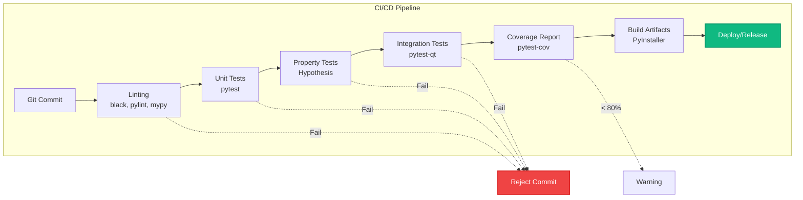

# EYE Testing Architecture

This document describes the comprehensive testing strategy for the EYE (Evidence Yield Engine) AI Forensic Assistant.

---

## Testing Architecture

### Test Suite Structure

```mermaid
graph TB
    subgraph "Test Categories"
        Unit[Unit Tests<br/>pytest]
        Integration[Integration Tests<br/>pytest-qt]
        Property[Property-Based Tests<br/>Hypothesis]
        E2E[End-to-End Tests<br/>Full Pipeline]
    end
    
    subgraph "Unit Test Coverage"
        U1[test_report_parser.py<br/>HTML Parsing]
        U2[test_report_engine.py<br/>Block Management]
        U3[test_database_service.py<br/>SQL Validation]
        U4[test_model_router.py<br/>Backend Switching]
        U5[test_rag_service.py<br/>Embedding & Search]
    end
    
    subgraph "Integration Test Coverage"
        I1[test_eye_bridge_import.py<br/>Bridge Communication]
        I2[test_eye_window_manager.py<br/>Window Lifecycle]
        I3[test_case_summary_dialog.py<br/>UI Components]
        I4[test_query_processor.py<br/>Full Pipeline]
    end
    
    subgraph "Property-Based Tests"
        P1[test_report_parser_properties.py<br/>HTML Parsing Invariants]
        P2[test_sql_validator_properties.py<br/>SQL Security Properties]
        P3[test_token_counter_properties.py<br/>Token Budget Properties]
    end
    
    Unit --> U1
    Unit --> U2
    Unit --> U3
    Unit --> U4
    Unit --> U5
    
    Integration --> I1
    Integration --> I2
    Integration --> I3
    Integration --> I4
    
    Property --> P1
    Property --> P2
    Property --> P3
    
    style Property fill:#f97316,stroke:#ea580c,stroke-width:2px,color:#fff
```



### Property-Based Testing Strategy

```mermaid
graph LR
    subgraph "Hypothesis Framework"
        Gen[Test Data Generator<br/>Random HTML, SQL, JSON]
        Prop[Property Definitions<br/>Invariants & Postconditions]
        Shrink[Shrinking Algorithm<br/>Minimal Failing Example]
    end
    
    subgraph "Properties Tested"
        P1[Parse-Render Roundtrip<br/>parse(render(x)) ≈ x]
        P2[SQL Injection Prevention<br/>∀ malicious SQL → rejected]
        P3[Token Budget Enforcement<br/>∀ context → tokens ≤ max]
        P4[Report Block Integrity<br/>∀ block → valid schema]
    end
    
    Gen --> Prop
    Prop --> Test{Test Passes?}
    Test -->|Fail| Shrink
    Test -->|Pass| Success[Property Verified]
    Shrink --> MinExample[Minimal Counterexample]
    
    Prop --> P1
    Prop --> P2
    Prop --> P3
    Prop --> P4
    
    style Shrink fill:#ef4444,stroke:#dc2626,stroke-width:2px,color:#fff
    style Success fill:#10b981,stroke:#059669,stroke-width:2px,color:#fff
```

### Continuous Integration Pipeline



---

## Test Categories

### 1. Unit Tests

Unit tests verify individual components in isolation using pytest.

#### Coverage Areas:
- **Report Parser** (`test_report_parser.py`): HTML parsing, block extraction, base64 decoding
- **Report Engine** (`test_report_engine.py`): Block CRUD operations, HTML rendering, PDF export
- **Database Service** (`test_database_service.py`): SQL validation, query execution, schema introspection
- **Model Router** (`test_model_router.py`): Backend switching, connectivity validation, model listing
- **RAG Service** (`test_rag_service.py`): Embedding generation, semantic search, ranking

#### Example Test Structure:
```python
def test_report_parser_extracts_text_blocks():
    """Verify that text blocks are correctly extracted from HTML."""
    html = '<div class="text-block"><h2>Title</h2><p>Content</p></div>'
    parser = ForensicReportParser()
    blocks = parser.parse_html(html)
    assert len(blocks) == 1
    assert blocks[0].block_type == "text"
    assert blocks[0].title == "Title"
```

### 2. Integration Tests

Integration tests verify component interactions using pytest-qt for UI components.

#### Coverage Areas:
- **EYE Bridge** (`test_eye_bridge_import.py`): QWebChannel communication, signal emission
- **Window Manager** (`test_eye_window_manager.py`): Window lifecycle, case directory changes
- **Case Summary Dialog** (`test_case_summary_dialog.py`): Timeline display, chart generation
- **Query Processor** (`test_query_processor.py`): Full 8-stage pipeline execution

#### Example Test Structure:
```python
def test_query_processor_full_pipeline(qtbot):
    """Verify complete query processing from input to output."""
    cm = ContextManager(...)
    result = cm.process_query("Show prefetch files")
    assert result["success"]
    assert "response" in result
    assert "data_viewer" in result
```

### 3. Property-Based Tests

Property-based tests use Hypothesis to generate random test data and verify invariants.

#### Coverage Areas:
- **Report Parser Properties** (`test_report_parser_properties.py`): Parse-render roundtrip, HTML sanitization
- **SQL Validator Properties** (`test_sql_validator_properties.py`): Injection prevention, whitelist enforcement
- **Token Counter Properties** (`test_token_counter_properties.py`): Budget enforcement, accurate counting

#### Example Property Test:
```python
from hypothesis import given, strategies as st

@given(st.text())
def test_sql_validator_rejects_malicious_sql(sql_query):
    """Property: All SQL containing forbidden keywords must be rejected."""
    validator = SQLValidator()
    if any(keyword in sql_query.upper() for keyword in ["DROP", "UPDATE", "INSERT", "ALTER"]):
        with pytest.raises(SecurityError):
            validator.validate(sql_query)
```

### 4. End-to-End Tests

E2E tests verify complete user workflows from UI interaction to report generation.

#### Coverage Areas:
- Case initialization workflow
- Query submission and response display
- Report import and block merging
- Model switching and fallback
- Export to HTML/PDF

---

## Testing Best Practices

### 1. Test Isolation
- Each test should be independent and not rely on other tests
- Use fixtures to set up and tear down test state
- Mock external dependencies (AI backends, file system)

### 2. Test Data Management
- Use factories for creating test objects
- Store test fixtures in `tests/fixtures/` directory
- Use Hypothesis for generating edge cases

### 3. Coverage Goals
- Minimum 80% code coverage
- 100% coverage for security-critical components (SQL validator, credential manager)
- Focus on testing behavior, not implementation details

### 4. Performance Testing
- Benchmark critical paths (query processing, report rendering)
- Set performance budgets (e.g., query processing < 5 seconds)
- Monitor token usage and context window management

### 5. Security Testing
- Test SQL injection prevention with malicious inputs
- Verify read-only database enforcement
- Test credential storage and retrieval
- Validate input sanitization

---

## Running Tests

### Run All Tests
```bash
python -m pytest eye/tests/
```

### Run Specific Test Category
```bash
# Unit tests only
python -m pytest eye/tests/ -m unit

# Integration tests only
python -m pytest eye/tests/ -m integration

# Property-based tests only
python -m pytest eye/tests/ -m property
```

### Run with Coverage
```bash
python -m pytest --cov=eye --cov-report=html eye/tests/
```

### Run Specific Test File
```bash
python -m pytest eye/tests/test_report_parser.py
```

### Run with Verbose Output
```bash
python -m pytest -v eye/tests/
```

---

## Test Fixtures

### Common Fixtures

```python
@pytest.fixture
def mock_model_router():
    """Provides a mock ModelRouter for testing."""
    router = Mock(spec=ModelRouter)
    router.generate.return_value = {
        "content": "Test response",
        "tool_calls": [],
        "model": "test-model"
    }
    return router

@pytest.fixture
def temp_case_directory(tmp_path):
    """Provides a temporary case directory for testing."""
    case_dir = tmp_path / "test_case"
    case_dir.mkdir()
    return str(case_dir)

@pytest.fixture
def sample_forensic_db(temp_case_directory):
    """Provides a sample forensic database for testing."""
    db_path = Path(temp_case_directory) / "prefetch.db"
    conn = sqlite3.connect(db_path)
    conn.execute("CREATE TABLE prefetch (name TEXT, timestamp INTEGER)")
    conn.execute("INSERT INTO prefetch VALUES ('test.exe', 1234567890)")
    conn.commit()
    conn.close()
    return str(db_path)
```

---

## Continuous Integration

### GitHub Actions Workflow

```yaml
name: EYE Tests

on: [push, pull_request]

jobs:
  test:
    runs-on: ubuntu-latest
    
    steps:
    - uses: actions/checkout@v2
    
    - name: Set up Python
      uses: actions/setup-python@v2
      with:
        python-version: '3.8'
    
    - name: Install dependencies
      run: |
        pip install pytest pytest-cov pytest-qt hypothesis
    
    - name: Run linters
      run: |
        black --check eye/
        pylint eye/
        mypy eye/
    
    - name: Run tests
      run: |
        pytest --cov=eye --cov-report=xml eye/tests/
    
    - name: Upload coverage
      uses: codecov/codecov-action@v2
      with:
        file: ./coverage.xml
```

---

## Test Maintenance

### Adding New Tests
1. Create test file in `eye/tests/` matching the module name
2. Add appropriate fixtures
3. Write tests following naming convention: `test_<component>_<behavior>`
4. Update this documentation with new test coverage

### Updating Tests
1. When modifying code, update corresponding tests
2. Ensure all tests pass before committing
3. Update test documentation if behavior changes

### Debugging Failed Tests
1. Run test with `-v` flag for verbose output
2. Use `pytest --pdb` to drop into debugger on failure
3. Check test logs in CI/CD pipeline
4. Verify test fixtures and mocks are correct

---

**Last Updated**: 2024
**Version**: 1.5
**Maintainer**: EYE Development Team
